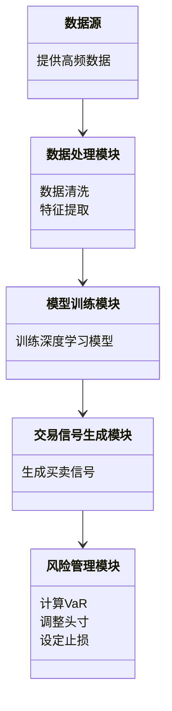
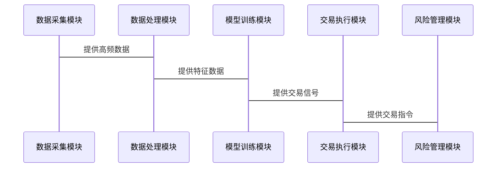

                 


# 深度学习在高频交易策略中的实践

> 关键词：高频交易，深度学习，神经网络，交易信号，风险管理

> 摘要：本文深入探讨了深度学习在高频交易中的应用，从理论基础到实际应用，详细分析了如何利用深度学习模型优化交易策略、生成交易信号以及进行市场预测。通过实际案例和系统架构设计，展示了深度学习在高频交易中的优势与挑战，并提出了相应的解决方案和未来研究方向。

---

## 第一部分: 高频交易与深度学习概述

### 第1章: 高频交易与深度学习的背景

#### 1.1 高频交易的基本概念
高频交易是指在极短的时间内，利用计算机程序自动执行大量的买卖交易，以捕捉市场中的微小价格波动。其核心在于快速决策和执行，通常涉及复杂的算法和高频数据处理。

- **特点**：
  - 高频交易依赖于低延迟的交易系统。
  - 交易决策基于高频数据，如每秒数千条的价格、成交量等市场数据。
  - 高频交易策略通常基于算法模型，追求短期收益。

- **核心要素**：
  - 数据采集与处理。
  - 算法模型的设计与优化。
  - 交易系统的低延迟实现。

- **市场影响**：
  - 提高市场流动性。
  - 可能引发市场波动，甚至导致“闪崩”事件。

#### 1.2 深度学习的基本概念
深度学习是一种人工智能技术，通过多层神经网络结构模拟人脑的神经网络，自动从数据中提取特征并进行分类或回归预测。

- **特点**：
  - 高维度数据处理能力。
  - 自动特征提取能力。
  - 强大的非线性拟合能力。

- **核心算法**：
  - 神经网络（Neural Networks）。
  - 卷积神经网络（CNN）。
  - 循环神经网络（RNN）及其变体（LSTM、GRU）。
  - Transformer模型。

- **应用领域**：
  - 图像识别、自然语言处理、金融时间序列分析等。

#### 1.3 高频交易与深度学习的结合
高频交易需要在极短时间内做出决策，而深度学习擅长处理高频、复杂的数据模式。两者的结合为交易策略的优化提供了新的可能性。

- **高频交易中的数据特征**：
  - 时间序列数据：价格、成交量等。
  - 市场情绪数据：基于新闻、社交媒体的情绪指标。
  - 技术指标：如MACD、RSI等。

- **深度学习在金融领域的优势**：
  - 能够捕捉非线性关系。
  - 自动提取特征，减少人为干预。
  - 处理高维数据能力强。

- **应用场景**：
  - 生成交易信号。
  - 市场预测。
  - 风险管理。

---

## 第2章: 深度学习模型的核心概念

### 2.1 深度学习模型的基本原理
深度学习模型通过多层非线性变换，从输入数据中提取高层次特征，最终输出预测结果。

- **神经网络的基本结构**：
  - 输入层：接收原始数据。
  - 隐藏层：通过非线性变换提取特征。
  - 输出层：生成最终的预测结果。

- **模型的训练过程**：
  - 前向传播：计算预测值。
  - 损失计算：计算预测值与真实值之间的差异。
  - 反向传播：通过梯度下降优化模型参数。

- **模型的过拟合与欠拟合问题**：
  - 过拟合：模型在训练数据上表现良好，但在测试数据上表现差。
  - 欠拟合：模型在训练数据和测试数据上表现都差，无法捕捉数据的特征。

### 2.2 常见深度学习模型

#### 2.2.1 RNN与LSTM网络
- **RNN（循环神经网络）**：
  - 适用于时间序列数据。
  - 通过循环结构处理序列数据，捕捉时序关系。
  - 但存在梯度消失问题，难以捕捉长距离依赖。

- **LSTM（长短期记忆网络）**：
  - 通过门控机制解决RNN的梯度消失问题。
  - 包含遗忘门、输入门和输出门，能够有效记忆长期信息。

#### 2.2.2 CNN网络
- **CNN（卷积神经网络）**：
  - 适用于图像识别和局部特征提取。
  - 通过卷积操作提取空间特征，池化操作降低计算复杂度。
  - 在时间序列数据中，可以用于捕捉局部模式。

#### 2.2.3 Transformer模型
- **Transformer模型**：
  - 适用于序列建模任务。
  - 通过自注意力机制捕捉全局依赖关系。
  - 在自然语言处理领域表现出色，也可应用于金融时间序列分析。

### 2.3 深度学习模型的优化方法

#### 2.3.1 梯度下降与Adam优化器
- **梯度下降**：
  - 通过计算损失函数的梯度，更新模型参数。
  - 常见的梯度下降方法包括随机梯度下降（SGD）和小批量梯度下降（BGD）。

- **Adam优化器**：
  - 结合动量和自适应学习率的技术。
  - 能够加速收敛，减少振荡。

- **优化器公式**：
  $$
  \theta_{t+1} = \theta_t - \eta \frac{g_t}{1-\beta_2^t} + \frac{\beta_1}{1-\beta_1^t} g_t
  $$
  其中，$\theta$ 是参数，$\eta$ 是学习率，$g_t$ 是梯度，$\beta_1$ 和 $\beta_2$ 是动量参数。

#### 2.3.2 正则化技术
- **L1正则化**：
  - 在损失函数中添加L1范数的惩罚项，使得模型参数稀疏。
  $$
  L = L_{\text{original}} + \lambda \sum |w_i|
  $$

- **L2正则化**：
  - 在损失函数中添加L2范数的惩罚项，使得模型参数均衡。
  $$
  L = L_{\text{original}} + \lambda \sum w_i^2
  $$

#### 2.3.3 模型压缩与加速
- **模型压缩**：
  - 通过剪枝、知识蒸馏等技术减少模型参数。
  - 使用低精度量化技术降低模型存储需求。

- **模型加速**：
  - 通过并行计算优化模型运行效率。
  - 使用轻量级模型（如MobileNet）进行优化。

---

## 第3章: 深度学习在高频交易中的特征工程

### 3.1 特征工程的基本概念
特征工程是指对原始数据进行处理和转换，提取有助于模型预测的特征。

- **特征工程的定义与作用**：
  - 定义：通过数据变换和特征选择，生成高质量的特征。
  - 作用：提高模型性能，减少过拟合。

- **特征工程的核心步骤**：
  1. 数据清洗：处理缺失值、异常值等。
  2. 特征提取：从原始数据中提取有用的特征。
  3. 特征选择：选择对目标变量有重要影响的特征。
  4. 特征变换：对特征进行标准化、归一化等处理。

### 3.2 高频交易中的特征提取

#### 3.2.1 时间序列特征提取
时间序列数据具有时序性，可以提取以下特征：

- **均值、方差、标准差**：描述价格波动情况。
- **最大值、最小值**：捕捉价格极值。
- **均方差（Variance）、均方根误差（RMSE）**：衡量波动性。
- **自相关性（Autocorrelation）**：捕捉序列的相关性。

#### 3.2.2 市场情绪特征提取
市场情绪可以通过新闻、社交媒体等数据进行分析，提取以下特征：

- **情绪极性（Sentiment Polarity）**：文本分析中的正负情绪值。
- **情绪强度（Sentiment Intensity）**：情绪的强烈程度。
- **市场情绪指数（Market Sentiment Index）**：基于多种情绪指标构建的综合指数。

#### 3.2.3 技术指标特征提取
技术指标是高频交易中常用的特征，包括：

- **移动平均线（MA）**：短期、中期、长期移动平均线。
- **相对强弱指数（RSI）**：衡量资产的超买或超卖状态。
- **MACD（移动平均收敛散度）**：判断趋势强度和方向。

### 3.3 深度学习模型的特征选择

#### 3.3.1 特征重要性分析
通过模型训练后，可以分析各特征对预测结果的贡献度。

- **特征重要性排序**：
  - 使用Lasso回归或随机森林模型进行特征重要性排序。

#### 3.3.2 基于模型的特征选择
通过模型自动选择重要特征。

- **嵌入式特征选择**：
  - 在模型训练过程中，通过权重大小筛选重要特征。

#### 3.3.3 基于统计的特征选择
使用统计方法筛选特征。

- **卡方检验**：
  - 用于分类任务的特征选择。
  - 计算特征与目标变量的独立性。

---

## 第4章: 深度学习算法在高频交易中的应用

### 4.1 基于深度学习的交易信号生成

#### 4.1.1 交易信号的定义与分类
交易信号是指模型生成的买卖指令或建议。

- **分类**：
  - 多头信号：买入信号。
  - 空头信号：卖出信号。
  - 平仓信号：平仓信号。

#### 4.1.2 基于RNN的交易信号生成
RNN适用于时间序列数据，能够捕捉时序关系。

- **交易信号生成流程**：
  1. 数据输入：价格、成交量等序列数据。
  2. RNN处理：生成序列特征。
  3. 输出层：输出多头、空头或平仓信号。

#### 4.1.3 基于Transformer的交易信号生成
Transformer模型适用于捕捉全局依赖关系。

- **交易信号生成流程**：
  1. 数据输入：多源时间序列数据。
  2. 自注意力机制：捕捉全局依赖。
  3. 输出层：生成交易信号。

### 4.2 基于深度学习的风险管理

#### 4.2.1 风险管理的基本概念
风险管理是指在交易过程中控制风险，避免重大损失。

- **头寸优化**：
  - 根据模型预测结果，调整持仓规模。
  - 使用VaR（在险价值）模型量化风险。

#### 4.2.2 基于深度学习的头寸优化
通过深度学习模型预测市场风险，优化头寸大小。

- **优化方法**：
  - 使用强化学习模型动态调整头寸。
  - 根据波动率预测结果调整头寸。

#### 4.2.3 基于深度学习的止损策略
通过深度学习模型预测价格波动，设定止损点。

- **止损点计算**：
  - 基于模型预测的价格波动范围，设定止损位置。

### 4.3 基于深度学习的市场预测

#### 4.3.1 市场预测的基本原理
通过深度学习模型预测市场价格走势。

- **预测目标**：
  - 下一时刻的价格。
  - 未来一段时间的价格趋势。

#### 4.3.2 基于CNN的市场预测
CNN适用于局部特征提取，适合处理图像和时间序列数据。

- **市场预测流程**：
  1. 数据输入：K线图等图形数据。
  2. CNN处理：提取图像特征。
  3. 输出层：预测价格走势。

#### 4.3.3 基于集成学习的市场预测
通过集成多种模型预测结果，提高预测准确性。

- **集成方法**：
  - 平均法：对多个模型的预测结果取平均。
  - 加权法：根据模型表现赋予不同权重。

---

## 第5章: 系统分析与架构设计

### 5.1 问题场景介绍
高频交易系统需要处理大量高频数据，快速生成交易信号，并实时执行交易。

- **核心需求**：
  - 低延迟：快速响应市场变化。
  - 高可用性：保证系统稳定运行。
  - 高扩展性：支持大规模数据处理。

### 5.2 项目介绍
本项目旨在构建一个基于深度学习的高频交易系统，实现交易信号生成、市场预测和风险管理。

- **项目目标**：
  - 提高交易策略的准确性。
  - 减少交易成本。
  - 控制交易风险。

### 5.3 系统功能设计

#### 5.3.1 领域模型（Mermaid 类图）


### 5.4 系统架构设计

#### 5.4.1 系统架构图（Mermaid 架构图）
```mermaid
rectangle 系统边界 {
    rectangle 数据采集模块 {
        接收高频数据
    }
    rectangle 数据处理模块 {
        数据清洗
        特征提取
    }
    rectangle 模型训练模块 {
        训练深度学习模型
    }
    rectangle 交易执行模块 {
        生成交易信号
        执行交易
    }
    rectangle 风险管理模块 {
        计算VaR
        调整头寸
        设定止损
    }
    数据采集模块 --> 数据处理模块
    数据处理模块 --> 模型训练模块
    模型训练模块 --> 交易执行模块
    交易执行模块 --> 风险管理模块
}

```

#### 5.4.2 系统接口设计
- **数据接口**：
  - 数据采集模块与数据源对接，接收高频数据。
  - 数据处理模块与模型训练模块对接，提供特征数据。

- **交易接口**：
  - 交易执行模块与交易系统对接，执行买卖指令。

#### 5.4.3 系统交互设计（Mermaid 序列图）


---

## 第6章: 项目实战

### 6.1 环境安装
- **Python环境**：安装Python 3.8以上版本。
- **深度学习框架**：安装TensorFlow或PyTorch。
- **数据处理库**：安装Pandas、NumPy。
- **可视化工具**：安装Matplotlib或Seaborn。

### 6.2 系统核心实现源代码

#### 6.2.1 数据处理代码
```python
import pandas as pd
import numpy as np

def load_data(file_path):
    # 加载数据
    df = pd.read_csv(file_path)
    return df

def preprocess_data(df):
    # 数据清洗
    df = df.dropna()
    df['date'] = pd.to_datetime(df['date'])
    df.set_index('date', inplace=True)
    return df

# 示例数据加载与处理
data = load_data('stock_data.csv')
data_processed = preprocess_data(data)
```

#### 6.2.2 模型训练代码
```python
import tensorflow as tf
from tensorflow.keras import layers

def build_model(input_shape):
    # 构建LSTM模型
    model = tf.keras.Sequential()
    model.add(layers.LSTM(64, input_shape=input_shape))
    model.add(layers.Dense(1, activation='linear'))
    model.compile(loss='mean_squared_error', optimizer='adam')
    return model

# 示例模型训练
model = build_model((None, 5))
model.fit(X_train, y_train, epochs=10, batch_size=32)
```

#### 6.2.3 交易信号生成代码
```python
import numpy as np

def generate_signals(model, data):
    # 生成预测值
    predictions = model.predict(data)
    # 生成信号
    signals = []
    for i in range(len(predictions)):
        if predictions[i] > data[i]:
            signals.append(1)  # 买入信号
        elif predictions[i] < data[i]:
            signals.append(-1)  # 卖出信号
        else:
            signals.append(0)  # 平仓信号
    return signals

# 示例信号生成
signals = generate_signals(model, data_processed)
```

### 6.3 代码应用解读与分析
- **数据处理**：加载数据并进行清洗，确保数据质量。
- **模型训练**：构建深度学习模型并训练，生成价格预测。
- **交易信号生成**：根据预测结果生成买卖信号。

### 6.4 实际案例分析
- **案例背景**：某股票的历史价格数据。
- **案例分析**：基于LSTM模型生成交易信号，计算交易收益。
- **优化策略**：根据回测结果优化交易信号生成策略。

### 6.5 模型调优与优化
- **超参数调整**：
  - 调整学习率、批量大小、 epochs。
  - 使用K折交叉验证选择最优模型。

- **模型优化**：
  - 使用早停（Early Stopping）防止过拟合。
  - 引入正则化技术（L1、L2）减少过拟合。

---

## 第7章: 总结与展望

### 7.1 总结
本文详细探讨了深度学习在高频交易中的应用，从模型选择到特征工程，再到系统架构设计，均进行了深入分析。通过实际案例展示了深度学习在交易信号生成、市场预测和风险管理中的优势。

### 7.2 展望
未来的研究方向包括：
- **多模态数据融合**：结合文本、图像等多种数据源进行预测。
- **强化学习应用**：研究强化学习在高频交易中的应用。
- **实时系统优化**：优化交易系统的延迟和吞吐量。

### 7.3 最佳实践 Tips
- **数据质量**：确保数据清洗和特征工程的质量。
- **模型选择**：根据具体场景选择合适的模型。
- **风险管理**：在交易系统中始终重视风险管理。

---

## 作者信息
作者：AI天才研究院/AI Genius Institute  
联系邮箱：contact@aicourse.com  
个人网站：https://www.aicourse.com

---

以上是《深度学习在高频交易策略中的实践》的技术博客文章的完整目录大纲和部分具体内容。

