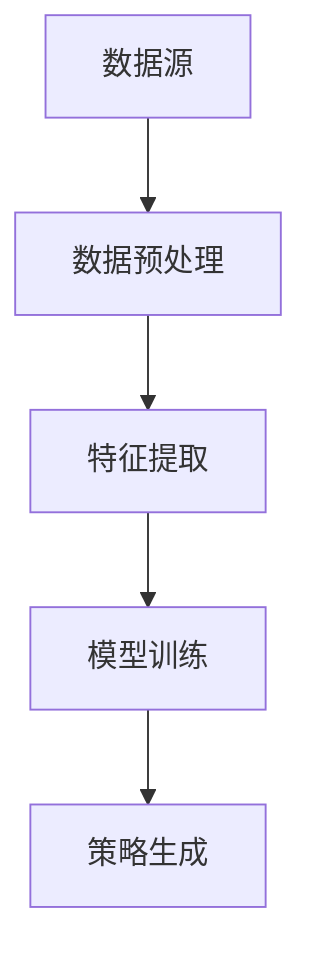
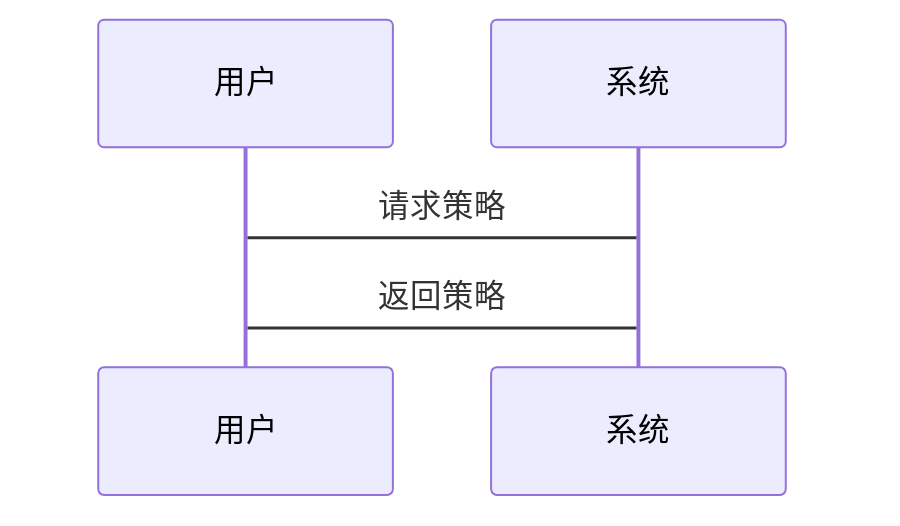

                 


# 深度强化学习在多周期投资决策中的应用

## 关键词
深度强化学习, 多周期投资, 投资决策, 神经网络, 强化学习, 量化投资

## 摘要
本文探讨了深度强化学习在多周期投资决策中的应用，详细介绍了深度强化学习的基本概念、核心算法及其在投资决策中的应用。通过构建多周期投资决策模型，分析了深度强化学习在复杂金融市场中的优势，并通过实际案例展示了其在投资组合优化和交易策略制定中的潜力。

---

# 第一章 引言

## 1.1 深度强化学习与多周期投资决策概述

### 1.1.1 深度学习与强化学习的定义与区别
- **深度学习**：基于人工神经网络的机器学习方法，通过多层非线性变换从数据中提取特征。
- **强化学习**：通过智能体与环境交互，基于奖励机制优化决策策略。
- **区别**：深度学习侧重于特征提取，强化学习关注于策略优化和目标最大化。

### 1.1.2 多周期投资决策的背景与挑战
- **多周期投资**：在不同时间框架（如短期、中期、长期）上进行投资决策。
- **挑战**：市场波动、信息不全、策略调整复杂性。

### 1.1.3 深度强化学习在投资中的应用潜力
- **优势**：处理非线性关系、适应市场变化、优化投资组合。

---

# 第二章 深度强化学习的核心概念与数学基础

## 2.1 深度强化学习的核心概念

### 2.1.1 强化学习的基本原理
- **智能体**：决策者。
- **环境**：市场。
- **状态**：市场数据。
- **动作**：买入、卖出、持有。
- **奖励**：收益。

### 2.1.2 深度学习在强化学习中的作用
- **神经网络**：逼近价值函数或策略函数。
- **优势**：非线性特征提取。

### 2.1.3 深度强化学习的关键算法
- DQN。
- A3C。
- PPO。

## 2.2 深度强化学习的数学基础

### 2.2.1 神经网络的数学模型
- **输入层**：市场数据。
- **隐藏层**：非线性变换。
- **输出层**：Q值或概率。

### 2.2.2 损失函数与优化算法
- **损失函数**：均方误差。
- **优化算法**：Adam。

### 2.2.3 状态、动作与奖励的数学表示
- 状态：$s$。
- 动作：$a$。
- 奖励：$r(s,a)$。

---

# 第三章 多周期投资决策中的问题建模

## 3.1 投资决策中的状态空间建模

### 3.1.1 市场数据的特征提取
- **技术指标**：MA、RSI。
- **市场情绪**：VIX指数。

### 3.1.2 投资组合的构建与优化
- **目标函数**：最大化收益。
- **约束条件**：风险控制。

---

## 3.2 多周期投资决策中的问题建模

### 3.2.1 多周期策略的复杂性
- **时间序列分析**。
- **跨周期相关性**。

### 3.2.2 基于深度强化学习的建模
- **状态空间**：多周期数据。
- **动作空间**：多策略选择。

---

# 第四章 深度强化学习算法在多周期投资中的实现

## 4.1 DQN算法在投资中的应用

### 4.1.1 神经网络结构
```python
class DQN(nn.Module):
    def __init__(self, input_dim, hidden_dim, output_dim):
        super(DQN, self).__init__()
        self.fc1 = nn.Linear(input_dim, hidden_dim)
        self.fc2 = nn.Linear(hidden_dim, output_dim)
```

### 4.1.2 损失函数与优化
- **损失函数**：均方误差。
- **优化器**：Adam。

### 4.1.3 训练流程
1. 收集数据。
2. 神经网络预测Q值。
3. 计算损失，反向传播。
4. 更新参数。

---

## 4.2 基于DQN的多周期投资策略

### 4.2.1 算法实现
```python
def train():
    model = DQN(...)
    optimizer = torch.optim.Adam(model.parameters(), lr=0.001)
    for epoch in range(num_epochs):
        states = get_states()
        q_values = model(states)
        targets = get_targets()
        loss = F.mse_loss(q_values, targets)
        optimizer.zero_grad()
        loss.backward()
        optimizer.step()
```

### 4.2.2 多周期策略优化
- **策略调整**：基于Q值选择动作。
- **动态平衡**：根据市场变化调整权重。

---

# 第五章 系统架构设计与实现

## 5.1 系统架构设计

### 5.1.1 系统功能模块
- 数据采集。
- 特征提取。
- 模型训练。
- 策略生成。

### 5.1.2 系统架构图


---

## 5.2 系统交互设计

### 5.2.1 交互流程
1. 数据输入。
2. 特征提取。
3. 模型预测。
4. 输出策略。

### 5.2.2 交互序列图


---

# 第六章 项目实战与案例分析

## 6.1 项目环境安装

### 6.1.1 环境配置
- Python 3.8+。
- PyTorch、numpy、pandas。

## 6.2 核心代码实现

### 6.2.1 数据预处理
```python
import pandas as pd
import numpy as np

def preprocess(data):
    # 数据清洗
    data = data.dropna()
    # 标准化
    data = (data - data.mean()) / data.std()
    return data
```

### 6.2.2 模型训练
```python
def train_model(model, optimizer, criterion, data_loader):
    for epoch in range(num_epochs):
        for inputs, targets in data_loader:
            outputs = model(inputs)
            loss = criterion(outputs, targets)
            optimizer.zero_grad()
            loss.backward()
            optimizer.step()
```

---

## 6.3 案例分析与策略优化

### 6.3.1 案例分析
- **数据来源**：历史股价数据。
- **训练结果**：策略表现。
- **对比分析**：与传统策略比较。

---

# 第七章 总结与展望

## 7.1 总结
深度强化学习在多周期投资中的应用展示了其强大的适应性和优化能力。

## 7.2 展望
- 更复杂的模型。
- 更多的市场数据。
- 更多的应用场景。

---

# 作者信息

作者：AI天才研究院  
联系方式：[contact@aicourse.com]  
网址：[www.aicourse.com](http://www.aicourse.com)

