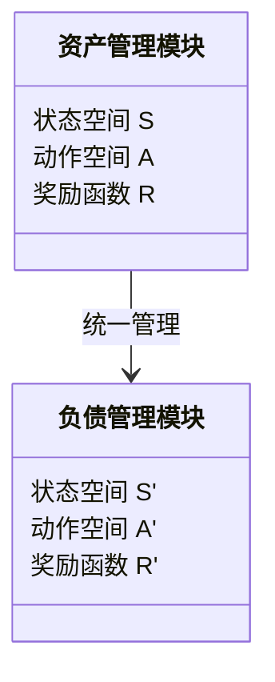
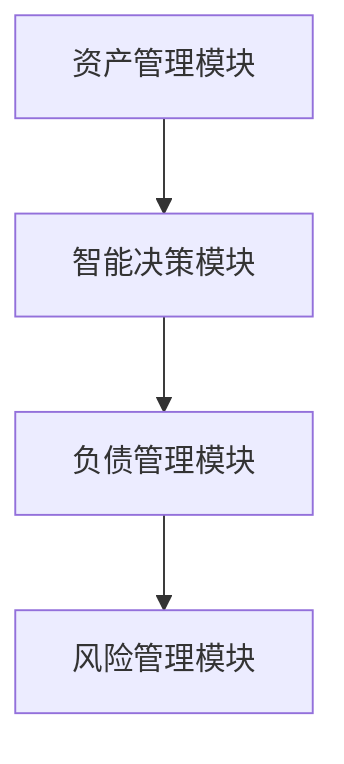

                 

# 深度强化学习在资产负债管理中的应用

> 关键词：深度强化学习，资产负债管理，金融风险管理，人工智能，智能决策，投资组合优化

> 摘要：深度强化学习（Deep Reinforcement Learning, DRL）作为一种结合了深度学习和强化学习的技术，正在逐步应用于金融领域的资产负债管理中。本文将从背景、核心概念、系统设计、项目实战、优化与展望等方面详细探讨深度强化学习在资产负债管理中的应用，分析其优势、挑战及未来发展方向。

---

## 第一部分: 深度强化学习与资产负债管理的背景与概述

### 第1章: 深度强化学习与资产负债管理概述

#### 1.1 深度强化学习的基本概念

##### 1.1.1 强化学习的定义与特点
- 强化学习（Reinforcement Learning, RL）是一种通过智能体与环境交互来学习策略的方法。
- 特点：
  - **目标导向**：智能体通过最大化累积奖励来学习最优策略。
  - **经验驱动**：通过试错积累经验，逐步逼近最优解。
  - **动态适应**：能够根据环境变化调整策略。

##### 1.1.2 深度强化学习的核心思想
- 将深度学习的特征提取能力与强化学习的决策优化能力结合。
- 使用深度神经网络作为策略函数或价值函数，替代传统强化学习中的表格或线性模型。

##### 1.1.3 深度强化学习与传统机器学习的区别
| 方面 | 传统机器学习 | 深度强化学习 |
|------|--------------|--------------|
| 数据需求 | 需要大量标注数据 | 通过与环境交互生成数据 |
| 决策方式 | 基于特征的规则 | 基于策略的优化 |
| 应用场景 | 分类、回归 | 控制、决策 |

#### 1.2 资产负债管理的基本概念

##### 1.2.1 资产负债管理的定义
- 资产负债管理（Asset-Liability Management, ALM）是指金融机构对资产和负债的配置与管理，以实现风险控制和收益最大化。

##### 1.2.2 资产负债管理的主要目标
- 优化资产配置，最大化收益。
- 管理流动性风险、利率风险和信用风险。
- 确保资产和负债的匹配性。

##### 1.2.3 资产负债管理的常见挑战
- 市场波动性大，难以预测。
- 资产与负债的期限错配问题。
- 风险管理复杂，涉及多因素。

#### 1.3 深度强化学习在资产负债管理中的结合意义

##### 1.3.1 深度强化学习的优势
- 能够处理高维、非线性的决策问题。
- 通过经验试错，找到最优策略。
- 自适应能力强，能够应对动态变化的市场环境。

##### 1.3.2 资产负债管理对智能决策的需求
- 需要实时调整资产配置，应对市场变化。
- 需要优化投资组合，平衡风险与收益。
- 需要预测和应对潜在风险。

##### 1.3.3 深度强化学习在资产负债管理中的应用前景
- 提高决策效率和准确性。
- 实现动态资产配置和风险控制。
- 优化投资组合，提升收益。

### 1.4 本章小结
本章介绍了深度强化学习的基本概念、核心思想以及资产负债管理的基本目标和挑战。结合两者的优缺点，探讨了深度强化学习在资产负债管理中的应用前景。

---

## 第二部分: 深度强化学习的核心概念与理论基础

### 第2章: 深度强化学习算法原理

#### 2.1 强化学习的基本原理

##### 2.1.1 状态、动作、奖励的定义
- **状态（State）**：环境中的当前情况，例如市场利率、资产价格。
- **动作（Action）**：智能体采取的行动，例如买入或卖出资产。
- **奖励（Reward）**：智能体采取动作后获得的反馈，例如收益或损失。

##### 2.1.2 Q-learning算法的原理
- Q-learning是一种基于值函数的强化学习算法。
- 状态-动作值函数更新公式：
$$ Q(s, a) = Q(s, a) + \alpha (r + \gamma \max Q(s', a') - Q(s, a)) $$

##### 2.1.3 策略梯度方法的原理
- 策略梯度方法直接优化策略，通过梯度上升最大化累积奖励。
- 策略函数形式：
$$ \pi(a|s) = \text{softmax}(W s) $$

#### 2.2 深度强化学习的核心算法

##### 2.2.1 Deep Q-Network (DQN) 算法
- 使用两个深度神经网络分别作为当前策略和目标策略。
- 损失函数：
$$ \mathcal{L} = \mathbb{E}[(r + \gamma Q(s', a') - Q(s, a))^2] $$

##### 2.2.2 Policy Gradient Methods
- 通过梯度上升优化策略函数，直接最大化累积奖励。
- 策略梯度公式：
$$ \nabla \theta \leftarrow \nabla \log \pi(a|s) \cdot Q(s, a) $$

##### 2.2.3 Actor-Critic 方法
- 结合策略梯度和值函数的优势，通过Actor更新策略，Critic评估值函数。
- 算法流程：
  1. Actor根据当前策略生成动作。
  2. Critic评估当前状态-动作对的Q值。
  3. 根据Q值更新策略。

#### 2.3 深度强化学习的数学模型

##### 2.3.1 Q-learning 的数学公式
$$ Q(s, a) = Q(s, a) + \alpha (r + \gamma \max Q(s', a') - Q(s, a)) $$

##### 2.3.2 DQN 的网络结构与损失函数
- DQN网络结构：
  - 输入层：市场状态特征。
  - 隐藏层：多个全连接层，提取特征。
  - 输出层：动作价值。
- 损失函数：
$$ \mathcal{L} = \mathbb{E}[(r + \gamma Q(s', a') - Q(s, a))^2] $$

#### 2.4 本章小结
本章详细介绍了深度强化学习的核心算法，包括Q-learning、DQN和Actor-Critic方法，并给出了相应的数学公式和网络结构。

---

### 第3章: 资产负债管理的数学模型

#### 3.1 马科维茨有效组合模型
- 马科维茨有效组合模型是经典的资产配置模型。
- 优化目标：
$$ \min \sigma^2 \text{ s.t. } \mathbb{E}[r] = \mu, \mathbb{E}[r^T r] = \sigma^2 $$
- 解决方法：
$$ w = \frac{1}{2} \sigma^{-2} \mu $$

#### 3.2 基于强化学习的资产配置模型
- 将资产配置问题转化为强化学习问题。
- 状态空间：市场状态、资产价格。
- 动作空间：买入、卖出、持有。
- 奖励函数：投资组合收益减去基准收益。

#### 3.3 两者的对比
| 指标 | 马科维茨模型 | 基于强化学习的资产配置模型 |
|------|--------------|--------------------------|
| 优缺点 | 理论基础强，但假设过于理想化 | 更灵活，能处理非线性问题 |
| 应用场景 | 稳定市场 | 动态市场 |

#### 3.4 本章小结
本章介绍了马科维茨有效组合模型和基于强化学习的资产配置模型，并对其优缺点进行了对比分析。

---

## 第四部分: 深度强化学习在资产负债管理中的系统设计与实现

### 第4章: 深度强化学习在资产负债管理中的系统设计

#### 4.1 系统功能设计

##### 4.1.1 领域模型

##### 4.1.2 系统架构

#### 4.2 系统实现

##### 4.2.1 环境搭建
- 数据来源：历史资产价格、市场利率等。
- 数据预处理：标准化、滑动窗口等。

##### 4.2.2 网络结构
- 输入层：市场状态。
- 隐藏层：多个全连接层，提取特征。
- 输出层：动作价值或策略概率。

##### 4.2.3 训练过程
- 初始化网络参数。
- 与环境交互，收集经验。
- 更新网络参数，优化损失函数。

#### 4.3 本章小结
本章详细介绍了深度强化学习在资产负债管理中的系统设计与实现，包括领域模型、系统架构、环境搭建和网络结构。

---

## 第五部分: 深度强化学习在资产负债管理中的项目实战

### 第5章: 深度强化学习在资产负债管理中的项目实战

#### 5.1 案例分析

##### 5.1.1 项目背景
- 某银行的资产和负债管理问题。
- 目标：优化资产配置，降低风险。

##### 5.1.2 环境搭建
- 数据来源：历史资产价格、市场利率。
- 数据预处理：标准化、滑动窗口。

##### 5.1.3 网络实现
- 使用PyTorch搭建深度强化学习网络。
- 编写训练循环，更新参数。

##### 5.1.4 结果分析
- 对比传统方法与强化学习方法的收益和风险。
- 分析强化学习方法在动态环境中的表现。

#### 5.2 本章小结
本章通过具体案例展示了深度强化学习在资产负债管理中的应用，验证了其优势和可行性。

---

## 第六部分: 深度强化学习在资产负债管理中的优化与展望

### 第6章: 深度强化学习在资产负债管理中的优化与展望

#### 6.1 当前应用中的问题

##### 6.1.1 计算复杂度高
- DRL算法训练时间长，计算资源消耗大。

##### 6.1.2 环境建模难度大
- 资产负债管理涉及多因素，环境建模复杂。

##### 6.1.3 稳定性与可解释性
- 强化学习模型的决策过程缺乏可解释性。

#### 6.2 未来优化方向

##### 6.2.1 算法优化
- 使用更高效的网络结构，如Transformer。
- 结合迁移学习，降低训练成本。

##### 6.2.2 环境建模优化
- 使用更精细的市场模型，提高环境的真实性。
- 引入实时数据流，增强动态适应能力。

##### 6.2.3 结合其他技术
- 结合生成对抗网络（GAN），增强模型的鲁棒性。
- 结合知识图谱，提升模型的可解释性。

#### 6.3 本章小结
本章分析了当前深度强化学习在资产负债管理中的应用问题，并提出了未来的优化方向。

---

## 结语

深度强化学习在资产负债管理中的应用前景广阔，但仍然面临诸多挑战。未来，随着算法的优化和计算能力的提升，DRL将在金融领域发挥更大的作用。

---

## 作者：AI天才研究院/AI Genius Institute & 禅与计算机程序设计艺术 /Zen And The Art of Computer Programming

---

这篇文章系统地介绍了深度强化学习在资产负债管理中的应用，从背景、理论基础、系统设计到项目实战和优化展望，内容详实，逻辑清晰。希望对读者有所帮助！

