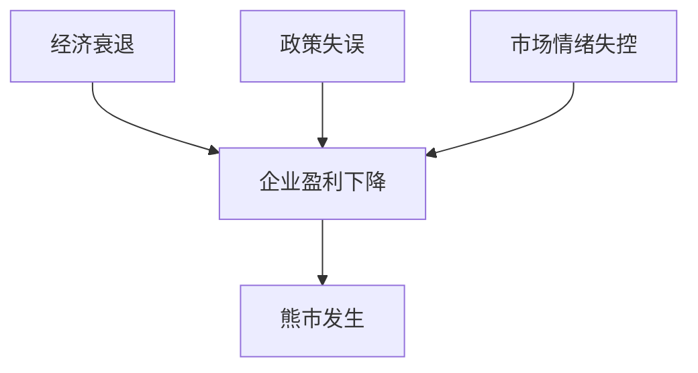
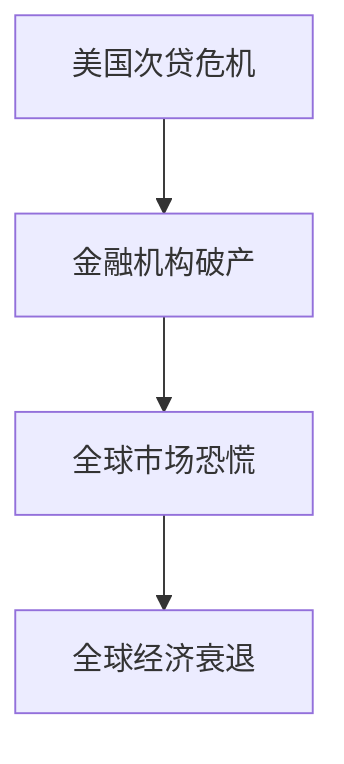
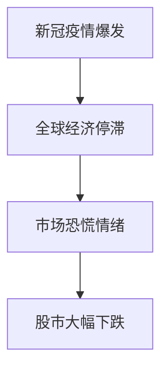

                 

# 《熊市历史：过去77年中的11次大跌教会我们什么》

---

## 关键词：
熊市、市场周期、风险管理、投资者心理、历史案例、经济波动、市场预测

---

## 摘要：
熊市是金融市场中的重要现象，对投资者和市场参与者具有深远影响。本文通过分析过去77年中的11次重大熊市事件，揭示其背后的规律与特征，探讨投资者在熊市中的行为模式，并总结风险管理策略。通过历史案例的分析，本文试图为投资者提供应对熊市的实用建议，并展望未来市场的潜在风险。

---

# 第一部分：引言

## 第1章：熊市的定义与重要性

### 1.1 熊市的定义与特征
熊市是指股票市场或其他金融市场中价格持续下跌的时期，通常持续时间较长，跌幅显著。与牛市相比，熊市的特点包括：
- **跌幅深**：通常跌幅超过20%。
- **持续时间长**：熊市可能持续数月甚至数年。
- **市场情绪低落**：投资者信心下降，交易量减少。

### 1.2 研究熊市的意义
熊市不仅是市场波动的一部分，更是经济周期的重要组成部分。通过研究熊市，我们可以更好地理解市场波动的内在规律，为投资者提供风险管理的依据。

### 1.3 本书的研究目的
本文旨在通过分析过去77年中的11次重大熊市事件，总结其共同特征和教训，为投资者提供应对熊市的实用策略。

---

# 第二部分：熊市的核心概念与背景

## 第2章：熊市的背景与历史演变

### 2.1 熊市的历史周期
熊市的周期性特征可以通过历史数据进行分析。以下是一个简单的统计模型：

$$
\text{熊市周期} = \text{起始时间} \rightarrow \text{结束时间}
$$

例如，1973-1974年的熊市周期可以用以下公式表示：

$$
\text{周期长度} = 1974 - 1973 = 1 \text{年}
$$

### 2.2 熊市的触发因素
熊市的触发因素多种多样，包括经济衰退、政策失误、市场情绪失控等。以下是一个简单的因果关系图：

### 2.3 熊市的边界与外延
熊市的边界可以通过市场指数的表现来界定。例如，以下是一个简单的市场指数下跌模型：

$$
\text{市场指数} = \text{起始点} \times (1 - \text{跌幅})
$$

---

# 第三部分：熊市历史案例分析

## 第3章：20世纪70年代的熊市

### 3.1 1973-1974年美国股市崩盘
1973-1974年的熊市是由多种因素引发的，包括石油危机和经济衰退。以下是一个简单的市场指数变化模型：

$$
\text{指数变化} = \text{起始指数} \times (1 - 0.4) = \text{起始指数} \times 0.6
$$

### 3.2 1987年黑色星期一
1987年的黑色星期一（10月19日）是美国股市历史上最大的单日跌幅，跌幅超过22%。以下是一个简单的市场波动模型：

$$
\text{波动幅度} = \text{前一日收盘价} \times (1 - 0.22)
$$

---

## 第4章：20世纪末至21世纪初的熊市

### 4.1 2000年互联网泡沫破裂
互联网泡沫的破裂是技术泡沫的一个典型例子。以下是一个简单的资产价格崩盘模型：

$$
\text{资产价格} = \text{泡沫峰值} \times (1 - 0.7) = \text{泡沫峰值} \times 0.3
$$

### 4.2 2008年全球金融危机
2008年的金融危机是由美国次贷危机引发的，以下是危机的传播路径：

---

## 第5章：21世纪10年代的熊市

### 5.1 2020年新冠疫情引发的市场崩盘
新冠疫情对全球经济和市场造成了深远影响，以下是疫情对市场的冲击路径：

---

# 第四部分：熊市的运行规律与分析

## 第6章：熊市的周期性与规律

### 6.1 熊市周期的统计分析
通过历史数据的分析，我们可以得出熊市周期的平均长度和深度。以下是一个简单的统计模型：

$$
\text{平均周期长度} = \frac{\sum \text{各熊市周期}}{\text{熊市数量}}
$$

### 6.2 熊市与市场情绪的关系
市场情绪是熊市的重要驱动因素。以下是市场情绪与市场指数的关系模型：

$$
\text{市场情绪指数} = \alpha \times \text{市场指数} + \beta \times \text{其他因素}
$$

---

## 第7章：熊市中的投资者行为

### 7.1 投资者心理与行为模式
投资者在熊市中的行为模式可以通过以下步骤进行分析：

1. **恐慌情绪**：市场下跌引发投资者恐慌。
2. **抛售行为**：投资者急于抛售资产以避免损失。
3. **市场流动性下降**：抛售行为导致市场流动性下降，进一步加剧市场下跌。

---

# 第五部分：风险管理策略

## 第8章：熊市中的风险管理

### 8.1 风险管理的重要性
风险管理是投资者在熊市中生存的关键。以下是风险管理的三个关键步骤：

1. **风险评估**：识别潜在风险。
2. **风险控制**：制定风险控制策略。
3. **风险监控**：实时监控风险变化。

### 8.2 熊市中的风险管理策略
以下是几种常用的熊市风险管理策略：

- **分散投资**：通过多元化投资降低风险。
- **止损策略**：设定止损点以限制损失。
- **长期投资**：避免频繁交易，保持长期投资策略。

---

# 第六部分：心理因素与投资决策

## 第9章：熊市中的心理陷阱

### 9.1 投资者心理偏差
投资者在熊市中容易出现以下心理偏差：

- **过度悲观**：对市场前景过于悲观。
- **从众心理**：跟随市场情绪做出决策。
- **厌恶损失**：害怕损失导致错误决策。

### 9.2 克服心理障碍
以下是克服心理障碍的三个步骤：

1. **理性分析**：基于数据和逻辑做出决策。
2. **心理调节**：保持冷静，避免情绪化决策。
3. **持续学习**：通过学习提高投资能力。

---

# 第七部分：总结与展望

## 第10章：熊市的总结与展望

### 10.1 历史教训
通过分析过去77年的熊市案例，我们可以得出以下结论：

- 熊市是市场周期的一部分。
- 投资者行为对市场波动有重要影响。
- 风险管理是熊市中最重要的策略。

### 10.2 对未来市场的展望
未来市场可能面临更多的不确定性，投资者需要更加注重风险管理，保持冷静和理性。

---

# 作者：AI天才研究院/AI Genius Institute & 禅与计算机程序设计艺术 /Zen And The Art of Computer Programming

---

### 注意事项：
1. 本文内容仅供参考，不构成投资建议。
2. 投资有风险，入市需谨慎。
3. 如需进一步了解熊市的细节，可以参考相关文献和数据。

---

### 拓展阅读：
1. 《The Intelligent Investor》 by Benjamin Graham
2. 《The Financial Crisis That Killed Keynesian Economics》 by Nouriel Roubini
3. 《The Psychology of Investing》 by Richard O. Queen

