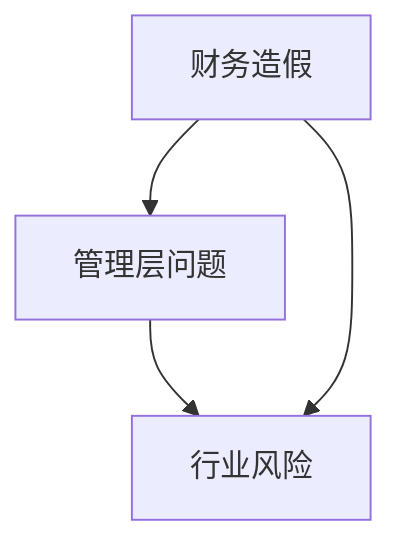

                 

# 第4章: 价值陷阱的深入分析与应对策略

## 4.1 价值陷阱的核心要素

### 4.1.1 财务造假

#### 4.1.1.1 财务造假的定义
财务造假是指公司通过虚构收入、虚增资产、隐瞒负债等手段，人为夸大或粉饰财务报表，误导投资者的行为。

#### 4.1.1.2 财务造假的表现形式
- 虚假收入确认
- 虚增资产
- 隐瞒负债
- 操纵利润

#### 4.1.1.3 财务造假的识别方法
##### 1. 识别虚假收入
- 检查收入与现金流是否匹配
- 关注收入增长是否合理
##### 2. 识别虚增资产
- 分析资产结构是否异常
- 检查固定资产折旧是否合理
##### 3. 识别隐瞒负债
- 关注公司是否存在未披露的债务
- 检查财务报表附注中的或有负债

### 4.1.2 管理层问题

#### 4.1.2.1 管理层问题的定义
管理层问题是指公司高管在经营过程中存在道德风险、管理不善或决策失误，导致公司价值受损。

#### 4.1.2.2 管理层问题的表现形式
- 决策失误
- 贪污腐败
- 管理混乱
- 激进扩张

#### 4.1.2.3 管理层问题的识别方法
##### 1. 关注管理层的背景
- 检查高管的履历和经验
- 关注管理层的稳定性
##### 2. 分析管理层的决策
- 检查公司重大决策的合理性
- 关注决策失误对公司的影响
##### 3. 监测管理层的财务行为
- 分析管理层的财务操作
- 关注管理层的财务纪律

### 4.1.3 行业风险

#### 4.1.3.1 行业风险的定义
行业风险是指由于行业本身的特点或外部环境的变化，导致行业整体或个别公司面临的风险。

#### 4.1.3.2 行业风险的表现形式
- 周期性波动
- 技术变革
- 政策变化
- 竞争加剧

#### 4.1.3.3 行业风险的识别方法
##### 1. 分析行业的周期性
- 关注行业所处的生命周期阶段
- 检查行业的景气程度
##### 2. 监测行业政策变化
- 关注行业相关政策的出台
- 分析政策对公司的影响
##### 3. 评估行业竞争格局
- 分析行业竞争状况
- 检查公司的竞争优势

## 4.2 价值陷阱的形成机制

### 4.2.1 财务造假的动机
- 避免退市
- 获得融资
- 提高股价
- 走私资金

### 4.2.2 管理层问题的影响
- 决策失误导致公司亏损
- 管理混乱导致效率低下
- 激进扩张导致债务过高

### 4.2.3 行业风险的传导
- 行业周期性波动影响公司业绩
- 技术变革导致公司竞争力下降
- 政策变化影响公司经营环境
- 竞争加剧导致公司市场份额减少

## 4.3 避免价值陷阱的策略

### 4.3.1 强化财务分析能力
- 深入学习财务知识
- 掌握财务分析技巧
- 培养财务敏感性

### 4.3.2 关注管理层背景
- 了解管理层的教育背景和工作经历
- 关注管理层的稳定性
- 监测管理层的财务行为

### 4.3.3 选择优质行业
- 投资具有长期增长潜力的行业
- 避免选择夕阳行业
- 关注政策支持的行业

### 4.3.4 保持警惕
- 不贪图便宜
- 深入研究公司基本面
- 耐心等待投资机会

## 4.4 案例分析: 识别价值陷阱

### 4.4.1 案例背景
某公司是一家曾经被市场看好的科技公司，但后来被发现财务造假，导致股价暴跌，投资者损失惨重。

### 4.4.2 财务分析
- 收入与现金流不匹配
- 资产结构异常
- 存在未披露的负债

### 4.4.3 管理层问题
- 高管背景复杂
- 决策失误频繁
- 管理混乱

### 4.4.4 行业风险
- 行业竞争激烈
- 技术更新换代快
- 政策变化频繁

### 4.4.5 结论
该公司存在明显的财务造假、管理层问题和行业风险，是一个典型的价值陷阱。

## 4.5 总结与展望

### 4.5.1 本章小结
价值陷阱是指那些看似便宜但实际存在重大问题的股票，主要表现为财务造假、管理层问题和行业风险。投资者需要通过深入的财务分析、关注管理层背景和选择优质行业来避免价值陷阱。

### 4.5.2 未来展望
随着市场的发展和监管的加强，价值陷阱的表现形式和识别方法可能会发生变化，投资者需要不断学习和提高自己的分析能力，以应对新的挑战。

---

# 第5章: 特价股票的投资策略与风险控制

## 5.1 特价股票的投资策略

### 5.1.1 价值投资策略
##### 1. 坚持长期投资
##### 2. 选择具有竞争优势的公司
##### 3. 关注公司的基本面

### 5.1.2 股票筛选策略
##### 1. 筛选低市盈率股票
##### 2. 筛选低市净率股票
##### 3. 筛选高股息率股票

### 5.1.3 分散投资策略
##### 1. 构建多元化的投资组合
##### 2. 降低投资风险
##### 3. 提高投资收益稳定性

## 5.2 风险控制策略

### 5.2.1 设置止损点
##### 1. 确定止损比例
##### 2. 严格执行止损纪律
##### 3. 控制情绪化交易

### 5.2.2 分散投资风险
##### 1. 避免过度集中投资
##### 2. 选择不同行业的股票
##### 3. 关注宏观经济环境

### 5.2.3 定期复盘与调整
##### 1. 定期检查投资组合
##### 2. 根据市场变化调整投资策略
##### 3. 总结经验教训

## 5.3 实战案例: 构建投资组合

### 5.3.1 案例背景
假设投资者有100万元资金，希望投资于特价股票，构建一个风险可控、收益稳定的投资组合。

### 5.3.2 股票筛选
##### 1. 筛选低市盈率股票：如钢铁、地产等行业
##### 2. 筛选低市净率股票：如银行、保险等行业
##### 3. 筛选高股息率股票：如公用事业、消费等行业

### 5.3.3 投资组合构建
##### 1. 分散投资于不同行业
##### 2. 选择具有竞争优势的公司
##### 3. 设置止损点和止盈点

### 5.3.4 风险管理
##### 1. 定期检查投资组合
##### 2. 根据市场变化调整投资比例
##### 3. 控制情绪化交易

## 5.4 总结与展望

### 5.4.1 本章小结
特价股票的投资需要制定科学的投资策略和严格的风险控制措施，通过分散投资、价值投资和定期复盘，可以有效降低风险，提高投资收益。

### 5.4.2 未来展望
随着市场的发展和投资者的成熟，特价股票的投资策略和风险管理方法将不断完善，投资者需要不断学习和提高自己的投资能力，以应对新的市场挑战。

---

# 第6章: 价值陷阱的系统分析与应对方案

## 6.1 价值陷阱的系统分析

### 6.1.1 价值陷阱的系统构成
##### 1. 财务造假
##### 2. 管理层问题
##### 3. 行业风险

### 6.1.2 价值陷阱的系统关系
##### 1. 财务造假与管理层问题的相互作用
##### 2. 管理层问题与行业风险的相互影响
##### 3. 价值陷阱系统的整体特征

### 6.1.3 价值陷阱的系统分析图

## 6.2 价值陷阱的应对方案

### 6.2.1 提高财务分析能力
##### 1. 学习财务知识
##### 2. 掌握财务分析技巧
##### 3. 培养财务敏感性

### 6.2.2 关注管理层背景
##### 1. 了解管理层的教育背景和工作经历
##### 2. 监测管理层的财务行为
##### 3. 评估管理层的决策能力

### 6.2.3 选择优质行业
##### 1. 投资具有长期增长潜力的行业
##### 2. 避免选择夕阳行业
##### 3. 关注政策支持的行业

### 6.2.4 保持警惕
##### 1. 不贪图便宜
##### 2. 深入研究公司基本面
##### 3. 耐心等待投资机会

## 6.3 案例分析: 应对价值陷阱

### 6.3.1 案例背景
某投资者在选择股票时，发现一家公司的财务数据异常，存在虚增收入和虚减负债的情况，同时公司管理层频繁变动，行业竞争激烈。

### 6.3.2 应对策略
##### 1. 识别财务造假：通过深入分析财务报表，发现收入与现金流不匹配，资产结构异常。
##### 2. 关注管理层问题：发现管理层决策失误，管理混乱。
##### 3. 评估行业风险：行业竞争加剧，技术变革快。

### 6.3.3 结论
通过系统分析和应对策略，投资者识别出该公司的价值陷阱，并避免了投资损失。

## 6.4 总结与展望

### 6.4.1 本章小结
价值陷阱是一个复杂的系统问题，涉及财务造假、管理层问题和行业风险等多个方面。投资者需要通过系统分析和应对策略，识别和避免价值陷阱。

### 6.4.2 未来展望
随着市场的发展和投资者的成熟，识别和应对价值陷阱的方法将不断优化，投资者需要不断学习和提高自己的分析能力，以应对新的市场挑战。

---

# 第7章: 特价股票与价值陷阱的综合分析与投资建议

## 7.1 综合分析方法

### 7.1.1 特价股票与价值陷阱的对比分析
##### 1. 定义对比
##### 2. 特点对比
##### 3. 投资价值对比

### 7.1.2 特价股票与价值陷阱的联系
##### 1. 两者都可能出现在低价位
##### 2. 两者都需要深入分析
##### 3. 两者的区分是投资成功的关键

## 7.2 投资建议

### 7.2.1 投资策略
##### 1. 价值投资策略
##### 2. 分散投资策略
##### 3. 长期投资策略

### 7.2.2 风险控制
##### 1. 设置止损点
##### 2. 分散投资风险
##### 3. 定期复盘与调整

## 7.3 实战案例: 综合分析

### 7.3.1 案例背景
某投资者在选择股票时，发现两家公司都处于低价位，但需要区分是特价股票还是价值陷阱。

### 7.3.2 分析过程
##### 1. 公司A：财务数据正常，管理层稳定，行业前景良好，判断为特价股票。
##### 2. 公司B：财务数据异常，管理层问题，行业风险大，判断为价值陷阱。

### 7.3.3 投资决策
##### 1. 投资公司A，获得超额收益。
##### 2. 避免投资公司B，避免损失。

## 7.4 总结与展望

### 7.4.1 本章小结
通过综合分析方法，投资者可以有效区分特价股票和价值陷阱，制定科学的投资策略，实现投资目标。

### 7.4.2 未来展望
随着市场的发展和投资者的成熟，综合分析方法将不断完善，投资者需要不断学习和提高自己的分析能力，以应对新的市场挑战。

---

# 第8章: 价值陷阱的法律与道德视角

## 8.1 价值陷阱的法律视角

### 8.1.1 财务造假的法律责任
##### 1. 刑事责任
##### 2. 民事责任
##### 3. 行政责任

### 8.1.2 管理层问题的法律后果
##### 1. 治理结构不完善
##### 2. 决策失误的法律责任
##### 3. 管理混乱的法律风险

## 8.2 价值陷阱的道德视角

### 8.2.1 财务造假的道德谴责
##### 1. 欺骗投资者的信任
##### 2. 损害市场的公平性
##### 3. 违背职业道德

### 8.2.2 管理层问题的道德责任
##### 1. 高管的道德风险
##### 2. 管理混乱的道德后果
##### 3. 激进扩张的道德反思

## 8.3 投资者的道德责任

### 8.3.1 投资者的道德义务
##### 1. 做好尽职调查
##### 2. 遵守市场规则
##### 3. 保护自身利益

### 8.3.2 避免价值陷阱的道德选择
##### 1. 坚持长期投资
##### 2. 选择优质公司
##### 3. 避免短期投机

## 8.4 总结与展望

### 8.4.1 本章小结
价值陷阱不仅是一个经济问题，更是一个法律和道德问题。投资者需要从法律和道德的角度，全面认识和应对价值陷阱。

### 8.4.2 未来展望
随着法律的完善和道德标准的提高，价值陷阱的识别和应对将更加规范化和系统化，投资者需要不断学习和提高自己的法律和道德素养，以应对新的市场挑战。

---

# 第9章: 价值陷阱的国际视角与跨市场比较

## 9.1 价值陷阱的国际视角

### 9.1.1 不同国家的市场特点
##### 1. 美国市场
##### 2. 欧洲市场
##### 3. 亚洲市场

### 9.1.2 不同市场的监管差异
##### 1. 美国的严格监管
##### 2. 欧洲的严格监管
##### 3. 亚洲的监管特点

## 9.2 价值陷阱的跨市场比较

### 9.2.1 不同市场的价值陷阱表现形式
##### 1. 美国市场的价值陷阱
##### 2. 欧洲市场的价值陷阱
##### 3. 亚洲市场的价值陷阱

### 9.2.2 不同市场的应对策略
##### 1. 美国市场的应对策略
##### 2. 欧洲市场的应对策略
##### 3. 亚洲市场的应对策略

## 9.3 总结与展望

### 9.3.1 本章小结
价值陷阱在不同市场有不同的表现形式和应对策略，投资者需要从国际视角出发，全面认识和应对价值陷阱。

### 9.3.2 未来展望
随着全球化的深入和市场的互联互通，价值陷阱的识别和应对将更加复杂化和多样化，投资者需要不断学习和提高自己的国际视野，以应对新的市场挑战。

---

# 第10章: 价值陷阱的未来趋势与投资机会

## 10.1 价值陷阱的未来趋势

### 10.1.1 技术进步对价值陷阱的影响
##### 1. 大数据技术
##### 2. 人工智能技术
##### 3. 区块链技术

### 10.1.2 监管趋严对价值陷阱的影响
##### 1. 国内监管加强
##### 2. 国际监管趋严
##### 3. 监管合作加强

## 10.2 价值陷阱的投资机会

### 10.2.1 新技术带来的投资机会
##### 1. 大数据技术在价值陷阱识别中的应用
##### 2. 人工智能技术在价值陷阱识别中的应用
##### 3. 区块链技术在价值陷阱识别中的应用

### 10.2.2 监管趋严带来的投资机会
##### 1. 合规公司的投资机会
##### 2. 行业整合的投资机会
##### 3. 技术创新的投资机会

## 10.3 总结与展望

### 10.3.1 本章小结
价值陷阱的未来趋势是技术驱动和监管趋严，投资者需要抓住新技术带来的投资机会，同时关注监管趋严带来的投资机会。

### 10.3.2 未来展望
随着技术的进步和监管的加强，价值陷阱的识别和应对将更加精准和高效，投资者需要不断学习和提高自己的技术能力和监管意识，以应对新的市场挑战。

---

# 第11章: 价值陷阱的应对策略与投资案例

## 11.1 价值陷阱的应对策略

### 11.1.1 提高财务分析能力
##### 1. 学习财务知识
##### 2. 掌握财务分析技巧
##### 3. 培养财务敏感性

### 11.1.2 关注管理层背景
##### 1. 了解管理层的教育背景和工作经历
##### 2. 监测管理层的财务行为
##### 3. 评估管理层的决策能力

### 11.1.3 选择优质行业
##### 1. 投资具有长期增长潜力的行业
##### 2. 避免选择夕阳行业
##### 3. 关注政策支持的行业

### 11.1.4 保持警惕
##### 1. 不贪图便宜
##### 2. 深入研究公司基本面
##### 3. 耐心等待投资机会

## 11.2 投资案例分析

### 11.2.1 案例背景
某投资者在选择股票时，发现一家公司的财务数据异常，存在虚增收入和虚减负债的情况，同时公司管理层频繁变动，行业竞争激烈。

### 11.2.2 分析过程
##### 1. 识别财务造假：通过深入分析财务报表，发现收入与现金流不匹配，资产结构异常。
##### 2. 关注管理层问题：发现管理层决策失误，管理混乱。
##### 3. 评估行业风险：行业竞争加剧，技术变革快。

### 11.2.3 投资决策
##### 1. 避免投资该公司，避免价值陷阱。
##### 2. 寻找具有竞争优势的公司进行投资。

## 11.3 总结与展望

### 11.3.1 本章小结
通过系统的应对策略和深入的案例分析，投资者可以有效识别和避免价值陷阱，实现投资目标。

### 11.3.2 未来展望
随着市场的发展和投资者的成熟，识别和应对价值陷阱的方法将不断优化，投资者需要不断学习和提高自己的分析能力，以应对新的市场挑战。

---

# 附录

## 附录A: 特价股票与价值陷阱的术语表

## 附录B: 价值陷阱识别的工具推荐

## 附录C: 参考文献与拓展阅读

---

# 作者：AI天才研究院/AI Genius Institute & 禅与计算机程序设计艺术 /Zen And The Art of Computer Programming

