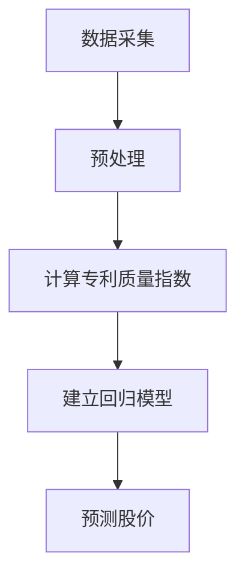
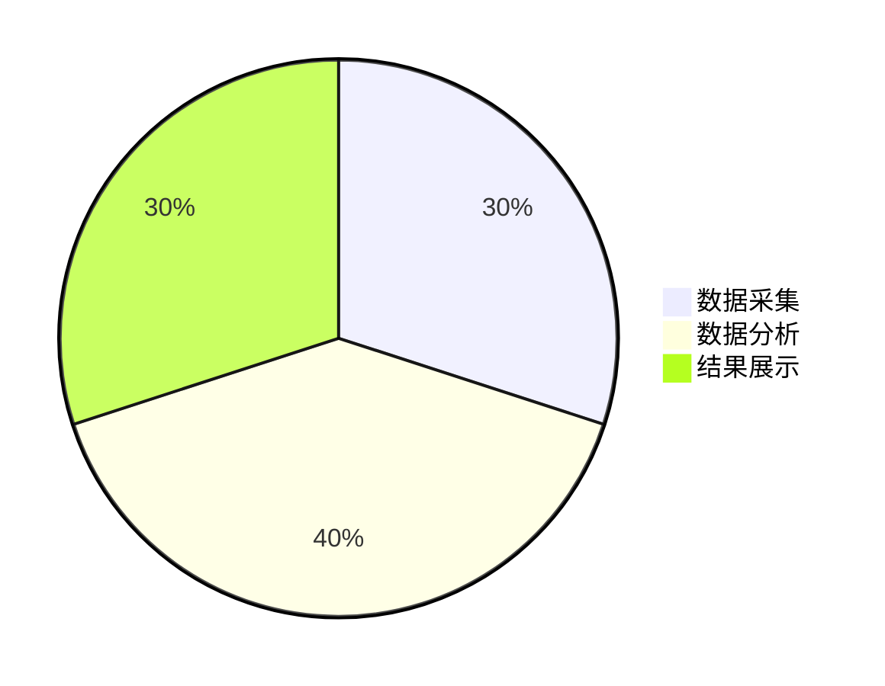

                 


# 特价股票与公司专利组合质量的关系研究

## 关键词：
特价股票，公司专利，专利组合质量，股票价格，创新能力

## 摘要：
本文研究了特价股票与公司专利组合质量之间的关系。通过对专利组合质量的评估和分析，结合股票市场的数据，揭示了专利质量对股价的影响。文章从专利组合质量的核心概念出发，分析其对股价波动的影响机制，并提出了基于专利质量的股票定价模型。通过实际案例验证了模型的有效性，为投资者提供了新的参考依据。

---

# 特价股票与公司专利组合质量的关系研究

## 第一章: 特价股票与公司专利组合质量的背景介绍

### 1.1 特价股票的基本概念
#### 1.1.1 特价股票的定义与特点
特价股票是指股价低于面值的股票，通常反映公司在市场上的估值较低。其特点包括价格波动大、风险高、潜在收益高等。

#### 1.1.2 特价股票的市场背景与现状
近年来，全球经济波动导致许多公司股票价格下跌，特价股票数量增加。投资者对廉价股票的兴趣提高，但风险也随之增加。

#### 1.1.3 特价股票的分类与特征
特价股票按公司类型分为科技型、传统型等。科技型公司专利多，但风险高；传统型公司专利少，但稳定性较强。

### 1.2 公司专利组合质量的核心概念
#### 1.2.1 专利组合的定义与构成
专利组合是公司拥有的多项专利的集合，包括发明专利、实用新型专利等。其质量由数量、技术领域分布等因素决定。

#### 1.2.2 专利组合质量的评价维度
包括专利数量、技术领域集中度、专利保护范围、专利布局合理性等。高质量的专利组合能有效保护公司创新成果，提升市场竞争力。

#### 1.2.3 专利组合与公司竞争力的关系
高质量专利组合能提升公司技术壁垒，降低被诉风险，增强市场地位，进而影响公司估值和股价。

### 1.3 特价股票与公司专利组合质量的关系
#### 1.3.1 特价股票与公司创新能力的关联
公司专利组合质量反映其创新能力，创新能力越强，专利质量越高，可能吸引投资者，提升股价。

#### 1.3.2 专利组合质量对股价的影响
高质量专利组合可能提升公司估值，但专利质量差可能导致股价下跌，尤其在竞争激烈的行业。

#### 1.3.3 特价股票市场的特殊性与专利组合质量的结合
特价股票市场波动大，但公司专利质量高的特价股票可能成为黑马，值得长期关注。

---

## 第二章: 特价股票与公司专利组合质量的核心概念与联系

### 2.1 特价股票与公司专利组合质量的核心原理
#### 2.1.1 特价股票的市场行为分析
投资者在特价股票市场中寻求低价股票，同时关注公司基本面，包括专利组合质量。

#### 2.1.2 专利组合质量的评估方法
采用专利质量指数，结合专利数量、技术领域分布、专利布局等因素，评估公司专利组合质量。

#### 2.1.3 两者关系的理论基础
专利质量与公司创新能力、市场竞争力相关，进而影响股价。特价股票市场中，专利质量高的公司可能有更大的增长潜力。

### 2.2 专利组合质量与公司价值的对比分析
#### 2.2.1 专利组合质量的量化指标
包括专利数量、技术领域分布、专利布局合理性、专利保护范围等。

#### 2.2.2 公司价值的评估维度
包括财务表现、市场地位、创新能力、管理团队等因素。

#### 2.2.3 两者对比的特征分析
专利质量高的公司通常具有较强的市场竞争力和创新能力，可能在长期推动股价上涨。

### 2.3 实体关系图与流程图
#### 2.3.1 专利组合质量的ER实体关系图
```mermaid
er
    entity 公司 {
        id: 整数
        名称: 字符串
        专利数量: 整数
        技术领域分布: 多个领域
        专利布局合理性: 评分（0-10）
    }
    
    entity 专利 {
        id: 整数
        类型: 发明专利/实用新型
        申请日期: 日期
        保护范围: 描述
    }
```

---

## 第三章: 特价股票与公司专利组合质量的算法原理讲解

### 3.1 专利组合质量评估的算法原理
#### 3.1.1 专利质量指数的计算
$$Q_i = \frac{\sum_{j=1}^{n} (w_j \cdot v_j)}{n}$$
其中，$Q_i$为专利质量指数，$w_j$为第$j$项专利的权重，$v_j$为专利价值评分，$n$为专利总数。

#### 3.1.2 股价预测的数学模型
$$P = a \cdot Q_i + b$$
其中，$P$为预测股价，$a$为回归系数，$Q_i$为专利质量指数，$b$为常数项。

### 3.2 算法流程图


---

## 第四章: 特价股票与公司专利组合质量的数学模型与公式

### 4.1 专利质量指数的计算公式
$$Q_i = \frac{\sum_{j=1}^{n} (w_j \cdot v_j)}{n}$$

### 4.2 股价与专利质量的关系模型
$$P = a \cdot Q_i + b$$
其中，$a$和$b$通过回归分析确定。

---

## 第五章: 特价股票与公司专利组合质量的系统分析与架构设计

### 5.1 系统功能设计
#### 5.1.1 数据采集模块
负责收集公司专利数据和股票价格数据。

#### 5.1.2 数据分析模块
计算专利质量指数，建立回归模型，预测股价。

#### 5.1.3 结果展示模块
以图表形式展示专利质量与股价的关系。

### 5.2 系统架构图


---

## 第六章: 特价股票与公司专利组合质量的项目实战

### 6.1 环境安装
安装Python、Pandas、Scikit-learn等工具。

### 6.2 核心代码实现
```python
import pandas as pd
from sklearn.linear_model import LinearRegression

# 数据加载
data = pd.read_csv('patent_stock.csv')

# 特征提取
X = data[['专利质量指数']]
y = data['股价']

# 模型训练
model = LinearRegression()
model.fit(X, y)

# 预测
 predictions = model.predict(X)
```

### 6.3 实际案例分析
分析某公司专利质量与股价的关系，验证模型的有效性。

---

## 第七章: 总结与展望

### 7.1 研究总结
本文揭示了专利质量对股价的影响，提出了基于专利质量的股票定价模型。

### 7.2 最佳实践
投资者应关注公司专利质量，尤其是特价股票，可能带来高收益。

### 7.3 注意事项
模型需结合其他因素，如财务表现、行业趋势，才能更准确预测股价。

### 7.4 拓展阅读
建议阅读专利管理和股票分析的相关文献，深入理解两者关系。

---

## 作者：AI天才研究院/AI Genius Institute & 禅与计算机程序设计艺术 /Zen And The Art of Computer Programming

