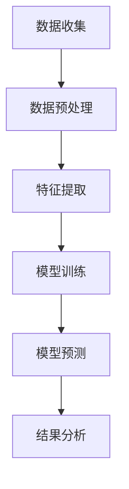
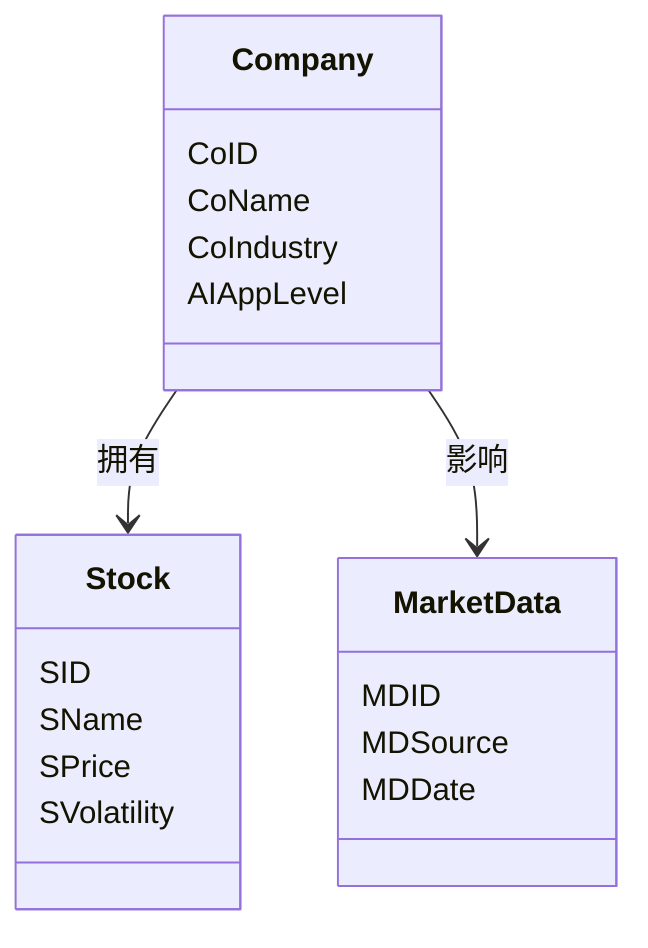
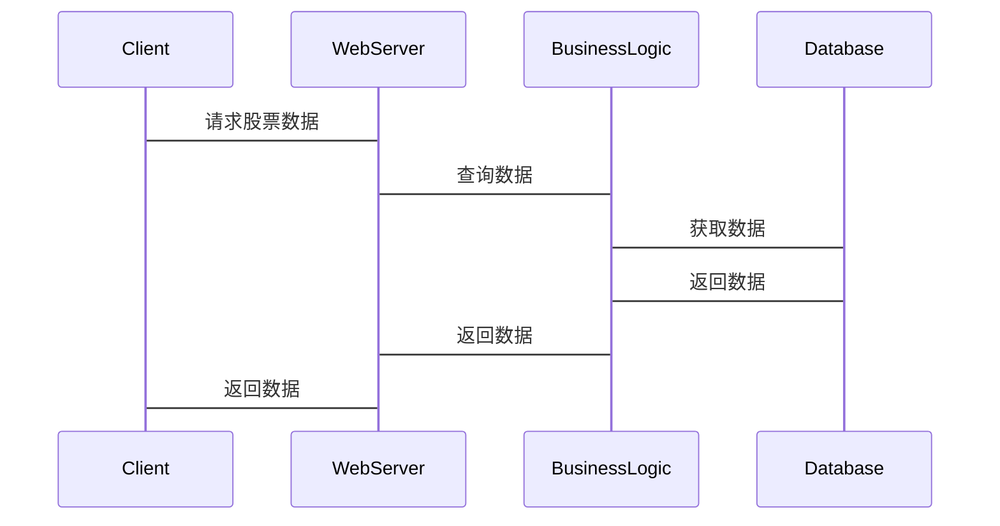

                 


# 特价股票与公司人工智能应用水平的潜在联系

> 关键词：特价股票、人工智能应用水平、股票分析、公司价值、算法原理

> 摘要：本文探讨了特价股票与公司人工智能应用水平之间的潜在联系，通过分析人工智能在股票市场中的作用，评估公司人工智能应用水平对股价的影响，提出了一种基于机器学习和深度学习的股票预测模型，并结合实际案例进行了详细分析。

---

## 第一章: 特价股票与公司人工智能应用水平的背景介绍

### 1.1 特价股票的定义与特点
#### 1.1.1 特价股票的定义
特价股票是指在股票市场中价格相对较低的股票，通常属于小盘股或中盘股，具有较高的波动性和潜在的高回报率。

#### 1.1.2 特价股票的核心特点
- 价格低：相对于大盘股，特价股票的价格通常较低，适合中小投资者。
- 波动性高：由于市场关注度较低，特价股票的价格波动较大，容易受市场情绪影响。
- 风险高：特价股票的风险较高，但潜在回报也较高。

#### 1.1.3 特价股票的市场现状
当前市场中，特价股票主要集中在新兴行业或中小型企业，这些企业的增长潜力较大，但市场风险也较高。

### 1.2 公司人工智能应用水平的定义与现状
#### 1.2.1 人工智能在公司的应用领域
- 数据分析：利用AI技术进行市场数据分析，优化业务决策。
- 自动化：通过AI实现生产、管理、服务等环节的自动化。
- 创新：利用AI技术开发新产品或服务。

#### 1.2.2 公司人工智能应用水平的评估标准
- 技术投入：公司对AI技术的研发投入和团队建设。
- 应用场景：AI在公司中的应用场景和实际效果。
- 产出效益：AI应用对公司业绩和市场竞争力的提升效果。

#### 1.2.3 当前公司人工智能应用的现状
目前，许多公司已经开始尝试将AI技术应用于业务中，但不同公司的应用水平差异较大，部分公司仍处于初级阶段，而一些领先企业已经实现了深度应用。

### 1.3 特价股票与公司人工智能应用水平的潜在联系
#### 1.3.1 特价股票市场的特点与风险
特价股票市场具有高波动性和高风险的特点，容易受到市场情绪和外部环境的影响。

#### 1.3.2 人工智能在股票分析中的作用
AI技术可以用于股票数据分析、市场预测、风险评估等，帮助投资者做出更明智的投资决策。

#### 1.3.3 人工智能如何影响公司价值与股价
公司的人工智能应用水平直接影响其市场竞争力和盈利能力，从而影响股价。通过分析公司的人工智能应用水平，投资者可以更好地评估其潜在价值。

---

## 第二章: 特价股票与公司人工智能应用水平的核心概念

### 2.1 特价股票的核心概念
#### 2.1.1 特价股票的分类与属性
- 按照行业分类：科技、制造、金融等。
- 按照市值分类：小盘股、中盘股、大盘股。

#### 2.1.2 特价股票的市场定位
特价股票通常位于市场中的中低端，适合风险承受能力强的投资者。

#### 2.1.3 特价股票的风险与机会
- 风险：市场波动大、流动性低、公司基本面差。
- 机会：潜在高回报、市场低估、行业变革。

### 2.2 公司人工智能应用水平的核心概念
#### 2.2.1 人工智能在公司中的应用场景
- 数据分析：市场数据、财务数据、用户数据。
- 自动化：生产自动化、流程自动化、客户服务自动化。
- 创新：产品创新、服务创新、商业模式创新。

#### 2.2.2 公司人工智能应用水平的评估维度
- 技术投入：研发投入、技术团队规模。
- 应用范围：AI在公司中的应用领域和深度。
- 应用效果：对公司业绩、市场竞争力的提升效果。

#### 2.2.3 人工智能对公司价值的影响
人工智能的应用可以提升公司的效率、降低成本、增强市场竞争力，从而提高公司价值和股价。

### 2.3 特价股票与公司人工智能应用水平的联系
#### 2.3.1 人工智能如何影响公司价值
- 提升效率：通过自动化和数据分析优化业务流程。
- 创新驱动：利用AI技术开发新产品和服务。
- 增强竞争力：在行业内建立技术优势。

#### 2.3.2 公司人工智能应用水平对股价的影响
- 高水平的AI应用可以提升公司业绩，从而提高股价。
- 低水平的AI应用可能导致公司竞争力不足，股价表现不佳。

#### 2.3.3 特价股票市场中的AI驱动因素
- 市场低估：许多特价股票由于市场关注度低，被AI技术发现其潜在价值。
- 数据驱动：通过AI技术分析市场数据，发现特价股票的投资机会。

### 2.4 核心概念属性对比表
| **属性**         | **特价股票**                | **公司人工智能应用水平**           |
|-------------------|-----------------------------|------------------------------------|
| 定义               | 价格较低的股票               | 公司对AI技术的应用程度             |
| 特点               | 高波动性、高风险             | 提升效率、降低成本、增强竞争力     |
| 影响因素           | 市场情绪、公司基本面           | 技术投入、应用范围、应用效果       |
| 价值评估           | 潜在高回报                   | 提高公司价值和股价                 |

### 2.5 核心概念ER实体关系图
```mermaid
erd
    company(CoID, CoName, CoIndustry, CoMarketCap, AIAppLevel)
    stock(SID, SName, SPrice, SVolatility)
    relationship(company, stock, invests)
```

---

## 第三章: 特价股票与公司人工智能应用水平的算法原理

### 3.1 人工智能在股票分析中的算法原理
#### 3.1.1 机器学习在股票预测中的应用
- 数据收集：收集历史股价、市场数据、公司基本面数据。
- 数据预处理：清洗数据、特征提取。
- 模型训练：使用回归、分类等算法训练模型。
- 模型评估：通过回测验证模型的准确性。

#### 3.1.2 深度学习在股票分析中的作用
- LSTM网络：用于时间序列数据的预测。
- 卷积神经网络：用于图像数据的分析。

#### 3.1.3 自然语言处理在股票分析中的应用
- 分析新闻、社交媒体数据，预测市场情绪。

### 3.2 特价股票分析算法实现
#### 3.2.1 算法流程图


#### 3.2.2 算法代码实现
```python
import numpy as np
import pandas as pd
from sklearn.linear_model import LinearRegression
from sklearn.metrics import mean_squared_error

# 数据收集
data = pd.read_csv('stock_data.csv')

# 数据预处理
data.dropna(inplace=True)
data['Date'] = pd.to_datetime(data['Date'])
data.set_index('Date', inplace=True)

# 特征提取
features = ['Close', 'Volume', 'Adj Close']
target = 'Close'

# 模型训练
model = LinearRegression()
model.fit(data[features], data[target])

# 模型预测
predictions = model.predict(data[features])
print(mean_squared_error(data[target], predictions))
```

#### 3.2.3 算法原理的数学模型
股票价格预测模型可以表示为：
$$
y = \beta_0 + \beta_1x_1 + \beta_2x_2 + ... + \beta_nx_n + \epsilon
$$
其中，\( y \) 是目标变量（股票价格），\( x_i \) 是特征变量，\( \beta_i \) 是回归系数，\( \epsilon \) 是误差项。

---

## 第四章: 特价股票与公司人工智能应用水平的系统架构设计

### 4.1 系统功能设计
#### 4.1.1 领域模型


#### 4.1.2 系统架构设计


### 4.2 系统接口设计
#### 4.2.1 系统接口
- API接口：提供股票数据查询、AI模型调用等功能。
- 数据接口：与数据源（如股票市场数据API）对接。

#### 4.2.2 系统交互


---

## 第五章: 特价股票与公司人工智能应用水平的项目实战

### 5.1 项目环境安装
- Python 3.8及以上版本
- 必要的库：pandas、numpy、scikit-learn、keras、tensorflow

### 5.2 项目核心实现
#### 5.2.1 数据采集
```python
import pandas_datareader as pdr

# 从Yahoo Finance获取数据
data = pdr.get_data_yahoo('AAPL', start='2020-01-01', end='2023-12-31')
```

#### 5.2.2 数据预处理
```python
data.dropna(inplace=True)
data['Close'] = data['Close'].astype(float)
```

#### 5.2.3 模型训练
```python
from sklearn.preprocessing import MinMaxScaler
from keras.models import Sequential
from keras.layers import LSTM, Dense

# 数据归一化
scaler = MinMaxScaler()
data_scaled = scaler.fit_transform(data)

# 划分训练集和测试集
train_size = int(len(data_scaled) * 0.8)
train_data = data_scaled[:train_size]
test_data = data_scaled[train_size:]

# 构建数据集
def create_dataset(data, look_back=1):
    X, Y = [], []
    for i in range(len(data) - look_back):
        X.append(data[i:i+look_back])
        Y.append(data[i+look_back])
    return np.array(X), np.array(Y)

X_train, Y_train = create_dataset(train_data, look_back=10)
X_test, Y_test = create_dataset(test_data, look_back=10)

# 模型训练
model = Sequential()
model.add(LSTM(50, input_shape=(10, 1)))
model.add(Dense(1))
model.compile(loss='mean_squared_error', optimizer='adam')
model.fit(X_train, Y_train, epochs=50, batch_size=32)

# 模型预测
Y_pred = model.predict(X_test)
```

#### 5.2.4 结果分析
```python
import matplotlib.pyplot as plt

plt.plot(Y_test, label='Actual Price')
plt.plot(Y_pred, label='Predicted Price')
plt.legend()
plt.show()
```

### 5.3 项目小结
通过该项目，我们可以看到人工智能在股票分析中的强大能力，但也需要注意到市场的不确定性和模型的局限性。

---

## 第六章: 特价股票与公司人工智能应用水平的最佳实践

### 6.1 小结
人工智能技术在股票分析和公司价值评估中具有重要作用，但需要结合市场实际情况进行综合判断。

### 6.2 注意事项
- 模型的局限性：AI模型无法完全预测市场的不确定性。
- 数据的质量：数据的准确性和完整性直接影响模型的效果。

### 6.3 拓展阅读
- 《机器学习实战》
- 《深度学习》
- 《股票技术分析入门》

---

## 作者信息

作者：AI天才研究院/AI Genius Institute & 禅与计算机程序设计艺术 /Zen And The Art of Computer Programming

