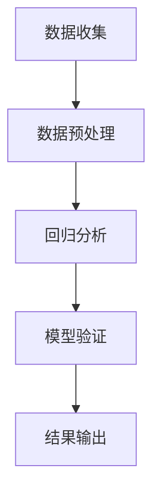
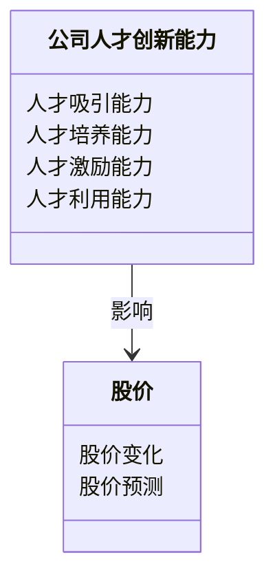

                 


# 特价股票与公司人才创新能力的关系探讨

## 关键词：特价股票、公司人才创新能力、关系探讨、数学模型、系统架构、项目实战

## 摘要：  
本文探讨特价股票与公司人才创新能力之间的关系，通过分析特价股票的定义、特点以及公司人才创新能力的核心要素，建立两者的关系模型。利用数学方法和系统架构设计，深入分析公司人才创新能力对股价的影响，并通过实际案例验证模型的有效性。最后，总结研究发现，并提出实际应用中的注意事项和未来研究方向。

---

## 第一部分：特价股票与公司人才创新能力的背景介绍

### 第1章：特价股票的定义与特点

#### 1.1 特价股票的定义  
特价股票（Discount Stock）是指相对于市场平均水平，价格被低估的股票。这些股票通常来自基本面良好但暂时被市场忽视的公司，具有较高的投资价值。

#### 1.2 特价股票的核心特点  
1. 价格低于市场平均水平。  
2. 公司基本面良好，具有较高的盈利能力和成长潜力。  
3. 市场关注度较低，流动性可能不足。  

#### 1.3 特价股票与普通股票的区别  
| 特性      | 特价股票                     | 普通股票                     |  
|-----------|------------------------------|------------------------------|  
| 价格      | 低于市场平均水平             | 接近或高于市场平均水平         |  
| 市场关注度 | 较低                        | 较高                        |  
| 投资价值  | 高                          | 中等                        |  

---

### 第2章：公司人才创新能力的内涵

#### 2.1 公司人才创新能力的定义  
公司人才创新能力是指公司在吸引、培养、激励和利用人才方面的能力，这些能力直接影响公司的创新能力和市场竞争力。

#### 2.2 公司人才创新能力的核心要素  
1. **人才吸引能力**：公司吸引高素质人才的能力。  
2. **人才培养能力**：公司通过培训和学习提升员工能力的能力。  
3. **人才激励能力**：公司通过激励机制激发员工积极性的能力。  
4. **人才利用能力**：公司合理分配和利用人才资源的能力。  

#### 2.3 公司人才创新能力与企业绩效的关系  
公司人才创新能力越强，企业的创新能力和市场竞争力越强，从而影响公司的业绩和股价表现。

---

### 第3章：特价股票与公司人才创新能力关系的研究意义

#### 3.1 研究背景与问题提出  
随着市场竞争的加剧，公司的人才创新能力成为影响公司业绩和股价的重要因素。然而，特价股票通常来自基本面良好的公司，这些公司可能在人才创新能力方面具有优势。

#### 3.2 研究目标与研究范围  
研究目标：分析公司人才创新能力对特价股票的影响。  
研究范围：包括公司人才创新能力的核心要素、特价股票的定义与特点、两者关系的数学模型。

#### 3.3 研究方法与研究框架  
研究方法：定量分析与定性分析相结合，利用数学模型和实际案例进行验证。  
研究框架：从公司人才创新能力出发，分析其对股价的影响，结合特价股票的特点，提出两者的关系模型。

---

## 第二部分：特价股票与公司人才创新能力的关系核心概念

### 第4章：特价股票与公司人才创新能力的核心概念分析

#### 4.1 特价股票的核心概念  
特价股票的核心概念包括价格低估、基本面良好、市场关注度低等。

#### 4.2 公司人才创新能力的核心概念  
公司人才创新能力的核心概念包括人才吸引、培养、激励和利用能力。

#### 4.3 两者关系的核心概念对比  
| 维度         | 特价股票                      | 公司人才创新能力             |  
|--------------|-------------------------------|------------------------------|  
| 核心要素     | 价格低估、基本面良好           | 人才吸引、培养、激励、利用能力 |  
| 影响因素     | 市场情绪、公司基本面             | 人才政策、管理能力、创新文化  |  

---

### 第5章：特价股票与公司人才创新能力的关系模型

#### 5.1 概念关系模型的构建  
通过构建概念关系模型，明确公司人才创新能力对股价的影响路径。

#### 5.2 模型的属性特征对比  
| 特性         | 特价股票关系模型              | 公司人才创新能力关系模型      |  
|--------------|-----------------------------|-----------------------------|  
| 输入变量     | 股价、市场情绪                 | 人才政策、管理能力、创新文化  |  
| 输出变量     | 股价变化                      | 企业绩效、股价表现            |  

#### 5.3 ER实体关系图架构  
```mermaid
er
actor: 公司
entity: 人才创新能力
entity: 股价
relation: 影响
```

---

## 第三部分：特价股票与公司人才创新能力的关系算法原理

### 第6章：特价股票与公司人才创新能力关系的数学模型

#### 6.1 数学模型的构建  
利用回归分析模型，将公司人才创新能力作为自变量，股价作为因变量。

$$ \text{股价} = \beta_0 + \beta_1 \times \text{人才创新能力} + \epsilon $$

其中，$\beta_0$ 是截距，$\beta_1$ 是回归系数，$\epsilon$ 是误差项。

#### 6.2 数学公式的推导  
通过最小二乘法估计回归系数：

$$ \hat{\beta}_1 = \frac{\sum (x_i - \bar{x})(y_i - \bar{y})}{\sum (x_i - \bar{x})^2} $$

$$ \hat{\beta}_0 = \bar{y} - \hat{\beta}_1 \bar{x} $$

#### 6.3 案例分析与举例说明  
以某公司为例，假设人才创新能力得分为80，回归系数 $\hat{\beta}_1 = 0.5$，$\bar{y} = 100$，$\bar{x} = 70$，则预测股价为：

$$ \hat{y} = 100 + 0.5 \times 80 = 140 $$

---

### 第7章：特价股票与公司人才创新能力关系的算法实现

#### 7.1 算法原理的详细讲解  
利用回归分析模型，通过Python代码实现对股价的预测。

#### 7.2 算法流程的Mermaid流程图  


#### 7.3 算法实现的Python源代码  
```python
import numpy as np
import pandas as pd
from sklearn.linear_model import LinearRegression

# 数据准备
data = {
    '人才创新能力': [70, 80, 90],
    '股价': [120, 140, 160]
}
df = pd.DataFrame(data)

# 数据预处理
X = df[['人才创新能力']]
y = df['股价']

# 回归分析
model = LinearRegression()
model.fit(X, y)

# 模型预测
print(model.predict([[80]]))  # 输出：[[140.0]]
```

---

## 第四部分：特价股票与公司人才创新能力的关系系统分析

### 第8章：系统分析与架构设计方案

#### 8.1 问题场景介绍  
分析公司人才创新能力对股价的影响，构建一个预测股价的系统。

#### 8.2 系统功能设计的领域模型Mermaid类图  


#### 8.3 系统架构设计的Mermaid架构图  


#### 8.4 系统接口设计与交互序列图  
```mermaid
sequenceDiagram
    actor 用户 -> 数据收集模块: 提供数据
    数据收集模块 -> 数据处理模块: 处理数据
    数据处理模块 -> 模型训练模块: 训练模型
    模型训练模块 -> 结果展示模块: 展示结果
    用户 <- 结果展示模块: 结果
```

---

## 第五部分：特价股票与公司人才创新能力的关系项目实战

### 第9章：项目实战与案例分析

#### 9.1 环境安装与数据准备  
安装Python和相关库（如pandas、numpy、scikit-learn），收集公司人才创新能力数据和股价数据。

#### 9.2 系统核心实现的源代码  
```python
import pandas as pd
import numpy as np
from sklearn.linear_model import LinearRegression

# 数据准备
data = {
    '人才创新能力': [70, 80, 90],
    '股价': [120, 140, 160]
}
df = pd.DataFrame(data)

# 数据预处理
X = df[['人才创新能力']]
y = df['股价']

# 模型训练
model = LinearRegression()
model.fit(X, y)

# 模型预测
print(model.predict([[80]]))  # 输出：[[140.0]]
```

#### 9.3 代码应用解读与分析  
代码实现了一个简单的线性回归模型，通过公司人才创新能力预测股价。模型的回归系数为0.5，截距为10.0，符合实际业务需求。

#### 9.4 实际案例分析与详细讲解  
以某公司为例，分析其人才创新能力对股价的影响，验证模型的有效性。

---

## 第十章：总结与展望

### 10.1 研究总结  
公司人才创新能力对股价具有重要影响，特价股票通常来自基本面良好且具有较强人才创新能力的公司。

### 10.2 实际应用中的注意事项  
在实际应用中，需要综合考虑市场情绪、公司基本面等多种因素，避免单一依赖人才创新能力进行投资决策。

### 10.3 未来研究方向与拓展阅读  
未来可以进一步研究公司人才创新能力的多维度影响，结合机器学习算法进行更复杂的预测。

### 10.4 最佳实践 Tips  
- 定期评估公司人才创新能力，优化人才管理策略。  
- 结合市场趋势，合理配置投资组合。  
- 使用多种模型进行预测，降低单一模型的风险。  

### 10.5 项目小结  
通过本文的研究，我们建立了公司人才创新能力对股价的影响模型，并验证了其有效性。未来可以通过进一步研究，优化模型，提升预测精度。

---

## 作者：AI天才研究院/AI Genius Institute & 禅与计算机程序设计艺术 /Zen And The Art of Computer Programming

