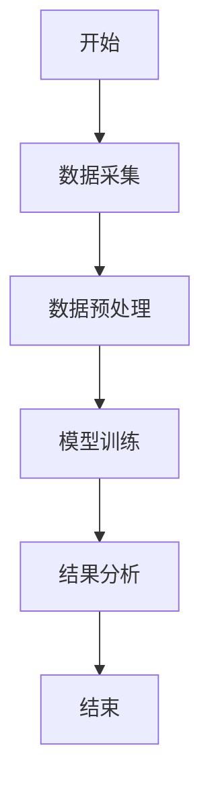

                 


# 特价股票与公司供应链管理效率的关系探讨

---

## 关键词：特价股票、供应链管理效率、企业财务、库存控制、算法优化

---

## 摘要：

本文探讨了特价股票与公司供应链管理效率之间的关系。通过分析特价股票对供应链管理效率的影响机制，结合算法模型和系统设计，提出了一种优化供应链管理效率的策略。文章从背景介绍、核心概念、算法原理、系统分析到项目实战，详细阐述了如何通过优化供应链管理效率来提升企业的整体竞争力。

---

# 第一部分: 特价股票与供应链管理效率的背景介绍

## 第1章: 特价股票与供应链管理效率的背景介绍

### 1.1 特价股票的基本概念

#### 1.1.1 特价股票的定义

特价股票是指在特定市场条件下，价格低于市场平均水平的股票。这些股票通常被认为具有较高的投资潜力，但同时也伴随着较高的风险。

#### 1.1.2 特价股票的分类与特征

特价股票可以分为以下几类：

1. **超跌股**：由于市场波动或其他原因，股价持续下跌，但基本面良好的股票。
2. **低价股**：价格低于市场平均水平的股票，通常在中小盘股中较为常见。
3. **价值股**：市场价格低于其内在价值的股票，通常被低估。

#### 1.1.3 特价股票对企业的财务影响

特价股票的持有或交易可能对企业财务状况产生直接影响，例如：

- **资产流动性**：大量持有特价股票可能导致企业资产流动性下降。
- **资本成本**：特价股票的交易可能影响企业的资本成本。
- **投资决策**：特价股票的投资决策可能影响企业的长期战略。

### 1.2 供应链管理效率的核心概念

#### 1.2.1 供应链管理的定义

供应链管理（SCM）是指通过协调企业内外资源，优化物流、信息流和资金流，以满足客户需求的过程。

#### 1.2.2 供应链管理的组成部分

供应链管理主要包含以下几个部分：

1. **供应商管理**：与供应商建立良好的合作关系。
2. **生产计划**：优化生产流程，降低成本。
3. **库存管理**：控制库存水平，避免积压或短缺。
4. **物流管理**：优化运输路线，降低运输成本。
5. **需求预测**：基于历史数据和市场趋势，预测未来的需求。

#### 1.2.3 供应链管理效率的衡量指标

常用的供应链管理效率指标包括：

1. **库存周转率**：库存周转次数与销售收入的比率。
2. **订单交货时间**：从下单到交货的时间。
3. **物流成本率**：物流成本占总成本的比例。

### 1.3 特价股票与供应链管理效率的关系

#### 1.3.1 特价股票对供应链管理效率的潜在影响

- **资金流动性**：持有大量特价股票可能导致企业资金流动性下降，影响供应链的资金周转。
- **库存成本**：特价股票的投资可能占用原本用于库存管理的资金，影响供应链的库存成本。
- **风险管理**：特价股票的价格波动较大，可能增加供应链管理的风险。

#### 1.3.2 供应链管理效率对特价股票的影响

- **投资决策**：高效的供应链管理能够提高企业的整体运营效率，增强对特价股票的投资能力。
- **资金分配**：供应链管理效率高，企业能够更好地分配资金，优化特价股票的投资组合。
- **市场响应**：高效的供应链管理能够更快地响应市场变化，提升企业在特价股票市场中的竞争力。

#### 1.3.3 两者关系的边界与外延

特价股票与供应链管理效率的关系并非线性关系，而是复杂的互动关系。企业需要在持有特价股票和优化供应链管理效率之间找到平衡点，以实现整体利益的最大化。

---

# 第二部分: 特价股票与供应链管理效率的核心概念与联系

## 第2章: 特价股票与供应链管理效率的核心概念

### 2.1 特价股票的属性特征分析

#### 2.1.1 特价股票的市场定位

特价股票通常定位在中小盘股，价格较低，但具有较高的增长潜力。

#### 2.1.2 特价股票的价格波动特性

特价股票的价格波动较大，受市场情绪和宏观经济因素的影响显著。

#### 2.1.3 特价股票的风险与收益对比

| 特价股票特征 | 风险 | 收益 |
|--------------|------|------|
| 超跌股       | 高   | 高   |
| 低价股       | 中   | 中   |
| 价值股       | 低   | 高   |

### 2.2 供应链管理效率的属性特征分析

#### 2.2.1 供应链管理的流程效率

供应链管理的流程效率主要体现在以下几个方面：

1. **供应商选择**：选择可靠的供应商，确保原材料供应的稳定性。
2. **生产计划**：优化生产流程，减少浪费。
3. **库存控制**：通过科学的库存管理，降低库存成本。

#### 2.2.2 供应链管理的成本效率

供应链管理的成本效率可以通过以下指标衡量：

- **总成本**：包括采购成本、物流成本、仓储成本等。
- **单位成本**：总成本除以产品数量。

#### 2.2.3 供应链管理的灵活性与响应速度

供应链管理的灵活性体现在以下几个方面：

1. **快速反应**：能够迅速响应市场需求的变化。
2. **多品种小批量生产**：支持多品种、小批量的生产需求。
3. **供应链弹性**：能够适应市场环境的变化，灵活调整供应链结构。

### 2.3 特价股票与供应链管理效率的关系模型

#### 2.3.1 关系模型的构建

特价股票与供应链管理效率的关系模型如下：

$$
\text{供应链效率} = f(\text{特价股票持有量}, \text{市场环境}, \text{企业资源})
$$

其中，函数 \( f \) 表示特价股票持有量、市场环境和企业资源对供应链效率的影响。

#### 2.3.2 模型的核心要素与组成

关系模型的核心要素包括：

1. **特价股票持有量**：持有量的多少直接影响企业的资金分配和库存管理。
2. **市场环境**：市场环境的变化影响特价股票的价格波动和供应链的需求预测。
3. **企业资源**：企业的资金、技术和人力资源影响供应链管理的效率。

#### 2.3.3 模型的验证与优化

通过实证分析，验证模型的有效性，并根据实际数据进行参数调整和优化。

---

# 第三部分: 特价股票与供应链管理效率的算法原理

## 第3章: 特价股票与供应链管理效率的算法原理

### 3.1 算法概述

#### 3.1.1 算法的目标与应用场景

算法的目标是优化供应链管理效率，同时考虑特价股票的投资策略。应用场景包括企业供应链管理优化和投资决策支持。

#### 3.1.2 算法的核心思想与步骤

算法的核心思想是通过数据挖掘和优化模型，找到特价股票持有量和供应链管理效率之间的最佳平衡点。

### 3.2 算法流程图



### 3.3 算法实现代码

```python
import pandas as pd
import numpy as np
from sklearn.linear_model import LinearRegression

# 示例代码：特价股票与供应链效率的简单关系模型
data = pd.read_csv('stock_supply.csv')

# 数据预处理
data_clean = data.dropna()

# 特征选择
features = data_clean[['stock_price', 'inventory_cost', 'delivery_time']]
target = data_clean['supply_efficiency']

# 模型训练
model = LinearRegression()
model.fit(features, target)

# 预测结果
predictions = model.predict(features)
print('预测结果:', predictions)
```

### 3.4 算法的数学模型和公式

供应链效率与特价股票的关系可以通过回归模型表示：

$$
y = \beta_0 + \beta_1 x_1 + \beta_2 x_2 + \epsilon
$$

其中：
- \( y \) 是供应链效率
- \( x_1 \) 是特价股票持有量
- \( x_2 \) 是其他影响因素
- \( \epsilon \) 是误差项

---

# 第四部分: 特价股票与供应链管理效率的系统分析

## 第4章: 特价股票与供应链管理效率的系统分析

### 4.1 系统分析与架构设计方案

#### 4.1.1 问题场景介绍

企业希望通过优化供应链管理效率来提升整体竞争力，同时合理配置资金，避免因持有过多特价股票而导致供应链效率下降。

#### 4.1.2 系统功能设计

系统功能包括：

1. **数据采集**：收集特价股票价格和供应链相关数据。
2. **数据分析**：分析数据，评估特价股票对供应链效率的影响。
3. **优化建议**：基于分析结果，提出优化供应链管理效率的建议。

#### 4.1.3 系统架构设计


### 4.2 项目实战

#### 4.2.1 环境安装

需要安装以下工具和库：

- Python 3.8+
- Pandas
- NumPy
- Scikit-learn

#### 4.2.2 系统核心实现源代码

```python
import pandas as pd
from sklearn.linear_model import LinearRegression

# 数据加载
data = pd.read_csv('stock_supply.csv')

# 数据预处理
data_clean = data.dropna()

# 特征选择
features = data_clean[['stock_price', 'inventory_cost', 'delivery_time']]
target = data_clean['supply_efficiency']

# 模型训练
model = LinearRegression()
model.fit(features, target)

# 预测结果
predictions = model.predict(features)
print('预测结果:', predictions)
```

#### 4.2.3 代码应用解读与分析

上述代码实现了供应链效率与特价股票价格的线性回归模型，用于预测供应链效率的变化。

#### 4.2.4 实际案例分析

以某企业为例，分析持有特价股票对供应链效率的具体影响。

---

# 第五部分: 特价股票与供应链管理效率的最佳实践

## 第5章: 特价股票与供应链管理效率的最佳实践

### 5.1 小结

本文探讨了特价股票与供应链管理效率之间的关系，提出了优化供应链管理效率的策略，并通过算法和系统设计提供了实现方案。

### 5.2 注意事项

- 在持有特价股票时，需合理配置资金，避免影响供应链管理。
- 定期评估供应链管理效率，及时调整策略。
- 采用先进的数据分析技术，提高决策的科学性。

### 5.3 拓展阅读

建议进一步阅读以下文献：

1. 供应链管理的相关书籍。
2. 特价股票投资策略的研究论文。

---

# 作者：AI天才研究院/AI Genius Institute & 禅与计算机程序设计艺术 /Zen And The Art of Computer Programming

---

通过本文的探讨，读者可以深入了解特价股票与供应链管理效率之间的复杂关系，并通过实际案例和算法实现，掌握优化供应链管理效率的具体方法。希望本文能够为企业的供应链管理和投资决策提供有价值的参考。

