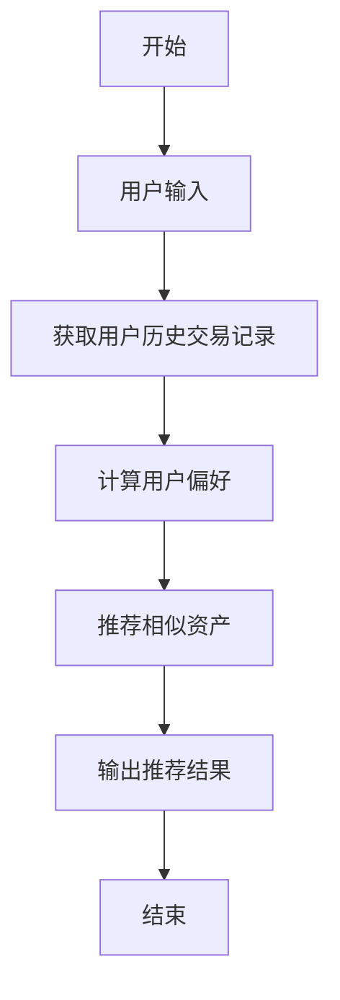
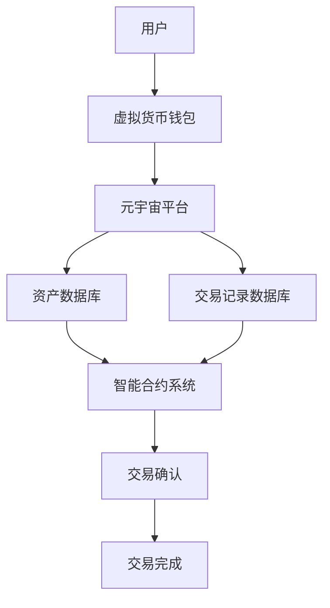
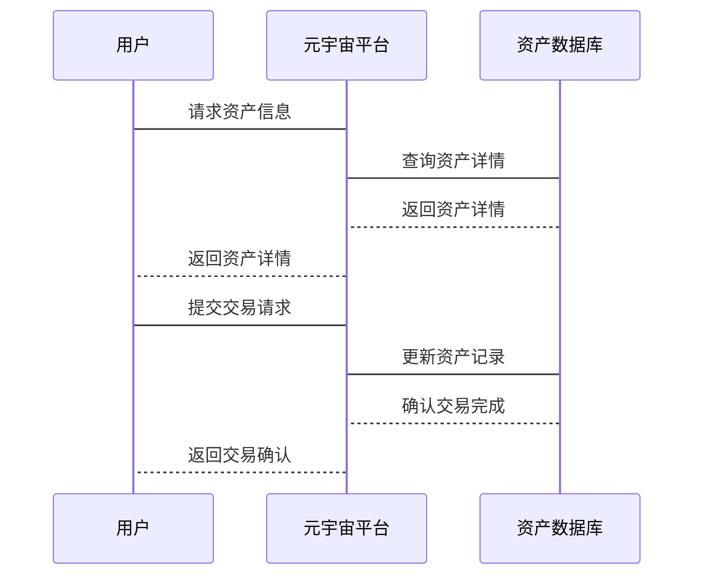

                 


# 特价股票与公司元宇宙互操作性能力的潜在关联研究

> 关键词：特价股票，元宇宙，互操作性，数字资产，虚拟经济，区块链

> 摘要：本文探讨了特价股票与元宇宙互操作性能力的潜在关联，分析了两者的核心概念、技术基础、数学模型及系统架构。通过对比与联系，揭示了互操作性能力在数字资产与虚拟经济中的重要作用，并提出了基于协同过滤推荐算法的实现方案。文章最后结合实际案例，展示了系统设计与实现，并总结了最佳实践。

---

## 第一部分: 特价股票与元宇宙互操作性能力的背景与概念

### 第1章: 特价股票与元宇宙的基本概念

#### 1.1 特价股票的定义与特点
- **1.1.1 特价股票的定义**
  特价股票是指价格相对较低、流通量大、适合短线交易的股票，通常具有高波动性和高风险回报特征。
- **1.1.2 特价股票的特点与分类**
  - **特点**：价格波动大、交易活跃、适合投机。
  - **分类**：包括小盘股、垃圾股、成长股等。
- **1.1.3 特价股票的市场现状与发展趋势**
  当前，特价股票在股票市场中占据重要地位，随着市场波动加剧，其吸引力进一步增强。

#### 1.2 元宇宙的定义与特点
- **1.2.1 元宇宙的定义**
  元宇宙是一个虚拟的、去中心化的数字空间，用户可以通过虚拟现实技术进行互动。
- **1.2.2 元宇宙的核心技术与应用场景**
  - **核心技术**：区块链、虚拟现实、人工智能。
  - **应用场景**：虚拟社交、虚拟资产、虚拟商品交易。
- **1.2.3 元宇宙的市场现状与未来趋势**
  元宇宙正在快速发展，吸引了大量投资，未来将成为虚拟经济的重要组成部分。

#### 1.3 特价股票与元宇宙的潜在关联
- **1.3.1 特价股票与元宇宙的初步关联**
  元宇宙的虚拟经济体系需要数字资产支持，而特价股票可能成为其中的一部分。
- **1.3.2 元宇宙对特价股票市场的影响**
  元宇宙的虚拟资产交易可能与传统股票市场形成竞争，但也可能带来新的投资机会。
- **1.3.3 特价股票在元宇宙中的潜在应用**
  特价股票可以通过元宇宙中的虚拟货币进行交易，或者成为虚拟经济中的信用工具。

---

### 第2章: 特价股票与元宇宙的背景介绍

#### 2.1 特价股票的市场背景
- **2.1.1 特价股票的市场现状**
  特价股票市场波动剧烈，吸引了大量短线交易者。
- **2.1.2 特价股票的市场参与者与交易机制**
  参与者包括个人投资者、机构投资者和高频交易算法。
- **2.1.3 特价股票的市场波动与风险**
  高波动性带来了高风险，但也提供了高回报的机会。

#### 2.2 元宇宙的技术背景
- **2.2.1 元宇宙的核心技术**
  区块链用于虚拟资产的去中心化管理，人工智能用于智能合约和数据分析。
- **2.2.2 元宇宙的硬件与软件支持**
  需要高性能计算、虚拟现实设备和分布式系统。
- **2.2.3 元宇宙的发展阶段与技术挑战**
  当前处于初期发展阶段，面临技术瓶颈和法律法规挑战。

#### 2.3 特价股票与元宇宙的背景关联
- **2.3.1 特价股票与元宇宙的市场背景**
  特价股票的高波动性和元宇宙的虚拟经济特性为互操作性提供了基础。
- **2.3.2 元宇宙对特价股票市场的潜在影响**
  元宇宙可能通过虚拟资产交易影响传统股票市场，但也可能带来新的投资渠道。
- **2.3.3 特价股票在元宇宙中的应用场景**
  特价股票可能成为元宇宙虚拟经济中的信用工具或交易媒介。

---

## 第二部分: 特价股票与元宇宙的核心概念与联系

### 第3章: 特价股票与元宇宙的核心概念

#### 3.1 特价股票的核心概念
- **3.1.1 特价股票的定义与分类**
  特价股票是指价格低、波动大、适合短线交易的股票。
- **3.1.2 特价股票的市场特征与交易机制**
  市场特征包括高波动性、高风险回报；交易机制包括竞价交易、做空机制。
- **3.1.3 特价股票的市场参与者与利益相关者**
  包括个人投资者、机构投资者和高频交易算法。

#### 3.2 元宇宙的核心概念
- **3.2.1 元宇宙的定义与核心要素**
  元宇宙是一个虚拟的、去中心化的数字空间，核心要素包括虚拟身份、虚拟资产和虚拟经济。
- **3.2.2 元宇宙的技术架构与功能模块**
  包括虚拟现实引擎、区块链平台、智能合约系统。
- **3.2.3 元宇宙的用户行为与社会特征**
  用户通过虚拟身份进行社交、交易和互动。

#### 3.3 特价股票与元宇宙的核心联系
- **3.3.1 特价股票与元宇宙的共同特征**
  两者都具有高波动性、高风险回报特性。
- **3.3.2 特价股票与元宇宙的潜在互动**
  元宇宙的虚拟资产交易可能与特价股票市场形成互动。
- **3.3.3 特价股票与元宇宙的协同效应**
  通过互操作性能力，特价股票可能成为元宇宙虚拟经济的重要组成部分。

### 第4章: 特价股票与元宇宙的核心概念对比与联系

#### 4.1 特价股票与元宇宙的属性特征对比
- **4.1.1 特价股票的属性特征**
  - 高波动性
  - 高风险回报
  - 适合短线交易
- **4.1.2 元宇宙的属性特征**
  - 虚拟性
  - 去中心化
  - 多元化应用场景
- **4.1.3 对比结果**
  特价股票和元宇宙在高风险回报和虚拟性方面具有相似性，但在应用场景和技术基础方面存在差异。

#### 4.2 特价股票与元宇宙的属性特征对比表格
| 属性 | 特价股票 | 元宇宙 |
|------|----------|--------|
| 特性 | 高波动性、高风险回报 | 虚拟性、去中心化、多元化 |
| 市场参与者 | 个人投资者、机构投资者 | 虚拟用户、虚拟经济参与者 |
| 交易机制 | 竞价交易、做空机制 | 智能合约、虚拟货币交易 |

#### 4.3 特价股票与元宇宙的ER实体关系图

```mermaid
erDiagram
    actor 特价股票用户 {
        <属性> 用户ID
        <属性> 股票代码
        <属性> 交易金额
    }
    actor 元宇宙用户 {
        <属性> 用户ID
        <属性> 虚拟资产
        <属性> 交易金额
    }
    entity 特价股票 {
        <主键> 股票ID
        <属性> 股票名称
        <属性> 股票价格
        <属性> 市场波动率
    }
    entity 元宇宙资产 {
        <主键> 资产ID
        <属性> 资产名称
        <属性> 资产价值
        <属性> 资产类型
    }
    relationship 特价股票交易 {
        <外键> 股票ID
        <外键> 用户ID
        <外键> 交易金额
    }
    relationship 元宇宙交易 {
        <外键> 资产ID
        <外键> 用户ID
        <外键> 交易金额
    }
```

---

## 第三部分: 特价股票与元宇宙的核心联系与数学模型

### 第5章: 特价股票与元宇宙的核心联系

#### 5.1 特价股票与元宇宙的核心联系
- **协同效应**：通过互操作性能力，特价股票可能成为元宇宙虚拟经济中的重要资产。
- **技术融合**：区块链技术可以实现特价股票的虚拟化，元宇宙的技术架构可以支持其交易。

#### 5.2 特价股票与元宇宙的数学模型
- **协同过滤推荐算法**：用于预测用户在元宇宙中的资产偏好，从而推荐适合的特价股票。
- **模型公式**：
  $$
  \text{推荐概率} = \sum_{i=1}^{n} w_{u,i} \cdot s_{i,j}
  $$
  其中，$w_{u,i}$ 是用户 $u$ 和资产 $i$ 的相似度，$s_{i,j}$ 是资产 $i$ 和资产 $j$ 的相似度。

#### 5.3 特价股票与元宇宙的协同过滤推荐算法



#### 5.4 算法实现代码

```python
def协同过滤推荐算法：
    输入：用户ID，历史交易记录
    输出：推荐资产列表
    步骤：
        1. 计算用户与其他用户的相似度。
        2. 基于相似度和用户的历史交易记录，预测用户的偏好资产。
        3. 根据预测结果生成推荐列表。
```

---

## 第四部分: 特价股票与元宇宙的系统分析与架构设计

### 第6章: 系统分析与架构设计

#### 6.1 问题场景介绍
- 特价股票与元宇宙的互操作性能力需要实现资产的虚拟化和交易的无缝对接。
- 用户需要在元宇宙中使用虚拟货币或代币进行特价股票的交易。

#### 6.2 系统功能设计
- **领域模型**：用户、资产、交易记录、虚拟货币。

#### 6.3 系统架构设计



#### 6.4 系统接口设计
- **API接口**：RESTful API，用于资产查询、交易记录获取和交易确认。

#### 6.5 系统交互设计



---

## 第五部分: 特价股票与元宇宙的项目实战

### 第7章: 项目实战

#### 7.1 环境安装
- **安装Python**：确保安装Python 3.8及以上版本。
- **安装依赖库**：包括Flask、Pandas、Scikit-learn。

#### 7.2 系统核心实现
- **协同过滤推荐算法实现**

```python
from sklearn.metrics.pairwise import cosine_similarity
import pandas as pd

def calculate_similarity(user_matrix):
    return cosine_similarity(user_matrix)

def collaborative_filtering_recommender(user_id, user_matrix, item_matrix):
    user_vector = user_matrix[user_id]
    similarities = calculate_similarity(user_matrix)
    similar_users = [i for i in range(len(similarities[user_id])) if i != user_id]
   推荐资产 = []
    for user in similar_users:
       推荐资产.extend(item_matrix[user].nlargest(3).index)
    return 推荐资产
```

#### 7.3 代码应用解读
- **用户矩阵**：记录用户对资产的评分或交易记录。
- **相似度计算**：使用余弦相似度计算用户之间的相似度。
- **推荐资产**：基于相似用户的资产偏好进行推荐。

#### 7.4 实际案例分析
- **案例背景**：假设用户A在元宇宙中购买了某种虚拟货币，希望推荐适合的特价股票。
- **数据处理**：提取用户A的历史交易记录和资产数据。
- **模型训练**：基于协同过滤算法训练推荐模型。
- **结果输出**：推荐适合的特价股票列表。

#### 7.5 项目小结
- **实现步骤**：环境搭建、数据收集、模型训练、结果输出。
- **注意事项**：确保数据隐私和交易安全，优化算法性能。

---

## 第六部分: 特价股票与元宇宙的最佳实践

### 第8章: 最佳实践

#### 8.1 小结
- **核心内容**：本文探讨了特价股票与元宇宙的潜在关联，分析了互操作性能力的重要性，并提出了协同过滤推荐算法的实现方案。
- **关键点**：数字资产、虚拟经济、互操作性能力。

#### 8.2 注意事项
- **数据隐私**：保护用户数据隐私，防止数据泄露。
- **交易安全**：确保交易过程中的数据安全和用户资产安全。
- **算法优化**：优化协同过滤算法，提高推荐准确率。

#### 8.3 拓展阅读
- **相关文献**：推荐阅读关于虚拟经济和区块链技术的书籍和论文。
- **技术社区**：参与技术社区讨论，了解行业最新动态。

---

## 结语

感谢您的阅读！如需进一步探讨或获取代码示例，请随时联系我。我们期待您的反馈！

---

**作者：AI天才研究院/AI Genius Institute & 禅与计算机程序设计艺术 /Zen And The Art of Computer Programming**

