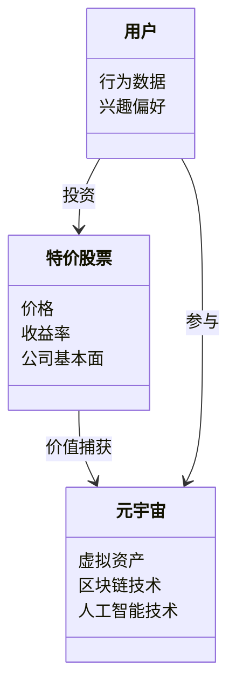
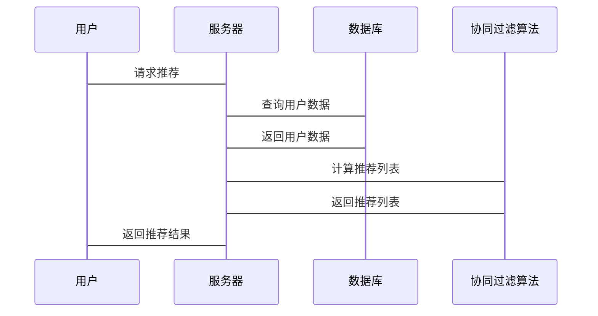

                 


# 特价股票与公司元宇宙价值捕获能力的潜在联系

> 关键词：特价股票，元宇宙，价值捕获，投资机会，协同算法

> 摘要：本文深入探讨了特价股票与元宇宙价值捕获能力之间的潜在联系，分析了特价股票的定义与特征、元宇宙的定义与价值捕获能力，以及两者之间的协同效应。通过构建联系模型、实体关系图和算法模型，本文详细阐述了如何利用技术手段捕捉特价股票在元宇宙中的潜在价值。文章还结合实际案例，展示了如何通过协同过滤推荐系统和数学模型实现价值捕获，并提出了最佳实践和注意事项。

---

## 第一部分: 特价股票与元宇宙价值捕获的背景与核心概念

### 第1章: 特价股票的定义与特征

#### 1.1 特价股票的定义
##### 1.1.1 特价股票的基本概念
特价股票是指在特定条件下以低于市场价发行的股票，通常用于吸引投资者或稀释现有股东的股权。其核心特征包括低发行价、高增长潜力和较高的投资回报率。

##### 1.1.2 特价股票的分类与特点
特价股票可以分为以下几类：
1. **初次公开发行（IPO）特价股票**：新公司以低于市场价发行股票，吸引早期投资者。
2. **配售特价股票**：公司通过配售方式向现有股东提供低价股票，用于资本扩张。
3. **员工激励特价股票**：公司向员工提供低价股票作为激励措施。

##### 1.1.3 特价股票的市场定位与投资价值
特价股票通常具有较高的增长潜力，但同时也伴随着较高的风险。其投资价值取决于公司的基本面、行业前景和市场环境。

---

#### 1.2 特价股票的市场现状
##### 1.2.1 特价股票的市场分布
当前市场中，特价股票主要集中在科技、人工智能和区块链等领域，这些行业的公司通常通过发行特价股票来吸引早期投资者。

##### 1.2.2 特价股票的投资机会与风险
投资机会：
- 高增长潜力：特价股票通常对应的是高成长性公司，投资回报率较高。
- 低价门槛：适合中小投资者参与。

风险：
- 市场波动大：特价股票价格波动较大，容易受市场情绪影响。
- 公司基本面不稳定：部分公司可能因管理不善或市场环境变化导致股价下跌。

##### 1.2.3 特价股票与传统股票的区别
- **发行方式**：特价股票通常通过配售或IPO方式发行，而传统股票通过二级市场交易。
- **价格敏感性**：特价股票价格对市场波动更敏感，而传统股票价格相对稳定。
- **投资者门槛**：特价股票通常要求较高的投资门槛，而传统股票适合各类投资者。

---

### 第2章: 元宇宙的定义与价值捕获能力

#### 2.1 元宇宙的基本概念
##### 2.1.1 元宇宙的定义与特征
元宇宙是一个虚拟的、去中心化的数字世界，用户可以通过虚拟现实技术（VR）或增强现实技术（AR）进行交互。其核心特征包括：
- **去中心化**：基于区块链技术，确保数据的安全性和不可篡改性。
- **虚拟现实**：通过VR和AR技术实现沉浸式体验。
- **智能合约**：通过区块链技术实现自动化交易和价值传递。

##### 2.1.2 元宇宙的核心技术与应用场景
- **区块链技术**：确保元宇宙中的资产和交易的安全性。
- **人工智能技术**：用于智能合约执行和用户行为分析。
- **虚拟现实技术**：实现沉浸式用户体验。

##### 2.1.3 元宇宙的经济体系与价值传递
元宇宙中的经济体系基于区块链技术，用户可以通过持有虚拟货币、数字资产或虚拟土地来实现价值捕获。智能合约用于自动执行交易和分配收益。

---

#### 2.2 元宇宙的价值捕获能力
##### 2.2.1 元宇宙中的价值捕获机制
价值捕获机制包括：
- **资产持有**：用户通过持有虚拟资产（如虚拟土地、数字艺术品）实现价值。
- **智能合约**：通过智能合约自动分配收益，确保价值的公平分配。
- **虚拟经济活动**：用户通过参与虚拟经济活动（如虚拟交易、游戏）实现价值。

##### 2.2.2 元宇宙中的资产与权益
- **虚拟货币**：如比特币、以太坊等，用于元宇宙中的交易。
- **数字资产**：如数字艺术品、虚拟土地等，具有较高的收藏价值。
- **虚拟权益**：用户通过持有公司股权或参与治理实现权益。

##### 2.2.3 元宇宙价值捕获的潜力与挑战
潜力：
- **高增长潜力**：元宇宙市场规模预计将达到数万亿美元，价值捕获潜力巨大。
- **技术创新**：区块链、人工智能和虚拟现实技术的不断进步将推动元宇宙的发展。

挑战：
- **技术瓶颈**：元宇宙的实现需要克服虚拟现实、区块链等技术的限制。
- **监管不确定性**：元宇宙的法律和监管框架尚未完善，存在一定的不确定性。

---

### 第3章: 特价股票与元宇宙的潜在联系

#### 3.1 特价股票与元宇宙的市场关联
##### 3.1.1 特价股票在元宇宙经济中的作用
特价股票可以作为元宇宙中的虚拟资产，用户可以通过持有特价股票参与元宇宙的经济活动。

##### 3.1.2 元宇宙对特价股票价值的影响
元宇宙的兴起将推动科技公司的发展，从而提升特价股票的投资价值。

##### 3.1.3 特价股票与元宇宙技术的融合
特价股票可以通过区块链技术实现去中心化发行和交易，进一步推动元宇宙的发展。

#### 3.2 特价股票与元宇宙的协同效应
##### 3.2.1 特价股票在元宇宙生态中的地位
特价股票可以作为元宇宙中的基础资产，为用户提供投资和交易的机会。

##### 3.2.2 元宇宙对特价股票投资策略的影响
元宇宙的兴起将改变股票市场的投资策略，投资者需要更加关注科技公司的技术创新和市场布局。

##### 3.2.3 特价股票与元宇宙价值捕获的协同机制
通过协同机制，特价股票和元宇宙可以实现价值的共同增长，推动技术创新和市场扩展。

---

## 第二部分: 特价股票与元宇宙价值捕获的核心概念与联系

### 第4章: 特价股票与元宇宙的核心概念原理

#### 4.1 特价股票的核心属性特征
##### 4.1.1 特价股票的市场定位
特价股票通常定位为高成长性公司的早期投资机会，适合风险承受能力较高的投资者。

##### 4.1.2 特价股票的投资价值
投资价值取决于公司的基本面、行业前景和市场环境。高成长性公司通常具有较高的投资价值。

##### 4.1.3 特价股票的风险与收益
- **风险**：市场波动大、公司基本面不稳定。
- **收益**：高增长潜力、较高的投资回报率。

#### 4.2 元宇宙的核心技术特征
##### 4.2.1 元宇宙的虚拟现实技术
虚拟现实技术通过沉浸式体验实现用户与元宇宙的交互。

##### 4.2.2 元宇宙的区块链技术
区块链技术确保元宇宙中的资产和交易的安全性。

##### 4.2.3 元宇宙的人工智能技术
人工智能技术用于智能合约执行和用户行为分析。

#### 4.3 特价股票与元宇宙的联系模型
##### 4.3.1 联系模型的构建
通过构建联系模型，可以分析特价股票与元宇宙之间的相互作用和协同效应。

##### 4.3.2 联系模型的属性特征
联系模型的属性特征包括：
- **协同性**：特价股票与元宇宙的协同效应。
- **互动性**：用户通过持有特价股票参与元宇宙的经济活动。
- **创新性**：技术创新推动特价股票与元宇宙的共同发展。

##### 4.3.3 联系模型的验证与优化
通过实证分析和模型优化，验证联系模型的有效性和准确性。

---

### 第5章: 特价股票与元宇宙价值捕获的ER实体关系图

#### 5.1 特价股票与元宇宙的实体关系
##### 5.1.1 实体关系的定义
- **特价股票**：作为元宇宙中的虚拟资产，用户通过持有特价股票参与经济活动。
- **元宇宙经济体系**：通过区块链技术实现资产的去中心化和价值传递。

##### 5.1.2 实体关系的属性
- **资产持有**：用户通过持有特价股票实现资产的虚拟化。
- **价值捕获**：用户通过参与元宇宙的经济活动实现价值捕获。

##### 5.1.3 实体关系的关联
- **交易关系**：用户通过特价股票交易实现资产的流动。
- **价值传递**：通过区块链技术实现价值的自动分配。

---

## 第三部分: 特价股票与元宇宙价值捕获的算法原理

### 第6章: 特价股票与元宇宙价值捕获的协同算法

#### 6.1 协同过滤推荐系统
##### 6.1.1 协同过滤的基本原理
协同过滤是一种基于用户行为和偏好推荐系统的算法，通过分析用户的相似性来推荐相关内容。

##### 6.1.2 基于用户的协同过滤
通过分析用户的相似性，推荐与用户兴趣相符的特价股票和元宇宙项目。

##### 6.1.3 基于物品的协同过滤
通过分析特价股票和元宇宙项目的相似性，推荐与用户相关的内容。

#### 6.2 特价股票与元宇宙协同的算法实现
##### 6.2.1 算法的输入与输出
- **输入**：用户行为数据、特价股票和元宇宙项目的属性特征。
- **输出**：推荐的特价股票和元宇宙项目列表。

##### 6.2.2 算法的实现步骤
1. 收集用户行为数据。
2. 分析用户相似性和项目相似性。
3. 生成推荐列表。

##### 6.2.3 算法的优化与改进
通过改进相似性计算方法和引入机器学习技术，提升协同过滤的推荐效果。

---

### 第7章: 特价股票与元宇宙价值捕获的数学模型

#### 7.1 特价股票价值的数学模型
##### 7.1.1 特价股票价值的计算公式
$$ V = P \times (1 + r)^n $$
其中，\( V \) 表示股票的未来价值，\( P \) 表示当前价格，\( r \) 表示年化收益率，\( n \) 表示时间。

##### 7.1.2 特价股票价值的影响因素
- **公司基本面**：包括收入、利润、增长率等。
- **行业前景**：包括行业发展趋势、政策支持等。
- **市场环境**：包括宏观经济环境、市场情绪等。

#### 7.2 元宇宙价值捕获的数学模型
##### 7.2.1 元宇宙价值捕获的计算公式
$$ V = A \times (1 + r)^n $$
其中，\( A \) 表示虚拟资产的初始价值，\( r \) 表示年化收益率，\( n \) 表示时间。

##### 7.2.2 元宇宙价值捕获的影响因素
- **技术创新**：包括区块链、人工智能和虚拟现实技术的进步。
- **用户参与度**：包括用户数量和参与度。
- **市场接受度**：包括市场对元宇宙的接受度和认可度。

---

## 第四部分: 特价股票与元宇宙价值捕获的系统分析与架构设计

### 第8章: 特价股票与元宇宙价值捕获的系统分析

#### 8.1 问题场景介绍
- **问题背景**：如何利用技术手段捕捉特价股票在元宇宙中的潜在价值。
- **问题描述**：分析特价股票与元宇宙之间的协同效应，构建价值捕获模型。
- **问题解决**：通过协同过滤推荐系统和数学模型实现价值捕获。

#### 8.2 系统功能设计
##### 8.2.1 领域模型


##### 8.2.2 系统架构设计


##### 8.2.3 系统接口设计
- **输入接口**：用户行为数据、特价股票和元宇宙项目的属性特征。
- **输出接口**：推荐的特价股票和元宇宙项目列表。

##### 8.2.4 系统交互设计


---

## 第五部分: 特价股票与元宇宙价值捕获的项目实战

### 第9章: 特价股票与元宇宙价值捕获的项目实战

#### 9.1 环境安装
- **开发环境**：Python 3.8+
- **依赖库**：pandas, numpy, scikit-learn, matplotlib

#### 9.2 系统核心实现源代码
```python
import pandas as pd
from sklearn.metrics.pairwise import cosine_similarity

# 加载用户行为数据
users = pd.read_csv('users.csv')

# 加载特价股票和元宇宙项目数据
stocks = pd.read_csv('stocks.csv')
projects = pd.read_csv('projects.csv')

# 计算用户相似性
user_similarity = cosine_similarity(users)

# 计算项目相似性
stock_similarity = cosine_similarity(stocks)
project_similarity = cosine_similarity(projects)

# 推荐算法实现
def recommend_stocks(user_id, similarity_matrix):
    # 找出与当前用户相似性最高的用户
    similar_users = similarity_matrix[user_id].argsort()[::-1][:5]
    # 推荐股票
    recommended_stocks = []
    for user in similar_users:
        recommended_stocks.extend(stocks[user])
    return recommended_stocks

def recommend_projects(user_id, similarity_matrix):
    similar_users = similarity_matrix[user_id].argsort()[::-1][:5]
    recommended_projects = []
    for user in similar_users:
        recommended_projects.extend(projects[user])
    return recommended_projects
```

#### 9.3 代码应用解读与分析
- **用户行为数据**：包括用户的兴趣偏好和投资行为。
- **相似性计算**：通过余弦相似性计算用户和项目的相似性。
- **推荐算法**：基于协同过滤的推荐算法，为用户推荐特价股票和元宇宙项目。

#### 9.4 实际案例分析
- **案例背景**：假设用户A对人工智能和区块链技术感兴趣。
- **推荐结果**：推荐与用户A兴趣相符的特价股票和元宇宙项目。

#### 9.5 项目小结
通过协同过滤推荐系统和数学模型，我们可以实现特价股票与元宇宙价值捕获的协同效应，为投资者提供更加精准的投资建议。

---

## 第六部分: 特价股票与元宇宙价值捕获的最佳实践

### 第10章: 最佳实践与注意事项

#### 10.1 最佳实践
- **技术选型**：选择合适的协同过滤算法和数学模型。
- **数据处理**：确保数据的准确性和完整性。
- **系统优化**：通过优化算法和架构设计提升推荐效果。

#### 10.2 小结
特价股票与元宇宙价值捕获的潜在联系为投资者提供了新的投资机会和技术手段。通过技术创新和协同效应，我们可以实现价值的最大化。

#### 10.3 注意事项
- **风险控制**：投资者需要关注市场波动和技术风险。
- **合规性**：确保投资活动符合相关法律法规。
- **持续学习**：技术发展迅速，需要持续关注行业动态。

---

## 结语

特价股票与元宇宙价值捕获能力的潜在联系为我们提供了一个全新的视角，通过技术创新和协同效应，我们可以实现投资价值的最大化。希望本文的内容能够为投资者和科技爱好者提供有价值的参考和启发。

作者：AI天才研究院/AI Genius Institute & 禅与计算机程序设计艺术 /Zen And The Art of Computer Programming

