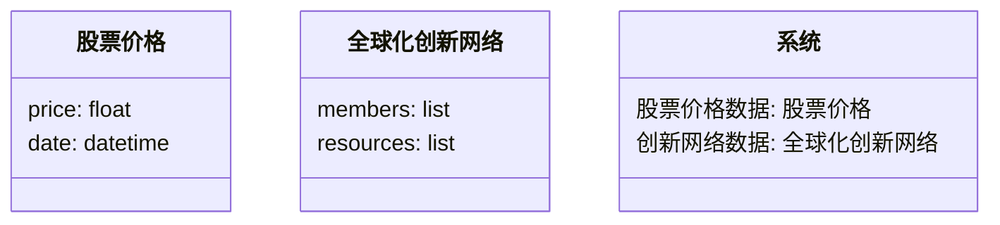
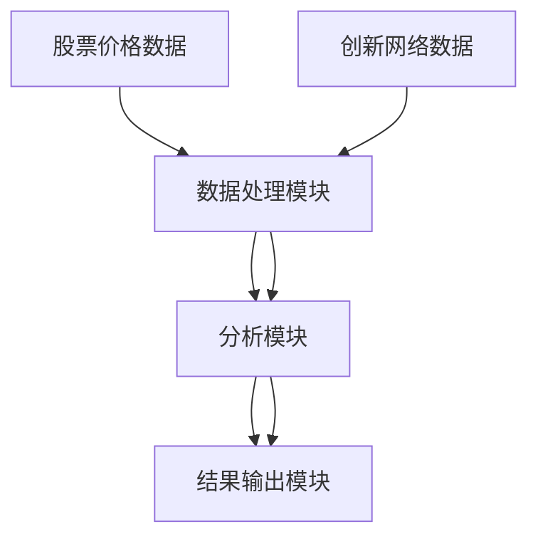
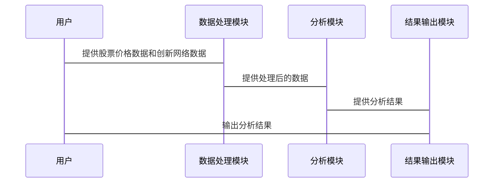

                 


# 特价股票与公司全球化创新网络的关系探讨

> 关键词：特价股票、全球化创新网络、算法原理、系统架构、项目实战

> 摘要：本文探讨了特价股票与公司全球化创新网络之间的关系，从背景介绍、核心概念、算法原理、系统架构设计、项目实战等多个维度进行深入分析。文章首先介绍了特价股票和全球化创新网络的基本概念，然后分析了两者之间的联系，接着详细阐述了相关的算法原理，包括特价股票价格预测算法和全球化创新网络的构建算法。最后，本文提出了系统架构设计方案和项目实战案例，总结了最佳实践和未来研究方向。

---

## 第一部分：特价股票与公司全球化创新网络的背景介绍

### 第1章：特价股票与公司全球化创新网络概述

#### 1.1 特价股票的基本概念

##### 1.1.1 特价股票的定义
特价股票是指公司发行的股票价格低于其面值的股票。通常，公司为了吸引投资者或进行资本结构调整，会发行特价股票。这种股票的面值通常为1元或更低，但实际交易价格可能低于面值。

##### 1.1.2 特价股票的特征
- **低面值**：特价股票的面值通常为1元或更低。
- **折价发行**：发行时价格低于面值。
- **吸引力强**：对投资者具有吸引力，尤其是对风险投资机构或战略投资者。
- **稀释性**：发行特价股票可能会稀释原有股东的股权。

##### 1.1.3 特价股票的分类
- **普通特价股票**：无特殊权利，仅享有普通股东的权利。
- **优先特价股票**：享有优先分红或优先清偿的权利。
- **认股权证附加型特价股票**：附带认股权证，允许投资者以特定价格购买公司债券或其他证券。

#### 1.2 公司全球化创新网络的概念

##### 1.2.1 全球化创新网络的定义
全球化创新网络是指公司在全球范围内建立的创新合作网络，包括研发机构、合作伙伴、供应链、客户和学术机构等。这些网络通过协同合作，推动公司的技术创新和业务扩展。

##### 1.2.2 全球化创新网络的构成要素
- **创新主体**：包括公司内部的研发团队和外部合作伙伴。
- **创新资源**：包括技术、资金、人才和信息等。
- **创新平台**：包括研发中心、实验室和合作项目等。
- **创新机制**：包括合作模式、激励机制和知识共享机制。

##### 1.2.3 全球化创新网络的特点
- **全球化**：覆盖全球范围，利用不同地区的资源和优势。
- **协同性**：各成员单位协同合作，共同推动创新。
- **动态性**：网络结构和合作关系不断变化和优化。

#### 1.3 特价股票与公司全球化创新网络的关系

##### 1.3.1 关系的背景介绍
特价股票的发行和公司全球化创新网络的构建之间存在一定的关联性。通过发行特价股票，公司可以吸引全球投资者，优化资本结构，从而支持全球化创新网络的建设。

##### 1.3.2 关系的核心概念
- **资本支持**：特价股票的发行为公司提供资金支持，用于全球化创新网络的建设。
- **股权结构**：特价股票的发行可能影响公司的股权结构，从而影响创新网络的管理。
- **合作机会**：通过吸引全球投资者，公司可以建立更广泛的创新合作关系。

##### 1.3.3 关系的边界与外延
- **边界**：特价股票的发行仅限于公司资本运作的一部分，而全球化创新网络的构建涉及更广泛的资源和合作。
- **外延**：随着全球化创新网络的扩展，公司可能需要更多的资本支持，进一步推动特价股票的发行。

#### 1.4 本章小结
本章介绍了特价股票和全球化创新网络的基本概念，分析了两者之间的关系，为后续章节的深入探讨奠定了基础。

---

## 第二部分：特价股票与公司全球化创新网络的核心概念与联系

### 第2章：特价股票与公司全球化创新网络的核心概念

#### 2.1 特价股票的核心原理

##### 2.1.1 特价股票的形成机制
- **市场供需**：市场对低价股票的需求推动了特价股票的形成。
- **公司行为**：公司为了吸引投资者或进行资本结构调整，选择发行特价股票。

##### 2.1.2 特价股票的市场影响
- **股价波动**：特价股票的发行可能导致股价短期波动。
- **投资者行为**：吸引风险投资者和机构投资者，可能带来更多的市场关注。

##### 2.1.3 特价股票的定价模型
- **面值定价法**：根据股票面值直接定价。
- **市场定价法**：根据市场供需情况定价。

#### 2.2 公司全球化创新网络的原理

##### 2.2.1 全球化创新网络的构建逻辑
- **资源整合**：公司通过全球化网络整合全球资源。
- **协同创新**：成员单位协同合作，共同推动技术创新。
- **知识共享**：通过知识共享促进网络的整体创新能力提升。

##### 2.2.2 全球化创新网络的运作机制
- **合作模式**：包括联合研发、技术转让和战略联盟等。
- **激励机制**：通过利益分配和股权激励促进成员单位的合作。
- **风险分担**：成员单位共同分担创新过程中的风险。

##### 2.2.3 全球化创新网络的效率优化
- **网络结构优化**：通过优化网络结构提高创新效率。
- **信息共享**：通过建立信息共享平台提高网络协作效率。
- **组织协调**：通过高效的组织协调机制促进网络的运作效率。

#### 2.3 特价股票与公司全球化创新网络的联系

##### 2.3.1 联系的理论基础
- **资本与创新的关系**：资本支持是创新活动的重要基础。
- **全球化与网络化的关系**：全球化背景下，公司需要通过网络化合作实现创新。

##### 2.3.2 联系的实践表现
- **资本支持**：特价股票的发行为全球化创新网络的建设提供资金支持。
- **股权结构优化**：通过发行特价股票优化公司股权结构，吸引全球投资者。
- **合作机会**：特价股票的发行可能吸引全球投资者，进而促进公司全球化创新网络的构建。

##### 2.3.3 联系的案例分析
- **案例一**：某科技公司通过发行特价股票吸引风险投资者，用于全球化研发中心的建设。
- **案例二**：某跨国公司通过发行特价股票优化股权结构，吸引全球合作伙伴，共同推动技术创新。

#### 2.4 本章小结
本章详细探讨了特价股票和全球化创新网络的核心概念及其联系，为后续章节的分析提供了理论基础。

---

## 第三部分：特价股票与公司全球化创新网络的算法原理

### 第3章：特价股票与公司全球化创新网络的算法原理

#### 3.1 特价股票价格预测算法

##### 3.1.1 算法概述
特价股票价格预测算法通过分析历史数据和市场趋势，预测股票的未来价格。常用的算法包括线性回归、时间序列分析和机器学习算法。

##### 3.1.2 算法流程图
```mermaid
graph TD
A[开始] -> B[数据预处理] -> C[特征提取] -> D[模型训练] -> E[模型预测] -> F[结果分析] -> G[结束]
```

##### 3.1.3 算法实现代码
```python
import pandas as pd
from sklearn.linear_model import LinearRegression

# 数据预处理
data = pd.read_csv('stock_data.csv')
X = data[['open', 'close', 'volume']]
y = data['price']

# 模型训练
model = LinearRegression()
model.fit(X, y)

# 模型预测
predictions = model.predict(X)
```

##### 3.1.4 算法原理的数学模型
特价股票价格预测的线性回归模型可以表示为：
$$ y = \beta_0 + \beta_1 x_1 + \beta_2 x_2 + \dots + \beta_n x_n + \epsilon $$
其中，$y$ 是预测的股票价格，$x_i$ 是自变量，$\beta_i$ 是回归系数，$\epsilon$ 是误差项。

#### 3.2 全球化创新网络的构建算法

##### 3.2.1 算法概述
全球化创新网络的构建算法通过分析成员单位之间的合作关系，优化网络结构，提高创新效率。常用算法包括网络流算法和聚类算法。

##### 3.2.2 算法流程图
```mermaid
graph TD
A[开始] -> B[数据收集] -> C[网络构建] -> D[网络优化] -> E[结果输出] -> F[结束]
```

##### 3.2.3 算法实现代码
```python
import networkx as nx

# 数据收集
data = pd.read_csv('network_data.csv')
G = nx.from_pandas_edgelist(data, 'from', 'to')

# 网络优化
nx.max_flow(G, 'source', 'target')
```

##### 3.2.4 算法原理的数学模型
全球化创新网络的构建可以通过最大流问题来优化：
$$ \text{最大化} \sum_{s} \text{flow}(s, t) $$
$$ \text{约束} \sum_{s} \text{flow}(s, t) \leq \text{容量}(t) $$
其中，$s$ 是源节点，$t$ 是目标节点，$\text{flow}(s, t)$ 是从源节点到目标节点的流量，$\text{容量}(t)$ 是目标节点的容量。

#### 3.3 本章小结
本章详细介绍了特价股票价格预测算法和全球化创新网络构建算法的原理和实现方法，为后续章节的系统设计和项目实战奠定了基础。

---

## 第四部分：系统分析与架构设计方案

### 第4章：系统分析与架构设计

#### 4.1 问题场景介绍
为了分析特价股票与公司全球化创新网络的关系，我们需要构建一个系统，整合股票价格数据和公司全球化创新网络的数据，进行综合分析。

#### 4.2 系统功能设计

##### 4.2.1 领域模型设计


#### 4.3 系统架构设计

##### 4.3.1 系统架构图


#### 4.4 系统接口设计
- **输入接口**：股票价格数据和创新网络数据的输入接口。
- **输出接口**：分析结果的输出接口。

#### 4.5 系统交互流程

##### 4.5.1 交互流程图


#### 4.6 本章小结
本章提出了系统架构设计方案，包括系统功能设计、架构设计和交互设计，为后续章节的项目实战奠定了基础。

---

## 第五部分：项目实战

### 第5章：项目实战

#### 5.1 环境搭建

##### 5.1.1 工具安装
- **Python**：安装Python 3.x
- **库安装**：安装pandas、numpy、networkx、sklearn等库。

#### 5.2 核心代码实现

##### 5.2.1 特价股票价格预测代码
```python
import pandas as pd
from sklearn.linear_model import LinearRegression

# 数据预处理
data = pd.read_csv('stock_data.csv')
X = data[['open', 'close', 'volume']]
y = data['price']

# 模型训练
model = LinearRegression()
model.fit(X, y)

# 模型预测
predictions = model.predict(X)
```

##### 5.2.2 全球化创新网络构建代码
```python
import networkx as nx

# 数据收集
data = pd.read_csv('network_data.csv')
G = nx.from_pandas_edgelist(data, 'from', 'to')

# 网络优化
nx.max_flow(G, 'source', 'target')
```

#### 5.3 案例分析

##### 5.3.1 案例一：特价股票价格预测
- 数据来源：某公司特价股票的历史价格数据。
- 分析结果：预测未来一段时间内的股票价格走势。

##### 5.3.2 案例二：全球化创新网络构建
- 数据来源：某公司全球化创新网络成员单位的合作数据。
- 分析结果：优化网络结构，提高创新效率。

#### 5.4 项目总结
本章通过项目实战，验证了系统设计的可行性和有效性，展示了特价股票与公司全球化创新网络关系分析的实际应用。

---

## 第六部分：总结与展望

### 第6章：总结与展望

#### 6.1 总结
本文从背景介绍、核心概念、算法原理、系统架构设计和项目实战等多个维度，详细探讨了特价股票与公司全球化创新网络的关系。通过系统设计和项目实战，验证了理论分析的可行性。

#### 6.2 未来展望
未来的研究可以进一步探索以下方向：
- 更复杂的算法模型，如深度学习算法在股票价格预测中的应用。
- 全球化创新网络的动态优化机制。
- 特价股票与全球化创新网络的长期影响研究。

---

## 作者信息

作者：AI天才研究院/AI Genius Institute & 禅与计算机程序设计艺术 /Zen And The Art of Computer Programming

---

本文通过系统的分析和实践，深入探讨了特价股票与公司全球化创新网络的关系，为相关领域的研究和实践提供了有价值的参考。

