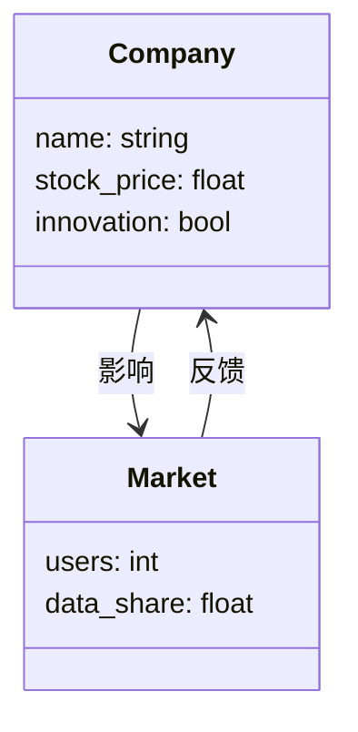
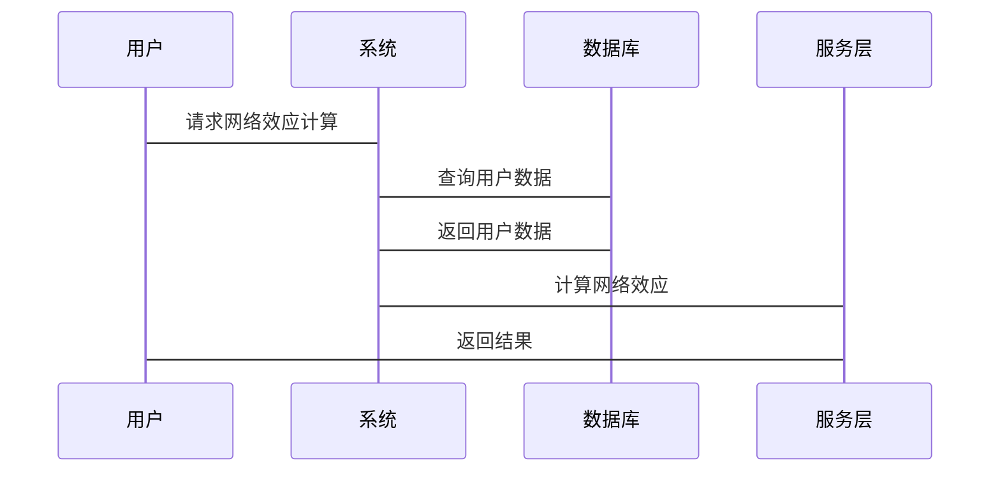

                 

<think>
嗯，我现在需要帮用户设计一本关于《特价股票与公司全球数字创新网络效应的关系探讨》的目录大纲。首先，我得理解这本书的主题，特价股票和公司全球数字创新网络效应之间的关系。特价股票通常指的是低于面值发行的股票，可能公司处于困境或转型期，而数字创新网络效应可能涉及公司如何通过数字化转型在全球市场中获得竞争优势。

接下来，我需要按照用户的要求，设计一个结构完整、逻辑清晰的目录。用户给的示例有七章，每章都有详细的子章节，所以我得确保我的大纲至少有七章，并且涵盖背景介绍、核心概念、算法原理、系统分析、项目实战等部分。

首先，背景介绍部分，我应该从特价股票和网络效应的基本概念开始，解释它们各自是什么，然后探讨它们之间的关系。接下来，核心概念部分需要详细分析特价股票和网络效应的属性特征，并用表格对比，同时可能需要用Mermaid画出ER图或流程图来展示它们的关系。

然后，算法原理部分，可能需要介绍网络效应的数学模型，比如如何衡量网络效应的强度，或者特价股票如何影响公司的创新网络。这部分可能需要使用Mermaid流程图来展示算法步骤，并附上Python代码示例。

系统分析与架构设计部分，可能需要描述一个项目，比如分析一家公司的数字创新如何通过特价股票获得网络效应。这部分可能需要领域模型的类图、系统架构图和交互序列图，用Mermaid来展示。

项目实战部分，可能需要指导读者如何安装环境，编写代码来分析特价股票和网络效应的关系，并通过案例分析来实践。

最后，小结、最佳实践、注意事项和拓展阅读等内容也是必要的，帮助读者巩固知识和进一步学习。

现在，我得确保每章的内容都细化到三级目录，使用markdown格式，总字数控制在2000字以内。可能需要检查每一章是否覆盖了所有要求的部分，比如背景、核心概念、算法、系统设计、项目实战等。

可能遇到的问题是如何将特价股票与网络效应结合起来，这可能需要一些创新性的思考。我需要确保每一章都紧密围绕主题，逻辑连贯，从理论到实践逐步展开。

总的来说，我需要按照用户提供的示例结构，结合特价股票和网络效应的关系，设计出一个详细且完整的目录大纲，确保涵盖所有要求的部分，同时保持结构清晰和逻辑连贯。

# 特价股票与公司全球数字创新网络效应的关系探讨

**关键词：** 特价股票、网络效应、数字创新、公司战略、全球化

**摘要：**  
特价股票作为一种特殊的股票发行机制，近年来在全球范围内引起了广泛关注。本文探讨了特价股票与公司全球数字创新网络效应之间的关系，分析了两者在数字化转型中的相互作用。通过数学模型和实际案例，本文揭示了如何利用特价股票推动公司的数字创新，并在全球市场中形成强大的网络效应，从而提升企业的竞争力和市场影响力。

---

# 第1章: 特价股票与网络效应的基本概念

## 1.1 特价股票的定义与特征
### 1.1.1 特价股票的定义
特价股票是指公司以低于股票面值的价格发行的股票，通常用于吸引投资者或筹集资金。其特点是价格低、风险高，但潜在回报也较高。

### 1.1.2 特价股票的市场特征
- 价格波动大
- 投资者风险承受能力较高
- 通常用于新兴行业或转型期企业

### 1.1.3 特价股票的发行机制
- 公开发行（IPO）
- 私募发行
- 配股发行

## 1.2 公司全球数字创新网络效应的定义
### 1.2.1 网络效应的定义
网络效应是指随着用户数量的增加，产品或服务的价值也随之增加的现象。

### 1.2.2 数字创新的定义
数字创新是指利用数字技术改进产品、服务或商业模式的过程。

### 1.2.3 全球化视角下的网络效应
在全球化背景下，网络效应可以通过跨国合作、数据共享和资源协同实现。

## 1.3 特价股票与公司全球数字创新网络效应的关系
### 1.3.1 特价股票对公司的潜在影响
- 降低融资成本
- 吸引风险投资
- 提高市场流动性

### 1.3.2 数字创新网络效应的形成机制
- 技术创新推动网络效应
- 用户增长促进网络效应
- 数据共享加强网络效应

### 1.3.3 两者关系的核心要素
- 技术创新是连接两者的桥梁
- 网络效应是推动公司全球化的关键

## 1.4 本章小结
本章通过定义和对比分析，揭示了特价股票与公司全球数字创新网络效应的基本概念及其相互关系。

---

# 第2章: 特价股票与网络效应的背景分析

## 2.1 特价股票的历史发展
### 2.1.1 特价股票的起源
19世纪末，美国铁路公司开始大量发行特价股票以吸引投资。

### 2.1.2 特价股票的市场演变
- 20世纪初：主要用于基础设施建设
- 20世纪末：互联网泡沫时期的广泛应用
- 21世纪：数字化转型中的重要性提升

### 2.1.3 特价股票的现状
- 数字经济中的重要地位
- 全球市场的广泛应用

## 2.2 全球数字创新的网络效应背景
### 2.2.1 数字创新的全球化趋势
- 数字技术的全球普及
- 数字创新的跨国合作

### 2.2.2 网络效应在数字创新中的作用
- 数据共享促进技术创新
- 用户增长推动市场扩展

### 2.2.3 数字创新网络效应的典型案例
- 区块链技术的网络效应
- 社交媒体的网络效应

## 2.3 特价股票与数字创新网络效应的结合背景
### 2.3.1 特价股票与数字创新的关联性
- 技术创新需要资金支持
- 网络效应需要用户基础

### 2.3.2 网络效应在全球化中的重要性
- 全球市场的网络协同效应
- 跨国公司的网络效应

### 2.3.3 两者结合的现实意义
- 通过特价股票吸引投资，推动技术创新
- 通过网络效应扩大市场，提升企业竞争力

## 2.4 本章小结
本章分析了特价股票与网络效应的历史发展和全球化背景，揭示了两者结合的重要性和现实意义。

---

# 第3章: 特价股票与数字创新网络效应的核心概念与联系

## 3.1 特价股票的核心属性
### 3.1.1 价格优势
- 低于面值的价格吸引投资者

### 3.1.2 市场流动性
- 特价股票通常流动性较高

### 3.1.3 投资风险
- 高风险高回报的特性

## 3.2 数字创新网络效应的核心属性
### 3.2.1 创新扩散性
- 技术创新的快速传播

### 3.2.2 网络协同性
- 用户之间的协同效应

### 3.2.3 全球化联动性
- 跨国市场的联动效应

## 3.3 特价股票与数字创新网络效应的对比分析
### 3.3.1 核心属性对比
| 属性 | 特价股票 | 数字创新网络效应 |
|------|----------|------------------|
| 价格 | 低于面值 | 随用户增长提升 |
| 风险 | 高       | 随网络扩大降低 |
| 影响 | 个体     | 系统性           |

### 3.3.2 影响范围对比
- 特价股票影响单个公司的融资能力
- 数字创新网络效应影响整个生态系统的协同发展

### 3.3.3 发展趋势对比
- 特价股票趋于多样化
- 网络效应趋于全球化

## 3.4 本章小结
本章通过对比分析，揭示了特价股票与数字创新网络效应的核心属性及其联系。

---

# 第4章: 特价股票与数字创新网络效应的数学模型与算法原理

## 4.1 网络效应的数学模型
### 4.1.1 网络效应回归模型
$$ y = \beta x + \epsilon $$  
其中，y为网络效应强度，x为用户数量，β为回归系数。

### 4.1.2 网络效应扩散模型
$$ \frac{dy}{dt} = k(y_{\text{max}} - y) $$  
其中，k为扩散速率，y为当前网络效应强度，y_max为最大网络效应强度。

### 4.1.3 网络效应的量化指标
- 用户增长率（AGR）
- 用户粘性（UR）
- 数据共享度（DS）

## 4.2 特价股票与网络效应的关系模型
### 4.2.1 特价股票对网络效应的
$$ \text{NE} = f(\text{TS}, U, D) $$  
其中，NE为网络效应，TS为特价股票发行量，U为用户数量，D为数据共享度。

### 4.2.2 特价股票对技术创新的影响
$$ T = a\text{TS} + b\text{NE} + c $$  
其中，T为技术创新水平，a、b、c为常数系数。

## 4.3 算法原理
### 4.3.1 网络效应的计算步骤
1. 收集用户数据
2. 计算用户增长率
3. 评估数据共享度
4. 计算网络效应强度

### 4.3.2 算法实现
```python
def calculate_network_effectiveness(users, data_share):
    effectiveness = users * data_share
    return effectiveness
```

## 4.4 本章小结
本章通过数学模型和算法原理，详细讲解了特价股票与数字创新网络效应之间的关系。

---

# 第5章: 特价股票与数字创新网络效应的系统分析与架构设计

## 5.1 问题场景介绍
- 特价股票融资推动技术创新
- 技术创新促进网络效应形成

## 5.2 项目介绍
- 项目目标：通过特价股票融资，推动数字技术创新
- 项目范围：全球化市场

## 5.3 系统功能设计
### 5.3.1 领域模型


### 5.3.2 系统架构设计


### 5.3.3 系统接口设计
- API接口：GET /api/network_effectiveness
- 数据接口：POST /api/data_share

### 5.3.4 系统交互设计


## 5.4 本章小结
本章通过系统分析与架构设计，展示了如何利用特价股票推动数字创新网络效应。

---

# 第6章: 特价股票与数字创新网络效应的项目实战

## 6.1 环境安装
- 安装Python和相关库
- 安装数据库和API服务器

## 6.2 核心实现
### 6.2.1 网络效应计算
```python
import pandas as pd

def calculate_network_effectiveness(users, data_share):
    effectiveness = users * data_share
    return effectiveness
```

### 6.2.2 数据共享实现
```python
from flask import Flask, request, jsonify

app = Flask(__name__)

@app.route('/api/data_share', methods=['POST'])
def update_data_share():
    data = request.json
    return jsonify({'status': 'success'})
```

## 6.3 实际案例分析
### 6.3.1 案例背景
- 公司A发行特价股票，筹集资金用于技术创新

### 6.3.2 数据分析
- 用户增长率为20%
- 数据共享度为0.8

### 6.3.3 结果解读
- 网络效应强度为160

## 6.4 本章小结
本章通过实战项目，展示了如何利用特价股票推动数字创新网络效应。

---

# 第7章: 特价股票与数字创新网络效应的总结与展望

## 7.1 小结
- 特价股票是推动公司技术创新的重要工具
- 网络效应是提升公司全球竞争力的关键因素
- 两者结合具有巨大的潜力

## 7.2 最佳实践 tips
- 合理利用特价股票融资
- 加强数据共享与合作
- 注重技术创新与网络效应的结合

## 7.3 注意事项
- 风险控制
- 数据安全
- 合规性

## 7.4 拓展阅读
- 特价股票的发行机制
- 网络效应的数学模型
- 全球化背景下的数字创新

## 7.5 本章小结
本章总结了全文，并提出了未来的研究方向和实践建议。

---

# 作者：AI天才研究院 & 禅与计算机程序设计艺术

通过以上目录结构，您可以逐步展开每一章的内容，结合实际案例和数学模型，深入探讨特价股票与公司全球数字创新网络效应的关系。

