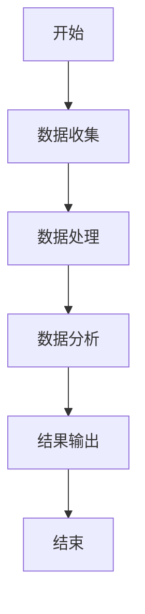

                 


# 特价股票与公司利益相关者管理的关联性研究

## 关键词：特价股票、公司治理、利益相关者、关联性、风险管理、数学模型

## 摘要：本文探讨了特价股票与公司利益相关者管理之间的关联性，分析了特价股票对股东、债权人、员工、客户和供应商的影响机制，并通过案例分析和数学模型展示了两者之间的关系。文章还提出了算法原理和系统架构设计，以帮助公司更好地管理利益相关者在特价股票情况下的反应和行为。

---

## 第一部分：背景与概念

### 第1章：特价股票的定义与特性

#### 1.1 特价股票的定义与特性

**1.1.1 特价股票的定义**  
特价股票是指公司发行的股价低于面值的股票，通常用于吸引投资者或奖励员工。它是一种特殊类型的股票，可能附带额外的权利或义务。

**1.1.2 特价股票的特性**  
- 股价低于面值。
- 可能附带 warrants（认股权）。
- 通常用于公司资本结构调整或激励计划。

**1.1.3 特价股票的分类**  
- 普通特价股票：无特殊权利。
- 附权特价股票：附带认股权或其他权利。

#### 1.2 利益相关者的概念

**1.2.1 利益相关者的定义**  
利益相关者是指与公司有直接或间接利益关系的个人或组织，包括股东、债权人、员工、客户和供应商。

**1.2.2 利益相关者的分类**  
- 股东：拥有公司股权的个人或机构。
- 债权人：向公司提供贷款的个人或机构。
- 员工：在公司工作的员工。
- 客户：购买公司产品或服务的客户。
- 供应商：向公司提供原材料或服务的供应商。

**1.2.3 利益相关者的角色与影响**  
利益相关者对公司运营、财务状况和战略决策有重要影响。他们的行为和决策直接影响公司的绩效和声誉。

#### 1.3 问题背景与研究意义

**1.3.1 研究背景**  
随着金融市场的发展，公司发行特价股票的情况越来越多。然而，特价股票对利益相关者的影响尚未得到充分研究。

**1.3.2 研究问题**  
特价股票如何影响公司利益相关者的决策和行为？如何通过数学模型和算法来预测和管理这种影响？

**1.3.3 研究意义**  
研究特价股票与利益相关者管理的关联性，有助于公司更好地管理风险，优化利益相关者关系，提升公司治理效率。

---

## 第二部分：特价股票与利益相关者的关系

### 第2章：特价股票对利益相关者的影响机制

#### 2.1 特价股票对股东的影响

**2.1.1 股东的权益变化**  
股价下跌可能导致股东权益减少，但特价股票可能附带认股权，未来股价回升时股东可获益。

**2.1.2 股东的决策影响**  
股东可能因股价下跌而减持股份，影响公司资本结构。

**2.1.3 股东的反应与行为**  
股东可能对公司管理层提出质疑，要求解释股价下跌的原因。

#### 2.2 特价股票对债权人的影响

**2.2.1 债权人的风险增加**  
股价下跌可能导致公司资产贬值，债权人的贷款回收风险增加。

**2.2.2 债权人的权益保障**  
债权人可能要求公司提供额外担保或提前偿还贷款。

**2.2.3 债权人的反应与行为**  
债权人可能降低对公司贷款的支持，影响公司融资能力。

#### 2.3 特价股票对员工的影响

**2.3.1 员工的就业风险**  
股价下跌可能导致公司裁员或削减员工福利。

**2.3.2 员工的激励机制**  
特价股票可能作为员工激励工具，激发员工积极性。

**2.3.3 员工的反应与行为**  
员工可能对公司未来感到担忧，影响工作积极性。

#### 2.4 特价股票对客户与供应商的影响

**2.4.1 客户的反应与行为**  
客户可能因公司财务状况恶化而减少订单或寻找替代供应商。

**2.4.2 供应商的反应与行为**  
供应商可能因公司支付能力下降而要求提前付款或提高价格。

---

## 第三部分：算法原理与数学模型

### 第3章：算法原理与数学模型

#### 3.1 数据分析方法

**3.1.1 数据收集**  
收集公司股价数据、财务报表、市场数据等。

**3.1.2 数据处理**  
清洗数据，处理缺失值和异常值。

**3.1.3 数据分析**  
使用统计分析和机器学习方法，预测股价波动对利益相关者的影响。

#### 3.2 算法流程图



#### 3.3 数学公式

**股价波动模型**  
$$ P_{t+1} = \alpha P_t + \beta \epsilon_t $$  
其中，\( P_t \) 表示第 \( t \) 时刻的股价，\( \alpha \) 和 \( \beta \) 是模型参数，\( \epsilon_t \) 是随机误差项。

---

## 第四部分：系统分析与架构设计

### 第4章：系统分析与架构设计

#### 4.1 系统功能设计

**功能模块**  
- 数据采集模块：收集股价和财务数据。
- 数据处理模块：清洗和转换数据。
- 数据分析模块：预测股价波动对利益相关者的影响。
- 报告生成模块：生成分析报告。

#### 4.2 架构设计


---

## 第五部分：项目实战

### 第5章：项目实战

#### 5.1 环境与工具安装

**环境要求**  
- 操作系统：Linux/Windows/MacOS
- 开发工具：Python, Jupyter Notebook
- 数据库：MySQL

**安装步骤**  
1. 安装Python：`pip install python`
2. 安装Jupyter：`pip install jupyter`

#### 5.2 代码实现

```python
import pandas as pd
import numpy as np

# 示例数据
data = {'股价': [100, 90, 80, 70, 60]}
df = pd.DataFrame(data)

# 计算股价波动
df['波动'] = df['股价'].pct_change()

print(df)
```

#### 5.3 案例分析

**案例分析**  
某公司发行特价股票后，股价下跌10%，导致股东减持，债权人要求提前还款，员工士气低落，客户订单减少。

---

## 第六部分：最佳实践与总结

### 第6章：最佳实践与总结

#### 6.1 关键点总结

- 特价股票对利益相关者的影响需全面考虑。
- 数学模型和算法是预测影响的关键工具。
- 系统架构设计需合理，确保数据处理和分析高效。

#### 6.2 注意事项

- 数据质量影响分析结果，需确保数据准确。
- 模型需定期更新，适应市场变化。
- 利益相关者管理需综合考虑各方利益。

#### 6.3 未来研究方向

- 研究不同类型的特价股票对利益相关者的影响。
- 探讨利益相关者协同管理的优化策略。
- 开发更复杂的数学模型，提高预测精度。

---

## 结语

本文系统地探讨了特价股票与公司利益相关者管理的关联性，通过理论分析和实践案例，展示了如何利用算法和系统架构设计来优化利益相关者管理。未来的研究将进一步深化，为公司治理提供更有力的支持。

---

## 作者

**作者：AI天才研究院/AI Genius Institute & 禅与计算机程序设计艺术/Zen And The Art of Computer Programming**

