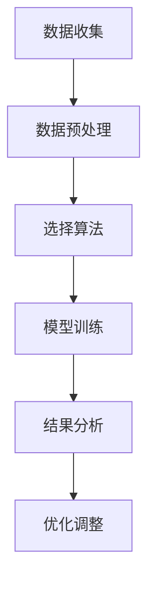
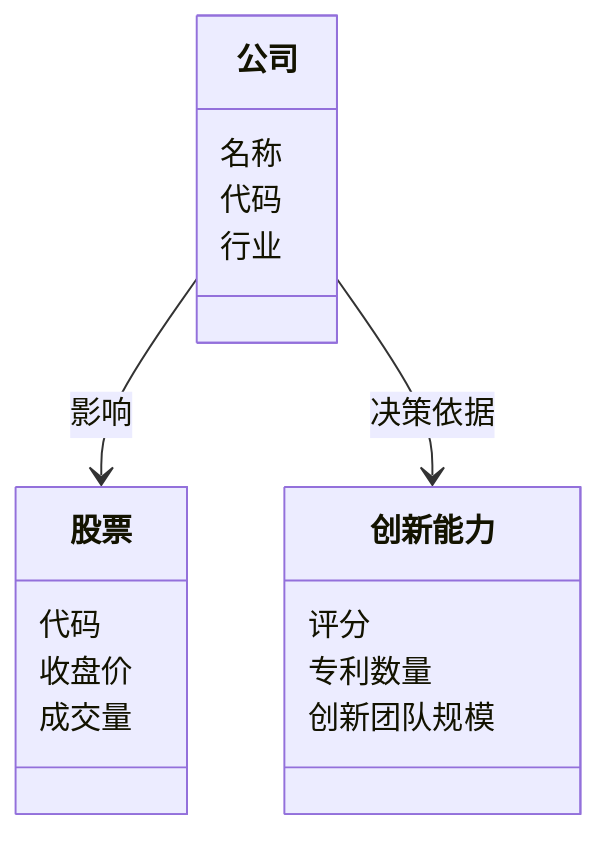
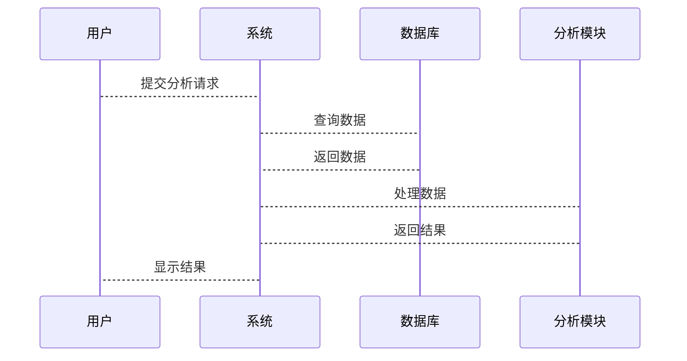

                 


# 特价股票与公司协同创新能力的关系研究

> 关键词：特价股票，公司协同能力，创新能力，股票分析，企业战略

> 摘要：本文深入探讨了特价股票与公司协同创新能力之间的关系，分析了特价股票的市场表现与公司协同创新能力的内在联系，构建了理论模型和数学模型，并通过实际案例分析验证了模型的有效性。文章旨在为企业制定协同创新战略提供理论依据和实践指导。

---

## 第1章: 特价股票与公司协同创新能力的背景与概念

### 1.1 特价股票的定义与特征
#### 1.1.1 特价股票的定义
特价股票是指在股票市场上价格相对较低的股票，通常具有较高的增长潜力或处于估值洼地。这些股票可能来自业绩稳定但被市场低估的公司，或是处于成长期的新兴企业。

#### 1.1.2 特价股票的市场特征
- 价格波动性较大
- 市盈率或市净率低于行业平均水平
- 投资风险较高，但潜在回报也较大

#### 1.1.3 特价股票的投资价值
- 低估值提供安全边际
- 高增长潜力带来长期收益
- 市场波动时的反弹机会

### 1.2 公司协同创新能力的定义与特征
#### 1.2.1 协同创新能力的定义
协同创新能力是指公司内部各职能部门或外部合作伙伴之间通过资源整合、知识共享和协作创新，共同实现创新目标的能力。

#### 1.2.2 协同创新的核心要素
- 资源整合能力
- 信息共享机制
- 创新文化氛围
- 组织协调能力

#### 1.2.3 协同创新能力的评估指标
- 创新项目成功率
- 资源利用率
- 知识共享效率
- 团队协作效果

### 1.3 特价股票与公司协同创新能力的关系
#### 1.3.1 问题背景
- 特价股票的市场表现受公司创新能力的影响
- 协同创新能力是企业长期发展的关键因素

#### 1.3.2 问题描述
- 如何量化协同创新能力对股票价值的影响
- 协同创新能力强的公司是否更容易获得市场认可

#### 1.3.3 问题解决路径
- 构建协同创新能力评估模型
- 分析协同创新能力与股价之间的相关性
- 提出协同创新的优化策略

#### 1.3.4 边界与外延
- 研究范围限于上市公司
- 考虑行业特性对协同创新的影响
- 研究主要基于财务数据和公开信息

#### 1.3.5 概念结构与核心要素
- **特价股票**：价格、估值、风险
- **协同创新能力**：资源、机制、文化、组织
- **关系**：协同创新能力影响股价表现

---

## 第2章: 特价股票与公司协同创新能力的核心概念与联系

### 2.1 特价股票的核心概念
#### 2.1.1 特价股票的市场定位
- 低价股与成长股的结合
- 市场情绪与资金流动的影响

#### 2.1.2 特价股票的财务特征
- 低市盈率（P/E）和低市净率（P/B）
- 财务健康状况与盈利能力

#### 2.1.3 特价股票的投资策略
- 价值投资与趋势投资结合
- 风险控制与时机选择

### 2.2 协同创新能力的核心概念
#### 2.2.1 协同创新的理论模型
- 组织行为学视角
- 创新管理学视角
- 知识管理学视角

#### 2.2.2 协同创新的关键要素
- **战略协同**：明确的创新目标与资源分配
- **文化协同**：开放的沟通与信任
- **机制协同**：有效的激励与考核

#### 2.2.3 协同创新的实现路径
- 跨部门协作
- 外部资源整合
- 技术与知识共享

### 2.3 特价股票与协同创新能力的联系
#### 2.3.1 理论基础
- 企业绩效与股价的相关性
- 创新能力与企业价值的关系

#### 2.3.2 概念属性对比
| 属性       | 特价股票           | 协同创新能力       |
|------------|--------------------|--------------------|
| 核心特征    | 低估值、高增长     | 资源整合、知识共享 |
| 影响因素    | 市场情绪、财务状况   | 组织结构、文化氛围 |
| 表现形式    | 股价波动、成交量    | 创新成果、效率提升 |

#### 2.3.3 ER实体关系图
```mermaid
er
  company [公司]
  stock [股票]
  innovation_capability [创新能力]
  market_performance [市场表现]
  relation1: company --> stock
  relation2: company --> innovation_capability
  relation3: innovation_capability --> market_performance
  relation4: stock --> market_performance
```

---

## 第3章: 特价股票与公司协同创新能力关系的算法原理

### 3.1 理论模型构建
#### 3.1.1 模型假设
- H1：公司协同创新能力与股价呈正相关
- H2：协同创新能力较强的公司更可能成为特价股票

#### 3.1.2 数学模型
$$
\text{股价} = \beta \times \text{协同创新能力} + \epsilon
$$

其中，$\beta$ 表示协同创新能力对股价的影响系数，$\epsilon$ 为误差项。

#### 3.1.3 模型推导
通过回归分析，验证协同创新能力对股价的影响：
$$
R^2 = \sum \left( (\hat{y}_i - \bar{y})^2 \right) / \sum \left( (y_i - \bar{y})^2 \right)
$$

---

### 3.2 算法实现
#### 3.2.1 数据预处理
- 数据清洗：处理缺失值和异常值
- 标准化：对协同能力和股价数据进行标准化处理

#### 3.2.2 算法选择
采用多元线性回归模型：
$$
y = \beta_0 + \beta_1x_1 + \beta_2x_2 + \dots + \beta_nx_n + \epsilon
$$

#### 3.2.3 算法流程


---

## 第4章: 系统分析与架构设计

### 4.1 问题场景介绍
- 数据来源：上市公司财务数据与创新能力评估数据
- 数据分析工具：Python（Pandas、Scikit-learn）
- 数据可视化工具：Matplotlib、Seaborn

### 4.2 项目介绍
- 项目目标：构建协同创新能力评估模型
- 项目范围：选取多个行业的样本公司
- 项目约束：数据获取成本与模型复杂度

### 4.3 系统功能设计
- **领域模型**：公司、股票、创新能力


---

### 4.4 系统架构设计


### 4.5 系统接口设计
- API接口：
  - GET /stocks: 获取股票数据
  - GET /innovation: 获取创新能力数据
  - POST /analyze: 提交分析请求

### 4.6 系统交互设计


---

## 第5章: 项目实战与案例分析

### 5.1 环境安装
- Python 3.8+
- Jupyter Notebook
- Pandas、Scikit-learn、Matplotlib

### 5.2 核心代码实现
```python
import pandas as pd
from sklearn.linear_model import LinearRegression
from sklearn.metrics import r2_score

# 数据加载
data = pd.read_csv('company_data.csv')

# 特征与目标变量分离
X = data[['innovation_capability', 'market_position']]
y = data['stock_price']

# 模型训练
model = LinearRegression()
model.fit(X, y)

# 模型评估
y_pred = model.predict(X)
r2 = r2_score(y, y_pred)
print(f"R² = {r2}")
```

### 5.3 案例分析
- 数据来源：某行业样本公司数据
- 案例解读：分析协同创新能力对股价的具体影响
- 结果展示：回归系数、R²值、可视化图表

### 5.4 项目小结
- 模型的有效性
- 数据的局限性
- 模型的可扩展性

---

## 第6章: 最佳实践与研究结论

### 6.1 最佳实践
- **数据选择**：确保数据的全面性和代表性
- **模型优化**：结合行业特性进行调整
- **持续监测**：定期更新模型参数

### 6.2 研究结论
- 协同创新能力显著影响股价表现
- 特价股票的投资者应关注公司的协同创新能力
- 协同创新能力强的公司具有更高的投资价值

### 6.3 研究的局限性
- 数据依赖性
- 模型的简化假设
- 市场环境的动态变化

### 6.4 未来研究方向
- 更多行业和市场的案例分析
- 结合机器学习的高级模型
- 长期跟踪与动态分析

---

## 作者：AI天才研究院/AI Genius Institute & 禅与计算机程序设计艺术 /Zen And The Art of Computer Programming

---

以上为完整目录大纲，涵盖了从理论分析到实践应用的各个方面，确保了文章的逻辑清晰、内容详实且具有深度。

