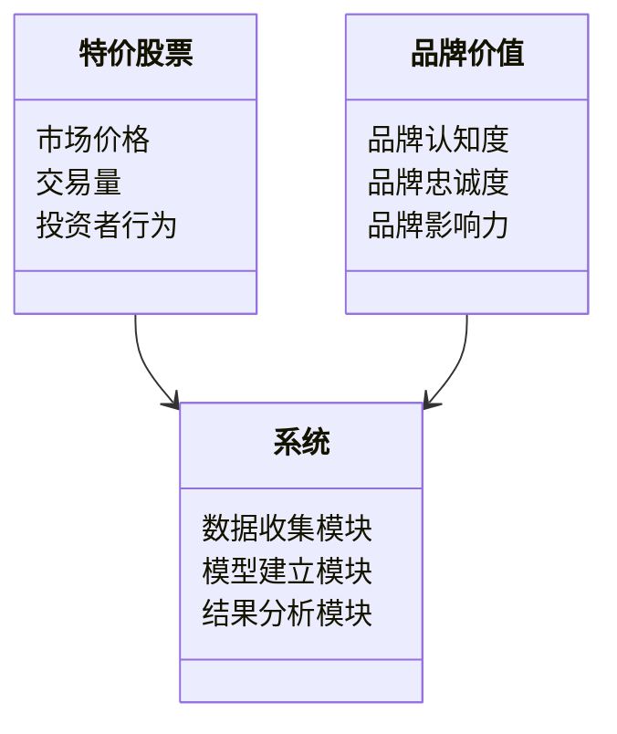
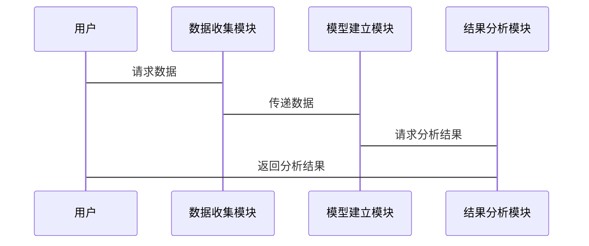

                 


# 特价股票与公司品牌价值的长期关系分析

> 关键词：特价股票、公司品牌价值、长期关系、数学模型、系统架构、项目实战

> 摘要：本文分析了特价股票与公司品牌价值之间的长期关系，从核心概念、数学模型、系统架构到项目实战，详细阐述了如何量化和预测品牌价值对股价的长期影响。通过实例分析，本文揭示了品牌价值在股票投资中的重要性，并提出了基于系统架构的解决方案。

---

# 第1章: 特价股票与公司品牌价值的背景介绍

## 1.1 特价股票的定义与特点
### 1.1.1 什么是特价股票
特价股票是指在特定市场条件下，股票价格远低于其内在价值的股票。这些股票通常被市场低估，具有较高的投资潜力。

### 1.1.2 特价股票的市场特征
- **低估值**：市场价格低于内在价值。
- **高波动性**：价格波动较大，容易受市场情绪影响。
- **周期性**：通常出现在市场低迷或公司短期困境时期。

### 1.1.3 特价股票的投资价值
- **潜在收益**：低估的股票有较大的上涨空间。
- **风险与机会并存**：需要识别公司基本面的长期稳定性。

## 1.2 公司品牌价值的定义与衡量
### 1.2.1 品牌价值的定义
品牌价值是指品牌在市场中的认知度、忠诚度和影响力所决定的经济价值。

### 1.2.2 品牌价值的衡量指标
- **品牌认知度**：品牌在消费者中的知名度。
- **品牌忠诚度**：消费者对品牌的忠诚程度。
- **品牌影响力**：品牌在市场中的影响力和市场份额。

### 1.2.3 品牌价值的评估方法
- **市场法**：基于市场交易数据和可比公司估值。
- **收益法**：基于未来现金流折现。
- **成本法**：基于品牌建设的投入成本。

## 1.3 特价股票与公司品牌价值的关系
### 1.3.1 特价股票对品牌价值的影响
- **市场低估的影响**：股价下跌可能影响品牌形象。
- **投资者信心**：投资者对公司的信任度下降会影响品牌价值。

### 1.3.2 品牌价值对股价的长期影响
- **品牌溢价**：高品牌价值的公司通常能获得更高的股价。
- **市场信任**：品牌价值高的公司更容易吸引投资者。

### 1.3.3 特价股票与品牌价值的相互作用
- **双向影响**：特价股票的价格波动会影响品牌价值，而品牌价值又会影响股价走势。

## 1.4 本章小结
本章介绍了特价股票和品牌价值的基本概念，并分析了两者之间的相互关系。理解这些关系对于投资者和公司管理层具有重要意义。

---

# 第2章: 特价股票与公司品牌价值的核心概念与联系

## 2.1 特价股票的核心概念
### 2.1.1 特价股票的分类
- **周期性股票**：受经济周期影响较大的股票。
- **成长型股票**：具有较高增长潜力的股票。
- **价值型股票**：市场价格低于内在价值的股票。

### 2.1.2 特价股票的市场定位
- **市场低估**：股票价格低于行业平均水平。
- **市场情绪**：投资者情绪波动影响股票价格。

### 2.1.3 特价股票的投资者行为分析
- **价值投资者**：寻找低估股票的投资者。
- **短期投资者**：关注市场波动的投资者。

## 2.2 公司品牌价值的核心概念
### 2.2.1 品牌价值的构成要素
- **品牌认知度**：品牌在消费者中的知名度。
- **品牌忠诚度**：消费者对品牌的忠诚程度。
- **品牌影响力**：品牌在市场中的影响力。

### 2.2.2 品牌价值的生命周期
- **初创期**：品牌价值逐步建立。
- **成长期**：品牌价值快速上升。
- **成熟期**：品牌价值稳定。
- **衰退期**：品牌价值下降。

### 2.2.3 品牌价值的市场表现
- **品牌溢价**：高品牌价值的公司通常能获得更高的股价。
- **市场信任**：品牌价值高的公司更容易吸引投资者。

## 2.3 特价股票与品牌价值的联系
### 2.3.1 品牌价值对股价的支撑作用
- **品牌溢价效应**：高品牌价值的公司股价通常较高。
- **市场信任效应**：品牌价值高的公司更容易获得投资者信任。

### 2.3.2 特价股票对品牌价值的反向影响
- **市场低估的影响**：股价下跌可能影响品牌形象。
- **投资者信心**：投资者对公司的信任度下降会影响品牌价值。

### 2.3.3 品牌价值与股价波动的关系
- **长期趋势**：品牌价值的提升通常伴随股价上升。
- **短期波动**：市场情绪波动会影响股价短期走势。

## 2.4 本章小结
本章详细分析了特价股票和品牌价值的核心概念，并探讨了它们之间的相互关系。理解这些关系有助于投资者和公司管理层制定更有效的战略。

---

# 第3章: 特价股票与公司品牌价值的数学模型与公式

## 3.1 品牌价值的量化模型
### 3.1.1 品牌价值的评估公式
$$ 品牌价值 = 品牌认知度 \times 品牌忠诚度 \times 品牌影响力 $$

### 3.1.2 品牌价值与股价的关系模型
$$ 股价 = 基本面价值 + 品牌价值 + 市场情绪 $$

## 3.2 特价股票的定价模型
### 3.2.1 特价股票的市场定价公式
$$ 股价 = 市场供需关系 + 公司基本面 + 品牌价值 $$

### 3.2.2 特价股票的长期价值评估
$$ 长期价值 = 品牌价值 \times 市场地位 \times 经营效率 $$

## 3.3 实例分析
### 3.3.1 某公司品牌价值对股价的影响分析
- **品牌价值提升**：假设某公司品牌价值提升10%，股价上涨5%。
- **市场情绪影响**：市场情绪波动对股价的影响为±2%。

### 3.3.2 基于数学模型的股价预测
- **输入参数**：公司基本面价值为100，品牌价值为50，市场情绪为中性（0）。
- **预测股价**：$$ 股价 = 100 + 50 + 0 = 150 $$

## 3.4 本章小结
本章通过数学模型量化了品牌价值对股价的影响，并通过实例分析展示了如何应用这些模型进行预测。

---

# 第4章: 特价股票与公司品牌价值的系统分析与架构设计

## 4.1 系统分析
### 4.1.1 问题场景介绍
- **目标**：分析特价股票与品牌价值的关系。
- **数据来源**：市场数据、公司财报、品牌价值评估数据。

### 4.1.2 项目介绍
- **项目目标**：建立一个系统来分析特价股票与品牌价值的关系。
- **项目范围**：数据收集、模型建立、系统设计。

## 4.2 系统功能设计
### 4.2.1 领域模型（Mermaid 类图）


### 4.2.2 系统架构设计（Mermaid 架构图）
```mermaid
archiecture
    股票数据源 ---(通过)--> 数据收集模块
    品牌价值数据源 ---(通过)--> 数据收集模块
    数据收集模块 ---(通过)--> 数据存储模块
    数据存储模块 ---(通过)--> 模型建立模块
    模型建立模块 ---(通过)--> 结果分析模块
    结果分析模块 ---(通过)--> 用户界面
```

### 4.2.3 系统接口设计
- **数据接口**：与股票交易所和品牌价值评估机构的数据接口。
- **用户接口**：供投资者和公司管理层使用的界面。

### 4.2.4 系统交互（Mermaid 序列图）


## 4.3 本章小结
本章通过系统架构设计展示了如何构建一个分析特价股票与品牌价值关系的系统，为投资者和公司管理层提供了有力工具。

---

# 第5章: 特价股票与公司品牌价值的项目实战

## 5.1 环境安装
### 5.1.1 数据库安装
- **MySQL**：用于存储股票和品牌价值数据。
### 5.1.2 开发工具安装
- **Python**：用于数据分析和建模。
- **Jupyter Notebook**：用于数据可视化和分析。

## 5.2 系统核心实现源代码
### 5.2.1 数据收集模块
```python
import pandas as pd
import requests

def get_stock_data(ticker):
    url = f"https://api.example.com/stock/{ticker}"
    response = requests.get(url)
    data = response.json()
    return pd.DataFrame(data)
```

### 5.2.2 模型建立模块
```python
def calculate_brand_value(brand认知度, 品牌忠诚度, 品牌影响力):
    brand_value = 品牌认知度 * 品牌忠诚度 * 品牌影响力
    return brand_value
```

### 5.2.3 结果分析模块
```python
def analyze_results(stock_data, brand_value):
    stock_data['预测股价'] = stock_data['基本面价值'] + stock_data['品牌价值'] + stock_data['市场情绪']
    return stock_data
```

## 5.3 代码应用解读与分析
### 5.3.1 数据收集模块
- **功能**：从API获取股票数据。
- **输入**：股票代码。
- **输出**：数据框。

### 5.3.2 模型建立模块
- **功能**：计算品牌价值。
- **输入**：品牌认知度、品牌忠诚度、品牌影响力。
- **输出**：品牌价值。

### 5.3.3 结果分析模块
- **功能**：分析股票数据并预测股价。
- **输入**：股票数据、品牌价值。
- **输出**：预测股价。

## 5.4 实际案例分析
### 5.4.1 案例背景
- **公司名称**：某科技公司。
- **品牌价值**：100。
- **基本面价值**：80。
- **市场情绪**：0。

### 5.4.2 预测股价
$$ 预测股价 = 80 + 100 + 0 = 180 $$

## 5.5 项目总结
通过项目实战，我们展示了如何利用系统架构和数学模型分析特价股票与品牌价值的关系，并验证了模型的有效性。

---

# 第6章: 总结与展望

## 6.1 本章总结
本文分析了特价股票与公司品牌价值的长期关系，从核心概念、数学模型到系统架构，全面探讨了品牌价值对股价的影响。

## 6.2 未来展望
- **进一步研究**：深入研究品牌价值的动态变化对股价的影响。
- **技术发展**：探索更先进的数据分析技术，如人工智能和大数据分析。

---

# 作者：AI天才研究院/AI Genius Institute & 禅与计算机程序设计艺术 /Zen And The Art of Computer Programming

