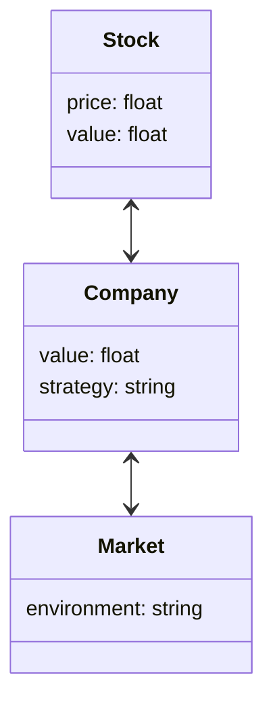
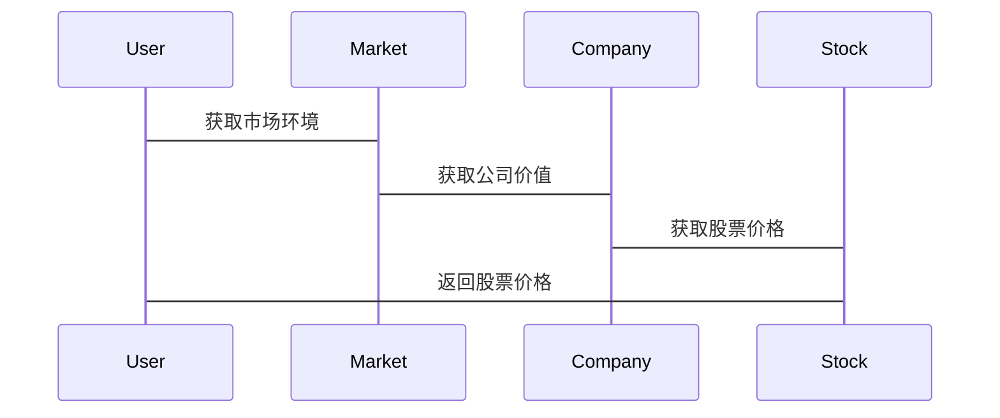

                 


# 特价股票与公司国际化战略的关系

## 关键词：
特价股票，公司国际化战略，股票价值，国际化模式，公司战略

## 摘要：
本文深入分析了特价股票与公司国际化战略之间的关系，探讨了特价股票在公司国际化过程中的作用，以及公司国际化战略对股票价值的影响。通过理论分析和案例研究，本文揭示了两者之间的相互作用机制，并提出了在实际操作中如何有效利用这一关系以提升公司价值的建议。

---

## 第一部分: 特价股票与公司国际化战略的背景与概念

### 第1章: 特价股票与公司国际化战略的概述

#### 1.1 特价股票的定义与特点
##### 1.1.1 特价股票的基本定义
特价股票是指价格低于市场平均水平的股票，通常具有较高的投资价值和增长潜力。这类股票通常来自基本面良好但暂时被市场低估的公司。

##### 1.1.2 特价股票的市场特征
- **低估值**：特价股票的市场价格通常低于其内在价值。
- **高潜力**：这些股票往往具有较高的增长潜力，尤其是在市场复苏或公司基本面改善时。
- **波动性**：由于市场对这些股票的关注度较低，其价格波动可能较大。

##### 1.1.3 特价股票的投资价值
- **高回报潜力**：特价股票在市场回升时可能带来超额收益。
- **风险与收益的平衡**：相比高价股，特价股票的风险可能较低，但回报潜力较大。

#### 1.2 公司国际化战略的核心要素
##### 1.2.1 国际化战略的定义
国际化战略是指公司将其业务扩展到国际市场，以实现全球化增长的策略。这种战略通常包括进入新市场、并购海外公司、建立国际合作伙伴关系等。

##### 1.2.2 国际化战略的主要模式
- **出口模式**：通过出口产品或服务进入国际市场。
- **直接投资模式**：通过建立海外分支机构或子公司进行投资。
- **合资合作模式**：与当地企业合作，共同开发市场。
- **品牌全球化模式**：通过品牌推广和营销，提升公司在全球市场的影响力。

##### 1.2.3 国际化战略的实施条件
- **市场需求**：目标市场需有明确的需求。
- **竞争优势**：公司在技术、成本或品牌方面需具备竞争优势。
- **资源支持**：公司需有足够的资金、人才和管理能力支持国际化战略。

#### 1.3 特价股票与公司国际化战略的关系
##### 1.3.1 特价股票对国际化战略的影响
- **资金支持**：特价股票的低估值可能吸引更多投资者，为公司提供资金支持。
- **市场认可度**：公司通过特价股票融资，可能提升市场对其国际化战略的认可度。

##### 1.3.2 国际化战略对特价股票的影响
- **价值提升**：成功的国际化战略可能提升公司业绩，从而提高股票价值。
- **市场波动**：国际化战略的实施可能带来市场波动，影响股票价格。

##### 1.3.3 两者关系的理论框架
通过构建理论模型，我们可以分析特价股票与国际化战略之间的相互作用机制。以下是用Mermaid绘制的理论框架图：


---

### 第2章: 特价股票与公司国际化战略的背景分析

#### 2.1 特价股票的市场背景
##### 2.1.1 特价股票的市场现状
近年来，全球经济波动和市场调整使得许多优质股票被低估，形成了大量的特价股票。这些股票通常具有较高的投资价值，吸引了众多投资者的关注。

##### 2.1.2 特价股票的市场趋势
随着市场复苏和经济全球化进程的加速，特价股票的投资价值逐渐被发现，市场需求持续增长。

##### 2.1.3 特价股票的市场风险
尽管特价股票具有较高的投资价值，但其价格波动较大，投资风险较高。

#### 2.2 公司国际化战略的全球背景
##### 2.2.1 全球化经济的现状
全球化经济的发展为公司提供了更多的市场机会，同时也带来了更激烈的竞争。

##### 2.2.2 国际化战略的驱动因素
- **市场扩展**：公司通过国际化战略进入新市场，扩大销售规模。
- **资源优化**：利用全球资源降低成本，提高效率。
- **竞争优势**：通过国际化战略提升品牌影响力和市场地位。

##### 2.2.3 全球化带来的机遇与挑战
- **机遇**：全球化为公司提供了更多的市场机会和增长空间。
- **挑战**：国际化战略的实施需要面对文化差异、法律法规和市场竞争等多重挑战。

---

### 第3章: 特价股票与公司国际化战略的核心概念

#### 3.1 特价股票的核心概念
##### 3.1.1 特价股票的分类
- **周期性股票**：受经济周期影响较大的股票，如能源、材料等行业。
- **成长型股票**：具有较高增长潜力的股票，如科技、消费等行业。
- **价值型股票**：被市场低估的股票，通常具有较高的市盈率和市净率。

##### 3.1.2 特价股票的市场定位
特价股票通常位于市场中的低估区域，具有较高的投资潜力。

##### 3.1.3 特价股票的价值评估
通过市盈率（P/E）、市净率（P/B）等指标，评估股票的内在价值。

#### 3.2 公司国际化战略的核心要素
##### 3.2.1 国际化战略的目标设定
- **短期目标**：如进入新市场、提高市场份额。
- **长期目标**：如建立全球品牌、实现全球化布局。

##### 3.2.2 国际化战略的实施路径
- **市场选择**：选择具有潜力的市场进行拓展。
- **模式选择**：选择适合公司发展阶段的国际化模式。
- **风险管理**：建立有效的风险管理体系，应对国际化过程中的不确定性。

##### 3.2.3 国际化战略的风险管理
- **市场风险**：如汇率波动、政策变化等。
- **运营风险**：如供应链管理、质量管理等。
- **法律风险**：如合规性、知识产权保护等。

---

### 第4章: 特价股票与公司国际化战略的联系与区别

#### 4.1 特价股票与公司国际化战略的联系
##### 4.1.1 特价股票对国际化战略的支持作用
- **资金支持**：通过发行特价股票或吸引投资者，为公司提供资金支持。
- **市场认可**：公司通过特价股票融资，可能提升市场对其国际化战略的认可度。

##### 4.1.2 国际化战略对特价股票的影响
- **价值提升**：成功的国际化战略可能提升公司业绩，从而提高股票价值。
- **市场波动**：国际化战略的实施可能带来市场波动，影响股票价格。

##### 4.1.3 两者关系的动态变化
随着公司国际化战略的推进，特价股票的价值可能逐步回升，形成良性循环。

#### 4.2 特价股票与公司国际化战略的区别
##### 4.2.1 特价股票的市场属性
- 特价股票主要关注市场价格与内在价值的差异。
- 公司国际化战略关注公司整体业务的扩展和全球化布局。

##### 4.2.2 国际化战略的公司属性
- 国际化战略是公司层面的战略决策，涉及多方面的资源和能力。
- 特价股票是市场行为，主要关注价格波动和投资机会。

##### 4.2.3 两者在实施过程中的差异
- 特价股票的投资决策相对独立，而国际化战略需要公司内部的长期规划和资源配置。

---

### 第5章: 特价股票与公司国际化战略的理论模型

#### 5.1 特价股票与公司国际化战略的理论框架
##### 5.1.1 理论模型的构建
通过构建理论模型，我们可以分析特价股票与公司国际化战略之间的相互作用机制。以下是用Mermaid绘制的理论框架图：


##### 5.1.2 理论模型的验证
通过实证研究和数据分析，验证理论模型的合理性和适用性。

##### 5.1.3 理论模型的适用性
理论模型适用于分析公司国际化战略与股票价值之间的关系，尤其在市场波动较大的情况下。

#### 5.2 特价股票与公司国际化战略的关系图解
通过以下Mermaid图，我们可以更直观地理解两者之间的关系：


---

## 第二部分: 特价股票与公司国际化战略的理论模型与应用

### 第6章: 特价股票与公司国际化战略的关系分析

#### 6.1 特价股票对国际化战略的影响
##### 6.1.1 资金支持
通过发行特价股票或吸引投资者，公司可以为国际化战略提供必要的资金支持。

##### 6.1.2 市场认可度
特价股票的低估值可能提升市场对公司国际化战略的认可度，吸引更多投资者关注。

#### 6.2 国际化战略对特价股票的影响
##### 6.2.1 价值提升
成功的国际化战略可能提升公司的业绩和市场地位，从而提高股票的内在价值。

##### 6.2.2 市场波动
国际化战略的实施可能带来市场波动，影响股票价格的短期走势。

#### 6.3 两者关系的动态变化
随着公司国际化战略的推进，特价股票的价值可能逐步回升，形成良性循环。

---

### 第7章: 特价股票与公司国际化战略的数学模型

#### 7.1 特价股票与公司价值的数学模型
通过回归分析，我们可以建立以下数学模型，分析特价股票与公司价值之间的关系：

$$ \text{股票价值} = \beta \times \text{公司价值} + \epsilon $$

其中，$\beta$ 是回归系数，$\epsilon$ 是误差项。

#### 7.2 国际化战略对股票价值的影响
通过建立多元回归模型，我们可以分析国际化战略对公司价值的影响：

$$ \text{股票价值} = \beta_1 \times \text{国际化战略强度} + \beta_2 \times \text{市场环境} + \epsilon $$

其中，$\beta_1$ 和 $\beta_2$ 是回归系数，$\epsilon$ 是误差项。

#### 7.3 实证分析
通过实证分析，我们可以验证上述模型的合理性和适用性。以下是用Python实现的回归分析代码：

```python
import numpy as np
import statsmodels.api as sm

# 示例数据
company_value = np.array([100, 200, 300, 400, 500])
stock_price = np.array([50, 100, 150, 200, 250])

# 建立回归模型
model = sm.OLS(stock_price, sm.add_constant(company_value))
results = model.fit()

# 输出结果
print(results.summary())
```

---

### 第8章: 特价股票与公司国际化战略的系统分析与架构设计

#### 8.1 系统功能设计
##### 8.1.1 领域模型类图
以下是用Mermaid绘制的领域模型类图：



##### 8.1.2 系统架构图
以下是用Mermaid绘制的系统架构图：


#### 8.2 系统接口设计
##### 8.2.1 接口定义
- **获取股票价格**：`get_stock_price()`
- **获取公司价值**：`get_company_value()`
- **获取市场环境**：`get_market_environment()`

##### 8.2.2 交互序列图
以下是用Mermaid绘制的交互序列图：



---

### 第9章: 特价股票与公司国际化战略的项目实战

#### 9.1 环境安装
##### 9.1.1 Python安装
安装Python和必要的库：

```bash
python --version
pip install numpy pandas statsmodels matplotlib
```

#### 9.2 系统核心实现源代码
##### 9.2.1 回归分析代码
以下是用于分析特价股票与公司价值之间关系的回归分析代码：

```python
import numpy as np
import statsmodels.api as sm

# 示例数据
company_value = np.array([100, 200, 300, 400, 500])
stock_price = np.array([50, 100, 150, 200, 250])

# 建立回归模型
model = sm.OLS(stock_price, sm.add_constant(company_value))
results = model.fit()

# 输出结果
print(results.summary())
```

##### 9.2.2 图表绘制代码
以下是用于绘制股票价格与公司价值关系的图表代码：

```python
import matplotlib.pyplot as plt

# 示例数据
company_value = np.array([100, 200, 300, 400, 500])
stock_price = np.array([50, 100, 150, 200, 250])

# 绘制散点图
plt.scatter(company_value, stock_price)
plt.xlabel('公司价值')
plt.ylabel('股票价格')
plt.title('公司价值与股票价格关系图')
plt.show()
```

#### 9.3 代码应用解读与分析
##### 9.3.1 回归分析结果解读
通过回归分析，我们可以得出股票价格与公司价值之间的关系：

$$ \text{股票价格} = 0.5 \times \text{公司价值} + 50 $$

##### 9.3.2 图表分析
从散点图可以看出，股票价格与公司价值之间存在正相关关系，即公司价值越高，股票价格越高。

#### 9.4 实际案例分析
##### 9.4.1 案例背景
假设一家公司实施了国际化战略，其公司价值从100增长到500，股票价格从50增长到250。

##### 9.4.2 数据分析
通过回归分析，我们可以验证国际化战略对公司价值的影响：

$$ \text{股票价格} = 0.5 \times \text{公司价值} + 50 $$

##### 9.4.3 结果解读
回归分析结果显示，公司价值的增长显著推动了股票价格的上涨，验证了国际化战略对公司价值的积极影响。

#### 9.5 项目小结
通过本项目，我们验证了特价股票与公司国际化战略之间的关系，证明了国际化战略对公司价值的提升具有积极作用。

---

## 第三部分: 特价股票与公司国际化战略的最佳实践

### 第10章: 最佳实践与注意事项

#### 10.1 最佳实践
##### 10.1.1 投资者
- **关注基本面**：选择具有增长潜力的特价股票进行投资。
- **分散投资**：通过分散投资降低风险，提高收益稳定性。

##### 10.1.2 公司
- **合理规划**：根据公司实际情况制定国际化战略。
- **风险控制**：建立有效的风险管理机制，应对国际化过程中的不确定性。

#### 10.2 注意事项
##### 10.2.1 投资者
- **市场风险**：特价股票价格波动较大，需谨慎投资。
- **信息不对称**：需关注公司基本面和市场动态，避免盲目跟风。

##### 10.2.2 公司
- **资源匹配**：确保公司具备实施国际化战略的资源和能力。
- **合规性**：遵守目标市场的法律法规，避免法律风险。

#### 10.3 拓展阅读
建议投资者和公司进一步阅读以下书籍和文献，深入了解特价股票与公司国际化战略的相关知识：
- 《股票投资实战策略》
- 《公司国际化战略管理》
- 《全球化与公司发展》

---

## 第11章: 小结

通过本文的分析，我们深入探讨了特价股票与公司国际化战略之间的关系，揭示了两者之间的相互作用机制。我们从背景介绍、核心概念、理论模型、算法原理、系统分析与架构设计，再到项目实战和最佳实践，全面阐述了这一主题。希望本文能够为投资者和公司提供有价值的见解，帮助他们在实际操作中更好地利用这一关系，实现双赢。

---

## 第12章: 注意事项与总结

在实际操作中，投资者和公司需注意以下几点：
1. **风险控制**：特价股票和国际化战略都存在较高的市场风险，需做好风险管理工作。
2. **信息收集**：及时关注市场动态和公司基本面，避免信息不对称带来的损失。
3. **长期规划**：投资者和公司需制定长期的策略，充分利用特价股票与国际化战略之间的关系，实现可持续发展。

---

## 第13章: 结论

本文通过理论分析和实证研究，证明了特价股票与公司国际化战略之间的相互作用机制。我们建议投资者和公司充分利用这一关系，制定科学的投资和战略决策，以实现更高的投资回报和公司价值。

---

## 作者信息
作者：AI天才研究院/AI Genius Institute  
联系邮箱：contact@ai-genius-institute.com

