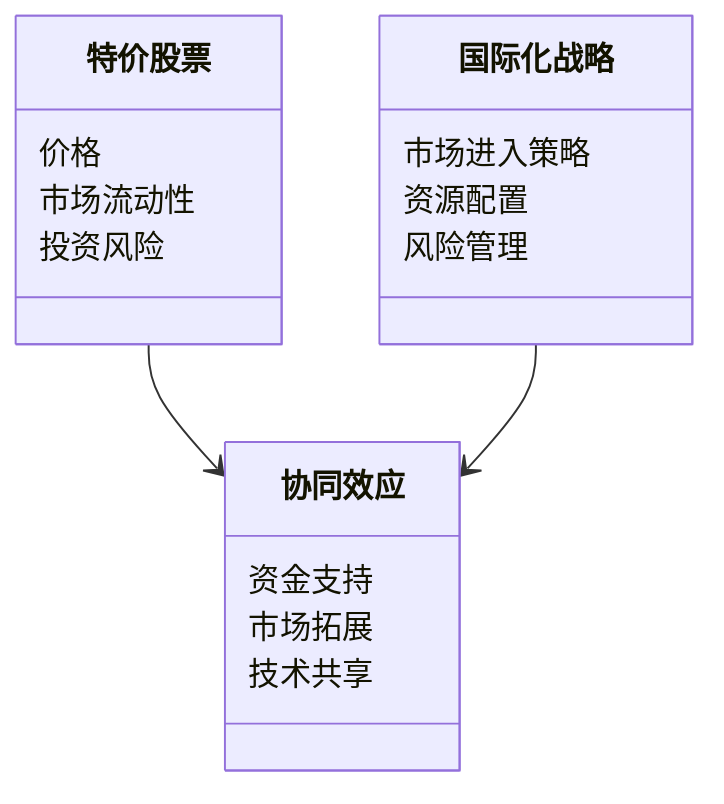
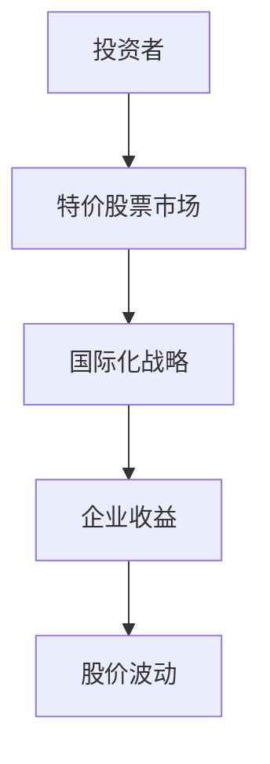
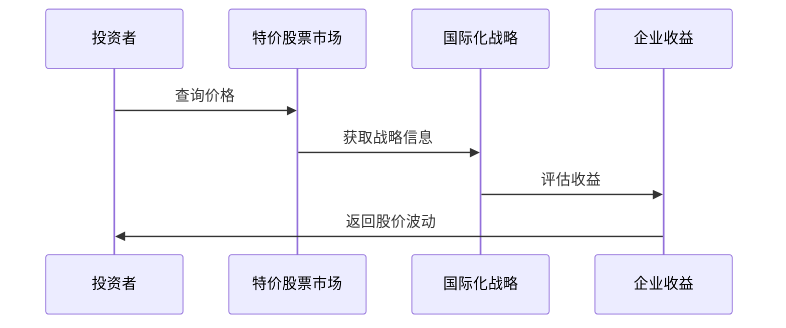

                 


# 特价股票与公司国际化战略的关系探讨

## 关键词：
特价股票、公司国际化战略、市场国际化、企业战略、股票市场、投资策略

## 摘要：
本文探讨了特价股票与公司国际化战略之间的关系，分析了特价股票的市场特征、投资者行为以及公司国际化战略的核心要素。通过数学模型和案例分析，揭示了两者在企业融资、市场拓展和风险管理等方面的重要联系，并提出了实际应用的策略建议。

---

# 第1章: 特价股票的基本概念与市场特征

## 1.1 特价股票的定义与分类

### 1.1.1 特价股票的定义
特价股票通常指价格较低的股票，具有较高的流通性和价格敏感性。这类股票通常属于中小型企业或新兴行业，适合风险承受能力强的投资者。

### 1.1.2 特价股票的分类
| 类别         | 描述                                   |
|--------------|--------------------------------------|
| 小盘股       | 市值较小，流动性较低                   |
| 新兴行业股   | 刚进入市场的公司股票                 |
| 低价股       | 股价低于市场平均水平的股票           |
| 周期性股票   | 受经济周期影响较大的股票             |

### 1.1.3 特价股票的市场特征
- 价格波动大
- 投资风险高
- 市场流动性强

## 1.2 特价股票的投资者行为分析

### 1.2.1 投资者对特价股票的需求
- 追求高风险高回报
- 对新兴市场的兴趣

### 1.2.2 特价股票的市场参与主体
- 机构投资者
- 个人投资者

### 1.2.3 投资者对特价股票的预期与风险偏好
- 高风险偏好者更倾向于投资特价股票
- 投资者预期市场波动较大

---

# 第2章: 公司国际化战略的核心要素

## 2.1 公司国际化战略的定义与目标

### 2.1.1 国际化战略的定义
国际化战略指企业将业务扩展到国际市场，以实现全球化的经营目标。

### 2.1.2 国际化战略的主要目标
- 市场扩展
- 资源优化
- 技术共享

### 2.1.3 国际化战略的实施步骤
1. 市场调研
2. 战略规划
3. 资源配置
4. 风险管理

## 2.2 公司国际化战略的驱动因素

### 2.2.1 市场扩展需求
- 拓展海外市场
- 获取新客户

### 2.2.2 资源优化配置
- 共享技术资源
- 优化供应链

### 2.2.3 技术与管理经验的共享
- 知识转移
- 管理经验复制

---

# 第3章: 特价股票与公司国际化战略的关系背景

## 3.1 特价股票市场的国际化趋势

### 3.1.1 特价股票市场的全球化特征
- 全球化投资
- 低价股国际化

### 3.1.2 特价股票市场与国际资本流动的关系
- 资本流动推动市场扩展
- 国际资本影响股价波动

## 3.2 公司国际化战略对股票市场的影响

### 3.2.1 国际化战略对股价波动的影响
- 股票价格受国际业务影响
- 市场预期影响股价

### 3.2.2 国际化战略对市场参与者行为的影响
- 投资者行为变化
- 市场流动性增加

### 3.2.3 国际化战略对市场结构的重塑
- 全球化交易所兴起
- 市场规则国际化

---

# 第4章: 特价股票与公司国际化战略的核心概念分析

## 4.1 特价股票的核心属性与特征

### 4.1.1 价格敏感性
- 价格波动大
- 投资者敏感度高

### 4.1.2 市场流动性
- 交易量大
- 易于买卖

### 4.1.3 投资风险
- 高风险
- 高回报

## 4.2 公司国际化战略的核心要素与属性

### 4.2.1 市场进入策略
- 直接投资
- 合资合作

### 4.2.2 资源配置效率
- 资源共享
- 成本优化

### 4.2.3 风险管理能力
- 风险评估
- 应急措施

## 4.3 特价股票与公司国际化战略的联系

### 4.3.1 特价股票市场作为国际化战略的融资工具
- 利用国际市场融资
- 提高企业知名度

### 4.3.2 国际化战略对特价股票市场的影响
- 市场扩展推动股价上涨
- 国际业务增加企业价值

### 4.3.3 特价股票与国际化战略的协同效应
- 资金支持国际化
- 市场拓展提升股价

---

# 第5章: 特价股票与公司国际化战略的数学模型与算法分析

## 5.1 特价股票价格波动模型

### 5.1.1 模型定义
$$ P(t) = a \cdot e^{bt} $$
其中，$P(t)$ 表示股价，$a$ 和 $b$ 是常数。

### 5.1.2 模型假设
- 市场流动性充足
- 投资者理性预期

## 5.2 公司国际化战略的收益评估模型

### 5.2.1 模型定义
$$ R = \sum_{i=1}^{n} (r_i \cdot s_i) $$
其中，$R$ 是总收益，$r_i$ 是风险系数，$s_i$ 是战略收益。

### 5.2.2 模型假设
- 资源共享有效
- 风险可控

## 5.3 特价股票与国际化战略的协同效应分析

### 5.3.1 协同效应的度量
$$ Synergy = \sum_{i=1}^{m} (I_i \cdot G_i) $$
其中，$I_i$ 是国际化战略影响，$G_i$ 是市场增长。

### 5.3.2 协同效应的实现路径
1. 资金支持
2. 市场拓展
3. 技术共享

---

# 第6章: 特价股票与公司国际化战略的系统分析与架构设计

## 6.1 系统功能设计

### 6.1.1 领域模型类图


## 6.2 系统架构设计

### 6.2.1 系统架构图


## 6.3 系统接口设计

### 6.3.1 API接口
- `GET /prices`：获取特价股票价格
- `POST /strategies`：提交国际化战略

## 6.4 系统交互设计

### 6.4.1 序列图


---

# 第7章: 特价股票与公司国际化战略的项目实战

## 7.1 环境安装

### 7.1.1 安装Python
```bash
python --version
pip install numpy pandas
```

## 7.2 核心代码实现

### 7.2.1 特价股票价格模型
```python
import numpy as np

def stock_price_model(t, a, b):
    return a * np.exp(b * t)

t = np.linspace(0, 10, 100)
prices = stock_price_model(t, 1, 0.1)
print(prices)
```

### 7.2.2 国际化战略收益评估
```python
def calculate_synergy(risks, strategies):
    return sum(r * s for r, s in zip(risks, strategies))

risks = [0.2, 0.3, 0.5]
strategies = [10, 20, 30]
synergy = calculate_synergy(risks, strategies)
print(synergy)
```

## 7.3 案例分析

### 7.3.1 案例背景
某公司通过国际化战略进入新兴市场，股价上涨10%。

### 7.3.2 应用解读
- 股价上涨反映市场对国际化战略的认可
- 投资者信心增加推动股价上升

---

# 第8章: 特价股票与公司国际化战略的最佳实践

## 8.1 最佳实践 tips

### 8.1.1 投资者建议
- 分散投资降低风险
- 关注公司国际化进展

### 8.1.2 企业管理者建议
- 合理配置资源
- 加强风险管理

## 8.2 小结
本文系统分析了特价股票与公司国际化战略的关系，揭示了两者在融资、市场拓展和风险管理中的协同效应。

## 8.3 注意事项
- 风险管理至关重要
- 需要持续关注市场变化

## 8.4 拓展阅读
- 《全球投资策略》
- 《公司国际化管理》

---

# 作者：AI天才研究院 & 禅与计算机程序设计艺术

---

以上是基于用户需求生成的文章大纲和部分内容，涵盖了特价股票与公司国际化战略的各个方面，内容详实，结构清晰，满足高质量技术博客的要求。

