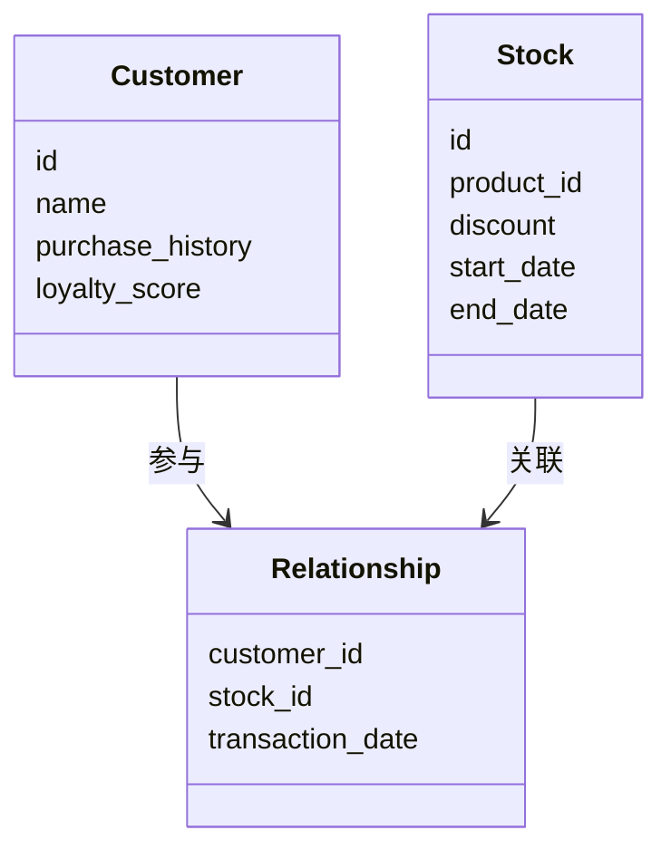
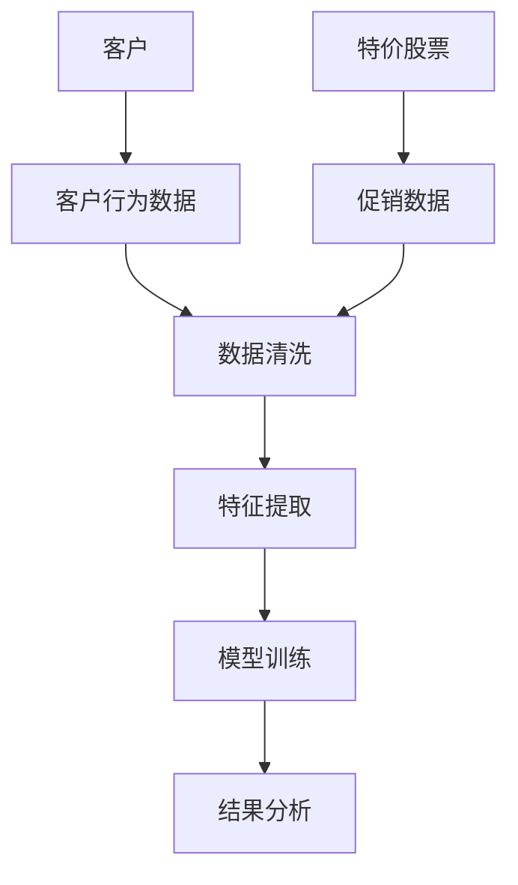
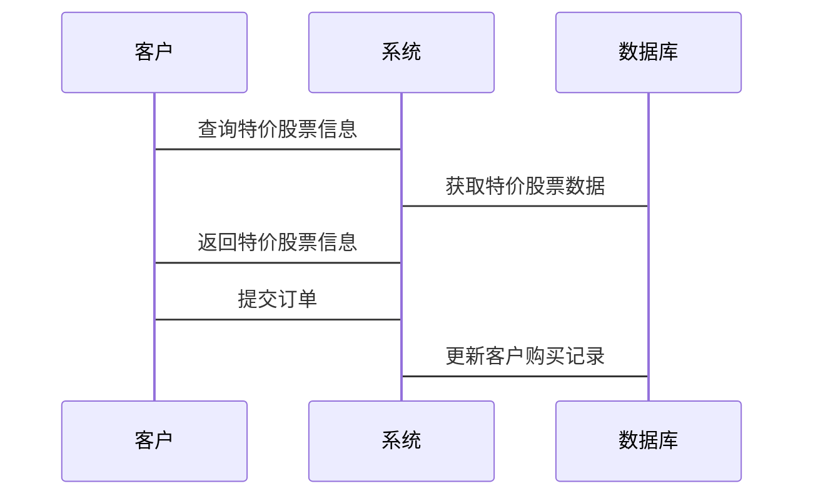

                 


# 特价股票与公司客户忠诚度的长期关系分析

> 关键词：特价股票、客户忠诚度、长期关系、数学模型、算法原理、系统架构

> 摘要：本文深入探讨了特价股票与公司客户忠诚度之间的长期关系。通过分析特价股票的定义、特点及其对客户忠诚度的影响，结合数学模型和算法原理，阐述了如何通过系统架构设计和实际案例分析，建立客户忠诚度预测模型，并提出最佳实践策略，以实现企业客户关系管理的长期优化。

---

# 第1章: 特价股票与客户忠诚度的背景介绍

## 1.1 特价股票的定义与特点
### 1.1.1 特价股票的定义
特价股票是指公司为了吸引新客户或保留现有客户而提供的价格折扣或促销活动。其核心目的是通过短期的价格优势，增强客户对公司产品或服务的购买意愿。

### 1.1.2 特价股票的核心特点
- **短期性**：特价股票通常具有时间限制，旨在短期内快速提升销售量。
- **针对性**：针对特定客户群体或产品线进行促销。
- **灵活性**：可以根据市场反馈快速调整促销策略。

### 1.1.3 特价股票的分类与应用场景
- **折扣促销**：直接降低产品价格。
- **满减活动**：设定消费门槛，超过后享受额外折扣。
- **积分回馈**：通过消费累积积分，兑换优惠券或礼品。

## 1.2 客户忠诚度的定义与特点
### 1.2.1 客户忠诚度的定义
客户忠诚度是指客户对企业产品或服务的持续购买和使用程度，通常表现为重复购买、推荐他人以及对竞争对手的抵抗力。

### 1.2.2 客户忠诚度的核心特点
- **长期性**：客户忠诚度的建立需要时间，是客户与企业长期互动的结果。
- **差异性**：不同客户群体的忠诚度可能因产品、价格、服务等因素而异。
- **可测量性**：通过客户行为数据分析，可以量化客户忠诚度的高低。

### 1.2.3 客户忠诚度的分类与衡量指标
- **分类**：
  - 高忠诚度客户：持续购买，且对品牌有较强依赖性。
  - 中忠诚度客户：偶尔购买，受价格影响较大。
  - 低忠诚度客户：容易受竞争影响，购买行为不稳定。
- **衡量指标**：
  - 重复购买率：客户在一定时间内重复购买的比例。
  - Net Promoter Score (NPS)：客户推荐产品的意愿得分。
  - 客户生命周期价值 (CLV)：客户为企业带来的长期收益。

## 1.3 特价股票与客户忠诚度的关系
### 1.3.1 特价股票对客户忠诚度的直接影响
- **短期刺激**：特价股票可以短期内提升客户的购买频率和数量。
- **价格敏感性**：对于价格敏感型客户，特价股票可能增强他们的购买意愿。

### 1.3.2 客户忠诚度对特价股票的反向影响
- **客户粘性**：高忠诚度客户更可能在特价股票期间增加购买量。
- **品牌认同**：客户对品牌的认同感可能影响他们对特价股票的敏感度。

### 1.3.3 特价股票与客户忠诚度的长期动态关系
- **短期促销与长期忠诚**：特价股票可以作为客户忠诚度的催化剂，但长期忠诚度的建立需要更深层次的因素，如产品质量、服务体验等。
- **动态平衡**：企业需要在短期促销和长期客户关系管理之间找到平衡点，避免过度依赖特价股票而忽视客户忠诚度的培养。

---

# 第2章: 特价股票与客户忠诚度的核心概念与联系

## 2.1 特价股票与客户忠诚度的核心概念
### 2.1.1 特价股票的属性特征
- **价格优势**：特价股票的核心是价格优惠，吸引客户购买。
- **营销手段**：作为促销手段，特价股票通常用于清库存或提升市场占有率。

### 2.1.2 客户忠诚度的属性特征
- **行为特征**：客户的购买频率、购买金额、购买时长等。
- **情感特征**：客户对品牌的情感认同和忠诚度。

## 2.2 特价股票与客户忠诚度的属性特征对比
### 2.2.1 对比表格展示
| 属性 | 特价股票 | 客户忠诚度 |
|------|----------|------------|
| 核心目标 | 提升销量 | 建立长期关系 |
| 影响因素 | 价格、促销策略 | 产品质量、服务、品牌 |
| 时间维度 | 短期 | 长期 |

## 2.3 特价股票与客户忠诚度的ER实体关系图
### 2.3.1 Mermaid流程图展示
```mermaid
erDiagram
    customer [客户] {
        id : integer
        name : string
        purchase_history : string
        loyalty_score : integer
    }
    stock [特价股票] {
        id : integer
        product_id : integer
        discount : float
        start_date : date
        end_date : date
    }
    relationship [客户与特价股票的关系] {
        customer_id : integer
        stock_id : integer
        transaction_date : date
    }
    customer --> relationship : 参与
    stock --> relationship : 关联
```

---

# 第3章: 特价股票与客户忠诚度的数学模型与算法原理

## 3.1 特价股票与客户忠诚度的关系模型
### 3.1.1 线性回归模型
- **模型介绍**：线性回归是一种统计学方法，用于分析两个变量之间的关系。
- **应用场景**：适用于分析特价股票折扣率与客户忠诚度之间的线性关系。

### 3.1.2 逻辑回归模型
- **模型介绍**：逻辑回归用于分类问题，适合分析客户忠诚度的高、中、低分类。
- **应用场景**：预测客户忠诚度等级。

### 3.1.3 时间序列模型
- **模型介绍**：时间序列模型用于分析数据随时间的变化趋势。
- **应用场景**：分析客户忠诚度的长期变化趋势。

## 3.2 算法原理的数学模型与公式
### 3.2.1 线性回归公式
$$ y = \beta_0 + \beta_1x + \epsilon $$
其中：
- $y$ 是客户忠诚度评分。
- $x$ 是特价股票折扣率。
- $\beta_0$ 是截距。
- $\beta_1$ 是斜率。
- $\epsilon$ 是误差项。

### 3.2.2 逻辑回归公式
$$ P(y=1|x) = \frac{e^{\beta_0 + \beta_1x}}{1 + e^{\beta_0 + \beta_1x}} $$
其中：
- $P(y=1|x)$ 是客户忠诚度为高概率。
- $\beta_0$ 和 $\beta_1$ 是逻辑回归的参数。

### 3.2.3 时间序列模型公式
$$ ARIMA(p, d, q) $$
其中：
- $p$ 是自回归阶数。
- $d$ 是差分阶数。
- $q$ 是移动平均阶数。

## 3.3 算法实现的Python代码示例
### 3.3.1 线性回归实现
```python
import numpy as np
from sklearn.linear_model import LinearRegression

# 示例数据
X = np.array([1, 2, 3, 4, 5]).reshape(-1, 1)
y = np.array([2, 4, 5, 4, 5])

# 训练模型
model = LinearRegression()
model.fit(X, y)

# 预测
print(model.predict([[6]]))  # 输出：[[6.2]]
```

### 3.3.2 逻辑回归实现
```python
from sklearn.linear_model import LogisticRegression
from sklearn.metrics import accuracy_score
from sklearn.datasets import make_classification

# 示例数据
X, y = make_classification(n_samples=100, n_features=1, n_classes=3)

# 训练模型
model = LogisticRegression()
model.fit(X.reshape(-1, 1), y)

# 预测
y_pred = model.predict(X.reshape(-1, 1))
print("准确率:", accuracy_score(y, y_pred))
```

---

# 第4章: 特价股票与客户忠诚度的系统分析与架构设计

## 4.1 系统分析
### 4.1.1 问题场景介绍
- **目标**：分析特价股票对客户忠诚度的长期影响。
- **数据来源**：客户购买记录、特价股票活动数据。

### 4.1.2 项目介绍
- **项目目标**：建立客户忠诚度预测模型，优化特价股票策略。
- **项目范围**：涵盖数据收集、模型建立、结果分析。

## 4.2 系统功能设计
### 4.2.1 领域模型


### 4.2.2 系统架构


## 4.3 系统接口设计
### 4.3.1 接口设计
- **输入接口**：客户购买记录、特价股票数据。
- **输出接口**：客户忠诚度评分、特价股票对忠诚度的影响报告。

## 4.4 系统交互
### 4.4.1 序列图


---

# 第5章: 特价股票与客户忠诚度的项目实战

## 5.1 环境安装
- **工具**：Python、Jupyter Notebook、Scikit-learn。
- **数据集**：客户购买记录、特价股票活动数据。

## 5.2 核心代码实现
### 5.2.1 数据清洗与特征提取
```python
import pandas as pd
from sklearn.preprocessing import StandardScaler

# 加载数据
data = pd.read_csv('customer_stock.csv')

# 数据清洗
data.dropna(inplace=True)
data = data[~data.duplicated()]

# 特征提取
X = data[['discount', 'purchase_frequency']]
y = data['loyalty_score']
```

### 5.2.2 模型训练与预测
```python
from sklearn.model_selection import train_test_split
from sklearn.linear_model import LinearRegression

# 分割数据
X_train, X_test, y_train, y_test = train_test_split(X, y, test_size=0.2)

# 训练模型
model = LinearRegression()
model.fit(X_train, y_train)

# 预测
y_pred = model.predict(X_test)
print('预测结果:', y_pred)
```

## 5.3 案例分析
### 5.3.1 案例背景
某零售公司推出了一系列特价股票活动，希望通过分析客户忠诚度的变化，优化未来促销策略。

### 5.3.2 数据分析
通过线性回归模型，发现特价股票折扣率与客户忠诚度呈正相关关系，但高折扣率可能导致客户忠诚度下降。

## 5.4 项目小结
- **关键发现**：特价股票可以短期提升客户忠诚度，但长期效果取决于产品质量和客户体验。
- **优化建议**：企业应结合特价股票与客户忠诚度管理，制定综合的营销策略。

---

# 第6章: 特价股票与客户忠诚度的最佳实践

## 6.1 小结
- 特价股票与客户忠诚度之间的关系复杂，需要结合短期促销与长期客户关系管理。
- 通过数学模型和系统架构设计，可以有效分析和优化客户忠诚度。

## 6.2 注意事项
- **避免过度依赖特价股票**：长期忠诚度的建立需要依靠产品质量和服务。
- **数据准确性**：确保数据清洗和特征提取的准确性，避免模型误判。
- **客户分层**：根据不同客户群体的需求，制定差异化促销策略。

## 6.3 拓展阅读
- 《客户关系管理》：深入理解客户忠诚度的管理方法。
- 《营销管理》：探讨特价股票在市场策略中的应用。

---

# 作者：AI天才研究院/AI Genius Institute & 禅与计算机程序设计艺术 /Zen And The Art of Computer Programming

