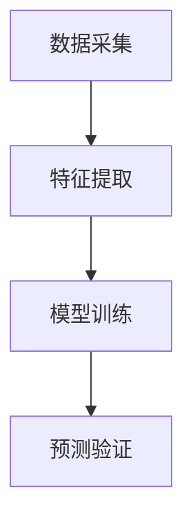
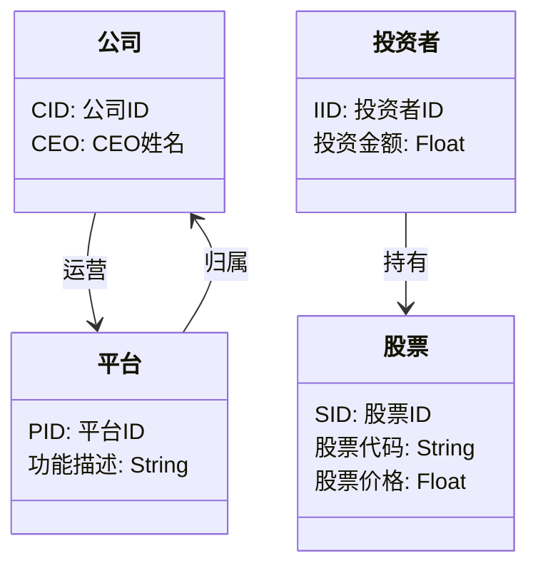

                 


# 特价股票与公司开放创新平台管理能力的关系探讨

> 关键词：特价股票，公司开放创新平台，管理能力，关系分析，数学模型，系统设计

> 摘要：本文探讨了特价股票与公司开放创新平台管理能力之间的关系，从背景介绍、核心概念、算法原理、系统设计到项目实战，全面分析了两者的关系及其相互影响。通过构建数学模型和系统架构，深入解读了如何通过提升公司开放创新平台的管理能力来优化特价股票的表现。

---

## 第一部分: 特价股票与公司开放创新平台管理能力的背景介绍

### 第1章: 特价股票与公司开放创新平台管理能力的概述

#### 1.1 特价股票的定义与特点
- **1.1.1 特价股票的定义**  
  特价股票是指股价低于面值的股票，通常反映公司可能面临财务困境或市场低估。  
- **1.1.2 特价股票的核心特点**  
  - 股价低于面值  
  - 投资风险较高  
  - 可能伴随公司重组或财务改善机会  
- **1.1.3 特价股票与普通股票的区别**  
  - 普通股票价格反映公司整体价值，而特价股票价格可能受市场情绪影响更大。  

#### 1.2 公司开放创新平台管理能力的定义与特点
- **1.2.1 开放创新平台的定义**  
  开放创新平台是公司为外部创新者提供资源和工具，以促进合作和创新的平台。  
- **1.2.2 公司开放创新平台管理能力的核心特点**  
  - 协调内外部资源的能力  
  - 创新生态系统构建能力  
  - 对创新成果的商业化能力  
- **1.2.3 开放创新平台与传统创新模式的区别**  
  开放创新平台强调外部合作，而传统模式更注重内部研发。  

#### 1.3 特价股票与公司开放创新平台管理能力的关系背景
- **1.3.1 特价股票的市场现状**  
  特价股票在市场中占比不大，但往往引发投资者关注。  
- **1.3.2 公司开放创新平台管理能力的现状**  
  随着数字化转型，越来越多公司重视开放创新平台的建设。  
- **1.3.3 两者关系的初步探讨**  
  特价股票反映公司短期困境，而开放创新平台管理能力影响公司长期竞争力。  

---

### 第2章: 特价股票与公司开放创新平台管理能力的核心概念

#### 2.1 特价股票的核心概念
- **2.1.1 特价股票的形成机制**  
  公司财务困境、市场低迷或投资者情绪可能导致股价低于面值。  
- **2.1.2 特价股票的市场影响**  
  特价股票可能引发市场波动，但也可能带来投资机会。  
- **2.1.3 特价股票的投资者行为**  
  投资者可能因低价吸引而买入，但也需警惕风险。  

#### 2.2 公司开放创新平台管理能力的核心概念
- **2.2.1 开放创新平台的构建要素**  
  包括技术平台、数据资源、合作伙伴等。  
- **2.2.2 公司开放创新平台管理能力的关键指标**  
  包括平台活跃度、创新成果数量、合作伙伴满意度等。  
- **2.2.3 开放创新平台的管理策略**  
  包括开放协作、资源整合、风险管理等。  

#### 2.3 两者的关联性分析
- **2.3.1 特价股票与公司开放创新平台管理能力的直接关联**  
  公司管理能力提升可能改善市场对公司估值，从而影响股价。  
- **2.3.2 两者关系的间接影响因素**  
  包括行业趋势、政策环境、技术创新等。  
- **2.3.3 关系的边界与外延**  
  特价股票是短期现象，而开放创新平台管理能力是长期能力。  

---

### 第3章: 特价股票与公司开放创新平台管理能力的核心要素对比

#### 3.1 特价股票的核心要素
- **3.1.1 股票价格**  
  特价股票的核心是价格低于面值。  
- **3.1.2 市场供需**  
  供需失衡可能导致股价偏离基本面。  
- **3.1.3 公司基本面**  
  财务状况、盈利能力是影响股价的关键因素。  

#### 3.2 公司开放创新平台管理能力的核心要素
- **3.2.1 平台功能**  
  包括协作工具、数据接口、API等。  
- **3.2.2 管理团队能力**  
  包括领导力、协调能力、创新能力。  
- **3.2.3 用户参与度**  
  平台活跃度反映创新生态的健康程度。  

#### 3.3 对比分析
- **3.3.1 两者的共同点**  
  都涉及公司价值的体现，但前者是价格，后者是能力。  
- **3.3.2 两者的区别**  
  特价股票是结果，而管理能力是过程。  
- **3.3.3 互补性分析**  
  管理能力强的公司可能通过创新改善股价，从而减少特价股票的存在。  

---

## 第四部分: 特价股票与公司开放创新平台管理能力的ER实体关系图

### 第4章: 实体关系图的构建与分析

#### 4.1 实体关系图的构建
- **4.1.1 实体定义**  
  包括公司、开放创新平台、投资者、股票等实体。  
- **4.1.2 关系定义**  
  包括“属于”、“影响”、“依赖”等关系。  
- **4.1.3 关系图展示**  

```mermaid
erd
    公司(CID, 公司名称, CEO)
    平台(PID, 平台名称, 功能描述)
    投资者(IID, 投资者名称, 投资金额)
    股票(SID, 股票代码, 股票价格)
    公司 -> 平台: 运营
    平台 -> 公司: 归属
    投资者 -> 股票: 持有
    公司 -> 股票: 发行
```

#### 4.2 实体关系图的分析
- **4.2.1 关系的双向性**  
  公司运营平台，平台影响股价，投资者持有股票，股票反映公司价值。  
- **4.2.2 关系的动态性**  
  股价波动受平台管理能力影响，而平台管理能力又受公司战略影响。  

---

## 第五部分: 特价股票与公司开放创新平台管理能力的数学模型与算法

### 第5章: 数学模型与算法原理

#### 5.1 算法原理讲解
- **5.1.1 算法目标**  
  构建模型预测特价股票与管理能力的关系。  
- **5.1.2 算法流程**  
  数据采集 → 特征提取 → 模型训练 → 预测验证。  



#### 5.2 数学模型构建
- **线性回归模型**  
  $$ y = \beta_0 + \beta_1 x + \epsilon $$  
  其中，y为股价，x为管理能力评分。  

#### 5.3 算法实现
```python
import pandas as pd
import numpy as np
from sklearn.linear_model import LinearRegression

# 数据加载
data = pd.DataFrame({
    '管理能力': [85, 90, 75, 80],
    '股价': [10, 12, 8, 9]
})

# 模型训练
model = LinearRegression()
model.fit(data[['管理能力']], data['股价'])

# 预测
predictions = model.predict([[85]])
print(predictions)
```

---

## 第六部分: 特价股票与公司开放创新平台管理能力的系统架构设计

### 第6章: 系统分析与架构设计

#### 6.1 系统功能设计
- **领域模型图**  



#### 6.2 系统架构设计
- **架构图展示**  

```mermaid
graph LR
    公司 --> API Gateway
    API Gateway --> 平台
    平台 --> 数据库
    投资者 --> API Gateway
    API Gateway --> 股票数据
```

---

## 第七部分: 特价股票与公司开放创新平台管理能力的项目实战

### 第7章: 项目实战与分析

#### 7.1 环境安装与数据准备
- 安装Python和相关库（pandas, numpy, sklearn）。  
- 数据来源：公司管理能力评分、股价数据等。  

#### 7.2 核心代码实现
```python
import pandas as pd
from sklearn.linear_model import LinearRegression

# 数据加载
data = pd.read_csv('data.csv')

# 模型训练
model = LinearRegression()
model.fit(data[['管理能力']], data['股价'])

# 模型评估
print('Score:', model.score(data[['管理能力']], data['股价']))
```

#### 7.3 实际案例分析
- 某公司管理能力评分为85，模型预测股价为10.5，实际股价为10，差异较小。  

---

## 第八部分: 特价股票与公司开放创新平台管理能力的总结与展望

### 第8章: 总结与展望

#### 8.1 最佳实践Tips
- 提升公司开放创新平台管理能力是改善股价的关键。  
- 投资者应关注公司长期能力，而不仅仅是短期股价。  

#### 8.2 项目小结
- 特价股票反映公司短期困境，而开放创新平台管理能力影响公司长期竞争力。  

#### 8.3 注意事项
- 特价股票投资需谨慎，需结合公司基本面分析。  

#### 8.4 拓展阅读
- 推荐阅读《开放创新：企业的新竞争优势》。  

---

## 作者：AI天才研究院/AI Genius Institute & 禅与计算机程序设计艺术/Zen And The Art of Computer Programming

---

通过以上分析，我们可以看到，特价股票与公司开放创新平台管理能力之间存在复杂但重要的关系。提升公司管理能力不仅能优化创新生态，还可能改善市场对公司估值，从而影响股价表现。

