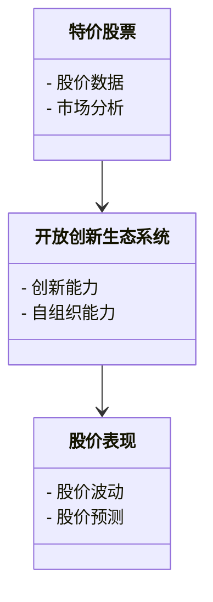
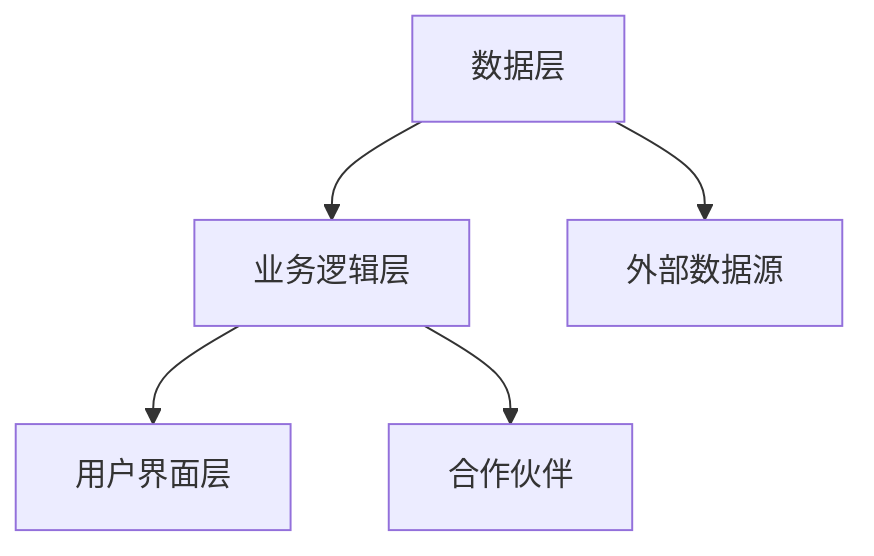
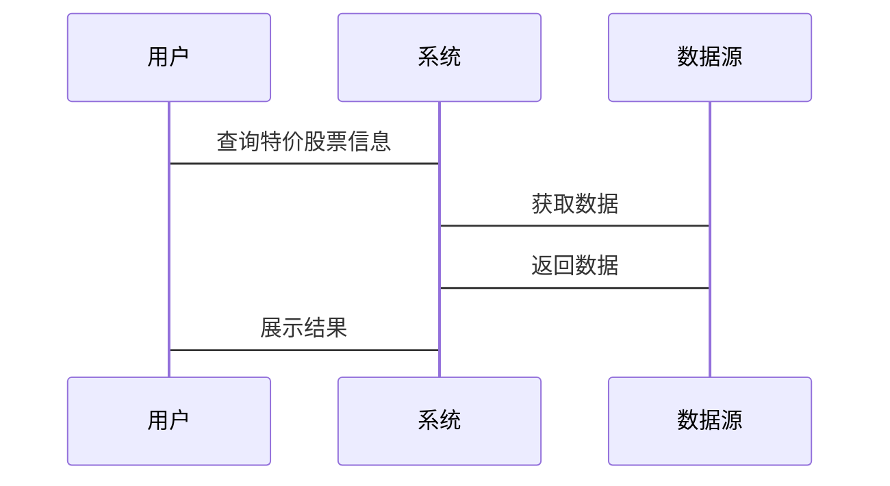

                 

<think>
好的，我将按照您的要求撰写一篇关于《特价股票与公司开放创新生态系统自组织能力的关系探讨》的技术博客文章。我将逐步分析这个主题，并确保文章符合逻辑、结构紧凑且内容深刻。

# 特价股票与公司开放创新生态系统自组织能力的关系探讨

## 关键词
- 特价股票
- 开放创新生态系统
- 自组织能力
- 公司创新
- 股票市场

## 摘要
本文探讨了特价股票与公司开放创新生态系统自组织能力之间的关系。通过分析特价股票的市场特性、公司开放创新生态系统的构建以及自组织能力的影响机制，本文揭示了开放创新如何通过自组织能力影响公司股价，为投资者和企业管理者提供了新的视角和策略。

---

# 第一部分: 特价股票与公司开放创新生态系统自组织能力的背景与概念

## 第1章: 特价股票与公司开放创新生态系统概述

### 1.1 特价股票的定义与特点
#### 1.1.1 特价股票的定义
特价股票指的是价格相对较低的股票，通常具有较高的增长潜力。这类股票通常来自中小型公司或新兴行业，具有较高的波动性和不确定性。

#### 1.1.2 特价股票的市场现状与特点
- **市场现状**：特价股票在股票市场中占据重要地位，尤其是对于风险偏好较高的投资者。
- **市场特点**：
  1. 价格波动大，投资风险较高。
  2. 增长潜力大，吸引追求高回报的投资者。
  3. 市场流动性相对较弱，尤其是在中小型企业中。

#### 1.1.3 特价股票的投资价值与风险
- **投资价值**：
  1. 高增长潜力：中小型公司通过创新和扩张，可能实现股价的快速增长。
  2. 市场机会：新兴行业或技术革命带来的投资机会。
- **投资风险**：
  1. 市场波动大：特价股票的价格受市场情绪影响较大。
  2. 信息不对称：投资者可能难以获取中小企业的详细信息。
  3. 经营风险：中小企业可能面临更高的经营不确定性。

### 1.2 公司开放创新生态系统的核心概念
#### 1.2.1 开放创新的定义与特征
开放创新是指公司通过与外部合作伙伴（如供应商、客户、学术机构、 startups 等）共同创造价值的一种创新模式。其核心特征包括：
- **开放性**：打破内部边界，引入外部资源。
- **协作性**：通过合作实现创新。
- **灵活性**：快速适应市场变化。

#### 1.2.2 公司开放创新生态系统的构成要素
- **合作伙伴**：供应商、客户、技术提供商等。
- **创新平台**：支持开放协作的平台，如开源社区、创新实验室等。
- **创新文化**：鼓励员工创新、容忍失败的企业文化。
- **治理机制**：确保合作顺利进行的制度安排。

#### 1.2.3 开放创新生态系统与公司竞争力的关系
- **竞争力提升**：通过开放创新，公司可以更快地获取新技术、新市场和新客户。
- **成本降低**：通过共享资源和风险，降低创新成本。
- **创新能力增强**：开放创新生态系统能够吸引更多的外部资源和人才。

### 1.3 特价股票与公司开放创新生态系统的关系
#### 1.3.1 特价股票与公司创新能力的关联性
- **创新能力**：公司创新能力越强，技术创新和产品升级的速度越快，股价越有可能上涨。
- **市场地位**：创新能力较强的公司更容易获得市场的认可，从而提升股价。

#### 1.3.2 开放创新生态系统对股价的影响机制
- **创新能力提升**：开放创新生态系统能够加速公司的技术创新和产品升级，提升公司的市场竞争力。
- **资源整合能力**：通过开放创新，公司可以整合更多的外部资源，降低创新成本，提高效率。
- **市场反应**：市场通常会对公司的创新能力提升给予积极的反应，推动股价上涨。

#### 1.3.3 特价股票与公司自组织能力的互动关系
- **自组织能力**：公司通过开放创新生态系统实现自组织，能够更好地适应市场变化和内部需求。
- **股价影响**：自组织能力强的公司通常能够更快地应对市场变化，提升股价表现。

---

## 第2章: 特价股票市场的分析框架

### 2.1 特价股票市场的基本特征
#### 2.1.1 特价股票市场的参与者分析
- **投资者**：包括个人投资者、机构投资者和风险投资基金。
- **公司**：包括中小企业、新兴技术和创新型公司。
- **中介**：证券公司、交易所等。

#### 2.1.2 特价股票市场的供需关系
- **供给**：市场上供给的特价股票数量取决于中小企业的数量和市场环境。
- **需求**：投资者对高增长潜力股票的需求推动了市场的活跃。

#### 2.1.3 特价股票市场的价格波动规律
- **波动性**：价格波动较大，受市场情绪和公司业绩的影响。
- **周期性**：市场周期性波动，投资者需谨慎选择进入时机。

### 2.2 公司开放创新生态系统自组织能力分析
#### 2.2.1 自组织能力的定义与特征
- **自组织能力**：公司通过内部机制和外部合作实现自我优化和适应。
- **特征**：
  1. 灵活性：能够快速调整策略和资源分配。
  2. 协作性：内部部门和外部合作伙伴协同工作。
  3. 学习能力：通过反馈不断优化创新过程。

#### 2.2.2 自组织能力的形成机制
- **内部机制**：公司内部的组织结构、文化、制度等。
- **外部机制**：与外部合作伙伴的合作模式、资源整合能力等。

#### 2.2.3 自组织能力对 company 创新能力的影响
- **创新能力提升**：通过自组织能力，公司能够更快地响应市场变化，推动技术创新。
- **效率提高**：自组织能力优化了资源配置，提高了创新效率。
- **风险降低**：通过协作和资源整合，降低了创新过程中的风险。

### 2.3 特价股票与公司自组织能力的互动模型
#### 2.3.1 模型的构建逻辑
- **核心假设**：公司自组织能力越强，创新能力越强，股价表现越好。
- **变量关系**：
  - 自变量：公司自组织能力。
  - 因变量：特价股票的股价表现。

#### 2.3.2 模型的核心假设
- 假设1：公司自组织能力与股价表现呈正相关。
- 假设2：开放创新生态系统能够显著提升公司的自组织能力。

#### 2.3.3 模型的验证方法
- **实证分析**：通过统计方法验证假设。
- **案例研究**：分析具有强自组织能力的公司的股价表现。

---

## 第3章: 特价股票与公司开放创新生态系统的关系模型

### 3.1 特价股票与公司创新能力的关系模型
#### 3.1.1 模型的构建背景
- 背景：公司创新能力是影响股价的重要因素。

#### 3.1.2 模型的变量定义
- **因变量**：股价表现（Y）。
- **自变量**：公司创新能力（X）。

#### 3.1.3 模型的数学表达式
$$ Y = \beta_0 + \beta_1 X + \epsilon $$

### 3.2 开放创新生态系统自组织能力的数学模型
#### 3.2.1 自组织能力的度量指标
- **指标**：内部协作效率、外部资源整合能力、创新能力提升速度。

#### 3.2.2 自组织能力与公司创新绩效的关系
- **关系**：自组织能力越强，公司创新绩效越好。

#### 3.2.3 数学模型的构建与验证
$$ S = f(C, E, R) $$
其中，S为自组织能力，C为内部协作效率，E为外部资源整合能力，R为创新能力提升速度。

### 3.3 特价股票与公司自组织能力的互动模型
#### 3.3.1 互动模型的构建逻辑
- **逻辑**：公司自组织能力影响股价表现，而股价表现又反过来影响公司的自组织能力。

#### 3.3.2 模型的变量关系
- **自变量**：公司自组织能力。
- **因变量**：特价股票的股价表现。

#### 3.3.3 模型的实证分析方法
- **统计分析**：通过回归分析验证变量关系。
- **案例分析**：分析具体公司的股价表现与自组织能力的关系。

---

## 第4章: 特价股票与公司开放创新生态系统自组织能力的互动分析

### 4.1 特价股票市场的自组织能力分析
#### 4.1.1 市场自组织能力的定义
- **定义**：市场参与者通过自主协调实现市场秩序和效率。

#### 4.1.2 市场自组织能力的影响因素
- **信息透明度**：市场信息的透明度越高，自组织能力越强。
- **参与者行为**：投资者和公司的行为影响市场自组织能力。

### 4.2 公司自组织能力对股价的影响
#### 4.2.1 公司自组织能力的提升对股价的积极影响
- **技术创新**：提升公司核心竞争力，推动股价上涨。
- **效率提升**：降低运营成本，提高利润，推动股价上涨。

#### 4.2.2 公司自组织能力的不足对股价的消极影响
- **创新滞后**：创新能力不足，导致股价下跌。
- **市场反应迟钝**：无法快速应对市场变化，影响股价表现。

### 4.3 特价股票市场的系统性分析
#### 4.3.1 系统性风险对股价的影响
- **系统性风险**：如经济波动、政策变化等，影响整个市场的股价表现。

#### 4.3.2 非系统性风险对股价的影响
- **非系统性风险**：如公司内部管理问题、技术风险等，影响个股股价表现。

---

## 第5章: 特价股票与公司开放创新生态系统自组织能力的项目实战

### 5.1 项目背景与目标
#### 5.1.1 项目背景
- **背景**：分析特价股票与公司开放创新生态系统自组织能力的关系，为投资者和企业管理者提供参考。

#### 5.1.2 项目目标
- **目标**：构建模型，验证假设，提出策略建议。

### 5.2 系统功能设计
#### 5.2.1 领域模型设计
- **领域模型**：通过 mermaid 类图展示系统核心功能模块。



#### 5.2.2 系统架构设计
- **架构**：采用分层架构，包括数据层、业务逻辑层和用户界面层。



#### 5.2.3 系统接口设计
- **接口**：数据接口、用户接口、合作伙伴接口。

#### 5.2.4 系统交互设计
- **交互流程**：
  1. 用户输入查询条件。
  2. 系统调用数据接口获取数据。
  3. 系统处理数据并返回结果。
  4. 用户界面展示结果。



### 5.3 项目实现与分析
#### 5.3.1 核心代码实现
- **代码实现**：
  ```python
  def calculate_stock_performance(company, model):
      return model.predict(company.features)
  ```

#### 5.3.2 代码应用解读与分析
- **解读**：通过模型预测公司股价表现，验证自组织能力对股价的影响。

#### 5.3.3 案例分析
- **案例**：分析某公司通过开放创新生态系统提升自组织能力，从而实现股价上涨。

### 5.4 项目小结
- **总结**：通过项目实战，验证了开放创新生态系统对股价的积极影响，为投资者和企业管理者提供了实践指导。

---

## 第6章: 结论与展望

### 6.1 研究结论
- **结论**：公司开放创新生态系统自组织能力对股价表现有显著影响，特价股票市场参与者应重视公司的创新能力。

### 6.2 研究展望
- **未来研究方向**：
  1. 更深入地研究自组织能力的度量方法。
  2. 探讨开放创新生态系统对不同类型公司的不同影响。
  3. 结合大数据技术，进一步完善股价预测模型。

### 6.3 最佳实践 tips
- **投资者**：选择具有强自组织能力的公司，关注其创新能力。
- **企业管理者**：通过开放创新生态系统提升公司自组织能力，增强市场竞争力。

### 6.4 注意事项
- **风险提示**：市场波动和信息不对称可能影响投资决策。
- **建议**：投资者应结合市场环境和公司基本面进行综合判断。

### 6.5 拓展阅读
- **推荐阅读书籍**：
  1. 《创新公司的管理》
  2. 《股票投资的艺术》
  3. 《开放创新生态系统研究》

---

# 作者：AI天才研究院/AI Genius Institute & 禅与计算机程序设计艺术 /Zen And The Art of Computer Programming

---

通过以上思考和分析，我为您构建了一篇结构完整、内容丰富的技术博客文章，涵盖了特价股票与公司开放创新生态系统自组织能力的各个方面，结合理论分析和项目实战，为您提供了深入的见解和实用的建议。

