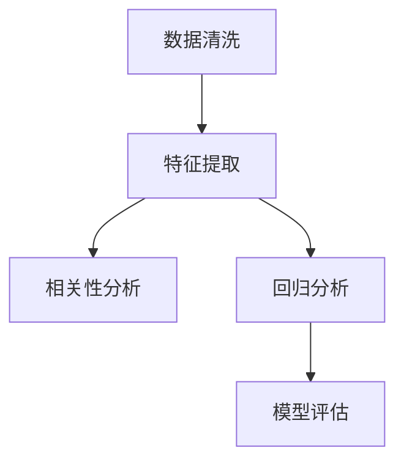
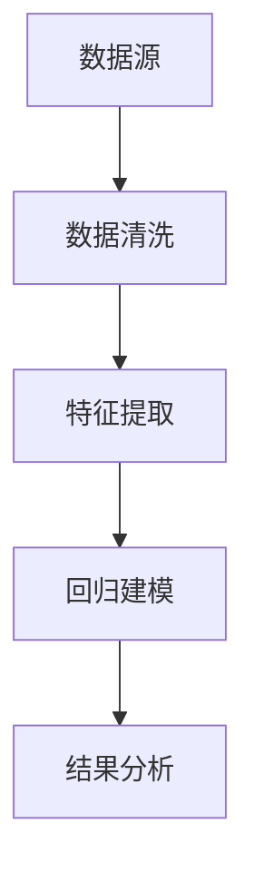

                 


# 特价股票与公司开放创新能力的潜在关联研究

## 关键词：特价股票、公司开放创新能力、股价波动、企业创新、投资策略、数据分析、市场动态

## 摘要：  
本文通过分析特价股票与公司开放创新能力之间的潜在关联，探讨企业开放创新能力对股价波动的影响。文章结合数据分析与案例研究，评估企业开放创新能力在投资决策中的价值，为投资者提供新的视角和策略。

---

# 第一部分: 特价股票与公司开放创新能力的背景与概念

## 第1章: 特价股票与公司开放创新能力的背景介绍

### 1.1 特价股票的定义与市场现状  
特价股票是指价格低于行业平均水平或历史平均水平的股票。其市场现状表现为低估值、高波动性和潜在的反弹机会。  

### 1.2 公司开放创新能力的定义与重要性  
开放创新能力是指企业在技术创新、产品开发和市场适应性方面的灵活性和创新能力。它是企业核心竞争力的重要组成部分。  

### 1.3 特价股票与公司开放创新能力的关联性  
特价股票的公司可能因创新能力不足而被市场低估，但开放创新能力的提升可能带来股价的回升。这种关联性为投资者提供了新的分析维度。  

## 第2章: 特价股票与公司开放创新能力的核心概念  

### 2.1 特价股票的属性特征  
- **价格特征**：低于行业平均水平。  
- **市场表现**：波动性高，可能存在反弹机会。  
- **风险特征**：高风险，回报不确定性大。  

### 2.2 公司开放创新能力的属性特征  
- **创新性**：技术创新、产品开发能力。  
- **协作性**：与外部合作伙伴的协作能力。  
- **可持续性**：长期维持创新的能力。  

### 2.3 特价股票与公司开放创新能力的对比分析  
| 特性         | 特价股票                     | 公司开放创新能力             |  
|--------------|------------------------------|------------------------------|  
| 核心指标     | 股价、市盈率、市净率         | 创新投入、研发占比、专利数   |  
| 影响因素     | 市场情绪、行业周期、公司基本面 | 技术研发、团队能力、资源投入 |  
| 关联性       | 可能因创新能力不足被低估     | 创新能力强可能带来股价回升   |  

### 2.4 核心概念的ER实体关系图  
```mermaid
erDiagram
    company {
        id
        name
        innovation_capability
    }
    stock {
        id
        price
        company_id
    }
    company --> stock: 拥有
```

---

# 第二部分: 特价股票与公司开放创新能力的关联性分析

## 第3章: 特价股票与公司开放创新能力的算法原理  

### 3.1 数据分析与特征提取  
- 数据来源：历史股价、财务数据、专利数量、研发投入。  
- 数据清洗：处理缺失值、异常值。  
- 特征提取：股价波动率、市盈率、专利申请数、研发投入占比。  

### 3.2 关联性分析算法  
- **相关性分析**：计算股价与创新指标的相关系数。  
- **回归分析**：建立股价对创新指标的回归模型。  

### 3.3 算法流程图  


### 3.4 算法实现代码  
```python
import pandas as pd
import numpy as np
from sklearn.linear_model import LinearRegression
from sklearn.metrics import r2_score

# 数据加载与清洗
data = pd.read_csv('stock_innovation.csv')
data = data.dropna().drop_duplicates()

# 特征提取
features = ['revenue_growth', 'patent_count', 'R&D_ratio']
target = 'stock_price'

# 数据分拆
X = data[features]
y = data[target]

# 回归分析
model = LinearRegression()
model.fit(X, y)
y_pred = model.predict(X)

# 模型评估
r2 = r2_score(y, y_pred)
print(f"R² = {r2}")
```

---

## 第4章: 特价股票与公司开放创新能力的数学模型  

### 4.1 回归模型  
$$ y = \beta_0 + \beta_1x_1 + \beta_2x_2 + \epsilon $$  
其中，$y$ 为股价，$x_1$ 为专利数量，$x_2$ 为研发投入占比，$\epsilon$ 为误差项。  

### 4.2 相关系数  
$$ r = \frac{\sum (x_i - \bar{x})(y_i - \bar{y})}{\sqrt{\sum (x_i - \bar{x})^2 \sum (y_i - \bar{y})^2}} $$  

---

## 第5章: 特价股票与公司开放创新能力的系统分析  

### 5.1 系统功能设计  
- 数据采集：收集股价和创新数据。  
- 数据处理：清洗和特征提取。  
- 模型构建：建立回归模型。  
- 结果分析：评估模型性能。  

### 5.2 系统架构设计  


---

## 第6章: 特价股票与公司开放创新能力的项目实战  

### 6.1 实战环境配置  
- 数据集：历史股价与创新指标。  
- 工具：Python、Pandas、Scikit-learn。  

### 6.2 核心代码实现  
```python
import pandas as pd
from sklearn.linear_model import LinearRegression
from sklearn.metrics import mean_squared_error

# 加载数据
data = pd.read_csv('stock_data.csv')

# 特征选择
X = data[['R&D_ratio', 'patent_count']]
y = data['stock_price']

# 模型训练
model = LinearRegression()
model.fit(X, y)

# 预测与评估
y_pred = model.predict(X)
mse = mean_squared_error(y, y_pred)
print(f"MSE = {mse}")
```

### 6.3 案例分析  
以某科技公司为例，分析其开放创新能力对股价的影响。  

---

## 第7章: 特价股票与公司开放创新能力的总结与最佳实践  

### 7.1 小结  
- 特价股票的公司开放创新能力可能影响股价。  
- 回归分析可量化这种影响。  

### 7.2 注意事项  
- 数据质量影响模型准确性。  
- 模型需结合市场动态调整。  

### 7.3 拓展阅读  
- 《股票技术分析实战》  
- 《企业创新管理》  

---

# 作者：AI天才研究院/AI Genius Institute & 禅与计算机程序设计艺术/Zen And The Art of Computer Programming

