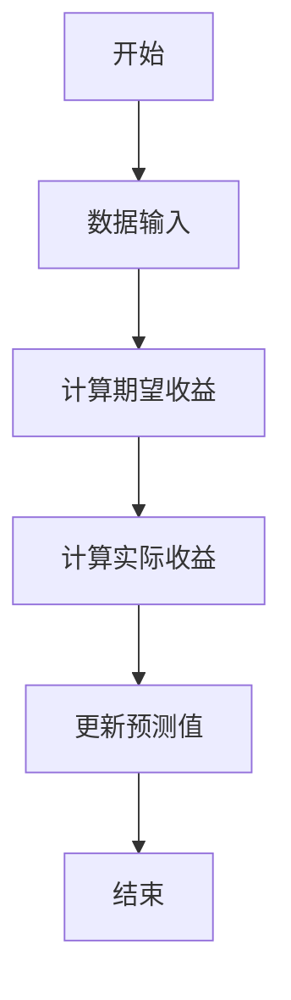
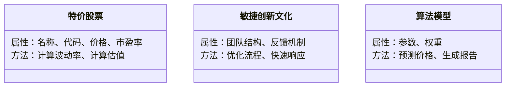

                 


# 特价股票与公司敏捷创新文化的深度分析方法

## 关键词：特价股票、敏捷创新、公司文化、股票分析、算法模型

## 摘要：  
本文通过分析特价股票的市场特征和公司敏捷创新文化的内在联系，结合数学模型和算法，探讨如何利用敏捷创新方法优化特价股票分析流程。文章从背景介绍、核心概念、算法原理、系统架构设计、项目实战到最佳实践，层层深入，为读者提供全面的分析框架和实践指导。

---

## 第1章：特价股票与敏捷创新文化概述

### 1.1 特价股票的定义与特征

#### 1.1.1 特价股票的定义  
特价股票通常指市盈率低、市值小、股价波动较大的股票，具有较高的投资潜力，但也伴随着较高的风险。

#### 1.1.2 特价股票的市场特征  
- **低估值**：市盈率、市净率低于行业平均水平。  
- **高波动性**：股价波动频繁，受市场情绪影响较大。  
- **小盘股**：多为中小型企业，市场关注度较低。  

#### 1.1.3 特价股票的投资价值  
- **潜在收益**：低价股票可能因公司基本面改善而上涨。  
- **风险较高**：市场波动可能导致较大损失。  

### 1.2 敏捷创新文化的定义与构成

#### 1.2.1 敏捷创新文化的定义  
敏捷创新是一种以快速迭代、灵活调整为核心的创新模式，强调通过小步快跑的方式实现创新目标。

#### 1.2.2 敏捷创新的核心要素  
- **迭代开发**：将项目分解为小模块，逐步开发和验证。  
- **用户反馈**：通过快速反馈机制优化产品和服务。  
- **团队协作**：强调跨部门协作，提升效率。  

#### 1.2.3 敏捷创新与传统创新的对比  
| 对比维度 | 敏捷创新 | 传统创新 |
|----------|----------|----------|
| 开发周期 | 短周期、快迭代 | 长周期、一次性 |
| 反馈机制 | 强调用户反馈 | 偏向内部评估 |
| 灵活性   | 高度灵活 | 较低灵活性 |

### 1.3 特价股票与敏捷创新的关联性

#### 1.3.1 特价股票市场的动态性  
特价股票市场波动剧烈，需要快速响应市场变化，敏捷创新的快速迭代特点正好契合这一需求。

#### 1.3.2 敏捷创新对企业竞争力的影响  
- 通过敏捷创新，企业能够更快适应市场变化，提升竞争力。  
- 敏捷创新文化有助于企业发现新的投资机会，优化资产配置。  

---

## 第2章：特价股票的特征分析

### 2.1 特价股票的市场表现

#### 2.1.1 市场波动对特价股票的影响  
- **宏观经济因素**：经济波动、政策变化等会影响特价股票价格。  
- **市场情绪**：投资者情绪波动会导致股价短期剧烈波动。  

#### 2.1.2 特价股票的周期性分析  
- 特价股票价格波动呈现周期性，通常与市场整体波动相关。  

### 2.2 特价股票的投资者行为

#### 2.2.1 投资者心理对股价的影响  
- 投资者情绪波动会导致股价短期波动，尤其是在市场恐慌时，特价股票可能被抛售。  

#### 2.2.2 投资策略的多样性  
- **价值投资**：寻找被低估的股票，长期持有。  
- **短期交易**：通过高频交易捕捉短期价格波动。  

---

## 第3章：敏捷创新文化的结构与功能

### 3.1 敏捷创新的核心要素

#### 3.1.1 迭代开发  
- 迭代开发将项目分解为多个小周期，每个周期结束时交付可运行的版本，便于快速验证和调整。  

#### 3.1.2 用户反馈的快速响应  
- 敏捷创新通过持续收集用户反馈，快速调整产品方向，确保产品与市场需求一致。  

#### 3.1.3 团队协作  
- 跨部门协作和扁平化管理是敏捷创新的重要特点，能够提高团队效率和创新能力。  

### 3.2 敏捷创新对企业竞争力的提升

#### 3.2.1 创新效率的提升  
- 通过快速迭代和反馈，企业能够更快地推出新产品或改进现有产品。  

#### 3.2.2 市场适应能力的增强  
- 敏捷创新使企业能够更快地适应市场变化，抓住新兴机会。  

---

## 第4章：基于敏捷创新的股票分析算法

### 4.1 算法原理

#### 4.1.1 算法的数学模型  
$$ P(t) = P(t-1) + \alpha \cdot (R(t) - E[R(t)]) $$  
其中：  
- $P(t)$ 表示第 $t$ 时刻的股票价格预测值。  
- $R(t)$ 表示第 $t$ 时刻的实际收益率。  
- $E[R(t)]$ 表示第 $t$ 时刻的期望收益率。  
- $\alpha$ 表示调整系数，通常取值在 0 到 1 之间。  

#### 4.1.2 算法流程图  


---

## 第5章：系统分析与架构设计

### 5.1 系统功能设计

#### 5.1.1 领域模型（Mermaid 类图）  


### 5.2 系统架构设计

#### 5.2.1 系统架构（Mermaid 架构图）  


### 5.3 系统交互设计

#### 5.3.1 系统交互流程（Mermaid 序列图）  
```mermaid
sequenceDiagram
    用户 --> 系统：输入股票代码
    系统 --> 数据库：查询股票信息
    数据库 --> 系统：返回股票信息
    系统 --> 算法模块：调用预测算法
    算法模块 --> 系统：返回预测结果
    系统 --> 用户：显示分析结果
```

---

## 第6章：项目实战

### 6.1 环境安装

#### 6.1.1 安装 Python 和相关库  
```bash
pip install numpy pandas matplotlib
```

### 6.2 核心实现代码

#### 6.2.1 特价股票数据分析  
```python
import pandas as pd
import numpy as np

# 数据加载
df = pd.read_csv('stocks.csv')

# 计算波动率
df['波动率'] = df['价格'].diff().std()

# 计算估值
df['市盈率'] = df['收益'] / df['价格']
```

#### 6.2.2 敏捷创新文化评估  
```python
import networkx as nx

# 构建团队协作网络
G = nx.DiGraph()
G.add_edge('开发团队', '测试团队')
G.add_edge('测试团队', '产品团队')
nx.draw(G, with_labels=True)
```

---

## 第7章：总结与展望

### 7.1 最佳实践

#### 7.1.1 投资策略  
- 结合价值投资和短期交易，灵活调整投资组合。  

#### 7.1.2 系统优化  
- 定期更新算法模型，适应市场变化。  

### 7.2 小结  
本文通过分析特价股票的市场特征和敏捷创新文化的内在联系，结合数学模型和算法，为投资者和企业提供了一种新的分析框架和实践方法。

### 7.3 注意事项  
- 投资有风险，需谨慎决策。  
- 算法模型需根据市场变化及时调整。  

### 7.4 拓展阅读  
- 《股票投资的艺术》  
- 《敏捷开发实践指南》  

---

## 作者：AI天才研究院 & 禅与计算机程序设计艺术

