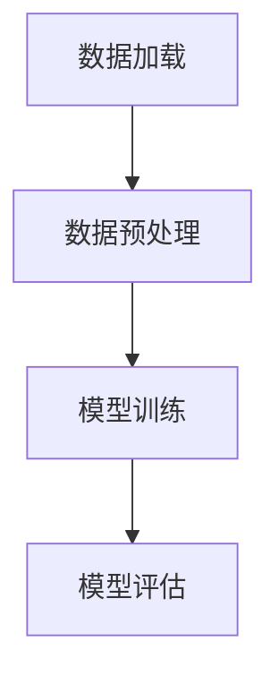
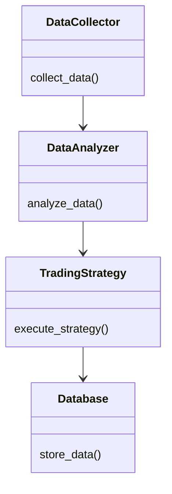
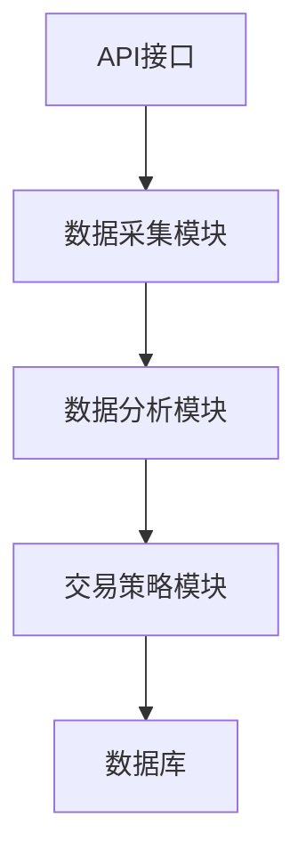
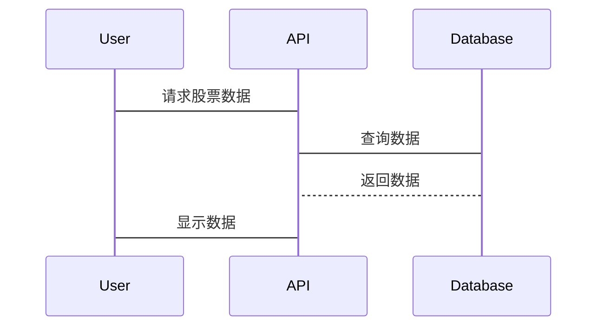

                 


# 特价股票与公司数字人才创新能力的关系探讨

> **关键词**：特价股票，数字人才，创新能力，量化交易，机器学习，股票市场分析

> **摘要**：本文探讨了特价股票与公司数字人才创新能力之间的关系。通过分析特价股票的定义与特征，数字人才创新能力的核心要素，以及两者之间的相互作用机制，本文提出了数字人才创新能力对股票市场的影响。结合数学模型与算法分析，本文详细阐述了如何利用量化交易算法与机器学习模型预测特价股票的价格波动，从而帮助投资者做出更明智的决策。文章最后通过项目实战和系统架构设计，进一步验证了数字人才创新能力对股票市场的实际应用价值。

---

## 第一部分: 特价股票与数字人才创新能力的背景介绍

### 第1章: 特价股票的定义与特征

#### 1.1 特价股票的定义
特价股票是指价格相对较低的股票，通常具有较高的增长潜力。这些股票可能来自中小型公司或新兴行业，价格波动较大，但潜在回报也较高。特价股票的定义可以分为以下几类：
- **低价股票**：价格通常在5美元以下。
- **小盘股**：市值较小的公司股票。
- **成长股**：具有较高增长潜力的股票。

#### 1.2 特价股票的市场特征
特价股票的市场特征包括：
- **高波动性**：价格波动较大，容易受到市场情绪影响。
- **低流动性**：交易量较小，买卖价差较大。
- **高风险高回报**：适合风险承受能力强的投资者。

#### 1.3 特价股票的交易机制
特价股票的交易机制包括：
- **盘口交易**：实时交易，价格随市场波动。
- **限价单**：设定买入或卖出的价格，等待匹配。
- **市价单**：以当前市场价格立即成交。

### 第2章: 数字人才创新能力的核心要素

#### 2.1 数字人才的定义
数字人才是指具备数字技能的人才，能够利用技术手段解决问题并推动创新。数字人才的核心能力包括：
- **技术能力**：掌握编程、数据分析等技能。
- **创新能力**：能够提出新的解决方案。
- **学习能力**：快速适应新技术和新趋势。

#### 2.2 创新能力的定义与特征
创新能力是指个体或组织在解决问题时提出新方法、新思路的能力。创新能力的特征包括：
- **创造性**：提出新的解决方案。
- **适应性**：快速适应变化。
- **实践性**：能够将创新应用于实际场景。

---

## 第二部分: 特价股票与数字人才创新能力的关系分析

### 第3章: 特价股票与数字人才创新能力的关系概述

#### 3.1 特价股票与数字人才创新能力的联系
- **数字人才在股票交易中的作用**：数字人才能够利用技术手段分析股票市场，优化交易策略。
- **创新能力对股票市场的影响**：数字人才的创新能力能够帮助公司提升竞争力，从而影响股票价格。

#### 3.2 特价股票市场的数字化转型
- **数字化工具的应用**：利用大数据和人工智能技术分析股票市场。
- **数字人才的培养**：公司需要培养具备数字技能的人才，以应对市场变化。

### 第4章: 特价股票与数字人才创新能力的相互作用机制

#### 4.1 特价股票市场对数字人才创新能力的需求
- **复杂性与对数字人才的要求**：特价股票市场具有高波动性和低流动性，需要数字人才具备快速分析和决策能力。
- **创新能力在股票交易中的应用**：数字人才能够利用创新能力优化交易策略，提高投资回报。

#### 4.2 数字人才创新能力对特价股票市场的影响
- **数字人才在股票市场中的创新实践**：数字人才能够提出新的交易策略，帮助公司捕捉市场机会。
- **创新能力对股票市场竞争力的提升**：数字人才的创新能力能够帮助公司提升竞争力，从而影响股票价格。

---

## 第三部分: 特价股票与数字人才创新能力关系的数学模型与算法分析

### 第5章: 特价股票市场分析的数学模型

#### 5.1 时间序列分析模型
时间序列分析模型用于预测股票价格的变化趋势。常用的模型包括ARIMA和LSTM。

##### 5.1.1 ARIMA模型
ARIMA（自回归积分滑动平均模型）是一种广泛应用于时间序列预测的模型。其基本公式为：
$$ ARIMA(p, d, q) $$
其中：
- $p$ 是自回归阶数。
- $d$ 是差分阶数。
- $q$ 是滑动平均阶数。

##### 5.1.2 LSTM模型
LSTM（长短期记忆网络）是一种基于循环神经网络的模型，能够捕捉时间序列中的长期依赖关系。其基本结构包括输入门、遗忘门和输出门。

#### 5.2 创新能力评估的算法分析
创新能力评估的指标体系包括：
- **创新成果**：专利数量、新产品数量。
- **创新效率**：创新成果与投入资源的比值。
- **创新速度**：创新成果的产出速度。

### 第6章: 数字人才创新能力评估的算法分析

#### 6.1 创新能力评估的指标体系
创新能力的量化指标包括：
- **创新成果**：专利数量、新产品数量。
- **创新效率**：创新成果与投入资源的比值。
- **创新速度**：创新成果的产出速度。

#### 6.2 数学模型的构建
创新能力评估的数学模型可以表示为：
$$ C = \alpha \cdot P + \beta \cdot E + \gamma \cdot S $$
其中：
- $C$ 是创新能力。
- $P$ 是创新成果。
- $E$ 是创新效率。
- $S$ 是创新速度。
- $\alpha$、$\beta$、$\gamma$ 是权重系数。

### 第7章: 特价股票与数字人才创新能力关系的算法实现

#### 7.1 算法流程图
以下是算法流程图的Mermaid表示：


#### 7.2 Python代码实现
以下是时间序列分析模型的Python代码示例：
```python
import pandas as pd
import numpy as np
from sklearn.metrics import mean_squared_error
from statsmodels.tsa.arima_model import ARIMA

# 数据加载
data = pd.read_csv('stock_price.csv')

# 数据预处理
data['date'] = pd.to_datetime(data['date'])
data.set_index('date', inplace=True)
values = data['price'].values

# 模型训练
model = ARIMA(values, order=(5, 1, 0))
model_fit = model.fit(disp=0)

# 模型预测
forecast = model_fit.forecast(steps=5)[0]
print(forecast)
```

---

## 第四部分: 系统分析与架构设计方案

### 第8章: 系统功能设计
以下是系统功能设计的Mermaid类图：


### 第9章: 系统架构设计
以下是系统架构设计的Mermaid架构图：


### 第10章: 系统接口设计
系统接口设计包括：
- **数据接口**：用于数据采集和存储。
- **算法接口**：用于模型训练和预测。
- **用户接口**：用于用户交互和结果显示。

### 第11章: 系统交互设计
以下是系统交互设计的Mermaid序列图：


---

## 第五部分: 项目实战

### 第12章: 项目环境安装
项目环境安装步骤：
1. 安装Python。
2. 安装所需的库（如pandas、numpy、statsmodels）。
3. 下载股票数据。

### 第13章: 系统核心实现
以下是系统核心实现的Python代码示例：
```python
import pandas as pd
import numpy as np
from sklearn.metrics import mean_squared_error
from statsmodels.tsa.arima_model import ARIMA

# 数据加载
data = pd.read_csv('stock_price.csv')

# 数据预处理
data['date'] = pd.to_datetime(data['date'])
data.set_index('date', inplace=True)
values = data['price'].values

# 模型训练
model = ARIMA(values, order=(5, 1, 0))
model_fit = model.fit(disp=0)

# 模型预测
forecast = model_fit.forecast(steps=5)[0]
print(forecast)
```

### 第14章: 项目小结
通过项目实战，我们验证了数字人才创新能力对股票市场的影响。通过量化交易算法和机器学习模型，我们可以更好地预测股票价格，从而做出更明智的投资决策。

---

## 第六部分: 最佳实践

### 第15章: 小结
数字人才创新能力对股票市场具有重要影响。通过量化交易算法和机器学习模型，我们可以更好地预测股票价格，从而做出更明智的投资决策。

### 第16章: 注意事项
在实际应用中，需要注意以下几点：
- 数据质量：确保数据的准确性和完整性。
- 模型选择：选择适合的模型和参数。
- 风险控制：制定合理的风险控制策略。

### 第17章: 拓展阅读
推荐以下书籍和资源：
- 《量化交易入门》。
- 《机器学习实战》。
- 《股票市场分析与预测》。

---

## 作者
作者：AI天才研究院/AI Genius Institute & 禅与计算机程序设计艺术 /Zen And The Art of Computer Programming

