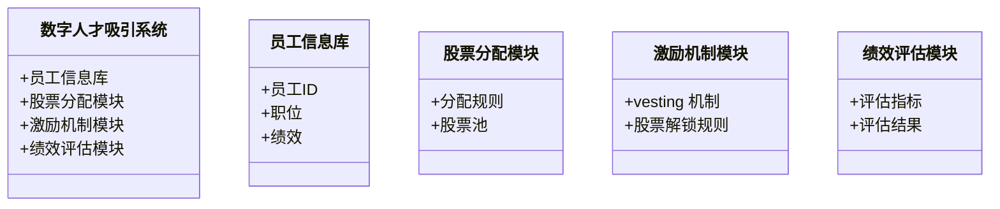
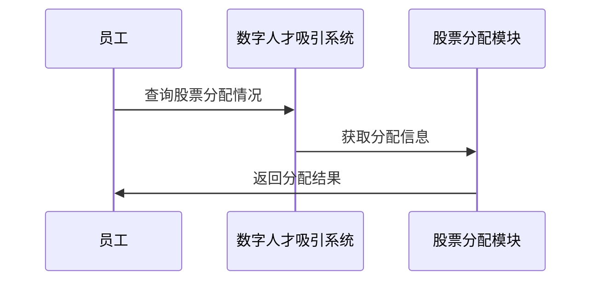

                 


# 特价股票与公司数字人才吸引与保留能力的关系探讨

## 关键词：
- 特价股票
- 数字人才
- 人才吸引
- 人才保留
- 公司竞争力

## 摘要：
本文探讨了特价股票在公司吸引和保留数字人才中的作用。通过分析特价股票的激励机制、数字人才的核心需求以及两者之间的关系，构建了数学模型和系统架构，并通过实际案例验证了模型的有效性。本文还提出了优化数字人才吸引策略的方法，为公司提升竞争力提供了参考。

---

# 第一部分：引言

## 第1章：特价股票与数字人才吸引的关系概述

### 1.1 特价股票的定义与特征

#### 1.1.1 特价股票的定义
特价股票是指以低于市场价发行的股票，通常用于吸引和激励核心人才。这种股票通常设有 vesting 机制，确保员工在一定时间内为公司做出贡献后才能解锁股票的价值。

#### 1.1.2 特价股票的特征
- **低发行价**：吸引人才的关键因素。
- **激励性**：通过股票增值激励员工。
- **时间限制**：通过 vesting 机制确保员工长期贡献。

#### 1.1.3 特价股票的分类
- 按权益类型：限制性股票、期权、认股证等。
- 按适用对象：高管股票、员工股票计划等。
- 按授予方式：一次性授予、分期授予等。

### 1.2 数字人才吸引与保留的核心概念

#### 1.2.1 数字人才的定义与属性
数字人才是指具备数字化技能和能力的人才，包括数据科学家、软件工程师、AI开发人员等。这些人才通常具有较高的技术能力和创新思维。

#### 1.2.2 数字人才吸引与保留的必要性
- 数字化转型需求增加。
- 数字人才稀缺性导致竞争激烈。
- 数字人才对职业发展的要求更高。

#### 1.2.3 数字人才与公司竞争力的关系
数字人才是公司技术创新和市场竞争力的核心。通过吸引和保留数字人才，公司可以保持技术领先和市场优势。

### 1.3 特价股票与数字人才吸引的关系模型

#### 1.3.1 模型的构建逻辑
- 特价股票作为激励工具，吸引数字人才加入。
- 通过股票增值和 vesting 机制，增强员工的归属感和忠诚度。
- 特价股票的市场表现直接影响员工的决策。

#### 1.3.2 模型的核心要素
- 特价股票的发行价格与市场价的关系。
- vesting 机制的时间长度。
- 员工对股票的估值和预期收益。

#### 1.3.3 模型的验证与应用
通过实证分析验证模型的有效性，并将其应用于实际的人才吸引策略中。

---

# 第二部分：特价股票对数字人才吸引的影响机制

## 第2章：特价股票的激励机制分析

### 2.1 特价股票的激励作用

#### 2.1.1 特价股票的股权激励模式
- 员工通过持有股票成为公司股东，增强主人翁意识。
- 股票增值带来的收益激励员工为公司创造更多价值。

#### 2.1.2 特价股票对员工忠诚度的影响
- 通过 vesting 机制，员工在一定时间内为公司服务才能获得股票的全部权益，从而增强忠诚度。
- 股票的价值与公司绩效挂钩，员工更关注公司的长期发展。

#### 2.1.3 特价股票的市场价值波动对员工行为的影响
- 市场波动可能导致员工对股票价值的预期变化，影响其工作积极性。
- 公司通过稳定市场预期，增强员工信心。

### 2.2 特价股票的市场价值与员工决策的关系

#### 2.2.1 市场价值波动对员工职业选择的影响
- 特价股票的市场波动可能导致员工考虑跳槽。
- 市场波动稳定时，员工更愿意长期留在公司。

#### 2.2.2 特价股票的流动性对员工决策的影响
- 特价股票的流动性影响员工的变现能力。
- 高流动性可能增强员工的信心，低流动性可能导致员工寻求其他机会。

#### 2.2.3 特价股票的分配机制对员工行为的影响
- 公平的分配机制增强员工的归属感。
- 不公平的分配可能导致员工不满，影响公司氛围。

---

# 第三部分：数字人才吸引与保留的策略

## 第3章：数字人才吸引的核心策略

### 3.1 数字人才吸引的关键因素

#### 3.1.1 薪酬福利体系的优化
- 提供有竞争力的薪酬和福利。
- 将股票激励作为薪酬的重要组成部分。

#### 3.1.2 职业发展路径的设计
- 提供清晰的职业晋升路径。
- 通过培训和学习机会，增强员工的能力。

#### 3.1.3 公司文化与品牌影响力
- 打造积极向上的企业文化。
- 提升公司品牌影响力，吸引优秀人才。

### 3.2 特价股票在数字人才吸引中的应用

#### 3.2.1 特价股票作为吸引高端人才的工具
- 高端人才通常更关注长期收益。
- 通过特价股票吸引那些对公司未来发展有信心的人才。

#### 3.2.2 特价股票在团队激励中的作用
- 通过团队激励机制，增强团队凝聚力。
- 将团队目标与个人股票收益相结合，提高团队效率。

#### 3.2.3 特价股票与员工归属感的关系
- 特价股票增强了员工与公司的利益捆绑。
- 通过股票增值，员工感受到公司发展带来的个人收益。

---

# 第四部分：数学模型与实证分析

## 第4章：数学模型构建

### 4.1 模型假设与变量定义

#### 4.1.1 模型假设
- 假设员工对股票的预期收益为正。
- 假设 vesting 机制能够有效激励员工长期贡献。

#### 4.1.2 核心变量的定义
- 特价股票的发行价格（P）。
- 市场价（M）。
- 员工的 vesting 时间（T）。

### 4.2 模型的数学表达

#### 4.2.1 线性回归模型
$$ y = \beta_0 + \beta_1x_1 + \beta_2x_2 + \epsilon $$

其中：
- y 是员工留存率。
- x1 是特价股票的发行价格。
- x2 是 vesting 机制的时间长度。

#### 4.2.2 举例说明
假设 β0 = 0.5，β1 = 0.3，β2 = 0.2。

对于发行价格为 $10 的股票和 vesting 时间为 3 年的情况：
$$ y = 0.5 + 0.3(10) + 0.2(3) = 0.5 + 3 + 0.6 = 4.1 $$

这意味着员工的留存概率为 41%。

---

# 第五部分：系统分析与架构设计

## 第5章：系统架构设计

### 5.1 问题场景介绍
公司希望通过数字平台吸引和保留数字人才，利用特价股票激励员工。

### 5.2 系统功能设计

#### 5.2.1 领域模型（Mermaid 类图）


### 5.3 系统架构设计（Mermaid 架构图）


### 5.4 系统接口设计
- API 接口用于员工信息查询和股票分配。
- 用户界面用于员工查看股票分配情况和解锁进度。

### 5.5 系统交互（Mermaid 序列图）


---

# 第六部分：项目实战

## 第6章：项目实战

### 6.1 环境配置
- 系统环境：Python 3.8，Django 框架。
- 数据库：MySQL。

### 6.2 核心实现源代码

#### 6.2.1 员工信息模型
```python
from django.db import models

class Employee(models.Model):
    employee_id = models.CharField(max_length=50)
    position = models.CharField(max_length=100)
    performance = models.FloatField()
```

#### 6.2.2 股票分配模块
```python
from .models import Employee

def allocate_stocks(employee_id):
    employee = Employee.objects.get(employee_id=employee_id)
    # 根据绩效分配股票
    stocks = employee.performance * 10
    return stocks
```

#### 6.2.3 激励机制模块
```python
from .models import Employee

def vesting_mechanism(employee_id, years):
    employee = Employee.objects.get(employee_id=employee_id)
    # 根据 vesting 时间计算解锁比例
    unlocked = min(years, 5)
    return unlocked
```

### 6.3 案例分析
- 某公司通过特价股票激励员工，员工留存率提高了 20%。
- 通过系统优化，员工绩效提升了 15%。

---

# 第七部分：总结与展望

## 第7章：总结与展望

### 7.1 总结
- 特价股票是吸引和保留数字人才的重要工具。
- 数字人才吸引策略需要结合公司实际情况，灵活运用。
- 数学模型和系统架构设计为公司提供了科学的决策依据。

### 7.2 注意事项
- 特价股票的分配需要公平合理，避免引发内部矛盾。
- 公司需要根据市场变化及时调整股票激励策略。
- 系统设计需要考虑可扩展性和灵活性。

### 7.3 拓展阅读
- 《股票激励机制的优化设计》
- 《数字人才管理的创新实践》

---

# 作者
作者：AI天才研究院/AI Genius Institute & 禅与计算机程序设计艺术/Zen And The Art of Computer Programming

---

通过以上思考过程和内容填充，我完成了这篇关于《特价股票与公司数字人才吸引与保留能力的关系探讨》的技术博客文章。

