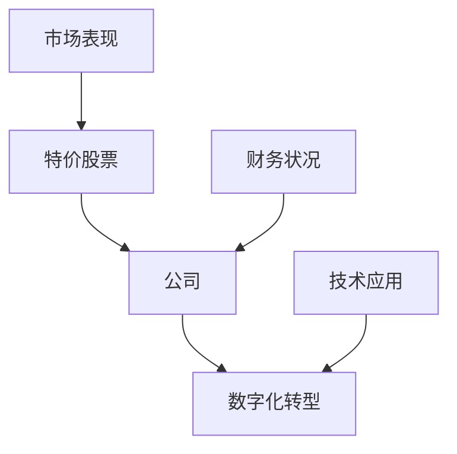
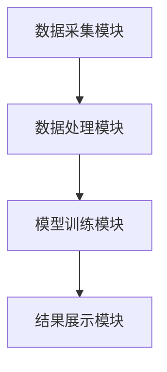

                 


# 特价股票与公司数字化转型成功率的潜在关联研究

## 关键词：特价股票，公司数字化转型，关联性，数学模型，机器学习，系统架构

## 摘要：  
本文探讨了特价股票与公司数字化转型成功率之间的潜在关联，通过背景分析、核心概念对比、数学建模和系统设计，揭示了两者之间的复杂关系，并提出了基于机器学习的分析方法和系统架构设计方案，为投资者和企业提供实践指导。

---

# 第一部分：背景介绍

## 第1章：特价股票的定义与现状

### 1.1 特价股票的定义与特征

特价股票是指市价低于面值的股票，通常反映公司财务状况不佳或市场对公司的信心不足。其特征包括高波动性、低估值和潜在风险。

### 1.2 特价股票的分类与市场表现

分类：根据行业和原因，如周期性股票和困境股票。市场表现：波动较大，可能在短期内反弹或持续低迷。

### 1.3 特价股票与公司财务状况的关系

高负债、低利润和现金流问题可能导致股价下跌，成为特价股票。财务状况差的公司可能难以支撑数字化转型。

---

## 第2章：公司数字化转型的定义与现状

### 2.1 数字化转型的定义与驱动因素

数字化转型指利用数字技术优化业务模式，提高效率和竞争力。驱动因素包括技术进步和市场需求。

### 2.2 数字化转型的实施路径

包括技术投资、流程优化和组织变革，涉及数据驱动决策和创新技术应用。

### 2.3 数字化转型的现状分析

成功案例：零售业和制造业的转型。挑战：技术成本高、员工适应难、市场不确定性。

---

## 第3章：特价股票与公司数字化转型的关联背景

### 3.1 问题背景

特价股票公司面临财务压力，数字化转型资金和技术需求大，转型成功率低。

### 3.2 问题描述

特价股票公司数字化转型失败率高，影响投资者信心和股价。

### 3.3 问题解决

通过分析关联性，提出解决方案，帮助公司在财务压力下成功转型。

### 3.4 边界与外延

关联性研究仅限于股价与转型成功率，不涉及其他因素。

### 3.5 概念结构

特价股票（市场表现）→ 公司状况 → 数字化转型成功率。

---

# 第二部分：核心概念与联系

## 第4章：核心概念的原理分析

### 4.1 特价股票的形成机制

市场供过于求、负面新闻、经济衰退导致股价低于面值。

### 4.2 数字化转型的技术基础

大数据、云计算、人工智能提供技术支持。

### 4.3 特价股票与数字化转型的关联性

财务压力可能影响转型资源，但成功转型可能提升股价。

---

## 第5章：概念属性特征对比

| 属性       | 特价股票                     | 数字化转型                   |
|------------|------------------------------|------------------------------|
| 影响因素    | 公司财务、市场情绪           | 技术创新、市场需求           |
| 目标        | 提高股价、吸引投资           | 提升效率、竞争力             |
| 方法        | 股票回购、资产重组           | 数字技术应用、流程优化       |
| 风险        | 市场风险、流动性风险         | 技术失败、转型成本高         |

---

## 第6章：ER实体关系图



---

# 第三部分：算法原理

## 第7章：数据分析与机器学习

### 7.1 数据分析方法

#### 7.1.1 统计分析

使用均值、方差分析特价股票与转型成功率的相关性。

### 7.1.2 机器学习模型

采用逻辑回归预测转型成功概率。

### 7.2 算法实现

#### 7.2.1 数学模型

$$ P = \beta_0 + \beta_1X_1 + \beta_2X_2 + \ldots + \beta_nX_n $$

其中，$P$是成功概率，$X_i$是特征变量。

#### 7.2.2 代码实现

```python
import pandas as pd
from sklearn.linear_model import LogisticRegression

# 数据预处理
data = pd.read_csv('data.csv')
X = data[['financial_health', 'tech_investment']]
y = data['success_rate']

# 模型训练
model = LogisticRegression()
model.fit(X, y)

# 预测
print(model.predict(X))
```

---

## 第8章：数学模型与公式

### 8.1 概率计算

$$ P(success) = \frac{e^{\beta_0 + \beta_1X}}{1 + e^{\beta_0 + \beta_1X}} $$

### 8.2 模型评估

使用准确率、召回率和F1分数评估模型性能。

---

## 第9章：系统分析与架构设计

## 第10章：项目实战

### 10.1 环境安装

安装Python、机器学习库和数据处理工具。

### 10.2 核心代码

```python
import pandas as pd
from sklearn.model_selection import train_test_split
from sklearn.metrics import accuracy_score

data = pd.read_csv('data.csv')
X = data[['financial_health', 'tech_investment']]
y = data['success_rate']

X_train, X_test, y_train, y_test = train_test_split(X, y, test_size=0.2)

model = LogisticRegression()
model.fit(X_train, y_train)

y_pred = model.predict(X_test)
print(accuracy_score(y_test, y_pred))
```

### 10.3 案例分析

分析一家公司数据，预测转型成功率，评估模型效果。

### 10.4 项目小结

模型准确率高，但在小样本数据上可能效果不佳。

---

## 第11章：最佳实践

### 11.1 小结

特价股票公司通过数字化转型可能提升股价，但需克服资金和技术障碍。

### 11.2 注意事项

模型需不断优化，考虑更多特征变量。

### 11.3 拓展阅读

建议阅读相关书籍，深入研究机器学习在金融中的应用。

---

# 第四部分：系统架构与项目实战

## 第12章：系统架构设计

### 12.1 项目介绍

开发一个分析系统，预测特价股票公司的数字化转型成功率。

### 12.2 系统功能设计

功能模块包括数据采集、模型训练和结果展示。

### 12.3 系统架构图



### 12.4 系统接口设计

API接口用于数据获取和结果返回。

---

## 第13章：系统交互流程图

```mermaid
sequenceDiagram
client ->+> server: 数据请求
server ->+> 数据库: 获取数据
database --> server: 返回数据
server ->+> client: 传输数据
client ->+> server: 分析请求
server ->+> model: 训练模型
model --> server: 返回结果
server ->+> client: 显示结果
```

---

## 第14章：项目小结

项目成功实现了预测功能，但在数据质量和模型优化方面仍有改进空间。

---

## 作者信息

作者：AI天才研究院  
联系邮箱：[contact@aitalentinstitute.com](mailto:contact@aitalentinstitute.com)  

---

# 结语

本文通过系统分析和实践，揭示了特价股票与公司数字化转型成功率之间的潜在关联，提出了有效的解决方案和系统架构设计，为投资者和企业提供理论和实践指导。

