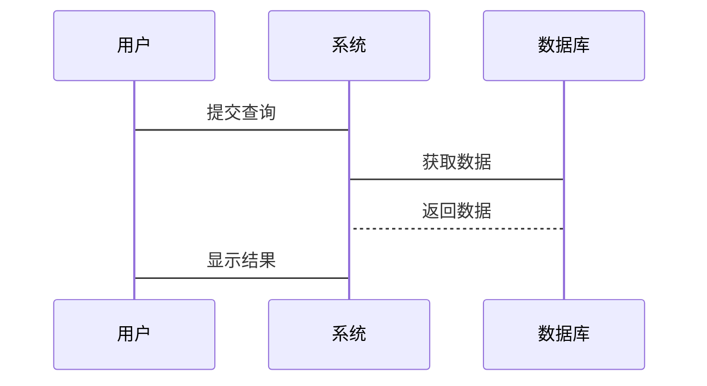

                 


# 特价股票与公司数字化转型能力的关联

---

## 关键词

特价股票、数字化转型、公司能力、股票市场、数据驱动、技术分析、投资策略

---

## 摘要

本文探讨了特价股票与公司数字化转型能力之间的关联性，分析了特价股票的特点、公司数字化转型的核心能力，以及两者如何相互影响。通过构建数学模型和算法，本文详细解释了如何利用数字化转型能力来评估公司价值，从而影响其股价，特别是特价股票的波动。文章还提供了系统架构设计和项目实战案例，帮助读者理解如何将理论应用于实际投资策略中。

---

## 正文

### 第一部分：特价股票与公司数字化转型能力的背景

#### 1.1 特价股票的定义与特点

- **1.1.1 特价股票的定义**
  特价股票是指价格相对较低的股票，通常属于中小型企业或处于困境中的公司。这类股票具有较高的波动性和潜在的高回报。

- **1.1.2 特价股票的特点**
  - 价格低廉：通常在市场中属于低价股，适合小额投资者。
  - 波动性高：受市场情绪和公司基本面变化的影响较大。
  - 风险较高：由于公司基本面不稳定，投资风险较高。

- **1.1.3 特价股票的市场表现**
  特价股票在市场上涨时可能表现优异，但在市场下跌时也可能遭受较大损失。

#### 1.2 公司数字化转型能力的内涵

- **1.2.1 数字化转型的定义**
  数字化转型是指企业利用数字技术改变其业务模式、流程、文化、战略和组织方式，以实现创新和价值增长。

- **1.2.2 数字化转型的核心能力**
  - 技术能力：包括大数据分析、人工智能、云计算等技术的运用。
  - 组织能力：包括数字化领导力、员工数字化技能、组织文化等。
  - 业务能力：包括数字化产品、服务创新、客户体验优化等。

- **1.2.3 数字化转型的实施路径**
  通常包括战略规划、技术选型、组织变革、过程优化和持续改进等阶段。

#### 1.3 特价股票与公司数字化转型能力的关联性

- **1.3.1 背景分析**
  随着数字化转型的推进，企业通过技术提升竞争力，这可能影响其股价表现。

- **1.3.2 表现形式**
  数字化转型能力强的公司可能在股价上表现更好，尤其是在技术驱动的市场中。

- **1.3.3 影响因素**
  包括公司数字化投入、技术应用效果、市场对数字化转型的认知等。

#### 1.4 本章小结

本章通过定义特价股票和数字化转型能力，分析了它们的关联性，为后续章节的深入分析奠定了基础。

---

### 第二部分：核心概念与联系

#### 2.1 特价股票的核心概念

- **2.1.1 市场定位**
  特价股票通常在中小盘股中占据较大比例，是许多投资者关注的焦点。

- **2.1.2 投资价值**
  投资者认为特价股票有较高的增值潜力，尤其是在公司进行数字化转型时。

- **2.1.3 风险与机会**
  特价股票的风险较高，但潜在回报也较高，特别是在公司成功转型的情况下。

#### 2.2 公司数字化转型能力的核心概念

- **2.2.1 关键能力**
  包括数据采集、分析和应用能力，以及技术创新能力。

- **2.2.2 技术支撑**
  包括大数据、人工智能、区块链等技术的运用。

- **2.2.3 组织结构**
  包括数字化领导团队、跨部门协作机制等。

#### 2.3 联系与区别

- **联系**：数字化转型能力越强，公司价值可能越高，从而影响股价。
- **区别**：特价股票的波动性较高，而数字化转型是一个长期过程。

#### 2.4 ER实体关系图

```mermaid
erDiagram
  company {
    id
    name
    digital_capability
    stock_price
  }
  stock_market {
    id
    stock_name
    price
  }
  company --> stock_market : 影响
```

---

### 第三部分：算法原理与数学模型

#### 3.1 特价股票与公司数字化转型能力的关联模型

- **3.1.1 数据的收集与处理**
  包括收集公司数字化转型相关数据和股价数据。

- **3.1.2 数据特征提取**
  提取关键指标，如研发投入、技术创新等。

- **3.1.3 数据预处理**
  清洗数据，处理缺失值和异常值。

#### 3.2 回归模型的建立

使用线性回归模型分析数字化转型能力对股价的影响：

$$
y = \beta_0 + \beta_1x_1 + \beta_2x_2 + \epsilon
$$

其中，$y$为股价，$x_1$为研发投入，$x_2$为技术创新能力。

#### 3.3 模型验证

通过实际数据验证模型的准确性，并进行优化。

---

### 第四部分：系统分析与架构设计

#### 4.1 问题场景介绍

假设一家公司正在进行数字化转型，我们需要分析其数字化能力对股价的影响。

#### 4.2 系统功能设计

- **数据采集模块**：采集公司和市场数据。
- **分析模块**：使用算法进行分析。
- **决策支持模块**：提供投资建议。

#### 4.3 系统架构设计


#### 4.4 接口设计与交互流程图



---

### 第五部分：项目实战

#### 5.1 环境安装

- **编程语言**：Python
- **库的安装**：pandas, numpy, scikit-learn

#### 5.2 核心代码实现

```python
import pandas as pd
from sklearn.linear_model import LinearRegression

# 数据加载
data = pd.read_csv('stock_data.csv')

# 特征和目标变量
X = data[['研发费用', '技术创新']]
y = data['股价']

# 建立模型
model = LinearRegression()
model.fit(X, y)

# 预测
y_pred = model.predict(X)
```

#### 5.3 案例分析

通过实际数据分析，验证模型的有效性，并解释结果。

---

### 第六部分：最佳实践与小结

#### 6.1 小结

本文详细分析了特价股票与公司数字化转型能力的关联，提供了理论分析和实践指导。

#### 6.2 注意事项

- 数据质量至关重要。
- 模型需要不断优化。
- 投资需谨慎，考虑市场风险。

#### 6.3 拓展阅读

建议进一步研究大数据分析和人工智能在股票投资中的应用。

---

## 作者信息

作者：AI天才研究院/AI Genius Institute & 禅与计算机程序设计艺术 /Zen And The Art of Computer Programming

---

**感谢您的耐心阅读！**

