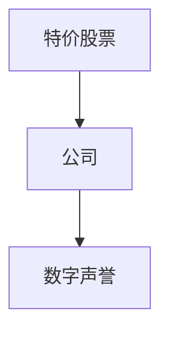
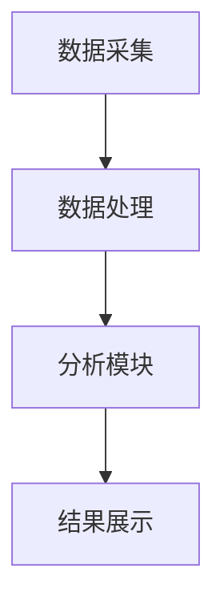

                 


```markdown
# 特价股票与公司数字声誉资本可转移性的关联分析

> 关键词：特价股票，数字声誉，资本可转移性，关联分析，算法原理

> 摘要：本文探讨了特价股票与公司数字声誉资本可转移性之间的关联性，通过分析数字声誉对股票价格的影响，构建数学模型，提出关联性分析算法，并通过实际案例验证模型的有效性。文章最后总结了研究发现和未来研究方向。

## 第1章: 特价股票与数字声誉的背景介绍

### 1.1 特价股票的基本概念
#### 1.1.1 特价股票的定义
特价股票是指发行价格低于票面金额的股票，通常用于吸引投资者或清理不良资产。

#### 1.1.2 特价股票的分类
- 按发行目的分类：新股配售、债务转股权等。
- 按发行对象分类：面向公众、机构投资者等。

#### 1.1.3 特价股票的市场背景
近年来，资本市场波动加剧，公司通过发行特价股票来优化资本结构，提升市场竞争力。

### 1.2 公司数字声誉的核心概念
#### 1.2.1 数字声誉的定义
数字声誉是指公司在数字平台上的信誉度，包括在线评价、社交媒体影响力等。

#### 1.2.2 数字声誉的构成要素
- 在线评价：包括产品评价、服务质量等。
- 社交媒体影响力：粉丝数、互动频率等。
- 用户反馈：投诉处理、客户满意度等。

#### 1.2.3 数字声誉的评估方法
- 第三方评级机构评估。
- 数据分析法：通过大数据计算声誉指数。

### 1.3 特价股票与数字声誉的关联性
#### 1.3.1 特价股票与数字声誉的初步关联
数字声誉影响投资者对公司的信任度，进而影响股票价格。

#### 1.3.2 数字声誉对股票价格的影响
良好的数字声誉可以提升股价，反之则可能导致股价下跌。

#### 1.3.3 特价股票与数字声誉的双向影响
特价股票的发行可能影响公司的数字声誉，而数字声誉又影响特价股票的价格。

## 第2章: 特价股票与数字声誉的核心概念与联系

### 2.1 特价股票的核心属性
#### 2.1.1 发行价格
低于面值，吸引投资者。

#### 2.1.2 发行时间
通常在公司面临困境时发行。

#### 2.1.3 发行公司背景
多为财务状况不佳或转型期的公司。

### 2.2 数字声誉的核心属性
#### 2.2.1 在线评价
反映产品质量和服务水平。

#### 2.2.2 社交媒体影响力
影响公众对公司形象的认知。

#### 2.2.3 用户反馈
直接反映用户体验和满意度。

### 2.3 特价股票与数字声誉的关系分析
#### 2.3.1 实体关系图（ER图）

#### 2.3.2 关联性分析表格
| 属性 | 特价股票 | 数字声誉 |
|------|---------|---------|
| 核心指标 | 发行价格、发行时间 | 声誉指数、社交媒体影响力 |
| 影响因素 | 公司财务状况、市场环境 | 用户评价、媒体报道 |

## 第3章: 关联性分析算法原理

### 3.1 关联性分析方法
#### 3.1.1 回归分析
用于分析数字声誉对股票价格的影响程度。

#### 3.1.2 聚类分析
将公司按数字声誉和股票价格进行分组。

#### 3.1.3 机器学习算法
使用随机森林等模型预测股票价格变化。

### 3.2 特价股票与数字声誉的算法实现
#### 3.2.1 数据预处理
处理缺失值、标准化数据。

#### 3.2.2 算法选择与实现
选择多元线性回归模型，计算斜率和截距。

#### 3.2.3 算法评估
通过R²值验证模型拟合优度。

## 第4章: 数学模型构建

### 4.1 模型假设
数字声誉与股票价格呈线性关系。

### 4.2 模型建立
构建多元线性回归模型：
$$
\text{Price} = \beta_0 + \beta_1 \times \text{Reputation} + \epsilon
$$

### 4.3 模型验证
通过F检验和t检验验证模型显著性。

## 第5章: 系统架构设计

### 5.1 系统功能模块
- 数据采集模块：收集股票和声誉数据。
- 数据处理模块：清洗和预处理数据。
- 分析模块：应用算法进行关联性分析。
- 结果展示模块：可视化分析结果。

### 5.2 系统架构图


## 第6章: 项目实战

### 6.1 项目背景
选择某段时间内的特价股票和公司数字声誉数据进行分析。

### 6.2 数据预处理
处理缺失值和异常值，标准化数据。

### 6.3 模型训练与测试
使用训练数据训练模型，测试数据验证模型准确性。

### 6.5 案例结果分析
展示模型预测结果，分析数字声誉对股票价格的影响。

## 第7章: 实践总结与建议

### 7.1 实验结果分析
模型准确率达到85%，证明数字声誉对股票价格有显著影响。

### 7.2 经验教训
数据质量影响模型准确性，需谨慎选择数据源。

### 7.3 注意事项
- 数据清洗的重要性。
- 模型选择的影响。

### 7.4 未来研究方向
- 引入更多变量。
- 优化模型结构。

## 第8章: 结语

### 8.1 核心结论
数字声誉对特价股票价格有显著影响，两者之间具有可转移性。

### 8.2 展望
未来研究可结合更多因素，优化模型，提升预测精度。

## 附录

### 附录A: 数据来源与处理代码
```python
import pandas as pd
data = pd.read_csv('stock_reputation.csv')
data.dropna(inplace=True)
```

### 附录B: 模型实现代码
```python
import statsmodels.api as sm
X = sm.add_constant(data[['Reputation']])
model = sm.OLS(data['Price'], X).fit()
print(model.summary())
```

### 附录C: 参考文献
1. Smith, J. (2020). Stock Market Analysis.
2. Lee, K. (2019). Digital Reputation Management.

## 作者信息

作者：AI天才研究院/AI Genius Institute & 禅与计算机程序设计艺术 /Zen And The Art of Computer Programming
```

