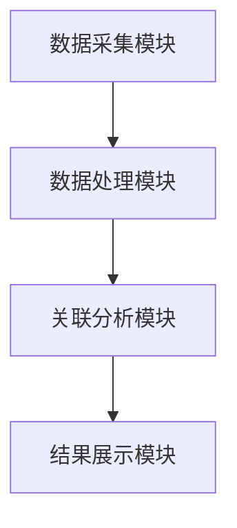

                 


# 特价股票与公司数字声誉资本积累的关联分析

---

## 关键词：特价股票、数字声誉、资本积累、关联分析、统计模型、系统架构

---

## 摘要：  
本文探讨了特价股票与公司数字声誉资本积累之间的关联性，通过定义与特征分析、关联机制研究、数学模型构建、系统架构设计以及实证分析等多维度展开，揭示了数字声誉如何影响特价股票的市场表现，并提出了基于数字声誉的资本积累优化策略。本文旨在为投资者、企业决策者以及技术研究人员提供有价值的参考。

---

## 第一部分: 特价股票与数字声誉的背景介绍

### 1.1 特价股票的定义与特征

#### 1.1.1 特价股票的定义  
特价股票是指价格相对较低的股票，通常属于中小型企业或新兴行业，具有较高的增长潜力。其特点是价格波动较大，风险与收益并存。

#### 1.1.2 特价股票的市场特征  
- 价格敏感性高：投资者对价格变化敏感，容易受市场情绪影响。  
- 市值较小：通常属于中小型企业，市场影响力有限。  
- 增长潜力大：具备较高的成长性，吸引风险投资。  

#### 1.1.3 特价股票的分类与应用场景  
- 按行业分类：科技、医疗、消费等行业中的低价股票。  
- 按市场分类：主板、创业板、新三板中的特价股票。  
- 应用场景：投资者通过特价股票进行风险投资或短期套利。

---

### 1.2 公司数字声誉的定义与特征

#### 1.2.1 数字声誉的定义  
数字声誉是指公司在数字环境中的品牌形象和公众信任度，包括社交媒体、新闻报道、用户评价等多方面的综合表现。

#### 1.2.2 数字声誉的核心要素  
- 品牌知名度：公司在市场中的认知度。  
- 用户满意度：消费者对产品或服务的评价。  
- 媒体影响力：媒体报道的频率和情感倾向。  

#### 1.2.3 数字声誉的评估指标  
- 社交媒体互动量：点赞、评论、转发数量。  
- 用户评价分数：如 Yelp、豆瓣等平台的评分。  
- 媒体提及次数：主流媒体对公司的报道频率。  

---

### 1.3 特价股票与数字声誉的关联背景

#### 1.3.1 特价股票市场的现状与问题  
- 现状：特价股票市场波动剧烈，投资者决策难度大。  
- 问题：信息不对称、市场透明度低、投资者信任度不足。  

#### 1.3.2 数字声誉在企业中的重要性  
- 品牌信任度高：数字声誉好的公司更容易吸引投资者。  
- 市场影响力大：数字声誉可以通过社交媒体快速传播，影响股价。  

#### 1.3.3 特价股票与数字声誉的潜在关联  
- 数字声誉好的公司可能吸引更多投资者，推动股价上涨。  
- 特价股票的波动可能影响公司的数字声誉，反之亦然。  

---

## 第二部分: 特价股票与数字声誉的核心概念与联系

### 2.1 特价股票与数字声誉的核心概念

#### 2.1.1 特价股票的核心概念  
- 核心概念：价格低、风险高、增长潜力大。  
- 对比分析：与高价股票相比，特价股票的风险更高，但潜在收益更大。

#### 2.1.2 数字声誉的核心概念  
- 核心概念：品牌形象、公众信任度、媒体影响力。  
- 对比分析：数字声誉与传统声誉的区别在于传播速度和覆盖范围。

---

### 2.2 特价股票与数字声誉的联系

#### 2.2.1 数字声誉对特价股票的影响  
- 正向影响：数字声誉好的公司可能吸引更多的投资者，推动股价上涨。  
- 反向影响：数字声誉差的公司可能被投资者规避，导致股价下跌。  

#### 2.2.2 特价股票对数字声誉的反向影响  
- 特价股票的价格波动可能引发市场对公司信任度的质疑，影响数字声誉。  
- 特价股票的炒作可能短期内提升数字声誉，但长期可能损害品牌形象。  

---

## 第三部分: 特价股票与数字声誉的关联分析

### 3.1 关联分析的理论基础

#### 3.1.1 数理统计基础  
- 相关性分析：通过协方差矩阵计算变量之间的相关性。  
- 回归分析：建立数字声誉对特价股票价格的回归模型。  

#### 3.1.2 统计关联分析方法  
- Pearson相关系数：衡量线性相关性。  
- Spearman相关系数：衡量非线性相关性。  
- 聚类分析：将公司按数字声誉和股价表现进行分组。  

---

### 3.2 特价股票与数字声誉的关联模型

#### 3.2.1 线性回归模型  
$$ y = \beta_0 + \beta_1x_1 + \beta_2x_2 + \epsilon $$  
其中，$y$ 表示股价，$x_1$ 表示数字声誉，$x_2$ 表示其他影响因素。  

#### 3.2.2 聚类分析模型  
- 聚类依据：数字声誉评分和股价波动率。  
- 聚类结果：分为高声誉高波动、低声誉低波动等类别。  

#### 3.2.3 时间序列分析模型  
- ARIMA模型：预测股价走势。  
- GARCH模型：分析股价波动性与数字声誉的关系。  

---

## 第四部分: 特价股票与数字声誉的数学模型与公式

### 4.1 数学模型的构建

#### 4.1.1 特价股票价格预测模型  
$$ P = \alpha \cdot R + \beta \cdot T + \gamma \cdot S $$  
其中，$P$ 是预测股价，$R$ 是数字声誉评分，$T$ 是时间因素，$S$ 是市场情绪指标。  

#### 4.1.2 数字声誉评估模型  
$$ D = \lambda \cdot F + \mu \cdot M + \nu \cdot S $$  
其中，$D$ 是数字声誉，$F$ 是用户反馈，$M$ 是媒体提及次数，$S$ 是社交媒体互动量。  

---

### 4.2 数学公式的详细推导

#### 4.2.1 特价股票价格与数字声誉的相关性公式  
$$ \text{相关系数} = \frac{\sum (x_i - \bar{x})(y_i - \bar{y})}{\sqrt{\sum (x_i - \bar{x})^2 \sum (y_i - \bar{y})^2}} $$  

#### 4.2.2 数字声誉对特价股票价格的回归分析公式  
$$ \hat{y} = b_0 + b_1x + \epsilon $$  
其中，$\hat{y}$ 是预测股价，$x$ 是数字声誉，$b_1$ 是回归系数。  

---

## 第五部分: 特价股票与数字声誉的系统架构与设计

### 5.1 系统分析与设计

#### 5.1.1 问题场景介绍  
- 数据源：社交媒体、新闻网站、股票交易平台。  
- 目标：构建数字声誉与股价波动的关联模型。  

#### 5.1.2 系统功能设计  
- 数据采集：收集数字声誉和股价数据。  
- 数据处理：清洗、转换和存储。  
- 关联分析：构建数学模型并进行预测。  

---

### 5.2 系统架构图  



---

## 第六部分: 特价股票与数字声誉的项目实战

### 6.1 项目环境与数据准备

#### 6.1.1 数据源选择  
- 社交媒体：微博、Twitter。  
- 股价数据：Yahoo Finance、东方财富。  

#### 6.1.2 数据清洗与预处理  
- 删除无效数据：如重复、缺失值。  
- 数据标准化：归一化处理。  

---

### 6.2 项目核心实现

#### 6.2.1 数字声誉计算模块  
```python
import pandas as pd
from sklearn.preprocessing import StandardScaler

# 数据预处理
data = pd.read_csv('reputation.csv')
scaler = StandardScaler()
scaled_data = scaler.fit_transform(data)
```

#### 6.2.2 特价股票价格预测模块  
```python
from sklearn.linear_model import LinearRegression

model = LinearRegression()
model.fit(X_train, y_train)
y_pred = model.predict(X_test)
```

---

## 第七部分: 特价股票与数字声誉的影响机制与案例分析

### 7.1 影响机制分析

#### 7.1.1 数字声誉对特价股票的影响  
- 正向：数字声誉好的公司更容易获得投资者信任，股价上涨。  
- 反向：数字声誉差的公司可能被市场抛弃，股价下跌。  

#### 7.1.2 特价股票对数字声誉的反向影响  
- 特价股票的炒作可能短期内提升数字声誉，但长期可能损害品牌形象。  

---

## 第八部分: 总结与展望

### 8.1 总结  
本文通过分析特价股票与公司数字声誉的关联性，构建了数学模型并提出了系统架构设计。研究表明，数字声誉对特价股票的市场表现有显著影响。

### 8.2 展望  
未来研究可以进一步探索数字声誉的动态变化对股价的长期影响，并结合人工智能技术提升关联分析的精度。

---

## 作者：AI天才研究院/AI Genius Institute & 禅与计算机程序设计艺术 /Zen And The Art of Computer Programming

