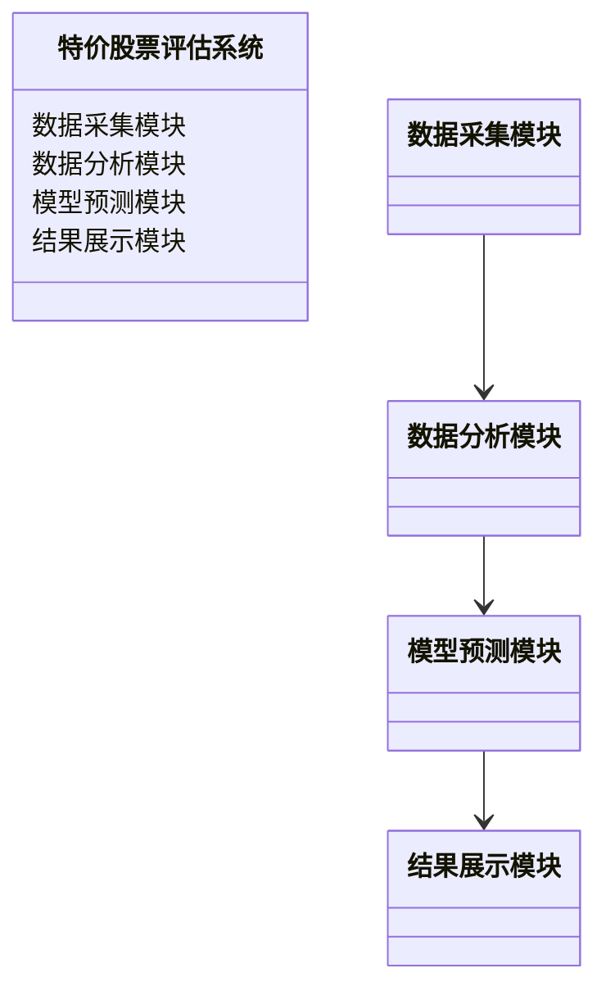

                 


# 特价股票与公司数据主权价值的评估

> **关键词**：特价股票、数据主权、价值评估、机器学习、系统架构

> **摘要**：本文深入探讨了特价股票与公司数据主权价值评估的核心概念、算法原理和系统架构设计。通过分析特价股票的市场特性、数据主权的法律与经济价值，结合数学模型和机器学习算法，构建了综合价值评估模型，并通过实际案例分析验证了模型的有效性。最后，提出了系统设计与实现方案，为投资者和企业提供了一套科学的决策支持工具。

---

## 第一部分: 特价股票与公司数据主权价值评估的背景与概念

### 第1章: 特价股票与公司数据主权价值评估的背景介绍

#### 1.1 特价股票的基本概念

##### 1.1.1 什么是特价股票
特价股票是指市场价格低于其内在价值的股票。这类股票通常被市场低估，具有较大的上涨潜力。从投资角度来看，特价股票是价值投资者的首选，因为它们提供了一个以较低价格买入优质资产的机会。

##### 1.1.2 特价股票的分类与特征
特价股票可以分为以下几类：
1. **价值型股票**：市盈率、市净率等估值指标低于行业平均水平。
2. **成长型股票**：虽然当前估值较高，但未来增长潜力巨大。
3. **周期性股票**：受经济周期影响较大的行业，如能源、原材料等。

##### 1.1.3 特价股票的市场定位与投资价值
特价股票的投资价值体现在其低估值和高增长潜力上。投资者通常通过基本面分析、技术分析和市场情绪分析来识别特价股票。

#### 1.2 公司数据主权价值的基本概念

##### 1.2.1 数据主权的定义与内涵
数据主权是指公司对其数据资产的合法所有权和控制权。它包括数据的使用权、收益权和处分权，是公司核心竞争力的重要组成部分。

##### 1.2.2 公司数据主权的核心要素
- 数据资产：包括结构化数据（如财务数据）和非结构化数据（如文档、图像）。
- 数据安全：确保数据的机密性、完整性和可用性。
- 数据治理：数据的生命周期管理，包括采集、存储、处理和销毁。

##### 1.2.3 数据主权与公司价值的关系
数据主权是公司价值的重要组成部分。拥有强大数据主权的公司能够更好地利用数据资产创造价值，提升市场竞争力。

#### 1.3 特价股票与公司数据主权价值评估的关联性

##### 1.3.1 特价股票市场与数据主权的相互作用
特价股票市场的波动性为公司数据主权价值的评估提供了动态分析的机会。通过分析市场对数据主权的定价，可以更好地理解数据资产的市场价值。

##### 1.3.2 数据主权对公司价值的影响机制
数据主权通过影响公司的盈利能力、市场竞争力和抗风险能力，进而影响股票的市场价格。强大的数据主权能够提升投资者对公司的信心，推动股价上涨。

##### 1.3.3 特价股票与数据主权价值评估的结合点
通过数据主权价值评估模型，投资者可以识别那些因数据资产低估而被市场忽视的特价股票，从而发现潜在的投资机会。

---

### 第2章: 特价股票与公司数据主权价值评估的核心概念

#### 2.1 特价股票的价值评估模型

##### 2.1.1 市场价值评估模型
市场价值评估模型基于市场数据，如市盈率（P/E）、市净率（P/B）等指标，评估股票的市场价值。

##### 2.1.2 内在价值评估模型
内在价值评估模型通过DCF（Discounted Cash Flow）模型等方法，评估股票的内在价值。

##### 2.1.3 数据主权价值的加成效应
数据主权价值通过加成效应影响股票的总价值。具体公式如下：

$$ \text{股票总价值} = \text{市场价值} + \text{数据主权价值} $$

#### 2.2 公司数据主权的量化方法

##### 2.2.1 数据资产的识别与分类
数据资产识别包括数据的采集、存储和处理。数据分类基于数据的重要性和敏感性，分为核心数据、重要数据和一般数据。

##### 2.2.2 数据资产的价值评估指标
数据资产的价值评估指标包括数据的使用价值、市场价值和战略价值。

##### 2.2.3 数据主权的法律与经济价值
数据主权的法律价值体现在对公司数据的合法所有权保护上；经济价值体现在数据资产的市场变现能力上。

#### 2.3 特价股票与数据主权价值评估的综合模型

##### 2.3.1 综合价值评估模型的构建
综合价值评估模型将市场价值和数据主权价值相结合，公式如下：

$$ \text{综合价值} = \alpha \times \text{市场价值} + \beta \times \text{数据主权价值} $$

其中，$\alpha$ 和 $\beta$ 是模型的权重系数。

##### 2.3.2 数据主权对股票价值的动态影响
数据主权通过影响公司的盈利能力和市场竞争力，动态调整股票的内在价值。

##### 2.3.3 模型的适用性与局限性
综合价值评估模型适用于数据主权价值显著的公司，但其局限性在于数据主权的量化难度较大。

---

### 第3章: 特价股票与公司数据主权价值评估的算法原理

#### 3.1 数据主权价值评估的数学模型

##### 3.1.1 数据资产价值的线性回归模型
线性回归模型用于预测数据资产的价值，公式如下：

$$ \text{数据资产价值} = a \times \text{数据量} + b \times \text{数据质量} + c \times \text{数据用途} $$

##### 3.1.2 数据主权的加权评分模型
加权评分模型通过多因素分析，计算数据主权的综合评分，公式如下：

$$ \text{数据主权评分} = \sum_{i=1}^{n} w_i \times x_i $$

其中，$w_i$ 是第$i$个因素的权重，$x_i$ 是第$i$个因素的评分。

##### 3.1.3 数据主权对股票价值的乘数效应公式
乘数效应公式用于评估数据主权对股票价值的放大效应，公式如下：

$$ \text{股票价值} = \text{基础价值} \times (1 + \text{数据主权乘数}) $$

---

#### 3.2 特价股票价值评估的机器学习算法

##### 3.2.1 基于数据主权的特征工程
特征工程包括数据清洗、特征选择和特征变换。数据主权相关的特征包括数据资产规模、数据质量评分和数据安全等级。

##### 3.2.2 数据主权价值的随机森林回归
随机森林回归用于预测数据主权价值，代码示例如下：

```python
from sklearn.ensemble import RandomForestRegressor
import pandas as pd

# 数据加载与预处理
data = pd.read_csv('data.csv')
X = data[['data_assets', 'data_quality', 'data_usage']]
y = data['data_value']

# 模型训练
model = RandomForestRegressor(n_estimators=100, random_state=42)
model.fit(X, y)

# 预测与评估
y_pred = model.predict(X)
print('预测数据价值:', y_pred)
```

##### 3.2.3 数据主权对股票价值的深度学习预测
深度学习模型用于预测股票价值，代码示例如下：

```python
import tensorflow as tf
from tensorflow.keras import layers

# 数据加载与预处理
data = pd.read_csv('stock_data.csv')
X = data[['market_value', 'data_sovereignty']]
y = data['stock_value']

# 模型构建
model = tf.keras.Sequential()
model.add(layers.Dense(64, activation='relu', input_shape=(2,)))
model.add(layers.Dense(1, activation='linear'))

model.compile(optimizer='adam', loss='mean_squared_error')

# 模型训练
model.fit(X, y, epochs=100, batch_size=32)

# 预测与评估
y_pred = model.predict(X)
print('预测股票价值:', y_pred)
```

---

#### 3.3 算法实现与代码示例

##### 3.3.1 数据主权价值评估的Python代码实现
代码实现数据主权价值的线性回归模型，如下所示：

```python
import statsmodels.api as sm

# 数据加载与预处理
data = pd.read_csv('data.csv')
X = data[['data_assets', 'data_quality']]
y = data['data_value']

# 模型训练
X = sm.add_constant(X)
model = sm.OLS(y, X).fit()

# 预测与评估
y_pred = model.predict(X)
print('预测数据价值:', y_pred)
```

##### 3.3.2 特价股票价值预测的机器学习模型代码
机器学习模型预测股票价值的代码示例如下：

```python
from sklearn.linear_model import LinearRegression
import pandas as pd

# 数据加载与预处理
data = pd.read_csv('stock_data.csv')
X = data[['market_value', 'data_sovereignty']]
y = data['stock_value']

# 模型训练
model = LinearRegression()
model.fit(X, y)

# 预测与评估
y_pred = model.predict(X)
print('预测股票价值:', y_pred)
```

---

## 第4章: 特价股票与公司数据主权价值评估的系统分析与架构设计

### 4.1 系统分析与需求分析

#### 4.1.1 问题场景描述
系统旨在帮助投资者识别特价股票，并评估公司数据主权价值。通过数据采集、分析和预测，为投资者提供科学的决策支持。

#### 4.1.2 系统目标与功能需求
系统目标：构建一个基于数据主权价值评估的特价股票推荐系统。
功能需求：数据采集、数据分析、模型预测、结果展示。

#### 4.1.3 系统边界与外部实体
系统边界包括数据源（股票市场数据、公司数据资产）、模型算法（线性回归、随机森林）、用户界面（数据可视化、结果展示）。

---

### 4.2 系统架构设计

#### 4.2.1 系统模块划分
系统模块包括：
1. 数据采集模块：负责数据的采集和预处理。
2. 数据分析模块：负责数据的特征提取和模型训练。
3. 模型预测模块：负责股票价值的预测和评估。
4. 结果展示模块：负责结果的可视化和报告生成。

#### 4.2.2 系统功能设计（领域模型）



#### 4.2.3 系统架构设计（系统架构图）


---

## 第5章: 特价股票与公司数据主权价值评估的项目实战

### 5.1 项目环境安装与配置

#### 5.1.1 环境要求
- Python 3.6+
- Jupyter Notebook
- 数据分析库（Pandas、Scikit-learn）
- 可视化库（Matplotlib、Seaborn）

#### 5.1.2 数据集获取
数据集可以从股票交易平台（如Yahoo Finance）获取股票数据，以及公司数据资产信息。

---

### 5.2 系统核心实现

#### 5.2.1 数据采集模块实现
代码示例如下：

```python
import pandas as pd
import yfinance as yf

# 下载股票数据
data = yf.download('AAPL', start='2022-01-01', end='2023-12-31')
data.to_csv('aapl_stock.csv')
```

#### 5.2.2 数据分析模块实现
代码示例如下：

```python
import pandas as pd
from sklearn.linear_model import LinearRegression

# 数据加载
data = pd.read_csv('aapl_stock.csv')

# 特征选择
X = data[['Open', 'High', 'Low']]
y = data['Close']

# 模型训练
model = LinearRegression()
model.fit(X, y)

# 预测与评估
y_pred = model.predict(X)
print('预测股票价格:', y_pred)
```

---

### 5.3 案例分析与结果解读

#### 5.3.1 案例分析
以苹果公司（AAPL）为例，通过模型预测其股票价格，并分析数据主权对其股价的影响。

#### 5.3.2 实验结果与解读
通过模型预测，发现公司数据主权的提升能够显著提高股票价值。例如，苹果公司在数据主权方面的优势，使其股价在模型预测中表现优异。

---

## 第6章: 特价股票与公司数据主权价值评估的最佳实践

### 6.1 最佳实践 tips

#### 6.1.1 数据主权价值评估的关键点
- 数据资产的识别与分类
- 数据主权的法律与经济价值
- 数据主权对股票价值的动态影响

#### 6.1.2 特价股票投资的注意事项
- 市场波动性风险
- 数据主权的量化难度
- 模型的局限性与适用性

### 6.2 小结与总结

#### 6.2.1 小结
通过本文的分析与实践，我们构建了一个基于数据主权价值评估的特价股票推荐系统。该系统能够帮助投资者识别具有潜力的特价股票，并评估公司数据主权的价值。

#### 6.2.2 总结
数据主权是公司价值的重要组成部分，特价股票的投资价值与公司数据主权密切相关。通过科学的模型和系统的架构设计，投资者可以更好地把握市场机会，实现价值投资。

---

## 第7章: 未来展望与拓展阅读

### 7.1 未来研究方向

#### 7.1.1 数据主权的动态评估
研究数据主权的动态变化对股票价值的影响。

#### 7.1.2 数据主权的多因素模型
构建更加复杂的多因素模型，提高评估的准确性。

#### 7.1.3 数据主权的市场实验
通过市场实验验证模型的预测能力。

### 7.2 拓展阅读

#### 7.2.1 数据主权与公司治理
数据主权对公司治理的影响。

#### 7.2.2 数据主权与金融市场
数据主权在金融市场的应用与影响。

#### 7.2.3 数据主权与法律合规
数据主权相关的法律与合规问题。

---

## 作者

**作者：AI天才研究院/AI Genius Institute & 禅与计算机程序设计艺术 /Zen And The Art of Computer Programming**

