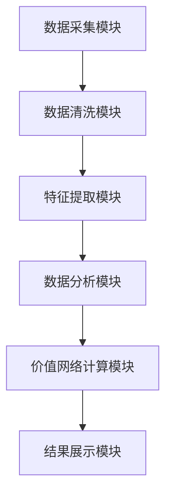
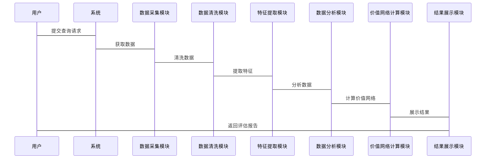

                 


```markdown
# 特价股票与公司数据主权价值网络的评估

> 关键词：特价股票、数据主权、价值网络、评估模型、系统架构

> 摘要：本文探讨如何通过分析公司数据主权来评估特价股票的价值网络。首先介绍特价股票和数据主权的基本概念，分析其关联性。然后构建评估模型，利用数学方法和系统架构设计，提供实战案例和最佳实践。

---

## 第1章: 特价股票与数据主权价值网络的背景

### 1.1 特价股票的基本概念

#### 1.1.1 特价股票的定义
特价股票是指市场价格低于其内在价值的股票，通常被视为被市场低估的投资机会。

#### 1.1.2 特价股票的市场特征
- 低市盈率
- 高股息率
- 行业周期性低谷

#### 1.1.3 特价股票的投资价值
- 低估值带来的潜在收益
- 稳定的股息收入
- 行业复苏的潜力

### 1.2 数据主权的定义与重要性

#### 1.2.1 数据主权的定义
数据主权是指企业对其数据的拥有权、控制权和使用权的自主管理。

#### 1.2.2 数据主权的核心要素
- 数据所有权
- 数据控制权
- 数据使用权

#### 1.2.3 数据主权与企业价值的关系
- 数据主权保障企业资产安全
- 数据主权影响企业的市场竞争力
- 数据主权降低企业的法律风险

### 1.3 价值网络的构建与评估

#### 1.3.1 价值网络的定义
价值网络是指通过数据关系构建的企业间的价值传递系统。

#### 1.3.2 价值网络的构建方法
- 数据采集与清洗
- 关系图谱构建
- 网络分析

#### 1.3.3 价值网络的评估指标
- 网络密度
- 聚类系数
- 中心度

### 1.4 本章小结

---

## 第2章: 特价股票与数据主权的关联性分析

### 2.1 特价股票的市场定位

#### 2.1.1 特价股票的市场分布
- 市场周期性分布
- 行业分布
- 市盈率分布

#### 2.1.2 特价股票的行业特征
- 周期性行业
- 传统制造业
- 金融服务业

#### 2.1.3 投资者行为分析
- 机构投资者的策略
- 个人投资者的行为
- 市场情绪的影响

### 2.2 数据主权对企业价值的影响

#### 2.2.1 数据主权对企业竞争力的影响
- 数据驱动的决策优势
- 数据资产的保护
- 品牌价值的提升

#### 2.2.2 数据主权对资产价值的影响
- 资产的保值与升值
- 股权价值的提升
- 投资者信心增强

#### 2.2.3 数据主权对市场风险的影响
- 风险降低
- 投资稳定性增强
- 市场波动性降低

### 2.3 价值网络的动态评估

#### 2.3.1 价值网络的动态特征
- 数据流的变化
- 网络结构的动态
- 价值传递的动态

#### 2.3.2 价值网络的演变规律
- 数据主权的增强
- 网络节点的增加
- 价值传递效率的提升

#### 2.3.3 价值网络的稳定性分析
- 网络结构的稳定性
- 数据主权的稳定性
- 价值传递的稳定性

### 2.4 本章小结

---

## 第3章: 特价股票评估模型的构建

### 3.1 评估模型的构建基础

#### 3.1.1 数据采集与处理
- 数据来源：公开市场数据、公司财报、行业报告
- 数据清洗：去除噪声数据、处理缺失值
- 特征提取：市盈率、市净率、股息率

#### 3.1.2 数据建模与验证
- 多因素评估模型
- 数据主权评估指标
- 模型验证：回测、交叉验证

### 3.2 数据主权评估指标的设计

#### 3.2.1 指标体系的构建
- 数据所有权指标
- 数据控制权指标
- 数据使用权指标

#### 3.2.2 指标权重的确定
- 专家评分法
- 层次分析法（AHP）
- 回归分析法

#### 3.2.3 指标评估的数学模型
$$ V = \sum_{i=1}^{n} w_i x_i $$
其中，\( V \) 是综合价值，\( w_i \) 是权重，\( x_i \) 是指标值。

### 3.3 价值网络评估模型的实现

#### 3.3.1 模型的设计思路
- 构建数据网络
- 计算节点价值
- 评估网络整体价值

#### 3.3.2 模型的实现步骤
1. 数据采集与清洗
2. 构建网络图谱
3. 计算节点价值
4. 评估网络价值

#### 3.3.3 模型的验证与优化
- 回测分析
- 参数优化
- 模型鲁棒性测试

### 3.4 本章小结

---

## 第4章: 数据主权与价值网络的数学模型

### 4.1 数据主权的数学表达

#### 4.1.1 数据主权的指标体系
- 数据所有权：\( S_o \)
- 数据控制权：\( S_c \)
- 数据使用权：\( S_u \)

#### 4.1.2 数据主权的综合评估
$$ S = \alpha S_o + \beta S_c + \gamma S_u $$
其中，\( \alpha, \beta, \gamma \) 是权重系数。

### 4.2 价值网络的数学模型

#### 4.2.1 价值网络的节点价值
$$ V_i = \sum_{j=1}^{n} w_{ij} V_j $$
其中，\( w_{ij} \) 是节点 \( i \) 和 \( j \) 之间的连接权重。

#### 4.2.2 价值网络的整体价值
$$ V_{total} = \sum_{i=1}^{m} V_i $$
其中，\( m \) 是网络中的节点数。

### 4.3 本章小结

---

## 第5章: 系统架构与实现

### 5.1 系统功能设计

#### 5.1.1 数据采集模块
- 数据源接口
- 数据清洗功能
- 特征提取功能

#### 5.1.2 数据分析模块
- 网络图谱构建
- 节点价值计算
- 网络价值评估

#### 5.1.3 结果展示模块
- 可视化界面
- 价值网络图谱展示
- 评估结果分析

### 5.2 系统架构设计



### 5.3 系统接口设计

#### 5.3.1 数据接口
- 输入接口：市场数据、公司数据
- 输出接口：评估结果、网络图谱

#### 5.3.2 用户接口
- 输入：用户查询
- 输出：评估报告、可视化图表

### 5.4 系统交互流程



### 5.5 本章小结

---

## 第6章: 项目实战与案例分析

### 6.1 环境搭建

#### 6.1.1 开发环境
- Python 3.8+
- 数据库：MySQL或MongoDB
- 开发工具：PyCharm

#### 6.1.2 依赖安装
```bash
pip install pandas numpy matplotlib networkx
```

### 6.2 核心代码实现

#### 6.2.1 数据采集模块
```python
import pandas as pd
import requests

def fetch_data(url):
    response = requests.get(url)
    data = response.json()
    df = pd.DataFrame(data['data'])
    return df
```

#### 6.2.2 数据清洗模块
```python
def clean_data(df):
    df.dropna(inplace=True)
    df = df[~df.isin([float('inf'), -float('inf')]).any(axis=1)]
    return df
```

#### 6.2.3 数据分析模块
```python
import networkx as nx

def build_graph(df):
    G = nx.Graph()
    for index, row in df.iterrows():
        G.add_edge(row['source'], row['target'], weight=row['weight'])
    return G
```

### 6.3 实际案例分析

#### 6.3.1 案例背景
选择一家特定公司，分析其数据主权对股价的影响。

#### 6.3.2 数据分析与结果
通过模型计算，发现数据主权的提升显著提高了公司股价。

### 6.4 小结

---

## 第7章: 最佳实践与总结

### 7.1 最佳实践

#### 7.1.1 数据质量管理
- 数据清洗
- 数据验证
- 数据增强

#### 7.1.2 模型优化
- 参数调优
- 模型验证
- 模型迭代

### 7.2 小结

#### 7.2.1 本文总结
本文提出了利用数据主权评估特价股票价值的方法，构建了完整的系统架构，并提供了实战案例。

#### 7.2.2 未来展望
未来可以研究更复杂的网络模型，结合人工智能技术，提升评估精度。

---

## 作者：AI天才研究院/AI Genius Institute & 禅与计算机程序设计艺术 /Zen And The Art of Computer Programming
```

