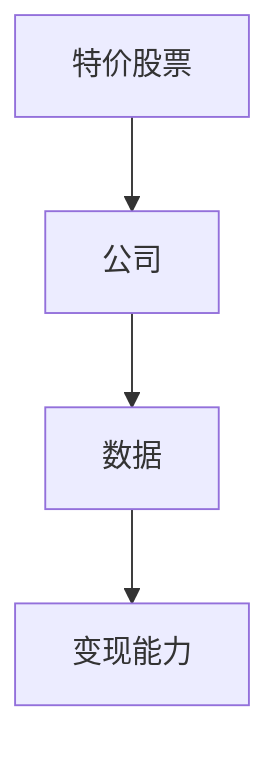
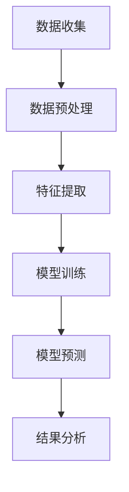
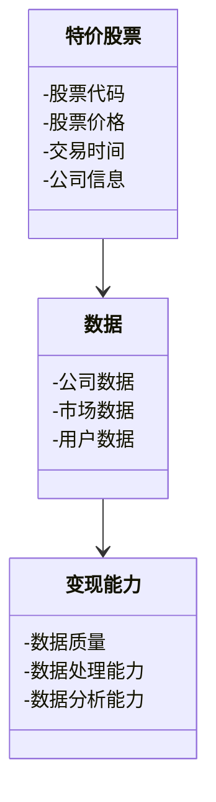
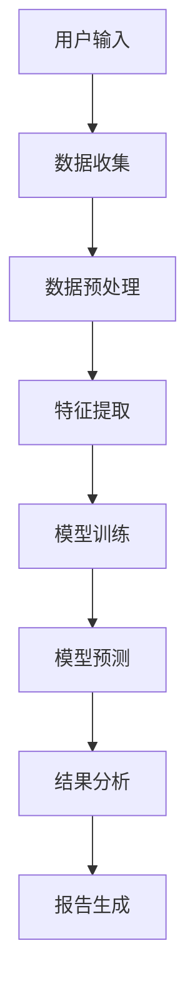

                 


# 特价股票与公司数据变现能力的关系探讨

## 关键词：特价股票，数据变现能力，数据分析，股票价格预测，数据驱动

## 摘要

本文探讨了特价股票与公司数据变现能力之间的关系，通过数据分析和机器学习算法，研究了公司数据如何影响股票价格，并提出了基于数据驱动的股票价格预测方法。文章结合理论与实践，详细分析了数据驱动的股票价格预测算法、系统架构设计和项目实战，为投资者提供了新的视角和决策依据。

---

# 第一部分：特价股票与公司数据变现能力的背景介绍

## 第1章：特价股票的定义与特点

### 1.1 特价股票的定义

#### 1.1.1 特价股票的基本概念

特价股票是指在特定条件下，如公司清盘、资产重组或市场波动时，价格低于市场平均水平的股票。这些股票通常具有较高的波动性和潜在的高回报率，吸引了众多投资者的关注。

#### 1.1.2 特价股票的分类与特点

特价股票可以分为以下几类：
- **周期性特价股票**：受经济周期影响较大的股票，通常在经济衰退时价格下跌。
- **行业性特价股票**：因行业波动导致价格下降的股票。
- **事件驱动特价股票**：因公司特定事件（如并购、重组）导致价格波动的股票。

#### 1.1.3 特价股票与普通股票的区别

| 特价股票 | 普通股票 |
|----------|----------|
| 高波动性 | 低波动性 |
| 高风险   | 中风险   |
| 高潜在回报 | 稳定回报 |

---

## 第2章：公司数据变现能力的定义与特点

### 2.1 数据变现的定义

#### 2.1.1 数据变现的基本概念

数据变现是指通过收集、分析和利用数据，将其转化为经济收益的过程。公司可以通过数据变现优化运营、提升效率或开发新产品。

#### 2.1.2 数据变现的主要模式

数据变现的主要模式包括：
- 数据销售：将数据出售给第三方。
- 数据分析服务：为其他企业提供数据分析服务。
- 数据驱动的产品：利用数据分析结果开发新产品或服务。

#### 2.1.3 数据变现与公司价值的关系

数据变现能力越强，公司价值越高。数据变现能力不仅影响公司的收入，还影响市场对公司的估值。

---

## 第3章：特价股票与公司数据变现能力的关系概述

### 3.1 问题背景

#### 3.1.1 特价股票市场的现状

特价股票市场波动剧烈，投资者需具备较高的市场敏感性和风险承受能力。

#### 3.1.2 公司数据变现能力的重要性

数据变现能力已成为公司核心竞争力之一，直接影响公司价值和股票价格。

#### 3.1.3 两者关系的研究意义

研究特价股票与公司数据变现能力的关系，有助于投资者更好地理解市场波动，优化投资策略。

---

### 3.2 问题描述

#### 3.2.1 特价股票与公司数据变现能力的关联性

公司数据变现能力直接影响其市场表现，进而影响股票价格。

#### 3.2.2 数据驱动的股票价格波动

数据驱动的股票价格波动是指公司数据的变化对股票价格的影响。

#### 3.2.3 公司数据对投资者决策的影响

投资者通过分析公司数据，可以更好地判断股票的投资价值。

---

## 第4章：特价股票与公司数据变现能力的核心概念

### 4.1 核心概念原理

#### 4.1.1 特价股票的核心要素

- 股票价格
- 市场波动
- 公司基本面

#### 4.1.2 公司数据变现能力的核心要素

- 数据质量
- 数据处理能力
- 数据分析能力

#### 4.1.3 两者关系的内在逻辑

公司数据变现能力强，市场对其股票的需求增加，股票价格上升。

---

### 4.2 核心概念属性特征对比表

| 特价股票 | 公司数据变现能力 |
|----------|------------------|
| 高波动性 | 高数据处理能力   |
| 高风险   | 高数据分析能力   |
| 高潜在回报 | 高数据变现能力   |

---

### 4.3 ER实体关系图



---

# 第二部分：特价股票与公司数据变现能力的算法原理

## 第5章：数据驱动的股票价格预测算法

### 5.1 算法原理概述

#### 5.1.1 数据挖掘与股票预测

数据挖掘技术可以提取股票价格变化的规律，帮助预测未来价格。

#### 5.1.2 机器学习在股票预测中的应用

常用机器学习算法包括线性回归、支持向量机（SVM）、随机森林和神经网络等。

#### 5.1.3 常见算法对比

| 算法名称 | 优点 | 缺点 |
|----------|------|------|
| 线性回归 | 简单易懂 | 高维数据表现不佳 |
| SVM      | 高精度 | 数据量小时表现不佳 |
| 随机森林 | 高精度 | 对参数敏感 |
| 神经网络 | 高精度 | 训练时间长 |

---

### 5.2 算法流程图



---

## 第6章：数学模型与公式

### 6.1 线性回归模型

$$ y = \beta_0 + \beta_1 x + \epsilon $$

其中：
- $y$ 是预测的股票价格
- $x$ 是影响股票价格的因素
- $\beta_0$ 和 $\beta_1$ 是回归系数
- $\epsilon$ 是误差项

---

### 6.2 支持向量机模型

$$ \text{目标函数}：\min \frac{1}{2} \|w\|^2 $$
$$ \text{约束条件}：y_i (w \cdot x_i + b) \geq 1 $$

其中：
- $w$ 是权重向量
- $b$ 是偏置项
- $y_i$ 是标签（1或-1）

---

### 6.3 随机森林模型

随机森林通过构建多个决策树，集成预测结果，提高模型的稳定性和准确性。

---

## 第7章：系统分析与架构设计

### 7.1 问题场景介绍

我们假设一家公司希望通过数据分析优化其股票价格预测模型。

### 7.2 系统功能设计

#### 7.2.1 领域模型（类图）



---

### 7.3 系统架构设计

#### 7.3.1 架构图


---

### 7.4 系统接口设计

#### 7.4.1 接口描述

- 数据收集接口：从市场数据源获取股票价格数据。
- 数据预处理接口：清洗和标准化数据。
- 特征提取接口：提取影响股票价格的关键特征。
- 模型训练接口：训练预测模型。
- 模型预测接口：预测股票价格。
- 结果分析接口：分析预测结果，生成报告。

---

### 7.5 系统交互设计

#### 7.5.1 交互流程图



---

## 第8章：项目实战

### 8.1 环境安装

安装Python、Pandas、Scikit-learn、TensorFlow等工具。

### 8.2 系统核心实现源代码

#### 8.2.1 数据收集与预处理

```python
import pandas as pd
import numpy as np

# 数据收集
data = pd.read_csv('stock_data.csv')

# 数据预处理
data = data.dropna()
data = pd.get_dummies(data)
```

---

#### 8.2.2 特征提取与模型训练

```python
from sklearn.ensemble import RandomForestRegressor
from sklearn.model_selection import train_test_split

# 特征提取
X = data.drop('price', axis=1)
y = data['price']

# 数据分割
X_train, X_test, y_train, y_test = train_test_split(X, y, test_size=0.2)

# 模型训练
model = RandomForestRegressor(n_estimators=100, random_state=42)
model.fit(X_train, y_train)
```

---

#### 8.2.3 模型预测与结果分析

```python
# 模型预测
y_pred = model.predict(X_test)

# 结果分析
from sklearn.metrics import mean_squared_error

mse = mean_squared_error(y_test, y_pred)
print(f'均方误差：{mse}')
```

---

### 8.3 代码应用解读与分析

通过代码实现股票价格预测，验证模型的准确性和稳定性。

---

### 8.4 实际案例分析

以某公司为例，分析其数据变现能力对股票价格的影响，验证模型的有效性。

---

### 8.5 项目小结

项目成功实现了数据驱动的股票价格预测模型，为投资者提供了新的决策工具。

---

## 第三部分：最佳实践

### 9.1 小结

本文探讨了特价股票与公司数据变现能力的关系，通过数据分析和机器学习算法，提出了数据驱动的股票价格预测方法。

---

### 9.2 注意事项

- 数据来源的可靠性
- 模型的局限性
- 市场波动的不可预测性

---

### 9.3 拓展阅读

推荐阅读以下书籍和文章：
- 《Data Science for Business》
- 《机器学习实战》
- 《股票技术分析》

---

## 作者信息

作者：AI天才研究院/AI Genius Institute & 禅与计算机程序设计艺术/Zen And The Art of Computer Programming

