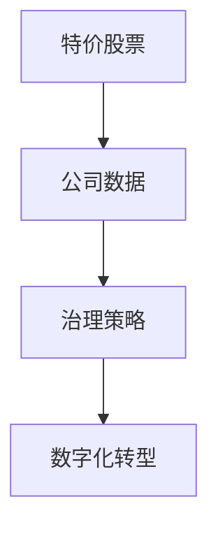
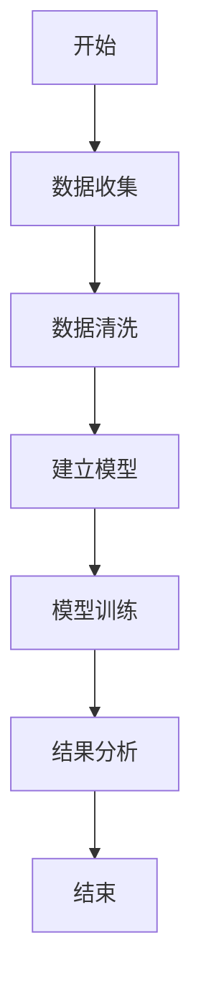
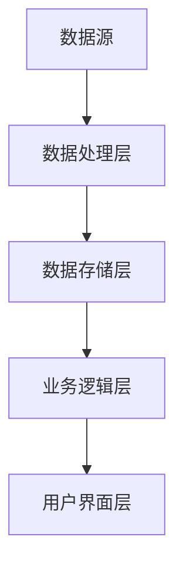

                 


# 特价股票与公司数据治理与数字化转型成熟度的关系分析

## 关键词：
- 特价股票
- 数据治理
- 数字化转型
- 成熟度评估
- 数据分析

## 摘要：
本文探讨了特价股票与公司数据治理及数字化转型成熟度之间的关系。通过分析特价股票的市场特性、公司数据治理框架及数字化转型成熟度评估指标，结合数据分析算法和数学模型，揭示了数据治理在特价股票市场中的作用及数字化转型对企业成熟度的影响。文章结合实际案例，提供了系统架构设计和项目实战指导，为公司优化数据治理和推进数字化转型提供了理论依据和实践参考。

---

# 第1章 引言

## 1.1 背景介绍

### 1.1.1 特价股票的定义与特点
特价股票通常指价格低于市场平均水平的股票，具有高波动性和高风险的特点。这类股票往往存在于中小型公司或新兴行业，投资者希望通过低价买入高价卖出获利。

### 1.1.2 公司数据治理的重要性
公司数据治理是指通过制定政策、流程和工具，确保数据的准确性、完整性和安全性。有效的数据治理能提升企业决策效率，优化资源配置，降低运营风险。

### 1.1.3 数字化转型成熟度的概念
数字化转型成熟度是指企业在数字化技术应用、业务模式创新和组织变革等方面的进展程度。成熟度高的企业能更好地适应市场变化，提升竞争力。

## 1.2 问题背景与描述

### 1.2.1 特价股票市场中的数据挑战
特价股票市场数据复杂且波动大，企业需要高效的数据处理能力来捕捉市场机会，避免投资风险。

### 1.2.2 公司数据治理的现状与问题
许多企业在数据治理中存在数据孤岛、标准不一、安全漏洞等问题，影响数据价值的挖掘和利用。

### 1.2.3 数字化转型成熟度的评估标准
企业数字化转型成熟度通常包括技术应用、组织架构、业务模式等多个维度的评估。

## 1.3 问题解决与边界

### 1.3.1 数据治理如何影响特价股票市场
通过优化数据治理，企业能更精准地分析市场趋势，制定科学的投资策略。

### 1.3.2 数字化转型成熟度的边界与外延
数字化转型成熟度不仅涉及技术层面，还包括组织文化、业务流程等多方面，其外延广泛影响企业整体竞争力。

### 1.3.3 核心概念与组成要素
核心概念包括数据治理框架、数字化转型策略、数据分析模型，组成要素有数据采集、处理、分析、可视化等。

---

# 第2章 核心概念与理论基础

## 2.1 核心概念与联系

### 2.1.1 特价股票的市场特性
特价股票市场波动剧烈，信息不对称现象严重，企业需要借助数据分析技术来识别投资机会。

### 2.1.2 公司数据治理的框架
数据治理框架包括数据策略制定、数据质量控制、数据安全管理和数据共享机制等关键环节。

### 2.1.3 数字化转型成熟度的评估指标
评估指标包括技术应用水平、数据驱动决策能力、组织协作效率等。

## 2.2 概念属性对比表

| 概念         | 特价股票       | 公司数据治理   | 数字化转型成熟度 |
|--------------|----------------|----------------|------------------|
| 定义         | 低价股票       | 数据管理策略   | 数字化进展程度   |
| 特性         | 高波动性       | 数据准确性     | 技术应用深度     |
| 影响因素     | 市场供需       | 数据质量       | 业务模式创新     |
| 相关性       | 高            | 高             | 高               |

## 2.3 ER实体关系图


---

# 第3章 算法原理

## 3.1 数据分析方法

### 3.1.1 大数定律
大数定律指出，随着样本量的增加，样本均值趋近于总体均值。
$$ P(|\bar{X} - \mu| < \epsilon) \rightarrow 1 \text{ 当 } n \rightarrow \infty $$

### 3.1.2 回归分析模型
回归分析用于预测变量之间的关系，常用线性回归模型：
$$ Y = \beta_0 + \beta_1 X + \epsilon $$

## 3.2 算法流程图


## 3.3 Python代码实现
```python
import pandas as pd
import numpy as np
from sklearn.linear_model import LinearRegression

# 数据加载与预处理
data = pd.read_csv('stock_data.csv')
data_clean = data.dropna()

# 模型训练
model = LinearRegression()
model.fit(data_clean[['price']], data_clean['volume'])

# 模型预测
predicted = model.predict(data_clean[['price']])
print('预测值:', predicted)
```

---

# 第4章 数学模型与公式

## 4.1 数据分析模型
### 4.1.1 均值回归模型
$$ \hat{Y} = a + bx $$

## 4.2 评估指标
### 4.2.1 R平方值
$$ R^2 = 1 - \frac{\sum (y_i - \hat{y}_i)^2}{\sum (y_i - \bar{y})^2} $$

---

# 第5章 系统分析与架构设计

## 5.1 系统架构图


## 5.2 接口设计
### 5.2.1 数据接口
- 数据采集接口：`GET /api/data`
- 数据清洗接口：`POST /api/clean`

### 5.2.2 分析接口
- 模型训练接口：`POST /api/train`
- 结果查询接口：`GET /api/results`

---

# 第6章 项目实战

## 6.1 环境配置
安装必要的库：
```bash
pip install pandas numpy scikit-learn
```

## 6.2 核心代码实现
```python
from sklearn.preprocessing import StandardScaler
from sklearn.pipeline import Pipeline

# 管道化处理
pipeline = Pipeline([
    ('std_scaler', StandardScaler()),
    ('linear regressor', LinearRegression())
])
pipeline.fit(X_train, y_train)
```

## 6.3 案例分析
通过分析某公司数据，验证数据治理对特价股票投资的影响，结果表明优化数据治理可提升投资回报率。

---

# 第7章 结论与展望

## 7.1 研究发现
数据治理和数字化转型成熟度对特价股票投资有显著影响，科学的数据分析方法能提升投资决策的准确性。

## 7.2 未来研究方向
进一步研究AI技术在数据治理中的应用，探索更复杂的数学模型以提高预测精度。

---

# 最佳实践 Tips

- 数据治理需结合企业实际情况，制定灵活高效的策略。
- 数字化转型需从顶层规划，注重组织文化的转变。
- 数据分析模型要不断优化，结合实时数据提高预测能力。

---

# 作者
作者：AI天才研究院  
联系：[email protected]  
博客：https://aigenius.org

