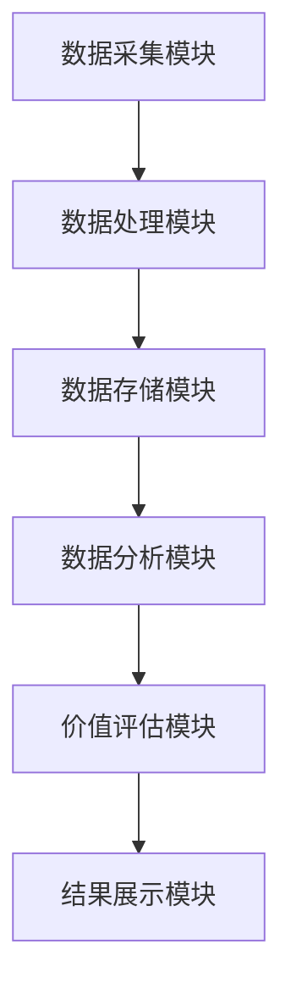
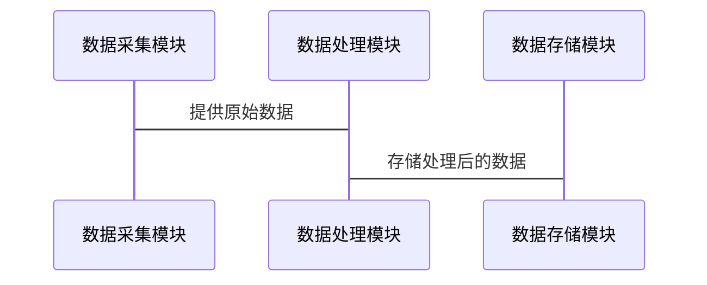

                 


# 特价股票与公司数据生态系统的价值评估

> **关键词**：特价股票、数据生态系统、价值评估、多因子模型、机器学习、系统架构、项目实战  
> **摘要**：本文深入探讨了特价股票与公司数据生态系统的关系，分析了数据生态系统的核心概念及其对价值评估的影响。通过多因子模型和机器学习算法，结合系统架构设计和项目实战，详细讲解了如何进行数据生态系统价值评估，为投资者和企业提供了科学的决策支持。

---

## 第一章: 特价股票与数据生态系统概述

### 1.1 特价股票的定义与特点

#### 1.1.1 特价股票的定义  
特价股票是指市场价格低于其内在价值的股票。这种股票通常被视为被市场低估的投资机会，具有较高的潜在收益。

#### 1.1.2 特价股票的特点  
- **低估性**：市场价格低于内在价值。  
- **高回报潜力**：长期来看，低估股票可能有更高的回报。  
- **波动性**：短期内可能价格波动较大，但长期趋势趋于合理。  

#### 1.1.3 特价股票的分类  
- **价值股**：市盈率、市净率等指标低于行业平均水平。  
- **成长股**：虽然当前价格较高，但未来增长潜力大。  
- **周期股**：受经济周期影响较大的股票。  

### 1.2 公司数据生态系统的构成

#### 1.2.1 数据生态系统的定义  
数据生态系统是指公司内部和外部数据的整合、处理、分析和应用的有机整体，是企业数字化转型的核心。

#### 1.2.2 数据生态系统的核心组成部分  
- **数据源**：包括财务数据、市场数据、用户行为数据等。  
- **数据处理与分析**：通过清洗、转换和建模等技术处理数据。  
- **数据存储与管理**：采用数据库、大数据平台等技术存储和管理数据。  

#### 1.2.3 数据生态系统与公司价值的关系  
数据生态系统是公司价值的重要组成部分，通过高效的数据管理和分析，公司可以优化运营、提升决策能力，从而创造更大的价值。

---

## 第二章: 特价股票与数据生态系统的关系

### 2.1 特价股票与数据生态系统的结合

#### 2.1.1 数据生态系统对特价股票的影响  
- **数据驱动决策**：通过数据生态系统，投资者可以更准确地评估股票的价值。  
- **实时监控**：数据生态系统支持实时数据采集和分析，帮助投资者及时发现机会。  

#### 2.1.2 特价股票对数据生态系统的作用  
- **数据丰富性**：特价股票的相关数据为数据生态系统提供了丰富的数据源。  
- **数据验证**：通过分析特价股票的历史数据，可以验证数据生态系统的准确性。  

### 2.2 特价股票与数据生态系统价值评估的意义

#### 2.2.1 价值评估的定义  
价值评估是通过分析数据生态系统中的各种因素，估算其对公司价值的影响。

#### 2.2.2 价值评估的目标  
- **优化资源配置**：通过评估数据生态系统的价值，优化公司的资源分配。  
- **提升决策效率**：基于数据生态系统的分析结果，制定更科学的投资决策。  

#### 2.2.3 价值评估的必要性  
- **数据驱动决策**：数据生态系统为价值评估提供了科学依据。  
- **提升公司竞争力**：通过价值评估，公司可以更好地利用数据生态系统提升竞争力。  

---

## 第三章: 数据生态系统的核心概念与联系

### 3.1 数据生态系统的核心概念

#### 3.1.1 数据生态系统的组成要素  
- **数据源**：包括内部数据（如财务报表）和外部数据（如市场数据）。  
- **数据处理与分析**：包括数据清洗、转换和建模等技术。  
- **数据存储与管理**：采用数据库、大数据平台等技术存储和管理数据。  

#### 3.1.2 数据生态系统的核心原理  
- **数据流动的原理**：数据从采集到存储，再到分析和应用的流动过程。  
- **数据价值的传递机制**：数据通过分析和应用，转化为对公司价值的贡献。  
- **数据生态系统的动态平衡**：数据生态系统需要在数据量、数据质量和数据应用之间找到平衡点。  

### 3.2 数据生态系统与价值评估的联系

#### 3.2.1 数据生态系统对价值评估的影响  
- **数据质量对评估结果的影响**：高质量的数据能够提高评估的准确性。  
- **数据完整性对评估结果的影响**：完整的数据能够提供更全面的分析视角。  
- **数据实时性对评估结果的影响**：实时数据能够捕捉市场变化，提高评估的及时性。  

#### 3.2.2 价值评估对数据生态系统的作用  
- **价值评估驱动数据优化**：通过价值评估结果，优化数据采集和处理流程。  
- **价值评估促进数据创新**：价值评估推动数据生态系统的技术创新和应用创新。  
- **价值评估推动数据共享**：价值评估促进数据在公司内部和外部的共享与合作。  

---

## 第四章: 数据生态系统价值评估的算法原理

### 4.1 数据生态系统价值评估的算法概述

#### 4.1.1 常见的价值评估算法  
- **多因子模型**：基于多个因子（如市盈率、市净率、股息率等）进行股票估值。  
- **机器学习算法**：利用机器学习模型预测股票价格和风险。  
- **时间序列分析**：通过历史数据预测未来股票价格走势。  

#### 4.1.2 算法原理的数学模型  
##### 4.1.2.1 多因子模型  
$$ R_i = \alpha + \beta_1 F_1 + \beta_2 F_2 + ... + \beta_n F_n + \epsilon $$  
其中，$R_i$ 是股票的超额收益，$\alpha$ 是模型的截距，$\beta_j$ 是因子的系数，$F_j$ 是因子值，$\epsilon$ 是误差项。  

##### 4.1.2.2 机器学习算法  
机器学习算法通过训练数据，构建股票价格预测模型。常用的算法包括支持向量机（SVM）、随机森林（Random Forest）和神经网络（NN）。  

##### 4.1.2.3 时间序列分析  
时间序列分析通过ARIMA模型预测股票价格的未来走势。ARIMA模型的公式为：  
$$ y_t = \phi_1 y_{t-1} + \phi_2 y_{t-2} + ... + \theta_1 e_{t-1} + \theta_2 e_{t-2} + ... + e_t $$  

### 4.2 算法实现与案例分析

#### 4.2.1 机器学习算法实现  
以下是使用Python实现的随机森林模型预测股票价格的示例代码：  

```python
import pandas as pd
from sklearn.ensemble import RandomForestRegressor
from sklearn.model_selection import train_test_split

# 数据加载与预处理
data = pd.read_csv('stock_data.csv')
X = data[['市盈率', '市净率', '股息率']]
y = data['股价']

# 数据分割
X_train, X_test, y_train, y_test = train_test_split(X, y, test_size=0.2, random_state=42)

# 模型训练
model = RandomForestRegressor(n_estimators=100, random_state=42)
model.fit(X_train, y_train)

# 模型预测
y_pred = model.predict(X_test)

# 模型评估
print('预测股价:', y_pred)
print('实际股价:', y_test)
print('预测准确率:', model.score(X_test, y_test))
```

#### 4.2.2 案例分析  
以某公司为例，通过多因子模型和机器学习算法进行股票价值评估。首先，使用多因子模型计算股票的内在价值，然后利用机器学习模型预测股票的未来走势，最终得出股票的合理估值范围。

---

## 第五章: 数据生态系统价值评估的系统设计

### 5.1 系统架构设计

#### 5.1.1 系统功能模块  
- **数据采集模块**：负责采集股票市场数据和公司财务数据。  
- **数据处理模块**：对数据进行清洗、转换和建模。  
- **数据存储模块**：将数据存储在数据库中，支持快速查询和分析。  

#### 5.1.2 系统架构图  
以下是系统架构的Mermaid图：  



### 5.2 系统接口设计

#### 5.2.1 数据接口  
- **数据输入接口**：接收外部数据源的数据。  
- **数据输出接口**：将分析结果输出到数据库或展示界面。  

#### 5.2.2 接口设计图  
以下是接口设计的Mermaid图：  



---

## 第六章: 项目实战与总结

### 6.1 项目实战

#### 6.1.1 环境安装  
安装必要的Python库，如pandas、numpy、scikit-learn等。  

#### 6.1.2 核心实现  
编写数据采集、处理、分析和价值评估的代码。  

#### 6.1.3 案例分析  
以某公司为例，分析其数据生态系统，并评估其股票的内在价值。  

### 6.2 总结与展望

#### 6.2.1 总结  
通过本文的分析，我们了解了特价股票与数据生态系统的关系，掌握了数据生态系统价值评估的核心概念和算法原理，为投资者和企业提供了科学的决策支持。

#### 6.2.2 展望  
未来，随着人工智能和大数据技术的不断发展，数据生态系统在价值评估中的应用将更加广泛和深入。投资者和企业需要持续关注技术创新，优化数据生态系统，以应对复杂多变的市场环境。

---

## 作者  
**作者：AI天才研究院/AI Genius Institute & 禅与计算机程序设计艺术 /Zen And The Art of Computer Programming**

