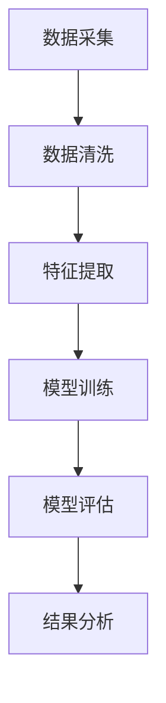
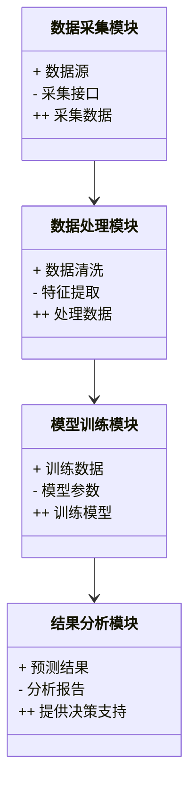

                 


```markdown
# 特价股票与公司数据驱动决策能力的长期关系分析

## 关键词：特价股票、数据驱动决策、长期关系、数据驱动、投资分析

## 摘要：
本文深入探讨了特价股票与公司数据驱动决策能力之间的长期关系。通过分析数据驱动决策的核心概念、算法原理和系统架构，结合实际项目案例，揭示了数据驱动决策在特价股票投资中的应用及其长期影响。文章还提供了最佳实践和未来研究方向，为投资者和数据科学家提供了有价值的参考。

---

## 第1章: 特价股票与数据驱动决策的背景与概念

### 1.1 特价股票的定义与特点
#### 1.1.1 特价股票的定义
特价股票是指市场价格低于面值的股票，通常反映公司财务状况不佳或市场对公司的负面预期。

#### 1.1.2 特价股票的特点
- **低估值**：股价低于面值，可能隐藏投资机会。
- **高风险**：公司可能存在财务问题或市场波动风险。
- **短期波动**：特价股票的价格受市场情绪影响较大。

#### 1.1.3 特价股票的分类
- 按行业分类：如金融、科技、制造等行业的特价股票。
- 按原因分类：因财务问题、市场波动等导致的特价股票。

### 1.2 数据驱动决策的定义与特点
#### 1.2.1 数据驱动决策的定义
数据驱动决策是基于数据分析和模型预测，利用数据支持决策的过程。

#### 1.2.2 数据驱动决策的核心要素
- 数据采集：获取相关数据。
- 数据处理：清洗、转换和特征提取。
- 数据分析：使用统计方法和机器学习模型进行分析。
- 决策支持：提供数据支持的决策建议。

#### 1.2.3 数据驱动决策的优势
- 提高决策的准确性。
- 降低决策的主观性。
- 提供实时数据分析支持。

### 1.3 特价股票与数据驱动决策能力的关系
#### 1.3.1 特价股票与数据驱动决策的关联性
数据驱动决策可以帮助投资者分析特价股票的潜在价值和风险。

#### 1.3.2 数据驱动决策在特价股票中的应用
- 预测特价股票的价格走势。
- 分析公司基本面数据，评估投资价值。

#### 1.3.3 长期关系的初步探讨
数据驱动决策能力的提升可以增强公司在特价股票市场中的竞争力，从而形成长期关系。

### 1.4 本章小结
本章介绍了特价股票和数据驱动决策的基本概念，并探讨了两者之间的关系，为后续分析奠定了基础。

---

## 第2章: 数据驱动决策的核心概念与算法原理

### 2.1 数据驱动决策的核心概念
#### 2.1.1 数据驱动决策的原理
通过收集和分析数据，利用模型预测和优化决策过程。

#### 2.1.2 数据驱动决策的关键技术
- 数据挖掘：从大量数据中提取有价值的信息。
- 机器学习：利用算法训练模型进行预测。
- 数据可视化：将复杂数据转化为易于理解的图表。

### 2.2 数据驱动决策的算法原理
#### 2.2.1 线性回归模型
线性回归是一种简单但强大的预测模型，用于预测连续型变量。

#### 2.2.2 支持向量机（SVM）
SVM适用于分类问题，能够处理高维数据。

#### 2.2.3 随机森林与梯度提升树
随机森林和梯度提升树是常用的集成学习方法，能够提高模型的准确性和鲁棒性。

#### 2.2.4 长短期记忆网络（LSTM）
LSTM适用于时间序列数据的预测，能够捕捉数据中的长期依赖关系。

### 2.3 数据驱动决策的数学模型
#### 2.3.1 线性回归模型
$$ y = \beta_0 + \beta_1 x + \epsilon $$
其中，$y$ 是目标变量，$x$ 是自变量，$\beta_0$ 和 $\beta_1$ 是回归系数，$\epsilon$ 是误差项。

#### 2.3.2 支持向量机（SVM）
SVM的目标是最小化经验损失和结构风险的函数：
$$ \min_{\theta} \frac{1}{2}||\theta||^2 + C \sum_{i=1}^n \xi_i $$
其中，$C$ 是惩罚参数，$\xi_i$ 是松弛变量。

#### 2.3.3 随机森林
随机森林通过构建多个决策树，并对结果进行投票或平均，提高模型的准确性和鲁棒性。

### 2.4 本章小结
本章详细介绍了数据驱动决策的核心概念和算法原理，为后续分析提供了理论基础。

---

## 第3章: 数据驱动决策在特价股票分析中的应用

### 3.1 数据预处理与特征工程
#### 3.1.1 数据清洗
处理缺失值、异常值和重复数据。

#### 3.1.2 数据标准化与归一化
对数据进行标准化或归一化处理，确保模型的稳定性。

#### 3.1.3 特征选择与降维
利用特征重要性分析选择关键特征，降低维度。

### 3.2 机器学习模型的应用
#### 3.2.1 线性回归模型
用于预测特价股票的未来价格。

#### 3.2.2 支持向量机（SVM）
用于分类问题，如判断股票是否为特价股票。

#### 3.2.3 随机森林与梯度提升树
用于分类和回归问题，预测股票价格和风险。

### 3.3 深度学习模型的应用
#### 3.3.1 神经网络基础
构建神经网络模型，用于复杂模式识别。

#### 3.3.2 长短期记忆网络（LSTM）
用于时间序列预测，捕捉股票价格的长期依赖关系。

### 3.4 算法流程图


### 3.5 本章小结
本章详细介绍了数据驱动决策在特价股票分析中的应用，展示了如何利用机器学习和深度学习模型进行预测和决策。

---

## 第4章: 特价股票分析的系统架构与设计方案

### 4.1 系统功能模块划分
#### 4.1.1 数据采集模块
从多个数据源采集股票数据。

#### 4.1.2 数据处理模块
清洗、转换和特征提取。

#### 4.1.3 模型训练模块
训练机器学习和深度学习模型。

#### 4.1.4 结果分析模块
分析模型预测结果，提供决策支持。

### 4.2 系统架构设计


### 4.3 系统接口设计
#### 4.3.1 数据接口设计
定义数据采集和处理的接口，确保数据流畅传输。

#### 4.3.2 模型接口设计
定义模型训练和预测的接口，方便模块化开发。

### 4.4 本章小结
本章详细介绍了系统的架构设计和功能模块划分，为后续的项目实施提供了指导。

---

## 第5章: 项目实战与案例分析

### 5.1 环境安装与配置
#### 5.1.1 安装Python
安装Python 3.8及以上版本。

#### 5.1.2 安装依赖库
安装NumPy、Pandas、Scikit-learn、TensorFlow等库。

### 5.2 核心代码实现
#### 5.2.1 数据采集与处理
```python
import pandas as pd
import numpy as np

# 数据采集
data = pd.read_csv('stock_data.csv')

# 数据清洗
data.dropna(inplace=True)
data = data[~data['price'].isin([np.nan, np.inf])]
```

#### 5.2.2 模型训练
```python
from sklearn.ensemble import RandomForestRegressor
from sklearn.model_selection import train_test_split

# 数据分割
X_train, X_test, y_train, y_test = train_test_split(data.drop('price', axis=1), data['price'], test_size=0.2)

# 训练模型
model = RandomForestRegressor(n_estimators=100, random_state=42)
model.fit(X_train, y_train)

# 模型评估
score = model.score(X_test, y_test)
print(f'模型得分：{score}')
```

### 5.3 实际案例分析
以某公司特价股票为例，分析数据驱动决策如何帮助投资者做出决策。

### 5.4 项目小结
通过实际案例分析，验证了数据驱动决策在特价股票分析中的有效性。

---

## 第6章: 数据驱动决策的最佳实践与未来展望

### 6.1 最佳实践
#### 6.1.1 数据质量的重要性
确保数据的准确性和完整性。

#### 6.1.2 模型选择与优化
根据问题类型选择合适的模型，并进行调优。

#### 6.1.3 结果解读与可视化
将复杂的数据分析结果可视化，便于决策者理解。

### 6.2 小结
数据驱动决策在特价股票分析中具有重要的应用价值，未来随着技术的发展，其应用前景将更加广阔。

### 6.3 注意事项
- 数据隐私和安全问题。
- 模型的可解释性和透明性。
- 数据的实时性和更新频率。

### 6.4 拓展阅读
推荐相关书籍和资源，供读者进一步学习。

---

## 作者：AI天才研究院/AI Genius Institute & 禅与计算机程序设计艺术 /Zen And The Art of Computer Programming

---

通过本文的分析，我们深入探讨了特价股票与公司数据驱动决策能力的长期关系，为投资者和数据科学家提供了有价值的参考和指导。
```

