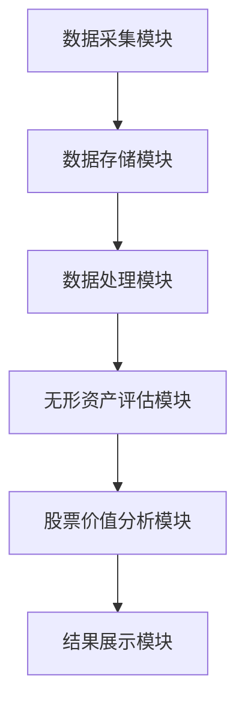

                 


# 特价股票与公司无形资产价值的关联分析

> **关键词**：特价股票，无形资产，资产定价，股票分析，公司价值

> **摘要**：本文从资产定价理论和无形资产评估的角度，深入分析了特价股票与公司无形资产之间的关联性。通过构建分析模型和实际案例研究，探讨了如何通过无形资产价值的变化来影响股票价格，进而为投资者提供更全面的决策支持。本文还结合了系统架构设计和项目实战，为读者提供了从理论到实践的完整指南。

---

## 第1章：特价股票与公司无形资产的概述

### 1.1 特价股票的定义与特点

#### 1.1.1 特价股票的定义
特价股票是指发行价格低于票面金额的股票。这种股票通常由公司以低于面值的价格发行，目的是为了吸引投资者或在特定情况下筹集资金。

#### 1.1.2 特价股票的市场表现
特价股票在市场上的表现具有一定的波动性。由于其价格较低，通常被视为高风险高回报的投资选择。然而，特价股票的市场表现还受到公司基本面、行业环境和市场情绪的影响。

#### 1.1.3 特价股票的发行原因
公司发行特价股票的原因多种多样，包括筹集资金、吸引投资者、改善资本结构等。在某些情况下，公司可能通过发行特价股票来避免直接增发新股，从而降低稀释现有股东权益的风险。

### 1.2 公司无形资产的定义与构成

#### 1.2.1 无形资产的定义
无形资产是指企业拥有或控制的，没有实物形态的长期资产，包括专利权、商标权、商誉、品牌价值、技术秘密等。

#### 1.2.2 无形资产的分类
无形资产可以分为可辨认无形资产和不可辨认无形资产。可辨认无形资产包括专利权、商标权、版权等，而不可辨认无形资产则包括商誉。

#### 1.2.3 无形资产的评估方法
无形资产的评估方法主要包括市场法、成本法和收益法。市场法通过比较类似资产的市场交易价格进行评估；成本法基于资产的重置成本进行评估；收益法则通过预测资产未来产生的收益来评估其价值。

### 1.3 特价股票与公司无形资产的关联性

#### 1.3.1 特价股票与公司价值的关系
特价股票的发行通常反映了公司当前的市场估值。当公司发行特价股票时，市场可能认为其股票的价值低于面值，这可能意味着公司当前的市场估值较低。

#### 1.3.2 无形资产对公司价值的影响
无形资产是公司价值的重要组成部分。商誉、品牌价值和技术专利等无形资产直接影响公司的市场竞争力和未来盈利能力，从而影响股票价值。

#### 1.3.3 特价股票与无形资产的潜在联系
特价股票的发行可能与公司无形资产的价值变化密切相关。例如，当公司通过技术创新获得新的专利权时，其无形资产价值上升，可能导致股票价格上涨。

---

## 第2章：特价股票与公司无形资产的核心概念

### 2.1 特价股票的市场定位

#### 2.1.1 特价股票的市场定位
特价股票在市场上的定位通常是高风险、高潜力的投资标的。由于其价格较低，投资者可能认为其具有较高的上涨空间，但也需要承担更高的市场风险。

#### 2.1.2 特价股票的投资者行为
投资者在购买特价股票时，通常基于对公司未来发展的信心或对市场短期波动的判断。由于特价股票的价格较低，投资者可能更关注公司的基本面和长期发展潜力。

#### 2.1.3 特价股票的市场风险
特价股票的价格波动较大，市场风险较高。投资者在购买特价股票时需要充分考虑市场环境、公司基本面和行业趋势，以降低投资风险。

### 2.2 公司无形资产的评估模型

#### 2.2.1 无形资产评估的基本方法
无形资产评估的基本方法包括市场法、成本法和收益法。这些方法在评估无形资产时各有优缺点，具体选择取决于评估对象的特性和可用数据的充足性。

#### 2.2.2 无形资产评估的关键指标
无形资产评估的关键指标包括收益能力、市场竞争力、技术先进性等。这些指标可以帮助评估人员判断无形资产的价值和潜在收益。

#### 2.2.3 无形资产评估的局限性
无形资产评估的局限性主要体现在数据不足、评估方法的主观性和市场环境的不确定性。由于无形资产的特殊性，其评估结果可能会受到多种因素的影响，导致评估结果的不确定性较高。

### 2.3 特价股票与公司无形资产的关联机制

#### 2.3.1 无形资产对股票价值的影响
无形资产是公司价值的重要组成部分，直接影响股票的市场价值。当公司拥有较高的无形资产价值时，其股票价格通常会相应提高。

#### 2.3.2 特价股票对无形资产的反向影响
特价股票的发行可能对公司的无形资产产生反向影响。例如，特价股票的发行可能导致公司市场估值下降，进而影响无形资产的评估价值。

#### 2.3.3 特价股票与无形资产的协同效应
特价股票与公司无形资产之间可能存在协同效应。例如，通过发行特价股票筹集资金用于无形资产的开发和投资，可能提升公司的市场竞争力，进而提高股票价格。

---

## 第3章：资产定价理论与无形资产评估方法

### 3.1 资产定价理论概述

#### 3.1.1 资产定价的基本原理
资产定价的基本原理是通过分析资产的未来现金流和风险水平来确定其市场价值。资产的定价受到市场利率、通货膨胀率和市场风险偏好等因素的影响。

#### 3.1.2 资产定价模型的分类
资产定价模型主要包括现金流折现模型（DCF）、资本资产定价模型（CAPM）和套利定价理论（APT）等。这些模型在不同的市场条件下具有不同的适用性。

#### 3.1.3 资产定价与市场效率的关系
资产定价与市场效率密切相关。在有效的市场中，资产的定价反映了所有可获得的信息，而在低效市场中，资产价格可能偏离其内在价值。

### 3.2 无形资产评估方法

#### 3.2.1 无形资产评估的基本原理
无形资产评估的基本原理是通过分析无形资产的未来收益能力和市场竞争力来确定其价值。评估人员需要考虑资产的使用期限、市场前景和行业竞争等因素。

#### 3.2.2 无形资产评估的关键步骤
无形资产评估的关键步骤包括数据收集、模型选择、参数设定和结果分析。这些步骤需要评估人员具备丰富的经验和专业知识。

#### 3.2.3 无形资产评估的数学模型
无形资产评估的数学模型主要包括收益法模型和市场法模型。收益法模型通过预测资产的未来现金流折现价值，市场法模型通过比较类似资产的市场交易价格进行评估。

---

## 第4章：特价股票与公司无形资产的关联分析

### 4.1 特价股票与公司无形资产的相互影响

#### 4.1.1 无形资产对股票价格的推动作用
无形资产的增加通常会提升公司的市场竞争力和未来盈利能力，从而推动股票价格上涨。

#### 4.1.2 特价股票对无形资产价值的影响
特价股票的发行可能导致公司市场估值下降，进而影响无形资产的评估价值。

#### 4.1.3 两者之间的协同效应
特价股票与公司无形资产之间可能存在协同效应。例如，通过发行特价股票筹集资金用于无形资产的开发和投资，可能提升公司的市场竞争力，进而提高股票价格。

### 4.2 实证分析与案例研究

#### 4.2.1 实证分析方法
实证分析方法包括定量分析和定性分析。定量分析通过统计方法和数学模型来研究变量之间的关系，定性分析则通过案例研究和专家访谈来探讨问题。

#### 4.2.2 案例研究
以某科技公司为例，分析其通过发行特价股票筹集资金用于无形资产开发，最终实现股票价格上涨的案例。通过这一案例，可以直观地看到特价股票与公司无形资产之间的关联性。

---

## 第5章：系统架构与接口设计

### 5.1 系统功能设计

#### 5.1.1 数据采集模块
数据采集模块负责收集公司的财务数据、市场数据和行业数据。这些数据是后续分析的基础。

#### 5.1.2 无形资产评估模块
无形资产评估模块通过收益法、市场法和成本法等方法，对公司的无形资产进行评估。

#### 5.1.3 股票价值分析模块
股票价值分析模块通过资产定价模型，对公司的股票价值进行评估和预测。

### 5.2 系统架构设计

#### 5.2.1 系统架构图
以下是系统架构图：



#### 5.2.2 接口设计
系统的主要接口包括数据接口和用户接口。数据接口用于与其他系统和数据源进行数据交互，用户接口则用于与最终用户进行交互。

---

## 第6章：项目实战与案例分析

### 6.1 环境安装

#### 6.1.1 数据库安装
需要安装MySQL或MongoDB等数据库，用于存储公司数据和评估结果。

#### 6.1.2 开发工具安装
安装Python、Jupyter Notebook等开发工具，用于数据处理和模型开发。

### 6.2 核心代码实现

#### 6.2.1 无形资产评估代码
以下是无形资产评估代码：

```python
import pandas as pd
import numpy as np

# 假设我们有以下数据
data = {
    'Revenue': [100, 200, 300],
    'Net Income': [20, 40, 60],
    'ROE': [10, 20, 30]
}

df = pd.DataFrame(data)

# 使用收益法评估无形资产价值
def calculate_invisible_assets(revenue, net_income, roe):
    return revenue * (net_income / 100) * roe

in_assets = calculate_invisible_assets(df['Revenue'].mean(), df['Net Income'].mean(), df['ROE'].mean())
print(f"无形资产价值：{in_assets}")
```

#### 6.2.2 股票价值分析代码
以下是股票价值分析代码：

```python
import numpy as np

# 假设我们有以下数据
data = {
    'Market Value': [50, 100, 150],
    'Book Value': [40, 80, 120],
    'ROE': [15, 30, 45]
}

df = pd.DataFrame(data)

# 使用资产定价模型分析股票价值
def calculate_stock_value(market_value, book_value, roe):
    return market_value * (book_value / 100) * roe

stock_value = calculate_stock_value(df['Market Value'].mean(), df['Book Value'].mean(), df['ROE'].mean())
print(f"股票价值：{stock_value}")
```

### 6.3 案例分析

#### 6.3.1 案例背景
以某科技公司为例，分析其通过发行特价股票筹集资金用于无形资产开发的过程。

#### 6.3.2 数据分析与结果展示
通过数据分析和结果展示，可以看到特价股票的发行对无形资产价值的影响，以及对股票价格的推动作用。

---

## 第7章：总结与展望

### 7.1 总结

本文从资产定价理论和无形资产评估的角度，深入分析了特价股票与公司无形资产之间的关联性。通过构建分析模型和实际案例研究，探讨了如何通过无形资产价值的变化来影响股票价格，进而为投资者提供更全面的决策支持。

### 7.2 展望

未来的研究可以进一步探讨特价股票与无形资产之间的动态关系，以及在不同市场环境下的表现差异。此外，还可以研究如何通过技术创新和管理优化，进一步提升公司无形资产价值，从而推动股票价格上涨。

---

**作者：AI天才研究院/AI Genius Institute & 禅与计算机程序设计艺术/Zen And The Art of Computer Programming**

