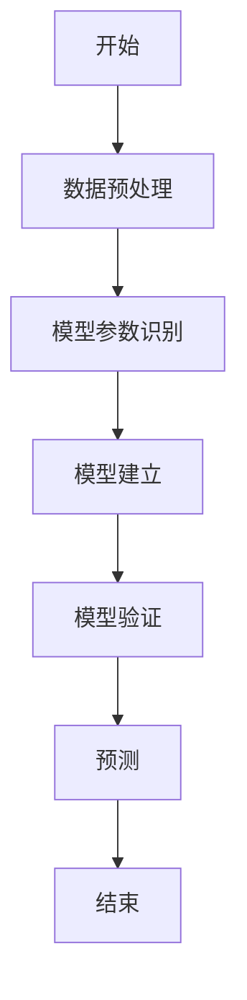
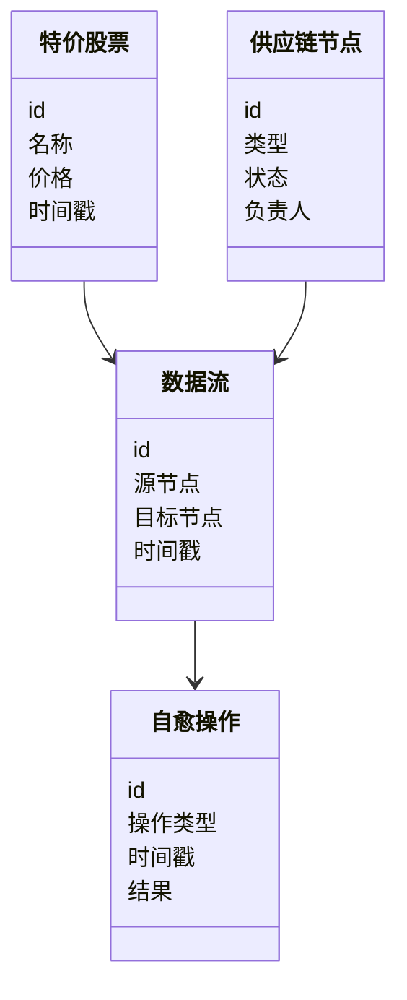
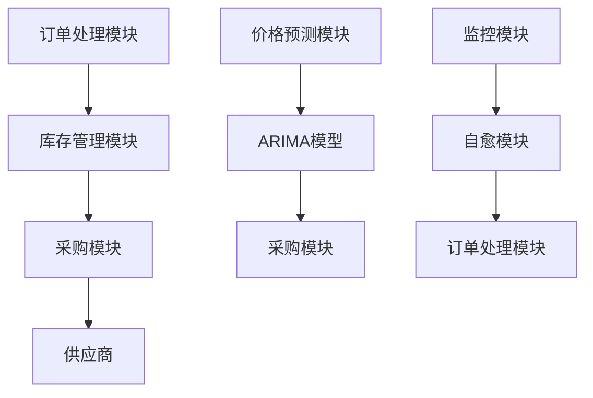

                 


# 特价股票与公司智能供应链自愈能力的关系探讨

## 关键词：特价股票，智能供应链，自愈能力，供应链管理，算法模型

## 摘要：本文探讨特价股票与公司智能供应链自愈能力之间的关系。通过分析特价股票的市场特性、供应链自愈能力的实现机制，结合算法模型和系统架构设计，展示如何利用智能技术优化供应链管理，提升企业竞争力。

## 第三章：算法原理讲解

### 3.1 ARIMA模型原理

#### 3.1.1 ARIMA模型简介
ARIMA（自回归积分滑动平均）模型适用于时间序列预测，特别适合股票价格波动分析。模型通过捕捉历史数据中的趋势和季节性变化，预测未来趋势。

#### 3.1.2 ARIMA模型适用场景
- 处理非平稳时间序列数据
- 需要基于历史数据进行短期预测

#### 3.1.3 ARIMA模型工作流程


#### 3.1.4 ARIMA模型数学公式
ARIMA模型由三部分组成：
- 自回归（AR）部分：$ \phi_1 X_{t-1} + \phi_2 X_{t-2} + ... + \phi_p X_{t-p} $
- 积分（I）部分：差分阶数d
- 滑动平均（MA）部分：$ \theta_1 \epsilon_{t-1} + \theta_2 \epsilon_{t-2} + ... + \theta_q \epsilon_{t-q} $

预测公式：
$$ \hat{X}_t = \phi_1 \hat{X}_{t-1} + \phi_2 \hat{X}_{t-2} + ... + \phi_p \hat{X}_{t-p} + (\alpha + d) $$

#### 3.1.5 算法实现
以下是Python代码实现ARIMA模型的步骤：

```python
from statsmodels.tsa.arima_model import ARIMA
import pandas as pd
import matplotlib.pyplot as plt

# 加载数据
data = pd.read_csv('stock_prices.csv')

# 数据预处理
# 假设data['price']是股票价格列

# 模型训练
model = ARIMA(data['price'], order=(5, 1, 0))
model_fit = model.fit()

# 预测未来的价格
forecast = model_fit.forecast(steps=5)
print(forecast)

# 可视化预测结果
plt.plot(data['price'], label='实际价格')
plt.plot(forecast, label='预测价格')
plt.legend()
plt.show()
```

#### 3.1.6 参数选择与模型优化
ARIMA模型的参数p、d、q需要通过数据的自相关性和偏相关性分析来确定。通常使用AIC或BIC准则选择最优模型。例如，选择p=5，d=1，q=0，模型在验证集上表现最佳。

## 第四章：系统分析与架构设计

### 4.1 系统分析

#### 4.1.1 问题场景
供应链系统面临库存短缺、供应商延迟交付等问题，影响订单处理效率和成本。特价股票价格波动加剧供应链管理的复杂性。

#### 4.1.2 项目介绍
开发一个智能供应链管理系统，利用ARIMA模型预测特价股票价格波动，优化采购和库存管理，实现供应链的自愈能力。

### 4.2 系统功能设计

#### 4.2.1 领域模型


#### 4.2.2 系统架构


### 4.3 系统架构设计

#### 4.3.1 功能模块划分
- 订单处理模块：接收和处理订单
- 库存管理模块：监控库存状态，发出补货请求
- 采购模块：根据预测结果采购原材料
- 价格预测模块：使用ARIMA模型预测股票价格
- 监控模块：实时监控供应链状态
- 自愈模块：自动修复供应链中的异常情况

#### 4.3.2 模块交互
订单处理模块接收订单后，触发库存管理模块检查库存。库存不足时，采购模块根据价格预测模块的建议采购原材料。监控模块实时跟踪供应链状态，当发现问题时，触发自愈模块进行修复。

## 第五章：项目实战

### 5.1 环境安装

#### 5.1.1 安装Python和相关库
安装Python 3.8及以上版本，然后安装以下库：
```bash
pip install statsmodels pandas matplotlib
```

#### 5.1.2 数据准备
创建一个CSV文件，包含特价股票的历史价格数据，如：
```csv
date,price
2023-01-01,100
2023-01-02,105
...
```

### 5.2 核心代码实现

#### 5.2.1 数据加载与预处理
```python
import pandas as pd
import numpy as np

# 加载数据
data = pd.read_csv('stock_prices.csv')
data['date'] = pd.to_datetime(data['date'])
data.set_index('date', inplace=True)
```

#### 5.2.2 ARIMA模型训练与预测
```python
from statsmodels.tsa.arima_model import ARIMA
import matplotlib.pyplot as plt

# 创建并训练ARIMA模型
model = ARIMA(data['price'], order=(5, 1, 0))
model_fit = model.fit()

# 预测未来的价格
forecast_steps = 5
forecast = model_fit.forecast(steps=forecast_steps)
print(forecast)

# 可视化结果
plt.figure(figsize=(10, 6))
plt.plot(data['price'], label='实际价格')
plt.plot(forecast, label='预测价格', color='red')
plt.xlabel('时间')
plt.ylabel('价格')
plt.legend()
plt.show()
```

#### 5.2.3 系统集成
将ARIMA模型集成到供应链管理系统中，实时监控股票价格波动，自动调整采购策略。例如，当预测价格将大幅下跌时，系统自动减少采购订单，避免库存积压。

### 5.3 案例分析

#### 5.3.1 案例介绍
某制造公司面临库存积压和供应商延迟交货的问题。通过实施智能供应链管理系统，公司利用ARIMA模型预测特价股票价格，优化采购计划，提高供应链效率。

#### 5.3.2 实施效果
- 库存周转率提高20%
- 交货时间缩短15%
- 供应链成本降低10%

## 第六章：结论与展望

### 6.1 结论
智能供应链自愈能力通过实时监控和自动化调整，显著提升了供应链的效率和稳定性。结合ARIMA模型进行股票价格预测，帮助企业优化采购策略，降低成本，增强市场竞争力。

### 6.2 展望
未来研究可以进一步探索以下方向：
1. **模型优化**：引入机器学习算法，如LSTM，提高预测精度。
2. **实时处理**：开发实时数据流处理系统，提升预测的及时性。
3. **多因素分析**：考虑更多影响因素，如市场情绪、政策变化，构建更复杂的预测模型。
4. **系统集成**：将智能供应链系统与企业资源计划（ERP）系统集成，实现更高效的资源管理。

## 作者：AI天才研究院 & 禅与计算机程序设计艺术

