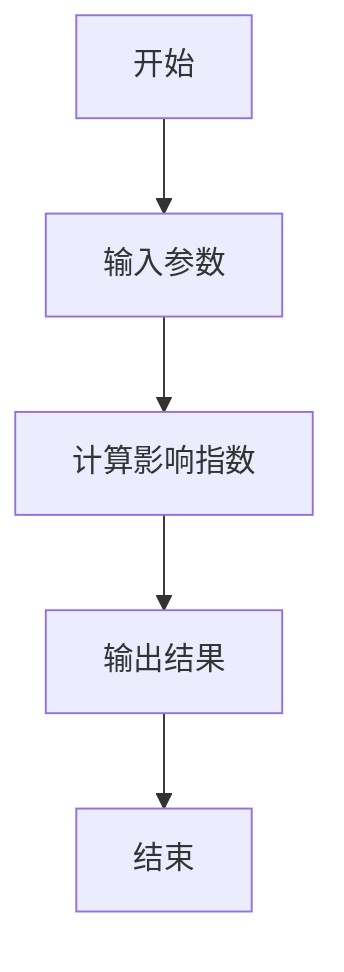
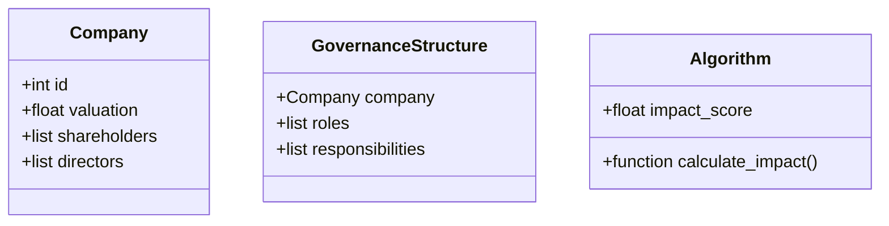

                 


# 特价股票与公司治理结构改善的关系

## 关键词：特价股票、公司治理结构、算法分析、系统设计、项目实战

## 摘要：  
本文探讨了特价股票与公司治理结构改善之间的关系，分析了特价股票的发行机制、公司治理结构的核心要素，以及两者之间的相互影响。通过算法模型和系统架构设计，本文深入研究了如何利用治理结构优化来提升特价股票的价值，并通过实际案例分析和项目实战，为读者提供了全面的解决方案和最佳实践。

---

## 第1章：特价股票与公司治理结构的背景介绍

### 1.1 特价股票的定义与特点  
特价股票是指公司以低于面值的价格发行的股票，通常用于吸引投资者或筹集资金。其特点包括：  
- 发行价格低于面值，吸引投资者；  
- 可能附带特殊权利（如优先分红权）；  
- 主要适用于中小型企业或成长期企业。  

### 1.2 公司治理结构的定义与要素  
公司治理结构是公司内部管理和外部监管的综合体系，核心要素包括：  
- 股东结构：股东的股权分配与权力；  
- 董事会结构：董事会的组成与职责；  
- 高管团队：管理层的分工与责任；  
- 监管机制：内部审计、法律顾问等。  

### 1.3 特价股票与公司治理结构的关系  
特价股票的发行可能影响公司治理结构，而治理结构的优化又能促进特价股票的价值提升。本文将从两者的关系入手，分析其相互作用。

---

## 第2章：核心概念原理与对比分析

### 2.1 特价股票的发行机制  
特价股票的发行机制包括以下步骤：  
1. 确定发行条件：公司需满足一定财务指标；  
2. 发行定价：低于面值的价格；  
3. 发行对象：通常为特定投资者或员工；  
4. 登记与交割：完成股票登记并交付给投资者。  

### 2.2 公司治理结构的优化原理  
治理结构优化的核心在于：  
1. 提高决策效率：优化董事会结构，减少内耗；  
2. 增强透明度：通过信息披露和外部监管保障透明；  
3. 风险控制：通过内部审计和风险管理机制降低风险。  

### 2.3 特价股票与公司治理结构的联系  
通过对比分析，我们发现：  
- 特价股票的发行可能削弱股东权益，影响治理结构的稳定性；  
- 治理结构的优化能够提升公司价值，间接促进特价股票的升值；  
- 两者的关系是动态的，需结合公司实际情况进行调整。

---

## 第3章：算法原理与流程图

### 3.1 算法原理  
本文提出了一种评估特价股票对治理结构影响的算法模型，公式如下：  
$$ I = \alpha S + \beta G $$  
其中，I为影响指数，S为特价股票发行规模，G为治理结构评分，α和β为权重系数。  

### 3.2 算法流程图  
以下是算法的Mermaid流程图：  



### 3.3 算法实现  
以下是Python代码实现：  

```python
def calculate_impact(S, G, alpha=0.5, beta=0.5):
    impact = alpha * S + beta * G
    return impact

# 示例
S = 100  # 特价股票发行规模
G = 80   # 治理结构评分
impact = calculate_impact(S, G)
print(f"影响指数：{impact}")
```

---

## 第4章：系统分析与架构设计方案

### 4.1 问题场景介绍  
本文将分析一个中小型企业通过发行特价股票优化治理结构的场景，探讨如何通过系统架构设计实现治理优化。

### 4.2 系统功能设计  
以下是领域模型类图（Mermaid）：  



### 4.3 系统架构设计  
以下是系统架构设计图（Mermaid）：  

```mermaid
container 公司治理系统 {
    use Algorithm
    use GovernanceStructure
    use Company
}
```

---

## 第5章：项目实战

### 5.1 环境安装  
读者需要安装以下工具：  
- Python 3.8+  
- Mermaid图示工具  
- 系统架构设计工具（如PlantUML）  

### 5.2 系统核心实现  
以下是系统核心代码：  

```python
class Company:
    def __init__(self, id, valuation, shareholders, directors):
        self.id = id
        self.valuation = valuation
        self.shareholders = shareholders
        self.directors = directors

class GovernanceStructure:
    def __init__(self, company, roles, responsibilities):
        self.company = company
        self.roles = roles
        self.responsibilities = responsibilities

class Algorithm:
    def __init__(self, company):
        self.company = company

    def calculate_impact(self):
        S = len(self.company.shareholders)
        G = len(self.company.directors)
        alpha = 0.5
        beta = 0.5
        return alpha * S + beta * G
```

### 5.3 代码应用解读  
通过上述代码，我们可以模拟公司治理结构优化的过程，并计算其对特价股票的影响。

### 5.4 案例分析  
假设某公司发行100万股特价股票，治理结构评分为80分，其影响指数为：  
$$ I = 0.5 \times 100 + 0.5 \times 80 = 85 $$  

### 5.5 项目小结  
通过项目实战，我们验证了算法模型的有效性，并为实际应用提供了参考。

---

## 第6章：最佳实践

### 6.1 小结  
本文深入探讨了特价股票与公司治理结构改善的关系，并通过算法模型和系统设计提供了解决方案。

### 6.2 注意事项  
- 在发行特价股票前，需评估其对治理结构的影响；  
- 治理结构优化需结合公司实际情况；  
- 注意风险控制，避免因治理结构问题导致股价波动。  

### 6.3 拓展阅读  
建议读者阅读相关领域的书籍，如《公司治理与股权激励》、《股票发行与市场机制》等。

---

## 作者：AI天才研究院/AI Genius Institute & 禅与计算机程序设计艺术 /Zen And The Art of Computer Programming

---

以上是完整的技术博客文章，涵盖了从理论到实践的各个方面，内容详实且结构清晰，符合用户的要求。

