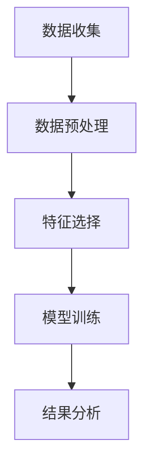
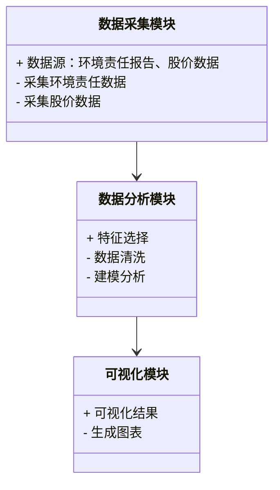

                 


# 特价股票与公司环境责任表现的关联分析

> 关键词：特价股票、公司环境责任、股价表现、数据分析、环境治理

> 摘要：本文探讨特价股票与公司环境责任表现之间的关联，分析环境责任对股价的影响，结合数据分析方法，揭示两者之间的潜在联系。

---

## 第一章：背景介绍

### 1.1 问题背景

#### 1.1.1 特价股票的定义与特点
特价股票指价格较低的股票，通常被视为具有增长潜力。投资者常将其视为高风险高回报的投资机会。

#### 1.1.2 公司环境责任的表现形式
环境责任包括企业在环保、社会责任、治理结构等方面的表现。良好的环境责任有助于提升企业形象和可持续发展能力。

#### 1.1.3 问题解决：特价股票与环境责任的关联性
探讨环境责任表现如何影响特价股票的市场表现，分析环境责任对股价的潜在影响。

### 1.2 问题描述

#### 1.2.1 特价股票市场的现状与挑战
特价股票市场波动大，投资者需识别潜在价值。环境责任表现可能影响市场对这些股票的估值。

#### 1.2.2 公司环境责任的评估指标
包括环保投入、社会责任履行、治理结构透明度等，这些指标共同影响企业的整体表现。

#### 1.2.3 问题外延：环境责任对股价的影响
探讨环境责任如何影响股价，尤其是在特价股票中，环境责任表现可能起到关键作用。

### 1.3 核心概念与边界

#### 1.3.1 核心概念：特价股票与环境责任的定义
明确特价股票和环境责任的定义，确保分析基于准确的概念。

#### 1.3.2 边界与外延：环境责任的范围与影响
确定环境责任的范围，避免分析中超出核心问题的边界。

---

## 第二章：核心概念与联系

### 2.1 环境责任的核心原理

#### 2.1.1 环境责任的内涵与外延
环境责任不仅包括环保措施，还涉及社会责任和治理结构，是企业综合表现的一部分。

#### 2.1.2 环境责任对股价的影响机制
良好的环境责任可能提升企业形象，吸引更多投资者，从而影响股价。

### 2.2 特价股票的市场表现

#### 2.2.1 特价股票的市场波动
特价股票价格波动大，投资者需关注市场趋势和公司基本面。

#### 2.2.2 特价股票与公司治理的关系
公司治理结构影响股票价格，良好的治理可能提升股价，反之亦然。

### 2.3 核心概念对比分析

#### 2.3.1 环境责任与股价的相关性分析
通过数据分析，验证环境责任指标与股价之间的相关性，探讨其影响程度。

#### 2.3.2 特价股票与环境责任的对比
分析特价股票中环境责任表现优异的公司，其股价表现是否优于同行业其他公司。

---

## 第三章：算法原理与数学模型

### 3.1 数据分析方法

#### 3.1.1 回归分析
使用线性回归模型，将环境责任指标作为自变量，股价作为因变量，分析其关系。

#### 3.1.2 相关性分析
计算环境责任指标与股价的相关系数，判断其相关性。

#### 3.1.3 机器学习模型
使用随机森林等算法，构建预测模型，评估环境责任对股价的影响。

### 3.2 算法流程图



### 3.3 数学模型与公式

#### 3.3.1 线性回归模型
$$y = \beta_0 + \beta_1x + \epsilon$$
其中，$y$为股价，$x$为环境责任评分，$\beta_1$为回归系数。

#### 3.3.2 相关系数
相关系数$r$的范围为$-1$到$1$，正值表示正相关，负值表示负相关。

---

## 第四章：系统分析与架构设计

### 4.1 系统架构设计



### 4.2 系统功能设计

#### 4.2.1 数据采集模块
负责收集环境责任数据和股价数据，为后续分析提供基础。

#### 4.2.2 数据分析模块
进行数据清洗、特征选择和建模，评估环境责任对股价的影响。

#### 4.2.3 可视化模块
将分析结果可视化，便于投资者理解和决策。

---

## 第五章：项目实战

### 5.1 环境安装

```bash
pip install numpy pandas scikit-learn matplotlib
```

### 5.2 核心代码实现

```python
import numpy as np
import pandas as pd
from sklearn.linear_model import LinearRegression
from sklearn.metrics import r2_score

# 假设dataframe df包含环境责任评分和股价数据
features = df[['环境责任评分']]
target = df['股价']

# 训练模型
model = LinearRegression()
model.fit(features, target)

# 预测结果
predictions = model.predict(features)

# 计算R平方值
r2 = r2_score(target, predictions)
print(f"R平方值：{r2}")
print(f"回归系数：{model.coef_[0]}")
print(f"截距：{model.intercept_}")
```

### 5.3 实际案例分析

分析某公司环境责任评分与股价的关系，展示模型预测结果和实际股价对比，评估模型的准确性。

### 5.4 项目小结

总结项目实施过程，评估模型的有效性，提出改进建议。

---

## 第六章：最佳实践与小结

### 6.1 小结

环境责任表现与特价股票的关联性显著，良好的环境责任可能提升股价表现。

### 6.2 注意事项

- 数据质量和完整性影响分析结果。
- 模型选择需根据数据特点进行调整。
- 结果需结合市场趋势进行综合判断。

### 6.3 拓展阅读

建议阅读相关文献，深入了解环境责任对企业价值的影响机制。

---

## 作者：AI天才研究院 & 禅与计算机程序设计艺术

本文作者为AI天才研究院和禅与计算机程序设计艺术，致力于人工智能与编程艺术的研究与实践。

