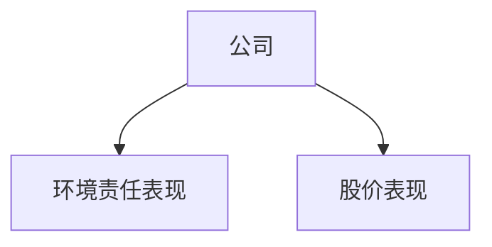
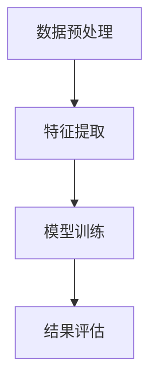

                 


# 目录大纲：《特价股票与公司环境责任表现的关联性研究》

## 第一部分：背景介绍

### 第1章：特价股票与公司环境责任表现的背景

#### 1.1 问题背景
- 1.1.1 特价股票的定义与特点
- 1.1.2 公司环境责任表现的定义与重要性
- 1.1.3 研究特价股票与环境责任表现的关联性的重要性

#### 1.2 问题描述
- 1.2.1 特价股票市场的现状与挑战
- 1.2.2 公司环境责任表现的评估标准
- 1.2.3 当前研究的空白与不足

#### 1.3 问题解决
- 1.3.1 研究目标的设定
- 1.3.2 研究方法的选择
- 1.3.3 数据收集与处理的步骤

#### 1.4 边界与外延
- 1.4.1 研究范围的界定
- 1.4.2 研究的局限性与适用场景
- 1.4.3 研究成果的潜在影响

#### 1.5 概念结构与核心要素
- 1.5.1 特价股票的核心要素
- 1.5.2 环境责任表现的关键属性
- 1.5.3 两者关联性的结构化分析

---

## 第二部分：核心概念与联系

### 第2章：核心概念的原理与联系

#### 2.1 核心概念的原理
- 2.1.1 特价股票的形成机制
- 2.1.2 公司环境责任表现的影响因素
- 2.1.3 两者关联性的理论基础

#### 2.2 环境责任表现与股价表现的属性对比
- 2.2.1 环境责任表现的评估指标
- 2.2.2 特价股票的市场特征
- 2.2.3 两者属性的对比分析

#### 2.3 ER实体关系图


---

## 第三部分：算法原理讲解

### 第3章：关联性分析的算法原理

#### 3.1 选择合适的算法
- 3.1.1 线性回归模型的原理
- 3.1.2 机器学习模型的选择

#### 3.2 算法步骤说明
- 3.2.1 数据预处理
- 3.2.2 模型训练
- 3.2.3 模型评估

#### 3.3 算法流程图


#### 3.4 数学模型与公式
- 3.4.1 线性回归公式
  $$ y = \beta_0 + \beta_1x + \epsilon $$
- 3.4.2 机器学习模型的损失函数
  $$ L = \frac{1}{n}\sum_{i=1}^{n}(y_i - \hat{y_i})^2 $$

#### 3.5 Python代码实现
```python
import pandas as pd
from sklearn.linear_model import LinearRegression

# 数据预处理
data = pd.read_csv('data.csv')
X = data[['环境责任评分']]
y = data['股价表现']

# 模型训练
model = LinearRegression()
model.fit(X, y)

# 模型评估
print('回归系数:', model.coef_)
print('截距:', model.intercept_)
```

---

## 第四部分：系统分析与架构设计方案

### 第4章：系统分析与架构设计

#### 4.1 问题场景介绍
- 4.1.1 数据收集与分析的流程
- 4.1.2 系统功能需求

#### 4.2 项目介绍
- 4.2.1 项目目标
- 4.2.2 项目范围
- 4.2.3 项目团队与角色

#### 4.3 系统功能设计
- 4.3.1 领域模型设计
  ```mermaid
  classDiagram
      class 公司 {
          名称
          环境责任评分
          股价表现
      }
      class 算法模型 {
          输入数据
          输出结果
      }
  ```

#### 4.4 系统架构设计
- 4.4.1 系统架构图
  ```mermaid
  graph TD
      A[数据层] --> B[业务逻辑层]
      B --> C[表现层]
  ```

#### 4.5 系统接口设计
- 4.5.1 接口定义
- 4.5.2 接口交互流程
  ```mermaid
  sequenceDiagram
      participant 用户
      participant 系统
      用户->系统: 提供数据
      系统->用户: 返回结果
  ```

---

## 第五部分：项目实战

### 第5章：项目实战

#### 5.1 环境安装与配置
- 5.1.1 安装Python
- 5.1.2 安装Pandas和Scikit-learn

#### 5.2 核心实现代码
```python
import pandas as pd
from sklearn.linear_model import LinearRegression
from sklearn.metrics import r2_score

# 加载数据
data = pd.read_csv('data.csv')

# 特征选择
X = data[['环境责任评分']]
y = data['股价表现']

# 训练模型
model = LinearRegression()
model.fit(X, y)

# 预测结果
predictions = model.predict(X)

# 评估模型
r2 = r2_score(y, predictions)
print('R平方值:', r2)
```

#### 5.3 代码功能解读与分析
- 5.3.1 数据加载与处理
- 5.3.2 模型训练过程
- 5.3.3 模型评估结果

#### 5.4 实际案例分析
- 5.4.1 案例背景
- 5.4.2 数据分析与解读
- 5.4.3 结果分析与策略建议

#### 5.5 项目小结
- 5.5.1 研究成果总结
- 5.5.2 可能的改进方向
- 5.5.3 实际应用中的注意事项

---

## 第六部分：最佳实践与总结

### 第6章：最佳实践与总结

#### 6.1 最佳实践 tips
- 6.1.1 数据质量的重要性
- 6.1.2 模型选择的策略
- 6.1.3 结果验证的方法

#### 6.2 小结
- 6.2.1 研究的主要发现
- 6.2.2 研究的意义与价值
- 6.2.3 未来研究的方向

#### 6.3 注意事项
- 6.3.1 数据的局限性
- 6.3.2 模型的适用场景
- 6.3.3 结果解释的合理性

#### 6.4 拓展阅读
- 6.4.1 推荐的相关书籍
- 6.4.2 建议的进一步研究领域
- 6.4.3 可参考的技术博客与资源

---

## 附录

### 附录A：数据来源说明
- 数据集的获取方式
- 数据清洗与预处理的具体步骤

### 附录B：参考文献
- 相关书籍与论文的引用

### 附录C：工具安装指南
- 安装Python、Pandas、Scikit-learn的详细步骤

### 附录D：术语表
- 专业术语的定义与解释

---

**作者：AI天才研究院/AI Genius Institute & 禅与计算机程序设计艺术 /Zen And The Art of Computer Programming**

---

### **正文**

> **关键词**：特价股票、公司环境责任、股价表现、关联性分析、数据驱动决策

> **摘要**：本文通过分析特价股票与公司环境责任表现之间的关联性，探讨环境责任如何影响股价表现。结合理论分析与实证研究，本文提出了一种基于线性回归的分析方法，并通过Python代码实现，展示了如何利用数据驱动的方法评估公司环境责任对股价的影响。

---

**接下来将根据上述大纲撰写完整的技术博客文章，涵盖各章节的具体内容。**

