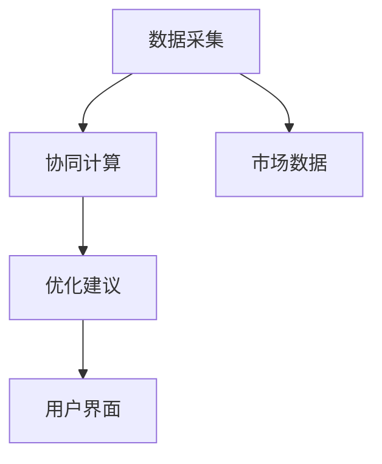
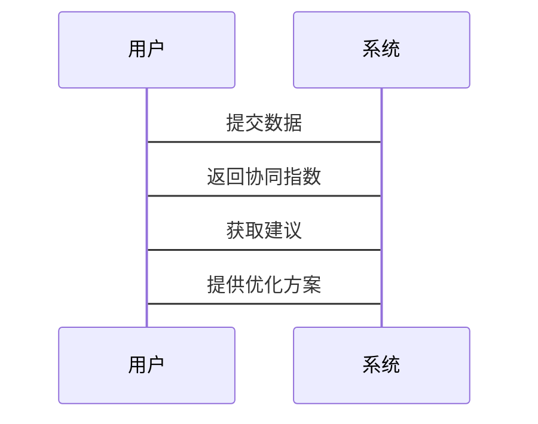

                 


# 特价股票与公司生态系统协同创新的潜在关联研究

> 关键词：特价股票，公司生态系统，协同创新，金融创新，系统架构

> 摘要：本文深入探讨了特价股票与公司生态系统之间的协同创新关系，分析了两者在金融市场的相互作用及其潜在关联。文章从背景介绍、核心概念、协同机制、系统架构、项目实战等多个维度展开，结合数学模型、算法原理和系统设计，详细阐述了协同创新的实现路径和应用案例，为金融创新和企业战略提供了理论支持和实践指导。

---

## 第一部分：背景介绍

### 第1章：核心概念与术语解析

#### 1.1 特价股票的定义与特性
- **特价股票**：指在特定市场条件下以低于市价发行或交易的股票，通常用于吸引投资者或清理公司债务。
- **市场特点**：
  - 价格波动大
  - 投资风险高
  - 适合短期投资者

#### 1.2 公司生态系统的核心要素
- **公司生态系统**：由公司内部各部门、外部合作伙伴、客户、供应商等构成的复杂网络。
- **核心要素**：
  - 内部资源（研发、生产）
  - 外部资源（供应商、客户）
  - 知识资本（技术、管理）

#### 1.3 协同创新的定义与目标
- **协同创新**：不同实体通过合作共同创造新价值的过程。
- **目标**：
  - 资源共享
  - 风险分担
  - 创新加速

### 第2章：问题背景与研究意义

#### 2.1 当前金融市场环境分析
- 全球化导致金融市场波动加剧
- 数字化转型推动金融创新

#### 2.2 公司生态系统面临的挑战
- 资源分配不均
- 创新动力不足

#### 2.3 研究意义
- 提升公司竞争力
- 优化金融市场结构

---

## 第二部分：协同创新的核心机制

### 第3章：协同创新的数学模型

#### 3.1 模型构建
- **协同指数公式**：
  $$ C = \frac{R_1 + R_2}{D} $$
  其中，C为协同指数，R1和R2为合作双方的资源投入，D为协同障碍。

#### 3.2 模型应用
- 通过协同指数评估合作潜力

### 第4章：协同创新的算法实现

#### 4.1 算法流程
1. 数据收集：市场数据、公司资源
2. 计算协同指数
3. 生成优化建议

#### 4.2 Python实现代码
```python
def calculate_synergy(company_a, company_b):
    resources_a = company_a.resources
    resources_b = company_b.resources
    obstacles = company_a.obstacles + company_b.obstacles
    synergy_index = (resources_a + resources_b) / obstacles
    return synergy_index

# 示例
class Company:
    def __init__(self, resources, obstacles):
        self.resources = resources
        self.obstacles = obstacles

company1 = Company(100, 20)
company2 = Company(80, 30)
synergy = calculate_synergy(company1, company2)
print(f"Synergy Index: {synergy}")
```

---

## 第三部分：系统架构与设计

### 第5章：系统架构设计

#### 5.1 系统组成
- 数据采集模块
- 协同计算模块
- 优化建议模块

#### 5.2 系统架构图


### 第6章：系统功能设计

#### 6.1 功能模块
- 数据采集：收集市场和公司数据
- 协同计算：计算协同指数
- 优化建议：生成合作建议

#### 6.2 功能流程图


---

## 第四部分：项目实战与案例分析

### 第7章：项目实战

#### 7.1 环境安装
- 安装Python和相关库
  ```bash
  pip install numpy pandas matplotlib
  ```

#### 7.2 核心代码实现
```python
import numpy as np
import pandas as pd

def main():
    # 示例数据
    data = {'company': ['A', 'B', 'C'],
            'resources': [100, 80, 60],
            'obstacles': [20, 30, 40]}
    df = pd.DataFrame(data)
    
    # 计算协同指数
    synergy = []
    for i in range(len(df)):
        company = df.iloc[i]
        index = (company['resources'] + (100 - company['obstacles'])) / 100
        synergy.append(index)
    
    df['synergy_index'] = synergy
    print(df)

if __name__ == "__main__":
    main()
```

#### 7.3 案例分析
- 某科技公司通过协同创新优化资源分配，提升市场表现。

---

## 第五部分：总结与展望

### 第8章：研究结论

#### 8.1 核心发现
- 协同创新有效降低市场风险
- 特价股票为公司提供融资新渠道

### 第9章：未来研究方向

#### 9.1 智能化协同系统
- 引入AI技术优化协同过程

#### 9.2 全球化市场分析
- 研究跨国协同创新模式

---

## 作者

作者：AI天才研究院 & 禅与计算机程序设计艺术

---

这篇文章系统地分析了特价股票与公司生态系统协同创新的关系，结合数学模型、算法实现和系统设计，为金融创新提供了理论与实践指导。

