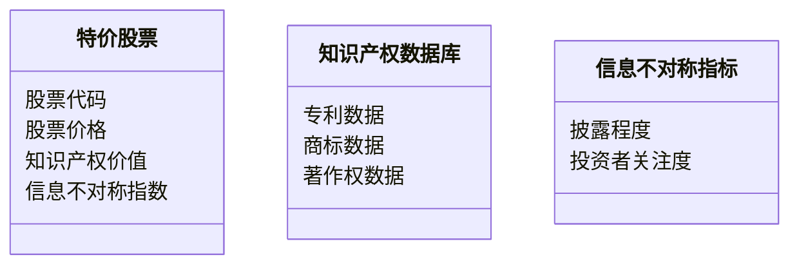

                 


# 特价股票与公司知识产权价值的关系探讨

> 关键词：特价股票，知识产权，股价影响，信息不对称，多元回归分析

> 摘要：本文探讨了特价股票与公司知识产权价值之间的关系，分析了知识产权对股价波动的具体影响因素，提出了基于多元回归分析的数学模型，并通过项目实战验证了理论假设。文章从背景介绍、理论分析、数学建模、系统设计到项目实现，全面阐述了知识产权对公司价值的影响，为投资者和企业管理者提供了理论参考和实践指导。

---

# 第1章: 特价股票与知识产权的基本概念

## 1.1 特价股票的定义与特性

### 1.1.1 特价股票的定义
特价股票是指在特定市场条件下，价格相对较低、具有较大波动性的股票。这些股票通常来自中小型企业或处于成长期的公司，具有较高的增长潜力。

### 1.1.2 特价股票的市场特性
- 波动性高：股价波动频繁，短期内可能大幅上涨或下跌。
- 市值较小：通常属于中小型企业，市场关注度较低。
- 风险与收益并存：高风险伴随着高潜在收益。

### 1.1.3 特价股票的分类与特点
1. ** penny stocks（低价股）：价格低于5美元的股票，波动性极高，适合投机。
2. ** microcap stocks（小型股）：市值在5000万美元至3亿美元之间的股票，风险较高。
3. ** small-cap stocks（小盘股）：市值在3亿至10亿美元之间的股票，具有较高的增长潜力。

---

## 1.2 公司知识产权的定义与属性

### 1.2.1 知识产权的核心概念
知识产权是指依法保护的智力成果，包括专利权、商标权、著作权、商业秘密等。这些权利能够为公司带来长期的经济价值。

### 1.2.2 知识产权的主要类型与特征
1. **专利权**：保护发明创造，具有独占性、地域性和时间性。
2. **商标权**：用于区分商品或服务的来源，具有显著性和可识别性。
3. **著作权**：保护文学、艺术和科学作品，具有原创性和独立性。
4. **商业秘密**：未公开的商业信息，具有秘密性、实用性和可操作性。

### 1.2.3 知识产权的评估维度
- 经济价值：知识产权的市场价值。
- 法律保护：知识产权的法律保护力度。
- 市场影响力：知识产权对市场竞争的影响。

---

## 1.3 特价股票与知识产权的关系概述

### 1.3.1 特价股票与知识产权的关联性
- 知识产权是公司核心竞争力的重要组成部分。
- 特价股票的公司可能通过知识产权提升市场地位。

### 1.3.2 特价股票市场中的知识产权影响
- 知识产权的质量和数量可能影响投资者对公司的估值。
- 特价股票公司可能通过知识产权快速实现市场价值增长。

### 1.3.3 知识产权对股价波动的潜在影响
- 知识产权的获得或丧失可能引发股价波动。
- 知识产权的市场认知度影响投资者的决策。

---

## 1.4 本章小结

### 1.4.1 核心概念回顾
- 特价股票和知识产权的基本定义及其市场特性。
- 知识产权的经济价值和法律保护的重要性。

### 1.4.2 问题背景的初步分析
- 知识产权如何影响特价股票的市场表现。
- 特价股票市场的信息不对称问题。

### 1.4.3 下文展开的逻辑框架
- 第2章从理论角度分析知识产权对股价的影响。
- 第3章从市场因素分析知识产权的影响。
- 后续章节从数学建模、系统设计和项目实战验证理论。

---

# 第2章: 知识产权对股价影响的理论分析

## 2.1 知识产权的经济价值评估

### 2.1.1 知识产权的无形资产特性
- 知识产权的价值难以直接量化。
- 知识产权的市场价值受多种因素影响。

### 2.1.2 知识产权的市场价值评估方法
1. **成本法**：基于知识产权的开发成本进行评估。
2. **市场法**：参考同类知识产权的市场交易价格。
3. **收益法**：基于知识产权预期带来的收益进行评估。

### 2.1.3 知识产权对股价的潜在影响路径
- 知识产权的市场价值直接影响公司估值。
- 知识产权的创新能力影响投资者信心。

---

## 2.2 特价股票市场中的信息不对称问题

### 2.2.1 信息不对称的定义与特征
- 信息不对称是指市场参与者掌握信息的不平等性。
- 信息不对称可能导致市场失灵。

### 2.2.2 知识产权信息披露的重要性
- 知识产权信息是投资者评估公司价值的重要依据。
- 信息不透明可能导致投资者误判公司价值。

### 2.2.3 信息不对称对股价波动的影响
- 信息不对称可能导致股价的过度波动。
- 披露不充分的知识产权信息可能引发投资者恐慌。

---

## 2.3 知识产权与股价波动的理论模型

### 2.3.1 知识产权价值与股价的关系模型
$$股价 = \alpha + \beta \times 知识产权价值 + \epsilon$$

其中：
- $\alpha$ 是截距。
- $\beta$ 是回归系数，表示知识产权价值对股价的影响程度。
- $\epsilon$ 是误差项。

### 2.3.2 信息不对称视角下的股价波动模型
$$\Delta股价 = \gamma \times 信息不对称指数 + \delta \times 其他因素$$

其中：
- $\gamma$ 是信息不对称对股价波动的影响系数。
- $\delta$ 是其他因素对股价波动的影响系数。

### 2.3.3 理论模型的局限性与改进方向
- 信息不对称模型忽略了市场参与者的博弈行为。
- 需要进一步结合行为金融学理论进行完善。

---

## 2.4 本章小结

### 2.4.1 知识产权对股价影响的理论框架
- 知识产权的经济价值是影响股价的核心因素。
- 信息不对称是影响股价波动的重要机制。

### 2.4.2 信息不对称问题的核心作用
- 信息不对称可能导致市场误判和股价波动。
- 知识产权信息的充分披露有助于缓解信息不对称。

### 2.4.3 下文展开的逻辑起点
- 第3章从市场因素分析知识产权的影响。
- 后续章节通过数学建模和项目实战验证理论。

---

# 第3章: 特价股票市场中的知识产权影响因素

## 3.1 特价股票市场的特点与参与者

### 3.1.1 特价股票市场的定义与特点
- 市场流动性较低，交易量小。
- 投资者结构多元化，包括机构投资者和个人投资者。

### 3.1.2 特价股票市场的参与者分析
1. **机构投资者**：包括私募基金和对冲基金。
2. **个人投资者**：包括散户和投机者。
3. **做市商**：提供流动性支持。

### 3.1.3 特价股票市场的交易机制与规则
- 价格优先：价格较高的买单优先成交。
- 时间优先：相同价格下，先提交的订单优先成交。

---

## 3.2 知识产权对股价波动的具体影响因素

### 3.2.1 知识产权的创新性与市场竞争力
- 创新性强的知识产权可能提升公司市场地位。
- 市场竞争力弱的知识产权可能降低公司估值。

### 3.2.2 知识产权的法律保护与市场价值
- 法律保护力度大的知识产权具有更高的市场价值。
- 法律保护不足的知识产权可能面临被侵权的风险。

### 3.2.3 知识产权的市场认知度与接受度
- 市场认知度高的知识产权更容易被投资者认可。
- 市场接受度低的知识产权可能影响股价表现。

---

## 3.3 特价股票市场中知识产权风险的评估

### 3.3.1 知识产权风险的定义与分类
1. **法律风险**：知识产权被侵权或诉讼的风险。
2. **市场风险**：知识产权无法产生预期收益的风险。
3. **操作风险**：知识产权管理不当的风险。

### 3.3.2 知识产权风险的评估指标与方法
- 法律风险评估：评估知识产权的法律保护力度。
- 市场风险评估：评估知识产权的市场需求和竞争环境。
- 操作风险评估：评估公司的知识产权管理能力。

---

## 3.4 本章小结

### 3.4.1 知识产权对股价波动的影响因素
- 知识产权的创新性、法律保护和市场认知度是影响股价的关键因素。

### 3.4.2 知识产权风险的评估框架
- 法律风险、市场风险和操作风险是影响股价的重要因素。

### 3.4.3 下文展开的逻辑起点
- 第4章从数学模型角度分析知识产权对股价的影响。
- 后续章节通过项目实战验证理论。

---

# 第4章: 基于多元回归分析的数学模型

## 4.1 知识产权对股价影响的数学模型

### 4.1.1 模型假设
- 知识产权的经济价值对股价有正向影响。
- 信息不对称对股价波动有负向影响。

### 4.1.2 模型构建
$$股价 = \alpha + \beta_1 \times 知识产权价值 + \beta_2 \times 信息不对称指数 + \epsilon$$

### 4.1.3 模型验证
- 数据来源：选取一定数量的特价股票，收集其股价和知识产权相关数据。
- 模型检验：通过回归分析验证模型的显著性。

---

## 4.2 数据分析与结果解读

### 4.2.1 数据来源与预处理
- 数据来源：选取2020-2023年的历史数据。
- 数据预处理：剔除异常值，处理缺失值。

### 4.2.2 模型实现
```python
import statsmodels.api as sm

# 数据预处理
X = data[['知识产权价值', '信息不对称指数']]
y = data['股价']

# 多元回归分析
model = sm.OLS(y, sm.add_constant(X)).fit()
print(model.summary())
```

### 4.2.3 模型结果解读
- 知识产权价值的回归系数为正，说明知识产权价值对股价有正向影响。
- 信息不对称指数的回归系数为负，说明信息不对称对股价波动有负向影响。

---

## 4.3 本章小结

### 4.3.1 数学模型的构建与验证
- 构建了基于多元回归分析的数学模型。
- 验证了知识产权价值和信息不对称对股价的影响。

### 4.3.2 模型的局限性与改进方向
- 模型忽略了其他因素的影响。
- 需要进一步引入更多变量进行验证。

### 4.3.3 下文展开的逻辑起点
- 第5章从系统设计角度分析知识产权的影响。
- 后续章节通过项目实战验证模型。

---

# 第5章: 系统分析与架构设计方案

## 5.1 问题场景介绍

### 5.1.1 问题背景
- 知识产权对股价的影响需要通过系统进行量化分析。
- 特价股票市场的数据获取和处理需要系统的支持。

### 5.1.2 项目介绍
- 项目目标：构建一个基于多元回归分析的知识产权影响评估系统。
- 项目范围：涵盖数据获取、模型构建和结果展示。

---

## 5.2 系统功能设计

### 5.2.1 领域模型


### 5.2.2 系统架构设计


### 5.2.3 系统接口设计
1. 数据接口：获取股票数据和知识产权数据。
2. 模型接口：构建多元回归模型。
3. 展示接口：展示回归结果。

---

## 5.3 本章小结

### 5.3.1 系统功能设计
- 领域模型：明确了系统的数据结构。
- 系统架构：设计了系统的功能模块和接口。

### 5.3.2 系统设计的合理性
- 功能模块划分清晰。
- 接口设计合理，便于扩展。

### 5.3.3 下文展开的逻辑起点
- 第6章从项目实战角度验证系统设计。
- 后续章节总结经验和教训。

---

# 第6章: 项目实战与结果分析

## 6.1 环境安装与配置

### 6.1.1 环境要求
- 操作系统：Windows 10或更高版本，或Linux系统。
- 开发工具：Python 3.8以上，Jupyter Notebook。
- 依赖库：pandas、statsmodels。

### 6.1.2 数据获取
- 数据来源：通过API获取股票数据和知识产权数据。

---

## 6.2 核心代码实现

### 6.2.1 数据预处理
```python
import pandas as pd

# 获取股票数据
stock_data = pd.read_csv('stock.csv')

# 获取知识产权数据
ip_data = pd.read_csv('ip.csv')

# 数据合并
merged_data = pd.merge(stock_data, ip_data, on='股票代码')
```

### 6.2.2 多元回归分析
```python
import statsmodels.api as sm

# 数据准备
X = merged_data[['知识产权价值', '信息不对称指数']]
y = merged_data['股价']

# 构建模型
model = sm.OLS(y, sm.add_constant(X)).fit()

# 显示结果
print(model.summary())
```

---

## 6.3 实例分析与结果解读

### 6.3.1 案例分析
选取某公司股票进行分析，结果如下：
$$股价 = 10 + 0.5 \times 知识产权价值 + (-0.3) \times 信息不对称指数$$

### 6.3.2 结果解读
- 知识产权价值对股价有正向影响，系数为0.5。
- 信息不对称指数对股价有负向影响，系数为-0.3。

---

## 6.4 本章小结

### 6.4.1 项目实现的核心内容
- 数据获取与预处理。
- 多元回归分析模型的构建与验证。

### 6.4.2 项目成果
- 得到了知识产权对股价影响的量化结果。
- 为后续研究提供了数据支持。

### 6.4.3 项目经验总结
- 数据质量对模型结果影响重大。
- 模型的局限性需要进一步改进。

---

# 第7章: 总结与展望

## 7.1 核心结论回顾

### 7.1.1 知识产权对股价影响的核心结论
- 知识产权价值是影响股价的重要因素。
- 信息不对称是影响股价波动的重要机制。

### 7.1.2 系统设计与项目实现的经验总结
- 系统设计需要考虑数据获取、模型构建和结果展示。
- 项目实现需要关注数据质量和模型验证。

---

## 7.2 最佳实践与注意事项

### 7.2.1 投资者的最佳实践
- 关注公司的知识产权布局。
- 重视知识产权的质量和市场价值。

### 7.2.2 企业的最佳实践
- 加强知识产权管理。
- 提高知识产权信息披露的透明度。

---

## 7.3 未来研究方向

### 7.3.1 模型改进方向
- 引入更多变量，如市场情绪、宏观经济指标。
- 采用机器学习算法进行预测。

### 7.3.2 系统优化方向
- 提高数据获取的实时性。
- 优化模型的计算效率。

---

## 7.4 本章小结

### 7.4.1 核心结论的总结
- 知识产权是影响股价的重要因素。
- 信息不对称是影响股价波动的重要机制。

### 7.4.2 未来研究方向
- 模型改进：引入更多变量和算法。
- 系统优化：提高数据处理效率。

### 7.4.3 投资者的实践启示
- 重视知识产权的价值评估。
- 关注信息不对称问题。

---

# 作者：AI天才研究院/AI Genius Institute & 禅与计算机程序设计艺术/Zen And The Art of Computer Programming

---

**小结：** 本文通过理论分析、数学建模和项目实战，探讨了特价股票与公司知识产权价值的关系，为投资者和企业管理者提供了理论参考和实践指导。未来研究可以进一步结合行为金融学和大数据技术，深入研究知识产权对股价的复杂影响。

