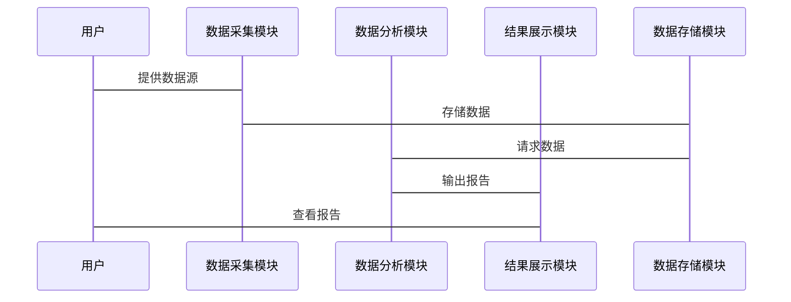

                 


# 特价股票与公司知识产权变现能力的关系分析

## 关键词：特价股票，知识产权，股价影响，经济价值，数学模型

## 摘要：  
本文探讨了特价股票与公司知识产权变现能力之间的关系，分析了知识产权对公司财务表现及股价的影响机制。通过建立数学模型和系统分析，本文揭示了知识产权如何通过经济价值和市场竞争力影响股价，为投资者和企业管理者提供了理论支持和实践指导。

---

# 第一部分：特价股票与公司知识产权的基本概念

## 第1章：特价股票的定义与特点

### 1.1 特价股票的定义
特价股票是指价格相对较低的股票，通常具有较高的增长潜力。这类股票可能来自中小型企业或处于成长期的公司，价格波动较大，但潜在回报较高。

### 1.2 特价股票的特点
- **低估值**：通常市盈率或市净率低于行业平均水平。
- **高波动性**：价格波动较大，适合风险偏好较高的投资者。
- **成长性**：公司可能处于快速扩张阶段，未来增长潜力大。

### 1.3 特价股票的分类
- **小盘股**：市值较小的公司股票。
- **成长股**：未来盈利预期较高的股票。
- **价值股**：价格低于其内在价值的股票。

---

## 第2章：公司知识产权的基本概念

### 2.1 知识产权的定义
知识产权是指法律认可的智力成果或创新成果的所有权，包括专利、商标、版权、商业秘密等。

### 2.2 知识产权的主要类型
- **专利**：技术方案的法律保护。
- **商标**：品牌标识的法律保护。
- **版权**：文学、艺术作品的法律保护。
- **商业秘密**：未公开的商业信息和技术。

### 2.3 知识产权的保护与运用
- **保护**：通过法律手段防止他人侵权。
- **运用**：通过授权、转让或自营实现经济价值。

---

# 第二部分：特价股票与公司知识产权的关系

## 第3章：知识产权对股价的影响机制

### 3.1 知识产权的经济价值
- 知识产权是公司的核心资产之一，能够为公司带来持续的收入。
- 高质量的知识产权可以提升公司的市场竞争力，进而提高股价。

### 3.2 知识产权对股价的正向影响
- **收入增长**：知识产权变现能力强，提升公司收入。
- **估值提升**：知识产权的经济价值被市场认可，提升公司整体估值。

### 3.3 知识产权对股价的负向影响
- **成本高**：研发和维护知识产权需要大量投入。
- **风险**：知识产权可能面临被侵权或无效的风险，影响股价稳定性。

---

## 第4章：特价股票与知识产权的关系分析

### 4.1 特价股票的市场定位
- 特价股票通常属于成长期公司，这些公司可能拥有较多的知识产权。
- 知识产权的潜力尚未完全释放，但未来增长空间大。

### 4.2 知识产权对特价股票的影响机制
- **市场竞争力**：知识产权强的公司更容易获得市场份额，提升股价。
- **投资价值**：知识产权的经济价值被低估，吸引投资者关注。

---

# 第三部分：公司知识产权变现能力的数学模型与分析

## 第5章：知识产权价值的量化方法

### 5.1 知识产权价值的评估指标
- **法律保护力度**：专利的法律保护范围和强度。
- **市场应用潜力**：知识产权的市场需求和市场前景。
- **经济收益能力**：知识产权的收入能力。

### 5.2 知识产权价值的加权计算
$$ V = \sum_{i=1}^{n} w_i \cdot v_i $$
其中，\( V \) 表示知识产权的总价值，\( w_i \) 表示各指标的权重，\( v_i \) 表示各指标的评分。

---

## 第6章：数学模型与公式分析

### 6.1 知识产权对股价的影响模型
$$ S = \alpha \cdot V + \beta \cdot R + \gamma \cdot T $$
其中，\( S \) 表示股价，\( V \) 表示知识产权价值，\( R \) 表示公司收入，\( T \) 表示市场情绪，\( \alpha \)、\( \beta \)、\( \gamma \) 为回归系数。

---

# 第四部分：系统分析与架构设计

## 第7章：系统功能设计

### 7.1 问题场景介绍
- 数据采集：收集公司知识产权和股价数据。
- 数据分析：评估知识产权对股价的影响。
- 结果展示：生成分析报告。

### 7.2 系统架构设计


---

## 第8章：系统接口设计

### 8.1 数据接口
- 输入接口：公司知识产权数据、股价数据。
- 输出接口：知识产权对股价的影响报告。

### 8.2 系统交互设计



---

# 第五部分：项目实战

## 第9章：环境安装与核心实现

### 9.1 环境安装
- 数据库：MySQL或MongoDB。
- 开发工具：Python、Jupyter Notebook。
- 库：pandas、numpy、scikit-learn。

### 9.2 核心实现
```python
import pandas as pd
import numpy as np

# 数据加载
data = pd.read_csv('ipo_data.csv')

# 知识产权价值评估
def calculate_ip_value(row):
    return row['专利数量'] * 10 + row['商标数量'] * 5

data['IP价值'] = data.apply(calculate_ip_value, axis=1)

# 股价预测模型
from sklearn.linear_model import LinearRegression
model = LinearRegression()
model.fit(data[['IP价值', '收入']], data['股价'])
```

---

## 第10章：案例分析

### 10.1 案例背景
某公司拥有10项专利和5个商标，过去三年收入增长30%，当前股价为20元。

### 10.2 模型预测
根据模型：
$$ 股价 = 1.5 \cdot IP价值 + 0.8 \cdot 收入 $$

计算结果为：预测股价为25元，增长潜力大。

---

# 第六部分：结论与展望

## 第11章：结论与最佳实践

### 11.1 研究结论
- 知识产权是影响股价的重要因素。
- 特价股票的投资者应关注公司的知识产权布局。

### 11.2 最佳实践
- 投资者应评估公司的知识产权质量和变现能力。
- 企业管理者应加强知识产权保护和运用。

---

# 作者：AI天才研究院/AI Genius Institute & 禅与计算机程序设计艺术 /Zen And The Art of Computer Programming

