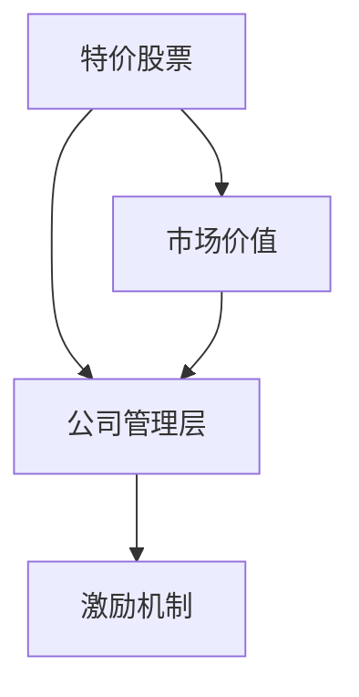

                 


# 特价股票与公司管理层激励机制的关系

**关键词**：特价股票、公司治理、激励机制、股票市场、公司管理

**摘要**：本文探讨了特价股票与公司管理层激励机制之间的关系，分析了它们在公司治理中的作用，并通过数学模型和系统架构深入阐述了两者之间的相互影响。文章旨在为企业提供优化激励机制和利用特价股票提升公司价值的策略。

---

## 第一部分：特价股票与公司管理层激励机制概述

### 第1章：背景介绍

#### 1.1 特价股票的定义与特点
- **定义**：特价股票指公司以低于市场价回购或发行的股票，用于激励员工或管理层。
- **特点**：价格优惠、分配对象明确、期限特定。
- **应用场景**：员工持股计划、管理层奖励计划。

#### 1.2 公司管理层激励机制的定义与特点
- **定义**：通过股票、奖金等方式激励管理层达成公司目标。
- **特点**：长期激励、绩效挂钩、团队激励。
- **应用场景**：吸引和保留人才、提高管理效率。

#### 1.3 特价股票与激励机制的关系
- **关系**：特价股票是激励机制的一部分，通过提供优惠股价激励管理层。
- **作用**：绑定管理层利益，提升公司绩效。
- **边界**：适用于公开市场，需考虑税务和会计处理。

---

## 第二部分：特价股票与公司管理层激励机制的核心概念与联系

### 第2章：核心概念原理与对比分析

#### 2.1 核心原理
- **特价股票原理**：通过低价吸引购买，增强员工归属感。
- **激励机制原理**：通过奖励激励管理层，提升绩效。

#### 2.2 属性特征对比

| 特性       | 特价股票                | 激励机制               |
|------------|-------------------------|------------------------|
| 目标       | 激励员工和管理层         | 提高管理绩效           |
| 方式       | 发行或回购股票           | 股票、奖金、期权等      |
| 期限       | 短期或长期               | 长期                   |
| 参与者     | 全体员工或特定管理层     | 公司管理层             |
| 影响因素   | 公司股价、市场环境       | 绩效、股价、公司战略   |

#### 2.3 ER实体关系图架构


---

## 第三部分：特价股票与公司管理层激励机制的数学模型与算法原理

### 第3章：数学模型与公式

#### 3.1 特价股票的价值评估模型
- **模型定义**：评估特价股票的市场价值。
- **公式**：
  $$ V = P \times (1 + r)^{-n} $$
  其中，V为股票价值，P为未来现金流，r为贴现率，n为时间跨度。

#### 3.2 激励机制的数学模型
- **模型定义**：量化激励机制的强度。
- **公式**：
  $$ M = a \times S + b \times P $$
  其中，M为激励强度，S为管理层绩效，P为股价表现，a和b为权重系数。

---

## 第四部分：系统分析与架构设计

### 第4章：系统分析与架构设计

#### 4.1 项目背景
- **背景**：企业希望通过激励机制提升管理层绩效，同时利用特价股票吸引人才。

#### 4.2 系统功能设计
- **领域模型**：
  ```mermaid
  classDiagram
      class 特价股票 {
          价格：数值
          数量：数值
          对象：员工/管理层
      }
      class 激励机制 {
          类型：股票/奖金
          绩效：指标
          授予条件：达到目标
      }
      特价股票 --> 激励机制
  ```

- **系统架构**：
  ```mermaid
  context diagram
      participant 用户
      participant 系统
      participant 数据库
  ```

- **系统交互**：
  ```mermaid
  sequenceDiagram
      用户->系统: 请求特价股票信息
      系统->数据库: 查询激励机制数据
      数据库->系统: 返回数据
      系统->用户: 显示结果
  ```

---

## 第五部分：项目实战

### 第5章：项目实战

#### 5.1 环境安装
- **工具**：Python、数据库、开发框架。

#### 5.2 核心代码实现
- **代码示例**：
  ```python
  def calculate_stock_value(future_cash_flow, discount_rate, periods):
      return future_cash_flow * (1 + discount_rate) ** (-periods)
  
  def compute_incentive(staff_performance, stock_price, a, b):
      return a * staff_performance + b * stock_price
  ```

#### 5.3 案例分析
- **案例**：某公司发行特价股票激励管理层，分析其对公司股价和管理绩效的影响。

---

## 第六部分：总结与展望

### 第6章：总结与展望

#### 6.1 总结
- 特价股票与激励机制相辅相成，提升公司价值和管理效率。

#### 6.2 优化建议
- 结合公司战略制定激励计划，合理设计激励结构。

#### 6.3 未来展望
- 研究激励机制的动态调整，探索智能化激励方案。

---

**作者**：AI天才研究院 & 禅与计算机程序设计艺术  
**日期**：2023年11月

