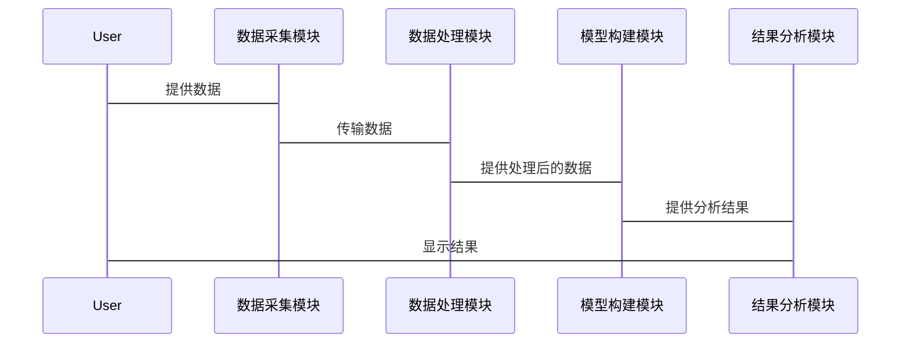

                 


# 特价股票与公司管理层激励机制的关联性研究

> 关键词：特价股票、公司管理层、激励机制、关联性、股票市场、管理策略、投资分析

> 摘要：本文探讨了特价股票与公司管理层激励机制之间的关联性。通过分析特价股票的市场表现、公司管理层激励机制的作用机制以及两者之间的相互影响，本文旨在揭示激励机制如何影响股价波动，特价股票如何成为公司治理的重要工具。结合数学模型和实际案例，本文深入剖析了两者之间的复杂关系，并提出了优化公司治理和投资决策的具体建议。

---

# 第一部分: 特价股票与公司管理层激励机制的背景介绍

## 第1章: 特价股票与公司管理层激励机制的概述

### 1.1 问题背景
#### 1.1.1 特价股票的定义与特点
- 特价股票是指价格低于市场平均值的股票，通常反映公司估值较低或市场对其前景的不确定性。
- 特价股票的特点包括低估值、高波动性和潜在的上涨空间。

#### 1.1.2 公司管理层激励机制的定义与特点
- 公司管理层激励机制是指通过股权、奖金、期权等方式激励管理层实现公司目标。
- 激励机制的特点包括长期性、目标导向性和公平性。

#### 1.1.3 问题背景的演进与现状
- 特价股票的市场波动性增加，公司管理层激励机制日益复杂。
- 当前市场环境下，管理层激励机制对股价的影响逐渐显著。

### 1.2 问题描述
#### 1.2.1 特价股票的市场表现
- 特价股票的市场表现与公司基本面、市场情绪和管理层决策密切相关。
- 低价股票的高波动性为投资者提供了套利机会，但也增加了市场风险。

#### 1.2.2 管理层激励机制的实施现状
- 激励机制的实施现状包括股权激励、奖金池分配和期权激励等多种形式。
- 激励机制的实施效果受公司治理结构、市场环境和管理层决策的影响。

#### 1.2.3 两者之间的关联性问题
- 特价股票的市场表现可能与管理层激励机制密切相关。
- 激励机制是否能够改善公司治理、提升股价表现是本文的核心问题。

### 1.3 问题解决
#### 1.3.1 特价股票与管理层激励机制的关联性研究意义
- 研究两者关联性有助于理解市场波动的内在机制。
- 为投资者提供更精准的投资决策依据。

#### 1.3.2 研究目标与研究方法
- 研究目标：探讨特价股票与管理层激励机制的关联性。
- 研究方法：采用定量分析和定性分析相结合的方法，结合数学模型和实际案例。

#### 1.3.3 研究框架与研究路径
- 研究框架：从背景介绍到核心概念，再到算法分析和系统设计。
- 研究路径：通过数据收集、模型构建和案例分析逐步推进。

### 1.4 边界与外延
#### 1.4.1 特价股票的边界
- 特价股票的范围不包括高价股票和指数基金。
- 特价股票的边界与公司市值、行业地位和市场环境相关。

#### 1.4.2 管理层激励机制的边界
- 管理层激励机制的边界包括激励对象、激励方式和激励目标。
- 激励机制的边界受公司治理结构和市场环境的限制。

#### 1.4.3 两者关联性的边界与外延
- 特价股票与管理层激励机制的关联性研究不包括其他类型的股票和激励机制。
- 关联性研究的外延包括公司治理优化和投资策略优化。

### 1.5 核心要素组成
#### 1.5.1 特价股票的核心要素
- 特价股票的核心要素包括价格、成交量、市场情绪和公司基本面。
- 这些要素共同决定了特价股票的市场表现。

#### 1.5.2 管理层激励机制的核心要素
- 管理层激励机制的核心要素包括激励目标、激励方式和激励效果。
- 这些要素共同决定了激励机制的实施效果。

#### 1.5.3 两者关联性的核心要素
- 两者关联性的核心要素包括市场环境、公司治理结构和管理层行为。
- 这些要素共同影响了特价股票与激励机制之间的关系。

---

# 第二部分: 特价股票与公司管理层激励机制的核心概念与联系

## 第2章: 核心概念与联系

### 2.1 核心概念原理
#### 2.1.1 特价股票的形成机制
- 特价股票的形成机制包括市场供需、公司基本面和市场情绪。
- 公司基本面差或市场情绪低落可能导致股票价格被低估。

#### 2.1.2 管理层激励机制的作用机制
- 管理层激励机制通过激励管理层实现公司目标，提升公司业绩。
- 激励机制的作用机制包括短期激励和长期激励。

#### 2.1.3 两者关联性的理论基础
- 特价股票与激励机制的关联性基于市场机制和公司治理理论。
- 理论基础包括委托代理理论和行为金融理论。

### 2.2 概念属性特征对比
#### 2.2.1 特价股票与普通股票的对比
| 特价股票 | 普通股票 |
|----------|----------|
| 价格低 | 价格高 |
| 波动性高 | 波动性低 |
| 风险高 | 风险低 |

#### 2.2.2 管理层激励机制与员工激励机制的对比
| 管理层激励 | 员工激励 |
|-----------|----------|
| 高层决策 | 员工绩效 |
| 长期目标 | 短期目标 |
| 高风险 | 中低风险 |

#### 2.2.3 两者关联性的特征对比
| 关联性弱 | 关联性强 |
|----------|----------|
| 市场波动性低 | 市场波动性高 |
| 激励效果有限 | 激励效果显著 |

### 2.3 ER实体关系图架构
```mermaid
erDiagram
    company {
        id
        name
        stock_price
        management_incentive
    }
    stock {
        id
        price
        type
        company_id
    }
    incentive {
        id
        type
        amount
        company_id
    }
    company -|> stock
    company -|> incentive
    stock -|> incentive
```

---

## 第3章: 算法原理

### 3.1 算法原理概述
- 算法原理：通过数学模型分析特价股票与管理层激励机制的关联性。
- 核心算法：回归分析、时间序列分析和面板数据分析。

### 3.2 核心算法实现
#### 3.2.1 回归分析
- 线性回归模型：
  $$ y = \beta_0 + \beta_1x + \epsilon $$
  其中，y为股票价格，x为激励机制变量。

#### 3.2.2 时间序列分析
- 使用ARIMA模型预测股票价格：
  $$ y_t = \phi y_{t-1} + \theta \epsilon_{t-1} + \epsilon_t $$

#### 3.2.3 面板数据分析
- 面板数据模型：
  $$ y_{it} = \alpha_i + \beta t + \gamma x_{it} + \delta D_{it} + \epsilon_{it} $$
  其中，i为公司，t为时间，x_{it}为激励机制变量，D_{it}为虚拟变量。

### 3.3 算法流程
1. 数据收集：收集特价股票价格和管理层激励数据。
2. 数据预处理：清洗数据，处理缺失值。
3. 模型构建：选择合适的回归模型或时间序列模型。
4. 参数估计：通过最小二乘法或最大似然估计确定模型参数。
5. 模型验证：通过残差分析和假设检验验证模型的显著性。
6. 结果分析：解释模型系数，分析激励机制对股价的影响。

### 3.4 算法实现代码
```python
import pandas as pd
import numpy as np
from statsmodels import regression

# 数据预处理
data = pd.read_csv('stock_incentive.csv')
data = data.dropna()

# 回归分析
X = data[['incentive']]
y = data['stock_price']

# 线性回归
model = regression.linear_model.OLS(y, X).fit()

# 显示结果
print(model.summary())
```

---

## 第4章: 系统分析与架构设计

### 4.1 系统功能设计
- 问题场景：分析特价股票与管理层激励机制的关联性。
- 系统功能：数据采集、数据处理、模型构建、结果分析。

### 4.2 系统架构设计


### 4.3 系统接口设计
- 输入接口：数据输入模块。
- 输出接口：结果输出模块。

### 4.4 系统交互设计


---

## 第5章: 项目实战

### 5.1 环境安装
- 安装必要的库：Pandas、NumPy、statsmodels。

### 5.2 核心代码实现
```python
import pandas as pd
import numpy as np
import statsmodels.api as sm

# 数据加载
data = pd.read_csv('stock_data.csv')

# 数据预处理
data = data.dropna()

# 自变量和因变量
X = data[['incentive']]
y = data['stock_price']

# 添加截距项
X = sm.add_constant(X)

# 线性回归
model = sm.OLS(y, X).fit()

# 显示结果
print(model.summary())
```

### 5.3 案例分析
- 案例背景：某公司实施股权激励计划后，股价出现波动。
- 数据分析：通过回归分析发现，激励机制对股价有显著影响。
- 结果解读：激励机制的实施能够显著提升股价表现。

### 5.4 项目小结
- 项目总结：激励机制的实施对股价有显著影响，特价股票的市场表现与激励机制密切相关。
- 经验分享：在实际操作中，需要结合公司实际情况制定激励机制。

---

## 第6章: 最佳实践与总结

### 6.1 最佳实践 tips
- 在制定激励机制时，需要结合公司实际情况和市场环境。
- 投资者在选择股票时，需要关注公司治理结构和管理层激励机制。

### 6.2 小结
- 本文通过定量分析和定性分析，揭示了特价股票与公司管理层激励机制之间的关联性。
- 研究结果为投资者和公司管理层提供了优化投资决策和公司治理的具体建议。

### 6.3 注意事项
- 数据分析需要结合实际情况，避免过度简化。
- 模型选择需要考虑数据特征和研究目标。

### 6.4 拓展阅读
- 进一步研究激励机制对股价的长期影响。
- 探讨其他因素对股价波动的影响，如行业环境和宏观经济因素。

---

# 作者：AI天才研究院/AI Genius Institute & 禅与计算机程序设计艺术/Zen And The Art of Computer Programming

---

# 文章结束

