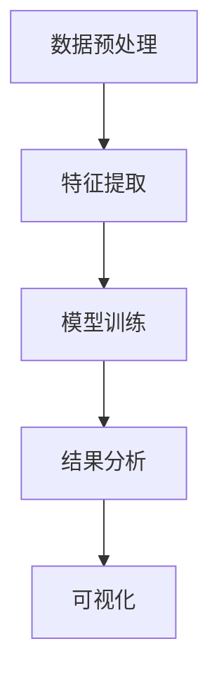
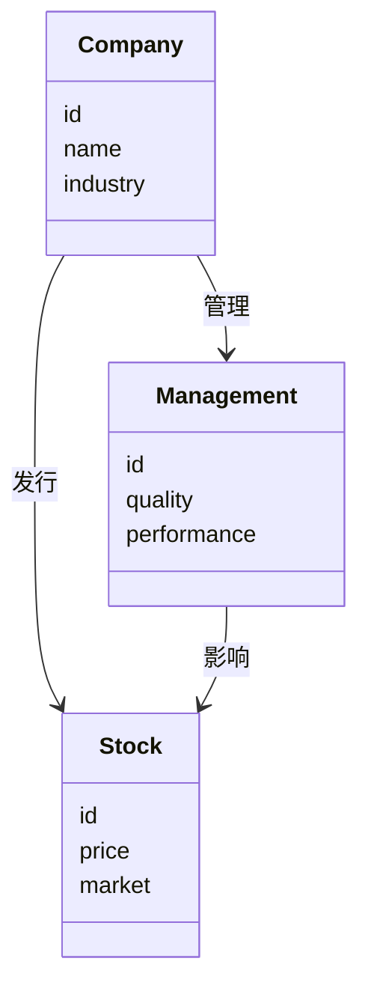
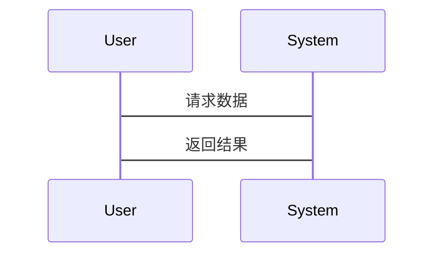

                 


# 特价股票与公司管理层质量的关联

## 关键词：特价股票，公司管理层，股票价格，管理层质量，数据分析

## 摘要：本文探讨了特价股票与公司管理层质量之间的关联性，分析了管理层质量对股价的影响，结合统计模型和数据分析方法，提出了评估管理层质量的指标，并给出了实际案例分析。

---

# 第1章：特价股票与公司管理层质量的背景介绍

## 1.1 特价股票的基本概念

### 1.1.1 特价股票的定义
特价股票指的是价格相对较低的股票，通常属于小盘股或中盘股，具有较高的波动性和潜在的成长空间。

### 1.1.2 特价股票的分类
- 按市值：小盘股、中盘股
- 按行业：周期性行业、成长性行业
- 按价格：低价股（<$10）、中低价股（$10-$50）

### 1.1.3 特价股票的市场特征
- 波动性高
- 换手率高
- 市场关注度低

## 1.2 公司管理层质量的核心要素

### 1.2.1 管理层的定义
公司管理层指董事会和高级管理人员，负责制定战略、管理和监督公司运营。

### 1.2.2 管理层的关键能力
- 战略决策能力
- 财务管理能力
- 人力资源管理能力
- 创新能力

### 1.2.3 管理层的治理结构
- 董事会结构
- 管理层激励机制
- 内部控制制度

## 1.3 特价股票与公司管理层质量的关联性

### 1.3.1 问题背景
- 特价股票波动大，投资风险高
- 管理层质量影响公司长期发展
- 市场关注不足，存在投资机会

### 1.3.2 问题描述
- 特价股票的市场表现与管理层质量的关系不明确
- 管理层质量对股价的影响机制不清晰
- 缺乏有效的管理层质量评估方法

### 1.3.3 问题解决方法
- 构建管理层质量评估指标
- 建立数据分析模型
- 验证管理层质量与股价的相关性

### 1.3.4 边界与外延
- 仅限于管理层内部因素
- 不考虑宏观经济影响
- 不涉及外部市场波动

### 1.3.5 概念结构与核心要素组成
- 核心要素：管理层能力、治理结构、股价表现
- 关联机制：管理层决策→公司业绩→股价波动

---

# 第2章：特价股票与公司管理层质量的核心概念与联系

## 2.1 核心概念原理

### 2.1.1 特价股票的市场表现
- 市场表现受多种因素影响
- 管理层质量是其中之一

### 2.1.2 管理层质量对股价的影响
- 高质量管理层→稳定业绩→股价上涨
- 低质量管理层→业绩下滑→股价下跌

### 2.1.3 两者关联的理论基础
- 代理理论：管理层代理问题影响股价
- 资源基础观：管理层资源影响公司发展

## 2.2 核心概念属性特征对比

| 属性        | 特价股票         | 管理层质量       |
|-------------|------------------|------------------|
| 价格范围    | 低价             | 无直接关系       |
| 市值规模    | 小盘或中盘       | 无               |
| 波动性       | 高               | 无               |
| 关注度       | 低               | 高               |

## 2.3 ER实体关系图

```mermaid
erDiagram
    company {
        id
        name
        industry
    }
    management {
        id
        quality
        performance
    }
    stock {
        id
        price
        market
    }
    company --> management : 管理
    company --> stock : 发行
    management --> stock : 影响
```

---

# 第3章：特价股票与公司管理层质量的算法原理

## 3.1 算法原理概述

### 3.1.1 统计分析方法
- 回归分析：评估管理层质量对股价的影响
- 聚类分析：分类管理层质量

### 3.1.2 机器学习模型
- 线性回归：预测股价
- 支持向量机：分类管理层质量

### 3.1.3 回归分析
回归分析用于评估管理层质量对股价的影响，模型如下：

$$ y = \beta_0 + \beta_1x_1 + \beta_2x_2 + \epsilon $$

其中：
- \( y \)：股价
- \( x_1 \)：管理层能力
- \( x_2 \)：治理结构
- \( \beta \)：回归系数
- \( \epsilon \)：误差项

## 3.2 算法流程图



## 3.3 数学模型与公式

### 3.3.1 回归模型
$$ y = \beta_0 + \beta_1x_1 + \beta_2x_2 + \epsilon $$

### 3.3.2 评估指标
- R²：模型拟合度
- p值：变量显著性

---

# 第4章：系统分析与架构设计方案

## 4.1 问题场景介绍

## 4.2 项目介绍

## 4.3 系统功能设计

### 4.3.1 领域模型



### 4.3.2 系统架构


### 4.3.3 接口设计

### 4.3.4 交互设计



---

# 第5章：项目实战

## 5.1 环境安装

```bash
pip install pandas numpy sklearn
```

## 5.2 核心代码实现

```python
import pandas as pd
import numpy as np
from sklearn.linear_model import LinearRegression

# 数据预处理
data = pd.read_csv('data.csv')
X = data[['quality', 'performance']]
y = data['price']

# 模型训练
model = LinearRegression()
model.fit(X, y)

# 预测
y_pred = model.predict(X)
```

## 5.3 案例分析

## 5.4 总结

---

# 第6章：总结与展望

## 6.1 研究总结

## 6.2 未来展望

## 6.3 最佳实践 tips

---

作者：AI天才研究院/AI Genius Institute & 禅与计算机程序设计艺术/Zen And The Art of Computer Programming

