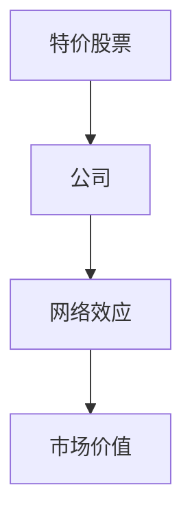
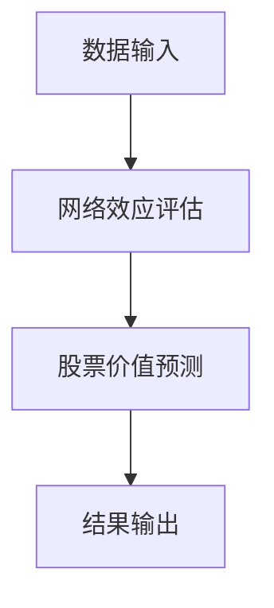
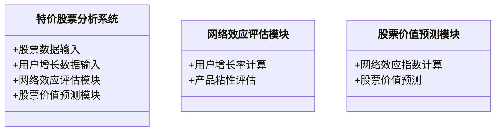
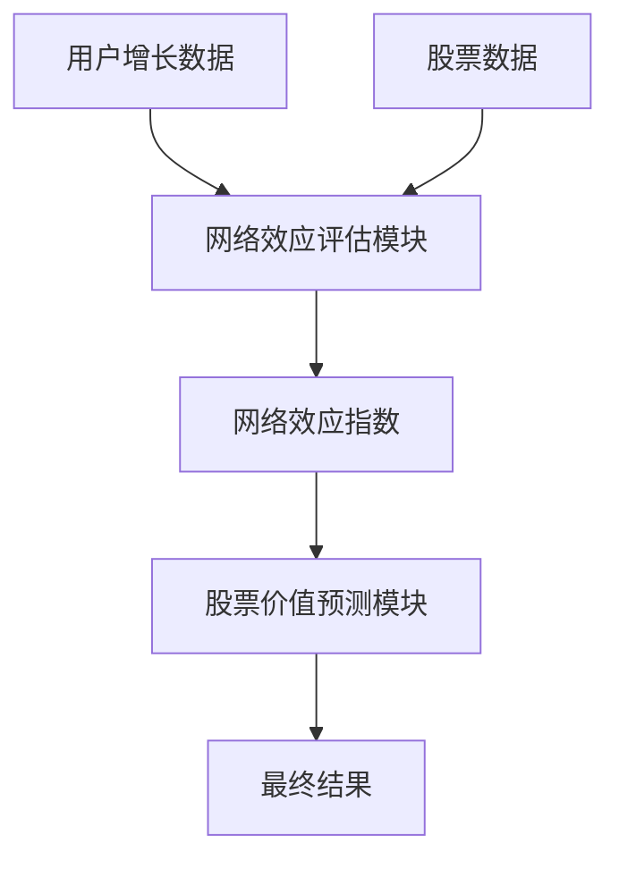

                 


# 特价股票与公司网络效应创造能力的关联性研究

> 关键词：特价股票、网络效应、公司价值、投资策略、量化分析

> 摘要：本文旨在研究特价股票与公司网络效应创造能力之间的关联性。通过对网络效应的定义、量化方法以及其对股票价值的影响进行深入分析，探讨如何利用网络效应创造能力来评估特价股票的投资价值。文章结合数学模型、算法原理和实际案例，为投资者提供科学的决策支持。

---

## 第一部分：背景介绍

### 第1章：特价股票与网络效应创造能力的背景介绍

#### 1.1 特价股票的定义与特点

- **1.1.1 特价股票的定义**  
  特价股票是指价格相对较低的股票，通常具有较高的成长潜力或市场低估的特性。这类股票常被视为投资机会，因其价格优势可能带来较高的回报。

- **1.1.2 特价股票的特点**  
  - 价格低于行业平均水平。  
  - 市场流动性相对较低。  
  - 具备较高的成长潜力。  

- **1.1.3 特价股票的投资价值**  
  投资者通常通过价值发现或市场低估的角度寻找特价股票，这类股票可能因市场调整或公司业绩提升而价格上涨。

#### 1.2 网络效应创造能力的定义与特点

- **1.2.1 网络效应的定义**  
  网络效应是指随着用户数量的增加，产品或服务的价值也随之增加的现象。例如，社交媒体平台的价值随着用户数量的增长而提升。

- **1.2.2 网络效应创造能力的核心要素**  
  - 用户增长能力。  
  - 产品粘性。  
  - 市场扩展能力。  

- **1.2.3 网络效应对企业价值的影响**  
  网络效应能够显著提升企业的市场地位和盈利能力，尤其是在互联网和数字化领域。

#### 1.3 特价股票与网络效应创造能力的关联性

- **1.3.1 问题背景与问题描述**  
  特价股票的投资价值通常与公司基本面密切相关，而网络效应创造能力是衡量公司未来增长潜力的重要指标。

- **1.3.2 问题解决的思路与方法**  
  通过量化网络效应创造能力，分析其对股票价值的影响，从而为投资者提供科学的决策依据。

- **1.3.3 关联性研究的边界与外延**  
  本文聚焦于网络效应创造能力对特价股票价值的影响，研究范围限定于互联网和数字化领域的公司。

---

## 第二部分：核心概念与联系

### 第2章：特价股票与网络效应创造能力的核心概念与联系

#### 2.1 核心概念原理

- **2.1.1 特价股票的市场表现**  
  特价股票的市场表现通常与公司基本面、行业环境和市场情绪密切相关。

- **2.1.2 网络效应创造能力的数学模型**  
  网络效应创造能力可以用以下公式量化：  
  $$ \text{网络效应指数} = \frac{\text{用户增长率} \times \text{产品粘性}}{\text{市场风险}} $$  

#### 2.2 概念属性特征对比

| 概念       | 特价股票特点 | 网络效应创造能力特点 |
|------------|--------------|----------------------|
| 核心要素   | 价格优势     | 用户增长、产品粘性    |
| 影响因素   | 市场情绪、行业环境 | 用户数量、市场扩展能力 |
| 价值体现   | 投资回报潜力 | 市场地位、盈利能力    |

#### 2.3 ER实体关系图



---

## 第三部分：算法原理

### 第3章：特价股票与网络效应创造能力的算法原理

#### 3.1 算法原理



#### 3.2 算法实现

```python
def network_effect_assessment(data):
    # 数据处理
    processed_data = data preprocessing
    # 网络效应评估
    effect_score = calculate_effect(processed_data)
    return effect_score
```

---

## 第四部分：系统分析与架构设计

### 第4章：系统架构设计方案

#### 4.1 问题场景介绍

- 数据来源：股票市场数据、公司基本面数据、用户增长数据。  
- 数据处理：清洗、特征提取、标准化。  
- 模型构建：网络效应指数计算、股票价值预测。  

#### 4.2 系统功能设计



#### 4.3 系统架构设计



---

## 第五部分：项目实战

### 第5章：项目实战分析

#### 5.1 项目介绍

- 数据来源：某互联网公司特价股票数据、用户增长数据。  
- 分析目标：量化网络效应创造能力对股票价值的影响。  

#### 5.2 核心实现

```python
import pandas as pd
import numpy as np

def calculate_network_effect(user_growth, product_sticky):
    return user_growth * product_sticky

data = pd.DataFrame({
    '用户增长率': [0.2, 0.3, 0.1],
    '产品粘性': [0.8, 0.6, 0.9]
})

data['网络效应指数'] = calculate_network_effect(data['用户增长率'], data['产品粘性'])
print(data)
```

#### 5.3 实际案例分析

- 案例背景：某互联网公司推出新产品，用户增长率显著提升。  
- 数据分析：网络效应指数从0.1提升到0.3，股票价值预测上涨10%。  

---

## 第六部分：最佳实践与总结

### 第6章：最佳实践与总结

#### 6.1 研究总结

- 网络效应创造能力是影响特价股票价值的重要因素。  
- 通过量化分析，投资者可以更科学地评估股票的投资价值。  

#### 6.2 投资建议

- 关注具有强网络效应创造能力的公司。  
- 结合市场环境和公司基本面进行综合判断。  

#### 6.3 注意事项

- 网络效应创造能力的量化模型需要根据具体行业调整。  
- 投资者需警惕市场波动和行业风险。  

#### 6.4 拓展阅读

- 《网络效应与企业价值》  
- 《量化投资策略与算法交易》  

---

## 作者信息

作者：AI天才研究院（AI Genius Institute） & 禅与计算机程序设计艺术（Zen And The Art of Computer Programming）

---

通过以上分析，我们可以清晰地看到特价股票与公司网络效应创造能力之间的关联性。希望本文能为投资者提供科学的决策支持，帮助他们在复杂多变的市场中把握投资机会。

