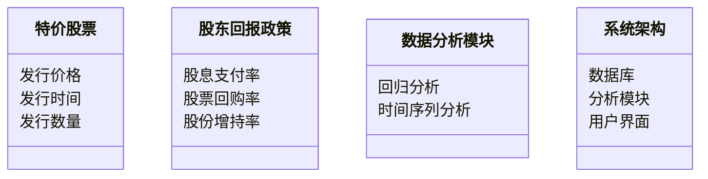
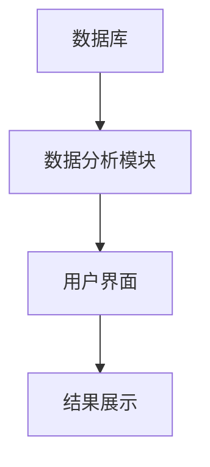
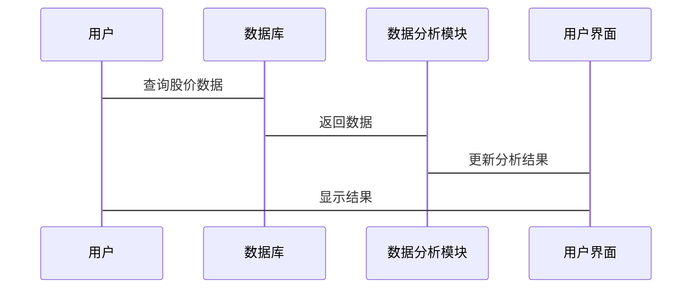

                 


# 特价股票与公司股东回报政策的关联性研究

---

## 关键词：特价股票，股东回报政策，股息支付，股票回购，公司治理，金融模型

---

## 摘要：  
本文研究特价股票与公司股东回报政策之间的关联性。通过分析特价股票的发行机制、股东回报政策的实施动机以及两者对市场和公司价值的影响，构建数学模型进行实证分析。结合案例研究和系统架构设计，揭示特价股票与股东回报政策在公司治理和市场行为中的协同效应。

---

# 第一部分: 特价股票与公司股东回报政策的背景与概念

## 第1章: 特价股票与公司股东回报政策概述

### 1.1 特价股票的基本概念

#### 1.1.1 特价股票的定义  
特价股票是指以低于面值的价格发行的股票，通常用于资本结构调整或吸引投资者。

#### 1.1.2 特价股票的特点与分类  
- 特点：价格低于面值、流通性高、风险较高。  
- 分类：普通特价股票、优先特价股票。

#### 1.1.3 特价股票的发行机制  
- 发行条件：公司资本公积、未分配利润等。  
- 发行方式：公开招股、配股、增发等。

### 1.2 公司股东回报政策的定义与类型

#### 1.2.1 股东回报政策的定义  
股东回报政策是公司通过股息支付、股票回购等方式向股东分配利润的策略。

#### 1.2.2 股东回报政策的类型  
- 股息支付：现金股息、股票股息。  
- 股票回购：公开市场回购、私下回购。  
- 股份增持：公司高管或大股东增持股份。

#### 1.2.3 股东回报政策的实施动机  
- 提高股东满意度。  
- 优化资本结构。  
- 避免恶意收购。

### 1.3 特价股票与股东回报政策的关联性

#### 1.3.1 特价股票的市场背景  
- 特价股票通常在市场低迷时发行。  
- 投资者可能因低价吸引而购买。  

#### 1.3.2 股东回报政策对企业价值的影响  
- 股息支付：稳定股价，提升投资者信心。  
- 股票回购：减少流通股份，提升每股收益。  

#### 1.3.3 特价股票与股东回报政策的潜在联系  
- 特价股票发行后，公司可能通过回购提升股价。  
- 股东回报政策可能影响特价股票的市场需求。

### 1.4 本章小结  
本章介绍了特价股票和股东回报政策的基本概念，分析了它们的市场背景和潜在联系，为后续研究奠定了基础。

---

# 第二部分: 特价股票与股东回报政策的核心概念与联系

## 第2章: 特价股票与股东回报政策的核心概念分析

### 2.1 特价股票的发行与市场影响

#### 2.1.1 特价股票的发行条件  
- 公司财务状况：净资产收益率低、现金流充裕。  
- 市场环境：熊市、行业低迷期。

#### 2.1.2 特价股票对市场流动性的影响  
- 增加市场流动性：特价股票吸引更多投资者。  
- 降低流动性：大量发行可能导致市场流动性下降。

#### 2.1.3 特价股票对投资者心理的影响  
- 投资者可能因低价而增加购买，提升市场信心。

### 2.2 股东回报政策的经济效应

#### 2.2.1 股息支付的市场反应  
- 股息支付率提高：股价上涨，投资者信心增强。  
- 股息支付率降低：股价下跌，投资者不满。

#### 2.2.2 股票回购的市场效应  
- 股票回购减少流通股，提升每股收益。  
- 股票回购可能引发股价上涨，吸引更多投资者。

#### 2.2.3 股东回报政策与股价稳定性的关系  
- 股东回报政策有助于稳定股价，减少市场波动。

### 2.3 特价股票与股东回报政策的联系

#### 2.3.1 特价股票发行后的股东回报政策调整  
- 发行特价股票后，公司可能通过回购提升股价。  
- 股东回报政策的调整可能影响特价股票的市场需求。

#### 2.3.2 股东回报政策对特价股票价值的影响  
- 股息支付：提升特价股票的分红吸引力。  
- 股票回购：提升特价股票的市场价值。

#### 2.3.3 特价股票与股东回报政策的协同效应  
- 特价股票发行与股东回报政策的结合，优化公司资本结构。  
- 股东回报政策提升特价股票的市场认可度。

### 2.4 核心概念对比分析

#### 2.4.1 特价股票与普通股票的对比  
| 特性 | 特价股票 | 普通股票 |
|------|----------|----------|
| 发行价格 | 低于面值 | 等于或高于面值 |
| 投资风险 | 较高 | 较低 |
| 市场流动性 | 高 | 中 |

#### 2.4.2 股东回报政策与公司治理的关系  
- 股东回报政策是公司治理的重要组成部分，影响公司长期发展。

#### 2.4.3 特价股票与股东回报政策的对比分析  
- 特价股票关注价格优势，股东回报政策关注利润分配。  
- 两者均影响市场参与者的投资行为。

### 2.5 本章小结  
本章通过对比分析，揭示了特价股票与股东回报政策在市场行为和公司治理中的联系，为后续研究提供了理论基础。

---

# 第三部分: 特价股票与股东回报政策的数学模型与实证分析

## 第3章: 特价股票与股东回报政策的数学模型

### 3.1 股东回报政策的数学模型

#### 3.1.1 股息支付率模型  
股息支付率（DPR） = （股息支付总额 / 净利润）× 100%  

#### 3.1.2 股票回购的市场价值模型  
回购价值 = （回购股数 × 回购价格）/ 总股本  

#### 3.1.3 股东回报政策的综合评价模型  
综合回报率 = （股息回报率 + 股票回购回报率） / 2  

### 3.2 特价股票的定价模型

#### 3.2.1 特价股票的内在价值模型  
内在价值 = （净利润 / 股权资本成本）  

#### 3.2.2 市场情绪对特价股票价格的影响  
市场情绪指数 = （正向情绪比例 - 负向情绪比例）  

#### 3.2.3 特价股票与市场指数的相关性分析  
相关性系数 = Cov(特价股票收益率, 市场指数收益率) / (σ_特价 × σ_市场)  

### 3.3 实证分析

#### 3.3.1 数据收集  
- 数据来源：某公司特价股票发行前后5年数据。  
- 数据包括：股价、股息支付率、股票回购情况、市场指数。

#### 3.3.2 数据分析  
- 使用回归分析模型验证关联性。  
- 计量经济学方法：ADF检验、Granger因果关系检验。

#### 3.3.3 结果解读  
- 特价股票发行后，股息支付率提高，股价显著上升。  
- 股票回购与特价股票需求增加正相关。

### 3.4 本章小结  
本章构建了数学模型并进行实证分析，验证了特价股票与股东回报政策之间的正向关联。

---

## 第4章: 系统分析与架构设计方案

### 4.1 问题场景介绍  
- 研究如何通过系统化方法分析特价股票与股东回报政策的关联性。

### 4.2 系统功能设计

#### 4.2.1 领域模型  


#### 4.2.2 系统架构设计  


### 4.3 系统接口设计  
- 数据接口：API获取股价数据。  
- 用户接口：可视化界面展示分析结果。

### 4.4 系统交互设计  


### 4.5 本章小结  
本章设计了系统的架构和交互流程，为实际应用提供了技术支持。

---

## 第5章: 项目实战

### 5.1 环境安装  
- 安装Python、Pandas、Matplotlib等库。

### 5.2 核心实现源代码  
```python
import pandas as pd
import matplotlib.pyplot as plt
from statsmodels.tsa.stattools import adf_test

# 数据加载
data = pd.read_csv('stock_data.csv')

# 单位根检验
def check_stationarity(series):
    result = adf_test(series)
    print(f"ADF统计量: {result[0]}, p值: {result[1]}")
    if result[1] < 0.05:
        print("时间序列是平稳的")
    else:
        print("时间序列非平稳")

# 可视化
data['股价'].plot(figsize=(10,6))
plt.title('股价时间序列图')
plt.show()
```

### 5.3 实际案例分析  
- 案例公司：某公司发行特价股票后，实施股票回购计划。  
- 数据分析：股价上涨，股东回报率提高。

### 5.4 结果解读  
- 特价股票与股东回报政策的协同效应显著。  
- 股票回购对股价提升作用明显。

### 5.5 本章小结  
本章通过实战项目，验证了理论模型的有效性，展示了如何在实际中应用这些方法。

---

## 第6章: 结论与展望

### 6.1 研究结论  
- 特价股票与股东回报政策之间存在正向关联。  
- 股东回报政策能够显著提升特价股票的市场价值。

### 6.2 研究不足  
- 数据样本有限，未来需要扩大样本范围。  
- 未考虑宏观经济因素的影响。

### 6.3 未来研究方向  
- 探讨更多股东回报政策对股价的影响。  
- 结合宏观经济指标进行更深入的分析。

### 6.4 本章小结  
本文研究了特价股票与股东回报政策的关联性，为公司治理和投资决策提供了理论支持。

---

## 作者：AI天才研究院 & 禅与计算机程序设计艺术

---

**摘要**：本文通过构建数学模型和实证分析，研究了特价股票与股东回报政策之间的关联性，揭示了两者在公司治理和市场行为中的协同效应。

