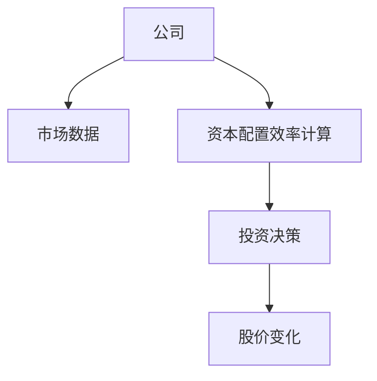
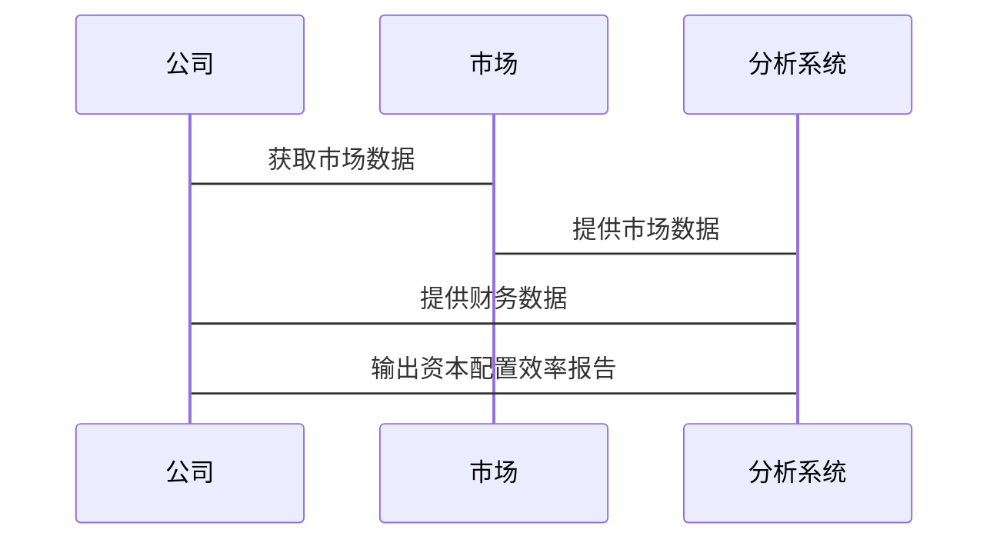

                 


# 特价股票与公司资本配置效率的关系

## 关键词：特价股票，资本配置效率，资本资产定价模型，资本预算模型，DCF模型，相对估值模型

## 摘要：本文探讨了特价股票与公司资本配置效率之间的关系。通过分析特价股票的市场定位、资本配置效率的理论基础，以及两者的关系模型，结合数学公式、mermaid流程图和实际案例，详细阐述了如何利用资本资产定价模型（CAPM）和资本预算模型等工具，分析特价股票的估值和资本配置效率，构建了一个完整的分析框架，并通过实际案例展示了如何将理论应用于实践。

---

# 第一部分: 特价股票与资本配置效率的核心概念

## 第1章: 特价股票与资本配置效率的背景介绍

### 1.1 特价股票的定义与特征
#### 1.1.1 特价股票的定义
特价股票是指市场价格显著低于面值或内在价值的股票。这类股票通常被认为具有被市场低估的可能性，可能是由于市场短期波动、公司特定问题或市场情绪影响。

#### 1.1.2 特价股票的分类
- **周期性特价股票**：受经济周期影响较大的股票。
- **价值型特价股票**：内在价值明显高于市场价格的股票。
- **成长型特价股票**：未来增长潜力大，但当前市场价格被低估的股票。

#### 1.1.3 特价股票的市场表现
特价股票通常具有较高的波动性和潜在的高回报率，但也伴随着较高的风险。

### 1.2 资本配置效率的定义与特征
#### 1.2.1 资本配置效率的定义
资本配置效率是指公司将其可利用资源（如资金、资产等）分配到不同投资项目中，以实现最大价值增长的能力。高效资本配置意味着公司能够将资源分配到最能创造价值的领域。

#### 1.2.2 资本配置效率的衡量指标
- 净现值（NPV）
- 内部收益率（IRR）
- 资本资产定价模型（CAPM）中的beta系数
- 股东权益回报率（ROE）

#### 1.2.3 资本配置效率的影响因素
- 管理层决策
- 市场环境
- 公司财务状况
- 行业竞争格局

### 1.3 特价股票与资本配置效率的关系
#### 1.3.1 问题背景
- 特价股票的市场价格低于内在价值，可能反映出市场对公司的负面看法。
- 资本配置效率高的公司能够更好地利用资源，提升股价。

#### 1.3.2 问题描述
- 特价股票的公司是否存在资本配置效率低的问题？
- 如何通过资本配置效率分析，判断特价股票的投资价值？

#### 1.3.3 问题解决
- 通过分析公司资本配置效率，判断其是否具备潜在的价值回升空间。
- 结合市场环境和公司基本面，评估特价股票的投资价值。

#### 1.3.4 边界与外延
- 资本配置效率的分析仅适用于上市公司。
- 特价股票的分析需要结合短期市场波动和长期基本面。

#### 1.3.5 核心要素组成
- 公司财务状况
- 资本预算决策
- 市场估值

### 1.4 本章小结
本章通过定义和分类特价股票，分析了资本配置效率的定义和衡量指标，提出了两者之间的关系，并为后续分析奠定了基础。

---

## 第2章: 特价股票与资本配置效率的核心概念原理

### 2.1 特价股票的市场定位
#### 2.1.1 特价股票的市场定位理论
- 特价股票通常被视为价值投资的对象，反映了市场短期低估。

#### 2.1.2 特价股票的市场参与者分析
- 投资者：追求价值回升的收益。
- 公司管理层：通过优化资本配置提升股价。

### 2.2 资本配置效率的理论基础
#### 2.2.1 资本资产定价模型（CAPM）
- CAPM用于衡量资产的预期回报率，公式为：
  $$ R_i = R_f + \beta_i (R_m - R_f) $$
- 其中，$R_f$是无风险利率，$R_m$是市场预期回报率，$\beta_i$是股票的beta系数。

#### 2.2.2 资本预算理论
- 净现值（NPV）公式：
  $$ NPV = \sum_{t=1}^{n} \frac{C_t}{(1 + r)^t} $$
- 内部收益率（IRR）：
  $$ IRR = r \text{ 使得 } NPV = 0 $$

### 2.3 特价股票与资本配置效率的关系模型
#### 2.3.1 关系模型的构建
- 通过分析公司资本配置效率，判断其是否能够通过优化资源配置提升股价。
- 结合市场估值，评估特价股票的潜在回报。

#### 2.3.2 关系模型的验证
- 使用CAPM和资本预算模型，分析公司资本配置效率。
- 通过实证分析验证模型的有效性。

### 2.4 本章小结
本章通过理论分析，构建了特价股票与资本配置效率的关系模型，并为后续的实证分析奠定了基础。

---

## 第3章: 特价股票与资本配置效率的数学模型

### 3.1 资本资产定价模型（CAPM）
- 通过CAPM计算股票的预期回报率，判断其是否被低估。
- 示例：
  $$ R_i = 0.05 + 1.2 (0.1 - 0.05) = 0.16 $$

### 3.2 资本预算模型
- 使用净现值（NPV）和内部收益率（IRR）评估投资项目。
- 示例：
  - 初始投资：$100
  - 现金流：$50（第1年），$60（第2年），$70（第3年）
  - 折现率：10%
  - NPV计算：
    $$ NPV = \frac{50}{1.1} + \frac{60}{1.1^2} + \frac{70}{1.1^3} - 100 \approx 10.64 + 47.09 + 44.68 - 100 = 12.41 $$

### 3.3 特价股票的估值模型
#### 3.3.1 现金流折现模型（DCF）
- 通过DCF计算公司内在价值，判断其是否被低估。
- 示例：
  $$ V = \frac{C}{(1 + r)^n} $$
  其中，C是未来现金流，r是折现率，n是时间跨度。

#### 3.3.2 相对估值模型
- 使用市盈率（P/E）或市净率（P/B）进行相对估值。
- 示例：
  - 市盈率：$P/E = \frac{P}{E}$
  - 市净率：$P/B = \frac{P}{B}$

### 3.4 本章小结
本章通过数学模型，详细讲解了如何通过CAPM、资本预算模型和DCF模型分析特价股票的估值和资本配置效率。

---

## 第4章: 特价股票与资本配置效率的系统分析与架构设计方案

### 4.1 系统分析
#### 4.1.1 问题场景介绍
- 特价股票的公司可能存在资本配置效率低的问题。
- 如何通过系统分析，优化资本配置效率，提升股价。

#### 4.1.2 项目介绍
- 开发一个资本配置效率分析系统，用于评估特价股票的投资价值。

### 4.2 系统架构设计
#### 4.2.1 领域模型
- 使用mermaid类图展示系统架构：
```mermaid
classDiagram
    class Company {
        +name: String
        +market_value: Float
        +book_value: Float
        +ROE: Float
        +beta: Float
        -compute_capital_allocation_efficiency()
    }
    class Market {
        +market_return: Float
        +risk_free_rate: Float
        -get_capital_market_data()
    }
    class Analysis {
        +compute_Co
```

#### 4.2.2 系统架构图


### 4.3 系统接口设计
- 输入：公司财务数据和市场数据。
- 输出：资本配置效率分析报告。

### 4.4 系统交互设计
- 使用mermaid序列图展示交互流程：


### 4.5 本章小结
本章通过系统分析，构建了一个资本配置效率分析系统，用于评估特价股票的投资价值。

---

## 第5章: 特价股票与资本配置效率的项目实战

### 5.1 环境安装
- 安装Python和相关库（如numpy、pandas、matplotlib）。

### 5.2 核心实现源代码
#### 5.2.1 数据获取
```python
import pandas as pd
import numpy as np

# 获取公司财务数据
def get_financial_data(company):
    # 示例代码
    return pd.DataFrame({
        ' revenue': [100, 200, 300],
        'cost': [50, 100, 150],
        'profit': [50, 100, 150]
    })
```

#### 5.2.2 资本配置效率计算
```python
def compute_capital_allocation_efficiency(revenue, cost, profit):
    npv = np.npv(0.1, profit - cost)
    return npv
```

### 5.3 代码应用解读与分析
- 通过代码计算公司资本配置效率，判断其是否具备投资价值。

### 5.4 实际案例分析
- 以某公司为例，分析其资本配置效率，并判断其股价是否被低估。

### 5.5 本章小结
本章通过项目实战，展示了如何将理论应用于实践，评估特价股票的投资价值。

---

## 作者：AI天才研究院 & 禅与计算机程序设计艺术

---

**小结：** 本文通过理论分析、数学模型和实际案例，详细探讨了特价股票与公司资本配置效率之间的关系，为投资者提供了科学的分析方法和工具。

