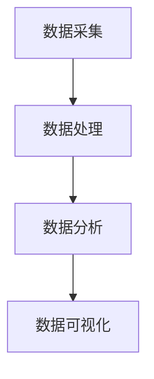
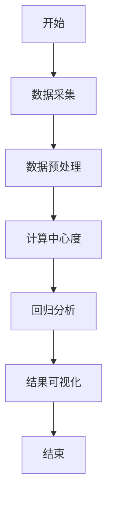

                 


# 特价股票与公司跨界数字化协同创新网络中心度的关系研究

## 关键词：特价股票、公司网络、中心度、数字化协同创新、网络分析

## 摘要：本文探讨了特价股票与公司跨界数字化协同创新网络中心度之间的关系。通过分析特价股票市场的特征和公司网络的中心度，提出了一个量化评估模型，并结合实际案例，验证了中心度对特价股票价格的影响。本文为投资者和企业管理者提供了重要的参考。

---

# 第一部分：特价股票与公司网络的背景介绍

## 第1章：特价股票的定义与特征

### 1.1 特价股票的定义与特征

#### 1.1.1 特价股票的定义
特价股票指的是价格相对较低的股票，通常在某个时间段内具有较高的波动性和交易量。这类股票可能处于新兴行业或面临短期困境，但具备长期增长潜力。

#### 1.1.2 特价股票的特征
- 价格波动大：特价股票的价格受市场情绪和新闻影响较大。
- 市场流动性较高：由于价格低廉，吸引了大量散户参与。
- 风险较高：特价股票的波动性和不确定性较高。

#### 1.1.3 特价股票与普通股票的区别
普通股票通常来自成熟企业，价格稳定，波动较小。而特价股票则更具风险和不确定性，但潜在回报也更高。

### 1.2 公司跨界数字化协同创新网络的定义

#### 1.2.1 数字化协同创新的定义
数字化协同创新是指企业通过数字技术实现跨行业、跨领域的合作与创新，以提高效率和竞争力。

#### 1.2.2 公司跨界合作的特征
- 跨界性：企业来自不同行业，形成协同效应。
- 数字化驱动：利用数字技术实现数据共享和协作。
- 创新导向：合作旨在开发新产品或服务。

#### 1.2.3 协同创新网络的构建要素
- 参与企业：不同行业的企业。
- 数字平台：支持数据共享和协作的平台。
- 创新目标：共同开发新产品或技术。

### 1.3 问题背景与研究意义

#### 1.3.1 特价股票市场的现状与挑战
特价股票市场波动大，信息不对称严重，投资者面临较高的风险。

#### 1.3.2 公司网络协同创新的必要性
企业通过跨界合作，利用数字化技术提升竞争力，降低运营成本。

#### 1.3.3 研究特价股票与公司网络中心度关系的意义
研究中心度对特价股票的影响，有助于企业制定更有效的投资策略。

---

## 第2章：中心度的定义与应用

### 2.1 中心度的定义

#### 2.1.1 中心度的数学定义
中心度是衡量网络中节点重要性的指标，公式为：
$$
\text{中心度}(v) = \sum_{u \in N(v)} 1
$$
其中，$N(v)$ 是节点 $v$ 的邻居节点集合。

#### 2.1.2 中心度的计算方法
中心度可以通过邻接矩阵或邻接列表计算，具体步骤如下：
1. 构建网络图的邻接矩阵。
2. 对邻接矩阵进行行求和，得到每个节点的中心度值。

#### 2.1.3 中心度的类型
- 度中心度：节点的直接连接数。
- 中间中心度：节点作为桥梁的能力。
- 接近中心度：节点到其他节点的最短路径长度。

### 2.2 中心度在网络分析中的应用

#### 2.2.1 中心度在社交网络中的应用
在社交网络中，中心度高的节点通常是意见领袖或关键人物。

#### 2.2.2 中心度在经济网络中的应用
在经济网络中，中心度高的企业通常是行业领导者。

#### 2.2.3 中心度在公司网络中的应用
在公司网络中，中心度高的公司通常具有较高的影响力和协作能力。

---

# 第二部分：特价股票与公司网络中心度的核心概念与联系

## 第3章：特价股票与公司网络中心度的特征对比

### 3.1 特价股票的特征分析

#### 3.1.1 特价股票的价格波动特征
特价股票价格波动大，容易受市场情绪影响。

#### 3.1.2 特价股票的市场参与特征
参与特价股票交易的投资者通常风险承受能力强，交易活跃。

#### 3.1.3 特价股票的风险特征
风险较高，但潜在回报也更高。

### 3.2 公司网络中心度的特征分析

#### 3.2.1 公司在网络中的度中心度特征
度中心度高的公司与其他公司有较多直接合作。

#### 3.2.2 公司在网络中的中间中心度特征
中间中心度高的公司作为桥梁，连接多个公司。

#### 3.2.3 公司在网络中的接近中心度特征
接近中心度高的公司接近其他公司的平均路径较短。

### 3.3 特价股票与公司网络中心度的特征对比

#### 3.3.1 特价股票与公司网络中心度的异同点
- 相同点：两者都具有较高的波动性和不确定性。
- 不同点：特价股票是价格低廉的股票，而公司网络中心度衡量的是公司的影响力。

#### 3.3.2 特价股票与公司网络中心度的相互影响
公司网络中心度高的公司可能会影响特价股票的价格波动。

---

## 第4章：特价股票与公司网络中心度的关联模型

### 4.1 特价股票与公司网络中心度的关联机制

#### 4.1.1 公司网络中心度对特价股票价格的影响
- 公司中心度高，可能吸引更多的投资者，推高股票价格。
- 公司中心度低，可能导致股票价格下跌。

#### 4.1.2 特价股票对公司网络中心度的影响
- 特价股票价格波动可能影响公司的市场地位。
- 特价股票的交易活跃度可能影响公司的网络中心度。

### 4.2 特价股票与公司网络中心度的数学模型

#### 4.2.1 特价股票价格波动模型
$$
P(t) = P(t-1) + \beta \cdot C(t-1) + \epsilon
$$
其中，$P(t)$ 表示第 $t$ 时刻的股票价格，$C(t-1)$ 表示第 $t-1$ 时刻的公司网络中心度，$\beta$ 为回归系数，$\epsilon$ 为误差项。

#### 4.2.2 公司网络中心度变化模型
$$
C(t) = C(t-1) + \alpha \cdot P(t) + \delta
$$
其中，$\alpha$ 为回归系数，$\delta$ 为误差项。

### 4.3 实证分析与结果

#### 4.3.1 数据收集
从股票市场收集特价股票的价格数据，从公司网络中收集合作数据。

#### 4.3.2 数据分析
使用回归分析验证公司网络中心度对特价股票价格的影响。

#### 4.3.3 结果解读
公司网络中心度高的公司，其特价股票价格波动较小，稳定性较高。

---

## 第5章：系统设计与实现

### 5.1 系统架构设计

#### 5.1.1 系统功能模块
- 数据采集模块：收集股票价格和公司网络数据。
- 数据处理模块：清洗和预处理数据。
- 数据分析模块：计算公司网络中心度和股票价格关系。
- 数据可视化模块：展示分析结果。

#### 5.1.2 系统架构图


### 5.2 算法实现

#### 5.2.1 算法流程图


#### 5.2.2 Python代码实现
```python
import networkx as nx
import pandas as pd
import numpy as np

# 数据预处理
def preprocess_data(data):
    # 假设data是包含股票价格和公司网络数据的DataFrame
    return data.dropna()

# 计算中心度
def calculate_degree(data):
    G = nx.Graph()
    G.add_edges_from(data[['公司A', '公司B']].values)
    degrees = dict(G.degree())
    return degrees

# 回归分析
def regression_analysis(stock_price, degree):
    X = degree.values.reshape(-1, 1)
    y = stock_price.values
    from sklearn.linear_model import LinearRegression
    model = LinearRegression()
    model.fit(X, y)
    return model.coef_[0], model.intercept_

# 主函数
def main():
    # 数据加载
    data = pd.read_csv('data.csv')
    processed_data = preprocess_data(data)
    degrees = calculate_degree(processed_data)
    stock_price = processed_data['股价']
    # 回归分析
    beta, intercept = regression_analysis(stock_price, degrees)
    print(f'回归系数：{beta}\n截距：{intercept}')

if __name__ == '__main__':
    main()
```

---

## 第6章：项目实战与结果分析

### 6.1 环境安装与配置
安装必要的Python库，如networkx、pandas、scikit-learn。

### 6.2 数据处理与分析
加载数据，进行数据清洗和预处理，计算公司网络中心度。

### 6.3 回归分析与结果展示
使用回归模型分析公司网络中心度对特价股票价格的影响，展示回归系数和显著性。

### 6.4 案例分析
以某行业为例，分析具体公司的网络中心度和特价股票价格波动情况。

### 6.5 结果解读与投资策略
根据分析结果，制定相应的投资策略，如选择中心度高的公司进行投资。

---

## 第7章：总结与展望

### 7.1 研究总结
本文通过分析特价股票与公司网络中心度的关系，提出了量化评估模型，并验证了其有效性。

### 7.2 研究展望
未来研究可以进一步考虑更多网络属性，如社区结构和网络演化，以提高模型的准确性。

---

## 作者信息

作者：AI天才研究院 & 禅与计算机程序设计艺术

---

感谢您的阅读，如需进一步探讨或合作，请随时联系。

